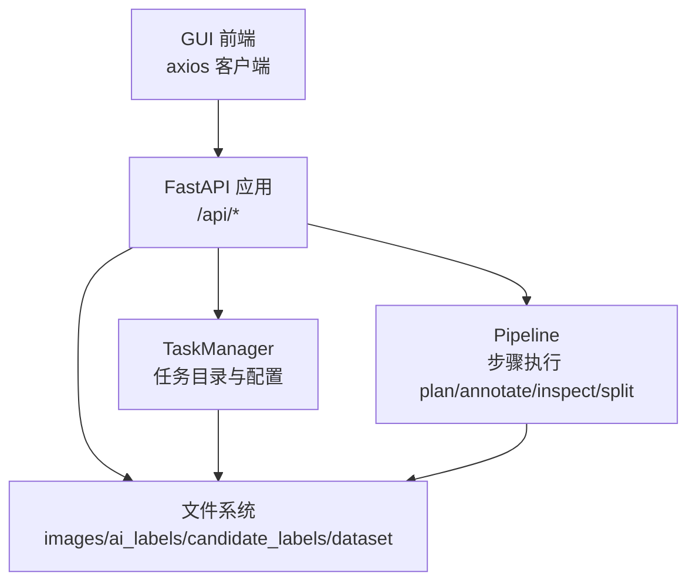
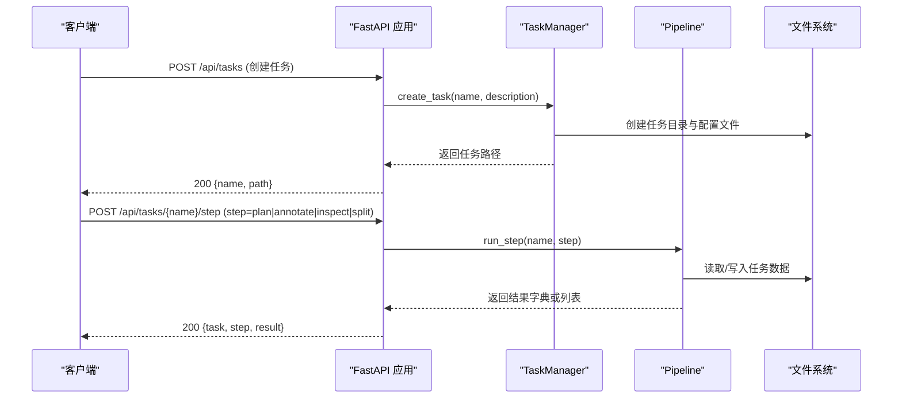
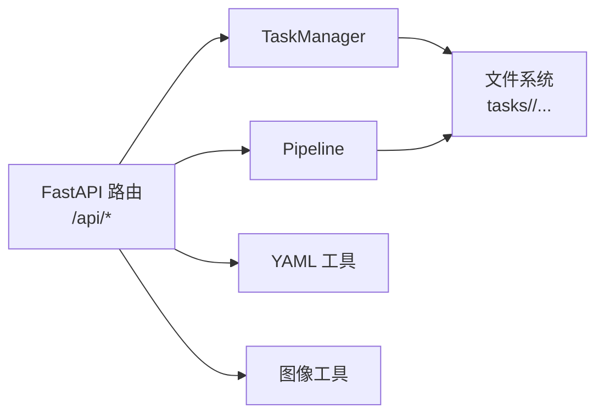

# API 接口文档

<cite>
**本文引用的文件**
- [src/api_server.py](file://src/api_server.py)
- [gui/src/services/api.ts](file://gui/src/services/api.ts)
- [specs/per-image-label-api.spec.md](file://specs/per-image-label-api.spec.md)
- [tests/test_api_server.py](file://tests/test_api_server.py)
- [src/core/task_manager.py](file://src/core/task_manager.py)
- [config/task_template.yaml](file://config/task_template.yaml)
- [config/global.yaml](file://config/global.yaml)
</cite>

## 目录
1. [简介](#简介)
2. [项目结构](#项目结构)
3. [核心组件](#核心组件)
4. [架构总览](#架构总览)
5. [详细端点说明](#详细端点说明)
6. [依赖关系分析](#依赖关系分析)
7. [性能与扩展性](#性能与扩展性)
8. [故障排查指南](#故障排查指南)
9. [结论](#结论)
10. [附录：客户端集成示例](#附录客户端集成示例)

## 简介
本仓库提供基于 FastAPI 的 RESTful API，用于管理图像标注任务、执行训练计划、生成质检报告、导出数据集以及浏览/获取标注数据与图像资源。API 主要面向本地 GUI（Tauri + React）使用，默认监听 127.0.0.1:8765。

## 项目结构
- API 服务入口位于 src/api_server.py，暴露 /api/tasks 及其子路径。
- 任务生命周期由 src/core/task_manager.py 管理，按任务名在 tasks_root 下维护独立目录。
- 前端通过 gui/src/services/api.ts 调用后端接口。
- 规格与验收标准见 specs/per-image-label-api.spec.md。
- 测试覆盖关键端点行为，见 tests/test_api_server.py。
- 配置项包括全局服务器地址端口、任务模板等，见 config/global.yaml 与 config/task_template.yaml。

图表来源
- [src/api_server.py:1-384](file://src/api_server.py#L1-L384)
- [src/core/task_manager.py:1-150](file://src/core/task_manager.py#L1-L150)

章节来源
- [src/api_server.py:1-384](file://src/api_server.py#L1-L384)
- [src/core/task_manager.py:1-150](file://src/core/task_manager.py#L1-L150)
- [gui/src/services/api.ts:1-80](file://gui/src/services/api.ts#L1-L80)
- [specs/per-image-label-api.spec.md:1-38](file://specs/per-image-label-api.spec.md#L1-L38)
- [tests/test_api_server.py:1-130](file://tests/test_api_server.py#L1-L130)
- [config/global.yaml:1-29](file://config/global.yaml#L1-L29)
- [config/task_template.yaml:1-54](file://config/task_template.yaml#L1-L54)

## 核心组件
- FastAPI 应用：定义路由、请求/响应模型、错误处理。
- TaskManager：创建/列出/加载/删除任务目录，维护 task.yaml 配置。
- Pipeline：封装 plan/annotate/inspect/split 等步骤的执行。
- 工具模块：读取/保存 YAML、列举图片、解析 OBB 标签等。

章节来源
- [src/api_server.py:1-384](file://src/api_server.py#L1-L384)
- [src/core/task_manager.py:1-150](file://src/core/task_manager.py#L1-L150)

## 架构总览

图表来源
- [src/api_server.py:149-192](file://src/api_server.py#L149-L192)
- [src/core/task_manager.py:51-80](file://src/core/task_manager.py#L51-L80)

## 详细端点说明

### 通用约定
- 基础 URL：http://127.0.0.1:8765
- 认证机制：当前未实现；仅限本地访问。
- 速率限制：未实现；生产环境建议增加限流中间件。
- 版本管理：应用版本为 0.1.0；URL 未包含版本前缀。
- 内容类型：JSON（application/json），图片端点返回二进制。
- 字符编码：UTF-8。
- 错误格式：HTTPException 返回 JSON，包含 detail 字段。

章节来源
- [src/api_server.py:21-26](file://src/api_server.py#L21-L26)
- [config/global.yaml:22-25](file://config/global.yaml#L22-L25)

---

### 任务管理：/api/tasks

- GET /api/tasks
  - 描述：列出所有任务名称（已排序）。
  - 成功响应：字符串数组。
  - 状态码：200。
  - 错误：无。

- POST /api/tasks
  - 描述：创建新任务。
  - 请求体：
    - name: 字符串，唯一任务名。
    - description: 字符串，可选描述。
  - 成功响应：
    - name: 任务名。
    - path: 任务目录路径。
  - 状态码：
    - 200：创建成功。
    - 409：任务已存在。
  - 错误：其他异常将转为 5xx。

章节来源
- [src/api_server.py:139-166](file://src/api_server.py#L139-L166)
- [src/core/task_manager.py:51-80](file://src/core/task_manager.py#L51-L80)
- [tests/test_api_server.py:44-51](file://tests/test_api_server.py#L44-L51)

---

### 步骤执行：/api/tasks/{name}/step

- POST /api/tasks/{name}/step
  - 描述：执行指定步骤（plan、annotate、inspect、split）。
  - 路径参数：
    - name: 任务名。
  - 请求体：
    - step: 枚举值 plan | annotate | inspect | split。
  - 成功响应：
    - task: 任务名。
    - step: 执行的步骤。
    - result: 步骤结果（字典或列表包装为 items）。
  - 状态码：
    - 200：执行成功。
    - 404：任务不存在。
    - 500：步骤执行失败（内部异常）。

章节来源
- [src/api_server.py:169-192](file://src/api_server.py#L169-L192)
- [tests/test_api_server.py:113-121](file://tests/test_api_server.py#L113-L121)

---

### 训练计划：/api/tasks/{name}/plan

- POST /api/tasks/{name}/plan
  - 描述：执行 plan 步骤，返回标准化后的训练计划。
  - 路径参数：name: 任务名。
  - 成功响应：StepResponse（result 中包含 classes、hyperparameters 等）。
  - 状态码：200 / 404（任务不存在）。

- GET /api/tasks/{name}/plan
  - 描述：直接读取任务配置中的 training_plan 部分。
  - 路径参数：name: 任务名。
  - 成功响应：training_plan 字典。
  - 状态码：200 / 404（任务不存在）。

章节来源
- [src/api_server.py:195-205](file://src/api_server.py#L195-L205)
- [src/api_server.py:253-269](file://src/api_server.py#L253-L269)
- [config/task_template.yaml:8-54](file://config/task_template.yaml#L8-L54)
- [tests/test_api_server.py:124-130](file://tests/test_api_server.py#L124-L130)

---

### 质检报告：/api/tasks/{name}/report

- GET /api/tasks/{name}/report
  - 描述：获取最新质检报告。
  - 路径参数：name: 任务名。
  - 成功响应：
    - report: 质检报告字典（包含任务信息、统计、错误列表、质量分数等）。
  - 状态码：
    - 200：报告存在。
    - 404：任务不存在或报告缺失。

章节来源
- [src/api_server.py:234-250](file://src/api_server.py#L234-L250)
- [gui/src/types/index.ts:66-80](file://gui/src/types/index.ts#L66-L80)

---

### 数据集导出：/api/tasks/{name}/export

- GET /api/tasks/{name}/export
  - 描述：获取 split 步骤生成的数据集导出摘要。
  - 路径参数：name: 任务名。
  - 成功响应：导出摘要字典（包含 splits、dataset_yaml、train_command 等）。
  - 状态码：
    - 200：摘要存在。
    - 404：任务不存在或摘要缺失。

章节来源
- [src/api_server.py:272-288](file://src/api_server.py#L272-L288)
- [gui/src/types/index.ts:82-88](file://gui/src/types/index.ts#L82-L88)

---

### 标注数据：/api/tasks/{name}/labels

- GET /api/tasks/{name}/labels
  - 描述：列出任务中拥有标签文件的图片名（候选标签优先于 AI 标签）。
  - 路径参数：name: 任务名。
  - 成功响应：
    - images: 字符串数组（已排序）。
  - 状态码：
    - 200：成功。
    - 404：任务不存在。

- GET /api/tasks/{name}/labels/{image_name}
  - 描述：获取单张图片的 OBB 框列表（候选标签优先）。
  - 路径参数：
    - name: 任务名。
    - image_name: 图片文件名。
  - 成功响应：
    - image: 图片名。
    - boxes: 框数组，每项包含 cls、points（8 个归一化浮点）、conf（默认 1.0）。
  - 状态码：
    - 200：成功（可为空框列表）。
    - 404：任务不存在、图片不存在或无标签文件。
  - 备注：畸形标签行会被跳过并记录警告，不影响整体响应。

章节来源
- [src/api_server.py:291-338](file://src/api_server.py#L291-L338)
- [specs/per-image-label-api.spec.md:1-38](file://specs/per-image-label-api.spec.md#L1-L38)
- [tests/test_api_server.py:54-110](file://tests/test_api_server.py#L54-L110)

---

### 图像资源：/api/tasks/{name}/images

- GET /api/tasks/{name}/images
  - 描述：列出任务中的图片，附带可访问的相对 URL。
  - 路径参数：name: 任务名。
  - 成功响应：图片条目数组，每项包含 name 与 url。
  - 状态码：
    - 200：成功。
    - 404：任务不存在。

- GET /api/tasks/{name}/images/{image_name}
  - 描述：直接返回图片文件二进制。
  - 路径参数：
    - name: 任务名。
    - image_name: 图片文件名。
  - 成功响应：图片二进制。
  - 状态码：
    - 200：成功。
    - 404：图片不存在。

章节来源
- [src/api_server.py:341-377](file://src/api_server.py#L341-L377)

---

### 补充步骤端点（便捷方法）
- POST /api/tasks/{name}/annotate
  - 描述：执行 annotate 步骤。
  - 成功响应：StepResponse。
  - 状态码：200 / 404 / 500。

- POST /api/tasks/{name}/inspect
  - 描述：执行 inspect 步骤。
  - 成功响应：StepResponse。
  - 状态码：200 / 404 / 500。

章节来源
- [src/api_server.py:208-231](file://src/api_server.py#L208-L231)

## 依赖关系分析

图表来源
- [src/api_server.py:16-26](file://src/api_server.py#L16-L26)
- [src/core/task_manager.py:1-150](file://src/core/task_manager.py#L1-L150)

章节来源
- [src/api_server.py:16-26](file://src/api_server.py#L16-L26)
- [src/core/task_manager.py:1-150](file://src/core/task_manager.py#L1-L150)

## 性能与扩展性
- 当前未实现认证与鉴权，仅绑定本地回环地址，适合桌面 GUI 场景。
- 未实现速率限制，生产部署建议引入限流中间件（如基于 IP 或令牌桶）。
- 大文件传输（图片）采用 FileResponse，注意服务端磁盘 I/O 与并发。
- 步骤执行可能耗时较长（AI 推理、数据分割），建议前端设置合理超时与重试策略。
- 可扩展方向：
  - 添加 JWT/Token 认证与权限控制。
  - 增加异步任务队列（Celery/RQ）以解耦长耗时步骤。
  - 增加缓存层（Redis）以减少重复计算。
  - 增加审计日志与指标上报。

[本节为通用指导，不直接分析具体文件]

## 故障排查指南
- 404 常见原因：
  - 任务不存在：检查 /api/tasks 列表。
  - 图片不存在：确认 images 目录与文件名。
  - 标签文件缺失：确保 candidate_labels 或 ai_labels 中存在对应 .txt。
- 409 冲突：
  - 重复创建同名任务：先查询是否存在。
- 500 错误：
  - 步骤执行异常：查看服务端日志，定位具体 agent 或数据处理错误。
- 标签解析问题：
  - 畸形行会被跳过并记录警告；检查标签文件格式是否为“cls x1 y1 x2 y2 x3 y3 x4 y4”。
- 前端连接问题：
  - 确认 baseURL 与端口（默认 http://127.0.0.1:8765）。
  - 检查跨域与代理配置（若通过浏览器访问）。

章节来源
- [src/api_server.py:169-192](file://src/api_server.py#L169-L192)
- [src/api_server.py:234-250](file://src/api_server.py#L234-L250)
- [src/api_server.py:272-288](file://src/api_server.py#L272-L288)
- [src/api_server.py:291-338](file://src/api_server.py#L291-L338)
- [src/api_server.py:341-377](file://src/api_server.py#L341-L377)
- [specs/per-image-label-api.spec.md:24-28](file://specs/per-image-label-api.spec.md#L24-L28)
- [tests/test_api_server.py:93-110](file://tests/test_api_server.py#L93-L110)

## 结论
该 API 提供了完整的任务生命周期管理与数据读写能力，涵盖计划、标注、质检、导出与可视化所需的全部端点。当前设计简洁、面向本地 GUI，便于快速迭代。后续可按需加入认证、限流、异步化与监控等生产特性。

[本节为总结，不直接分析具体文件]

## 附录：客户端集成示例

- 前端 Axios 客户端基址与超时
  - baseURL：http://127.0.0.1:8765
  - timeout：120000 ms
  - 参考：gui/src/services/api.ts

- 常用调用流程
  - 创建任务：POST /api/tasks，返回 {name, path}。
  - 执行步骤：POST /api/tasks/{name}/step，body 含 step。
  - 获取计划：GET /api/tasks/{name}/plan。
  - 获取报告：GET /api/tasks/{name}/report。
  - 获取导出摘要：GET /api/tasks/{name}/export。
  - 列出有标签的图片：GET /api/tasks/{name}/labels。
  - 获取单图标注：GET /api/tasks/{name}/labels/{image_name}。
  - 列出图片与下载图片：GET /api/tasks/{name}/images 与 /api/tasks/{name}/images/{image_name}。

- 错误处理建议
  - 捕获 404：提示用户任务/图片/标签缺失。
  - 捕获 409：提示任务已存在。
  - 捕获 500：显示错误详情并重试或联系运维。

- 版本与兼容性
  - 应用版本：0.1.0。
  - URL 不含版本前缀；如需向后兼容，建议在路由前加 /v1 并在未来升级时保留旧路由。

章节来源
- [gui/src/services/api.ts:1-80](file://gui/src/services/api.ts#L1-L80)
- [src/api_server.py:21-26](file://src/api_server.py#L21-L26)