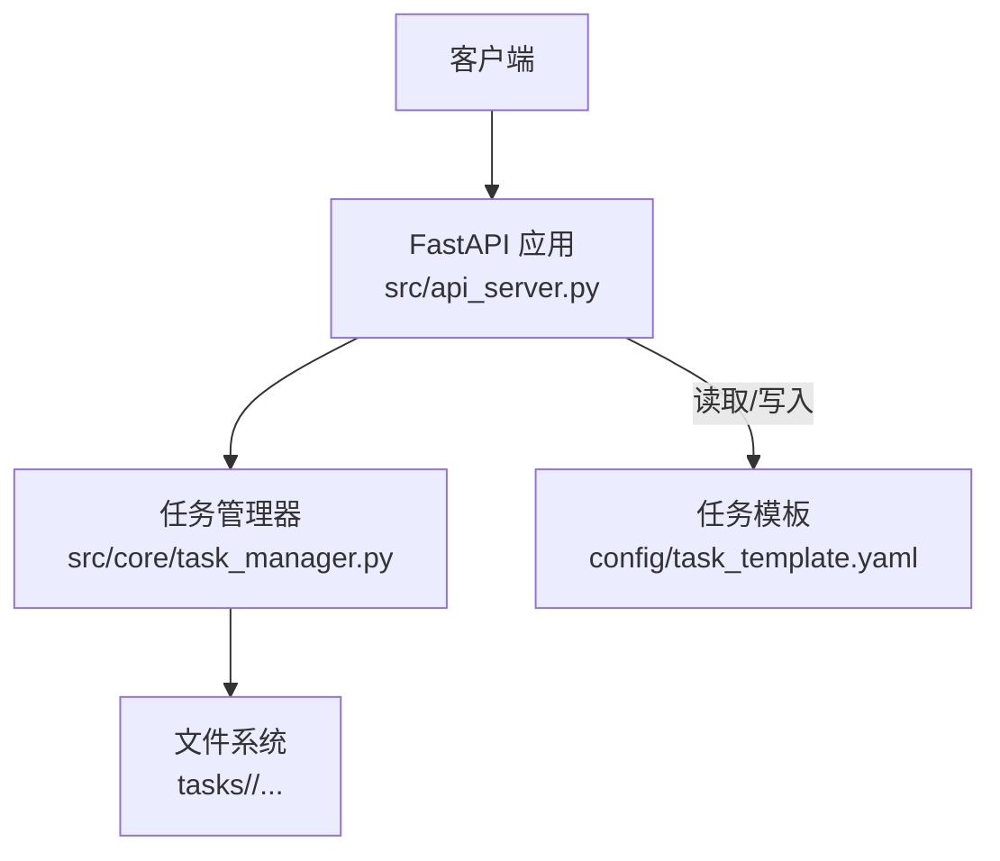
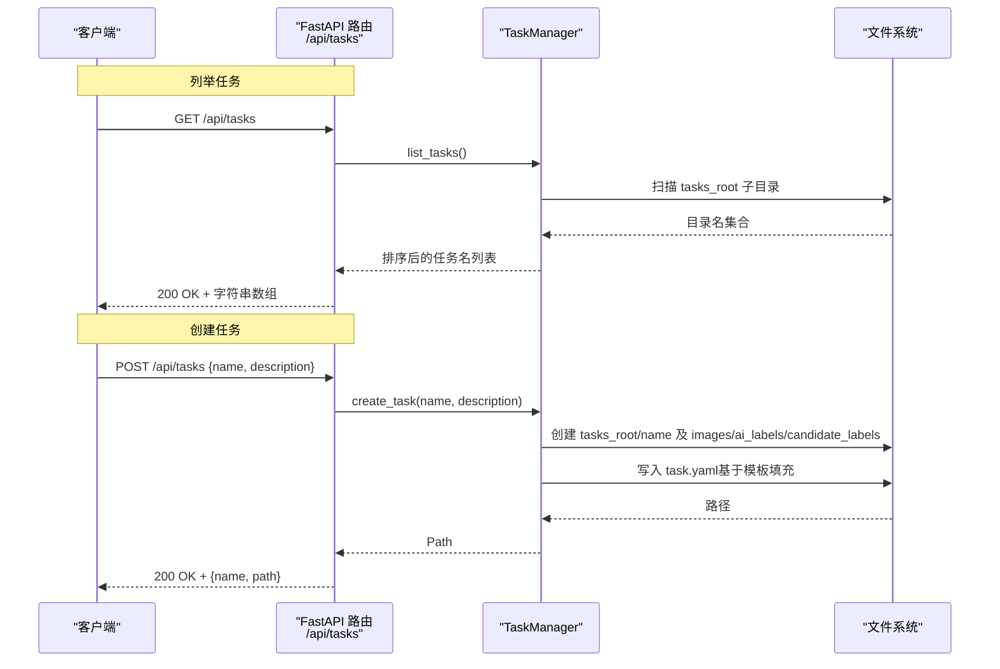
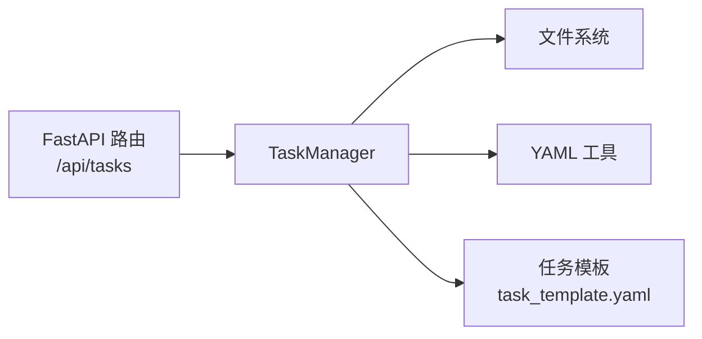

# 任务管理接口

<cite>
**本文引用的文件**
- [src/api_server.py](file://src/api_server.py)
- [src/core/task_manager.py](file://src/core/task_manager.py)
- [config/task_template.yaml](file://config/task_template.yaml)
- [tests/test_api_server.py](file://tests/test_api_server.py)
</cite>

## 目录
1. [简介](#简介)
2. [项目结构](#项目结构)
3. [核心组件](#核心组件)
4. [架构总览](#架构总览)
5. [详细端点说明](#详细端点说明)
6. [依赖关系分析](#依赖关系分析)
7. [性能考虑](#性能考虑)
8. [故障排查指南](#故障排查指南)
9. [结论](#结论)

## 简介
本文件为“任务管理”相关API的接口文档，聚焦以下两个端点：
- GET /api/tasks：列出所有任务名称
- POST /api/tasks：创建新任务

文档包含HTTP方法、URL模式、请求参数、响应格式、状态码说明；并提供TaskCreateRequest与TaskCreatedResponse的数据结构定义、成功与错误场景的请求/响应示例，以及任务命名规则、唯一性约束和错误处理机制。

## 项目结构
与任务管理API直接相关的代码位于后端服务层与任务管理层：
- API路由与数据模型定义在 api_server.py
- 任务生命周期（创建、列举、加载、删除）在 task_manager.py
- 任务模板配置在 config/task_template.yaml
- 行为验证与用例在 tests/test_api_server.py

图表来源
- [src/api_server.py:139-166](file://src/api_server.py#L139-L166)
- [src/core/task_manager.py:51-90](file://src/core/task_manager.py#L51-L90)
- [config/task_template.yaml:1-54](file://config/task_template.yaml#L1-L54)

章节来源
- [src/api_server.py:139-166](file://src/api_server.py#L139-L166)
- [src/core/task_manager.py:51-90](file://src/core/task_manager.py#L51-L90)
- [config/task_template.yaml:1-54](file://config/task_template.yaml#L1-L54)

## 核心组件
- FastAPI 应用与路由：提供 /api/tasks 的GET与POST端点，负责请求解析、校验与响应序列化。
- TaskManager：维护 tasks_root 下的任务目录结构，实现 create_task、list_tasks 等能力，并基于模板生成任务配置。
- 数据模型：
  - TaskCreateRequest：创建任务的请求体
  - TaskCreatedResponse：创建任务成功的响应体

章节来源
- [src/api_server.py:29-41](file://src/api_server.py#L29-L41)
- [src/core/task_manager.py:14-90](file://src/core/task_manager.py#L14-L90)

## 架构总览
下图展示了任务创建与列举的核心调用链：客户端通过HTTP调用FastAPI路由，路由将请求委托给TaskManager完成持久化或查询，最终返回JSON响应。

图表来源
- [src/api_server.py:139-166](file://src/api_server.py#L139-L166)
- [src/core/task_manager.py:51-90](file://src/core/task_manager.py#L51-L90)

## 详细端点说明

### GET /api/tasks
- 功能：列出所有任务名称（按字母序排序）
- 方法：GET
- URL：/api/tasks
- 请求头：无特殊要求
- 请求体：无
- 响应体：字符串数组，元素为任务名
- 状态码：
  - 200：成功
- 错误处理：
  - 若 tasks_root 不存在，返回空数组（由底层实现保证）

章节来源
- [src/api_server.py:139-147](file://src/api_server.py#L139-L147)
- [src/core/task_manager.py:82-90](file://src/core/task_manager.py#L82-L90)

### POST /api/tasks
- 功能：创建新任务
- 方法：POST
- URL：/api/tasks
- 请求体：TaskCreateRequest
- 响应体：TaskCreatedResponse
- 状态码：
  - 200：创建成功
  - 409：任务已存在（重复名称）
- 错误处理：
  - 当同名任务已存在时，抛出409冲突错误

章节来源
- [src/api_server.py:149-166](file://src/api_server.py#L149-L166)
- [src/core/task_manager.py:51-80](file://src/core/task_manager.py#L51-L80)

### 数据结构定义

#### TaskCreateRequest
- name：必填，字符串，最小长度1，表示唯一任务名
- description：可选，字符串，自然语言描述

章节来源
- [src/api_server.py:29-34](file://src/api_server.py#L29-L34)

#### TaskCreatedResponse
- name：字符串，任务名
- path：字符串，任务根目录路径

章节来源
- [src/api_server.py:36-41](file://src/api_server.py#L36-L41)

### 请求与响应示例

- 成功创建任务
  - 请求
    - 方法：POST
    - URL：/api/tasks
    - 内容类型：application/json
    - 请求体：{"name": "demo", "description": "test"}
  - 响应
    - 状态码：200
    - 响应体：{"name": "demo", "path": "tasks/demo"}

- 重复任务名
  - 请求
    - 方法：POST
    - URL：/api/tasks
    - 内容类型：application/json
    - 请求体：{"name": "demo", "description": "test"}
  - 响应
    - 状态码：409
    - 响应体：包含错误详情的对象（detail字段）

- 列举任务
  - 请求
    - 方法：GET
    - URL：/api/tasks
  - 响应
    - 状态码：200
    - 响应体：["demo"]

以上示例的行为由测试用例覆盖，可参考：
- 创建与列举、409冲突、列举结果顺序等断言

章节来源
- [tests/test_api_server.py:44-51](file://tests/test_api_server.py#L44-L51)

### 任务命名规则与唯一性约束
- 命名规则：
  - name 为必填字符串，且最小长度为1
  - 名称同时作为任务目录名，需符合操作系统文件系统命名规范
- 唯一性约束：
  - 同一 tasks_root 下不允许存在同名任务
  - 重复创建会触发409冲突

章节来源
- [src/api_server.py:29-34](file://src/api_server.py#L29-L34)
- [src/core/task_manager.py:51-80](file://src/core/task_manager.py#L51-L80)

### 错误处理机制
- 409 Conflict：当尝试创建已存在的任务时返回
- 其他异常：当前端点未捕获其他异常，默认由框架处理

章节来源
- [src/api_server.py:149-166](file://src/api_server.py#L149-L166)

## 依赖关系分析
- API层依赖：
  - FastAPI路由与Pydantic模型用于请求/响应校验与序列化
  - 调用 TaskManager 完成实际的任务创建与列举
- 任务管理层依赖：
  - 文件系统工具确保目录存在
  - YAML工具读写任务配置，基于模板初始化
- 配置依赖：
  - 任务模板 config/task_template.yaml 在创建任务时被合并到 task.yaml

图表来源
- [src/api_server.py:139-166](file://src/api_server.py#L139-L166)
- [src/core/task_manager.py:51-90](file://src/core/task_manager.py#L51-L90)
- [config/task_template.yaml:1-54](file://config/task_template.yaml#L1-L54)

章节来源
- [src/api_server.py:139-166](file://src/api_server.py#L139-L166)
- [src/core/task_manager.py:51-90](file://src/core/task_manager.py#L51-L90)
- [config/task_template.yaml:1-54](file://config/task_template.yaml#L1-L54)

## 性能考虑
- 列举任务：仅遍历 tasks_root 的子目录并按名称排序，时间复杂度近似 O(N log N)，N为任务数，通常开销很小。
- 创建任务：涉及目录创建与YAML写入，I/O操作为主，建议避免高频批量创建。
- 并发安全：当前实现基于文件系统原子性有限，高并发创建同名任务可能产生竞争条件；如需强一致，可在上层加锁或引入数据库。

[本节为通用指导，不直接分析具体文件]

## 故障排查指南
- 409冲突：检查是否已存在同名任务；可通过 GET /api/tasks 确认现有任务列表。
- 创建后找不到任务：确认 tasks_root 路径是否正确，以及服务端进程对该目录有读写权限。
- 日志定位：查看服务器日志中关于任务创建的记录，便于定位问题。

章节来源
- [tests/test_api_server.py:44-51](file://tests/test_api_server.py#L44-L51)

## 结论
本接口提供了简洁可靠的“任务创建”与“任务列举”能力，采用文件系统作为持久化存储，并通过模板化配置快速初始化任务。遵循命名与唯一性约束，结合明确的错误码与响应结构，便于前端集成与自动化流程。对于高并发或强一致性需求，建议在业务层增加并发控制或迁移至数据库存储。