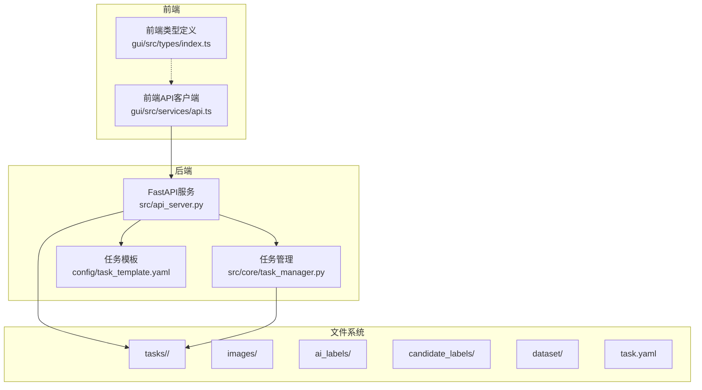
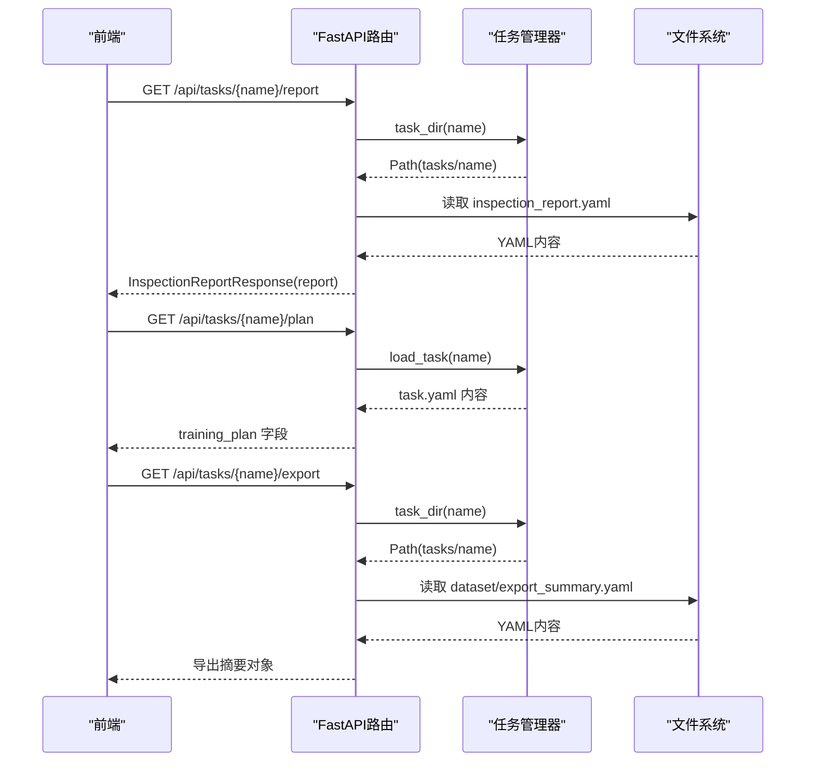
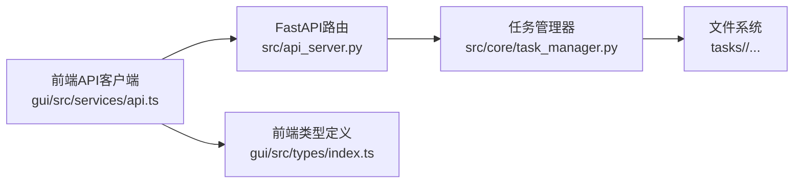

# 数据访问接口

<cite>
**本文引用的文件**
- [src/api_server.py](file://src/api_server.py)
- [gui/src/services/api.ts](file://gui/src/services/api.ts)
- [gui/src/types/index.ts](file://gui/src/types/index.ts)
- [src/core/task_manager.py](file://src/core/task_manager.py)
- [config/task_template.yaml](file://config/task_template.yaml)
</cite>

## 目录
1. [简介](#简介)
2. [项目结构](#项目结构)
3. [核心组件](#核心组件)
4. [架构总览](#架构总览)
5. [详细端点分析](#详细端点分析)
6. [依赖关系分析](#依赖关系分析)
7. [性能与最佳实践](#性能与最佳实践)
8. [故障排查指南](#故障排查指南)
9. [结论](#结论)
10. [附录：数据结构定义](#附录数据结构定义)

## 简介
本文件面向数据访问相关的API接口，聚焦以下三个只读端点：
- GET /api/tasks/{name}/report：获取质检报告
- GET /api/tasks/{name}/plan：获取训练计划
- GET /api/tasks/{name}/export：获取导出摘要

文档包含每个端点的请求/响应格式、错误码、数据来源与存储位置、以及查询与过滤的最佳实践。同时给出InspectionReportResponse等响应模型说明，便于前后端协同开发。

## 项目结构
后端基于FastAPI提供REST接口，任务数据以文件系统形式组织在tasks根目录下，每个任务一个子目录，包含images、ai_labels、candidate_labels、dataset等子目录及task.yaml配置文件。前端通过Axios调用后端API，并在类型文件中定义共享的数据结构。

图表来源
- [src/api_server.py:1-384](file://src/api_server.py#L1-L384)
- [gui/src/services/api.ts:1-80](file://gui/src/services/api.ts#L1-L80)
- [gui/src/types/index.ts:1-89](file://gui/src/types/index.ts#L1-L89)
- [src/core/task_manager.py:1-150](file://src/core/task_manager.py#L1-L150)
- [config/task_template.yaml:1-54](file://config/task_template.yaml#L1-L54)

章节来源
- [src/api_server.py:1-384](file://src/api_server.py#L1-L384)
- [src/core/task_manager.py:1-150](file://src/core/task_manager.py#L1-L150)
- [config/task_template.yaml:1-54](file://config/task_template.yaml#L1-L54)

## 核心组件
- FastAPI应用与路由：集中定义所有HTTP端点，包括报告、计划、导出摘要等读取接口。
- 任务管理器：负责任务目录的创建、列举、配置加载与持久化，统一任务数据的物理路径。
- 前端API客户端：封装Axios调用，提供便捷方法用于获取报告、计划、导出摘要等。
- 前端类型定义：定义InspectionReport、TaskPlan、ExportSummary等数据结构，保证前后端契约一致。

章节来源
- [src/api_server.py:1-384](file://src/api_server.py#L1-L384)
- [gui/src/services/api.ts:1-80](file://gui/src/services/api.ts#L1-L80)
- [gui/src/types/index.ts:1-89](file://gui/src/types/index.ts#L1-L89)
- [src/core/task_manager.py:1-150](file://src/core/task_manager.py#L1-L150)

## 架构总览
下图展示了三个目标端点在请求处理中的关键交互：前端发起GET请求，后端路由解析任务名并定位对应数据文件（YAML），读取后返回JSON响应。

图表来源
- [src/api_server.py:234-288](file://src/api_server.py#L234-L288)
- [src/core/task_manager.py:40-107](file://src/core/task_manager.py#L40-L107)

## 详细端点分析

### GET /api/tasks/{name}/report（获取质检报告）
- 功能：返回指定任务的最新质检报告。
- 请求：
  - 路径参数：name（任务名）
  - 无请求体
- 响应：
  - 成功：200，类型为InspectionReportResponse，包含report字段，值为质检报告字典。
  - 失败：
    - 404：任务不存在或inspection_report.yaml缺失
- 数据来源与存储位置：
  - 文件路径：<tasks_root>/<name>/inspection_report.yaml
  - 由任务管理器提供的task_dir(name)拼接得到
- 前端使用：
  - 通过getReport(task)调用，返回InspectionReport对象
- 注意事项：
  - 若未执行inspect步骤或未生成报告，将返回404

章节来源
- [src/api_server.py:64-68](file://src/api_server.py#L64-L68)
- [src/api_server.py:234-250](file://src/api_server.py#L234-L250)
- [gui/src/services/api.ts:38-42](file://gui/src/services/api.ts#L38-L42)
- [gui/src/types/index.ts:66-80](file://gui/src/types/index.ts#L66-L80)
- [src/core/task_manager.py:40-49](file://src/core/task_manager.py#L40-L49)

### GET /api/tasks/{name}/plan（获取训练计划）
- 功能：返回当前任务的训练计划（training_plan段）。
- 请求：
  - 路径参数：name（任务名）
  - 无请求体
- 响应：
  - 成功：200，返回training_plan字典
  - 失败：
    - 404：任务不存在
- 数据来源与存储位置：
  - 文件路径：<tasks_root>/<name>/task.yaml
  - 从task.yaml中读取training_plan字段
- 前端使用：
  - 通过getPlan(task)调用，返回TaskPlan对象
- 注意事项：
  - 若task.yaml缺少training_plan，将返回空字典

章节来源
- [src/api_server.py:253-269](file://src/api_server.py#L253-L269)
- [gui/src/services/api.ts:44-48](file://gui/src/services/api.ts#L44-L48)
- [gui/src/types/index.ts:26-55](file://gui/src/types/index.ts#L26-L55)
- [src/core/task_manager.py:92-107](file://src/core/task_manager.py#L92-L107)
- [config/task_template.yaml:8-54](file://config/task_template.yaml#L8-L54)

### GET /api/tasks/{name}/export（获取导出摘要）
- 功能：返回数据集拆分步骤生成的导出摘要。
- 请求：
  - 路径参数：name（任务名）
  - 无请求体
- 响应：
  - 成功：200，返回导出摘要字典
  - 失败：
    - 404：任务不存在或dataset/export_summary.yaml缺失
- 数据来源与存储位置：
  - 文件路径：<tasks_root>/<name>/dataset/export_summary.yaml
  - 由split步骤生成
- 前端使用：
  - 通过getExportSummary(task)调用，返回ExportSummary对象
- 注意事项：
  - 需先执行split步骤才会生成该文件

章节来源
- [src/api_server.py:272-288](file://src/api_server.py#L272-L288)
- [gui/src/services/api.ts:61-65](file://gui/src/services/api.ts#L61-L65)
- [gui/src/types/index.ts:82-88](file://gui/src/types/index.ts#L82-L88)
- [src/core/task_manager.py:40-49](file://src/core/task_manager.py#L40-L49)

## 依赖关系分析
- 路由层依赖任务管理器进行目录与配置的访问。
- 任务管理器依赖文件系统工具与YAML工具进行读写。
- 前端API客户端依赖后端路由，并通过类型定义保持数据结构一致性。

图表来源
- [src/api_server.py:1-384](file://src/api_server.py#L1-L384)
- [src/core/task_manager.py:1-150](file://src/core/task_manager.py#L1-L150)
- [gui/src/services/api.ts:1-80](file://gui/src/services/api.ts#L1-L80)
- [gui/src/types/index.ts:1-89](file://gui/src/types/index.ts#L1-L89)

章节来源
- [src/api_server.py:1-384](file://src/api_server.py#L1-L384)
- [src/core/task_manager.py:1-150](file://src/core/task_manager.py#L1-L150)
- [gui/src/services/api.ts:1-80](file://gui/src/services/api.ts#L1-L80)
- [gui/src/types/index.ts:1-89](file://gui/src/types/index.ts#L1-L89)

## 性能与最佳实践
- 缓存策略：
  - 对于频繁读取的计划与导出摘要，可在前端做短期缓存（例如按任务名+时间戳），减少重复请求。
  - 质检报告通常较大，建议按需加载，避免列表页一次性拉取全部详情。
- 分页与过滤：
  - 当前三个端点为全量读取；如需优化，可在前端对返回数据进行本地过滤（如按类别、指标阈值筛选）。
- 并发控制：
  - 同一任务的多端点请求可并行发起，但应避免对同一资源的频繁刷新导致I/O压力。
- 错误重试：
  - 对404错误应提示用户先执行相应步骤（如inspect、split），再重试。
- 网络超时：
  - 前端已设置较长超时，适合大文件读取场景；可根据实际网络环境调整。

[本节为通用指导，不直接分析具体文件]

## 故障排查指南
- 404 任务不存在：
  - 检查任务是否已通过POST /api/tasks创建，且名称正确。
  - 确认tasks根目录存在且可读。
- 404 报告/导出缺失：
  - 确保已执行inspect步骤生成inspection_report.yaml。
  - 确保已执行split步骤生成dataset/export_summary.yaml。
- 404 图像或标签缺失：
  - 检查images目录是否存在对应图片。
  - 检查ai_labels或candidate_labels下是否有同名txt标签文件。
- 日志定位：
  - 后端会记录步骤失败的异常信息，可通过日志查看具体原因。

章节来源
- [src/api_server.py:183-189](file://src/api_server.py#L183-L189)
- [src/api_server.py:247-250](file://src/api_server.py#L247-L250)
- [src/api_server.py:285-288](file://src/api_server.py#L285-L288)

## 结论
本文档明确了三个数据访问端点的职责、请求/响应格式、数据存储位置与前端调用方式。通过统一的YAML文件结构与任务管理器抽象，系统实现了清晰的数据边界与稳定的接口契约。建议在业务侧结合缓存与本地过滤提升体验，并确保在执行相关步骤后再访问对应数据。

[本节为总结性内容，不直接分析具体文件]

## 附录：数据结构定义

### InspectionReportResponse
- 描述：质检报告响应模型
- 字段：
  - report：字典，内容为质检报告的具体数据

章节来源
- [src/api_server.py:64-68](file://src/api_server.py#L64-L68)

### InspectionReport（前端类型）
- 描述：质检报告结构（与后端InspectAgent输出对应）
- 字段：
  - task：任务名
  - num_images：图片数量
  - num_boxes：标注框数量
  - errors：各类错误列表（缺失标签、重复框、类别错误、坐标越界、尺寸异常）
  - quality_score：质量评分
  - candidate_dir：候选修正目录路径

章节来源
- [gui/src/types/index.ts:66-80](file://gui/src/types/index.ts#L66-L80)

### TaskPlan（前端类型）
- 描述：训练计划结构（与task_template.yaml对应）
- 字段：
  - classes：类别映射
  - min_defect_pixels：最小缺陷像素
  - conf_threshold：置信度阈值
  - exclude_items：排除项
  - obb_rule：OBB规则
  - split：数据集划分比例与分层设置
  - model：YOLO版本与图像尺寸
  - hyperparameters：超参数
  - inspection：质检规则
  - metrics：评估指标

章节来源
- [gui/src/types/index.ts:26-55](file://gui/src/types/index.ts#L26-L55)
- [config/task_template.yaml:8-54](file://config/task_template.yaml#L8-L54)

### ExportSummary（前端类型）
- 描述：数据集导出摘要（split步骤输出）
- 字段：
  - task：任务名
  - splits：各集合数量映射
  - dataset_yaml：生成的数据集配置文件路径
  - train_command：训练命令

章节来源
- [gui/src/types/index.ts:82-88](file://gui/src/types/index.ts#L82-L88)