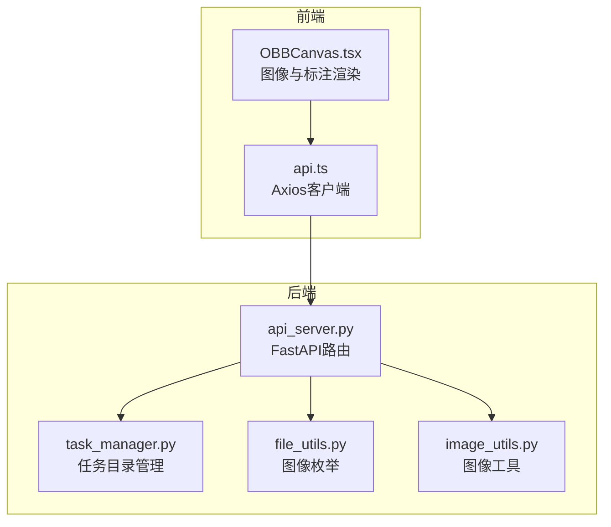
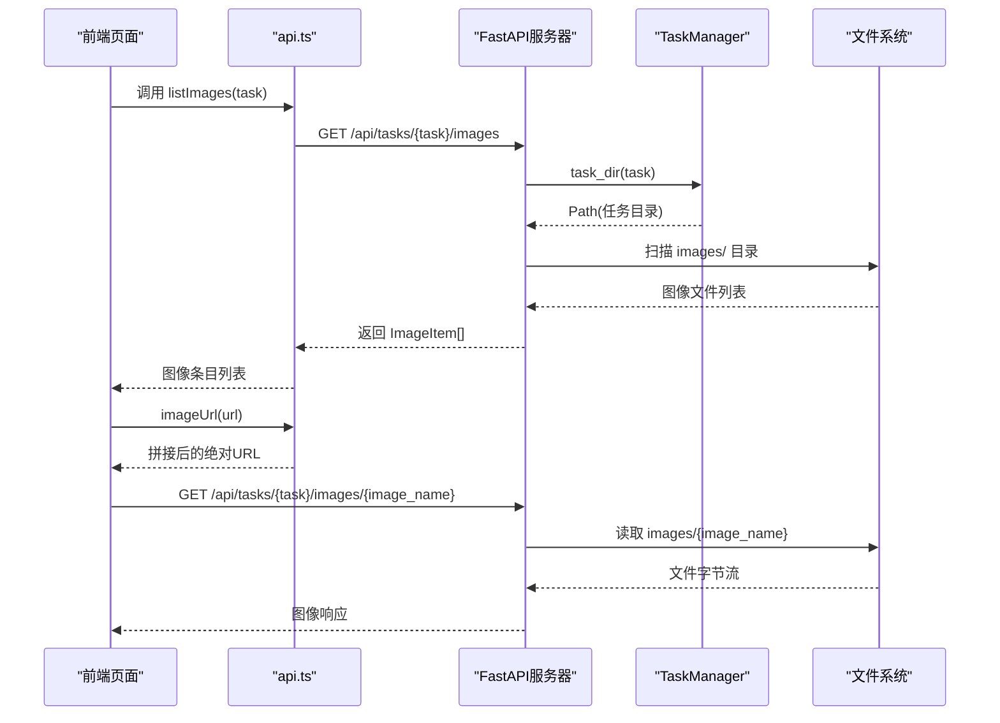
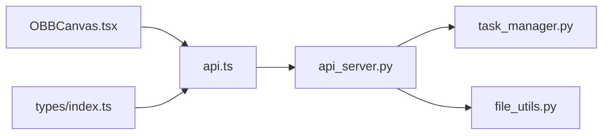

# 文件服务接口

<cite>
**本文引用的文件**
- [src/api_server.py](file://src/api_server.py)
- [gui/src/services/api.ts](file://gui/src/services/api.ts)
- [gui/src/components/OBBCanvas.tsx](file://gui/src/components/OBBCanvas.tsx)
- [gui/src/types/index.ts](file://gui/src/types/index.ts)
- [src/utils/file_utils.py](file://src/utils/file_utils.py)
- [src/utils/image_utils.py](file://src/utils/image_utils.py)
- [src/core/task_manager.py](file://src/core/task_manager.py)
</cite>

## 目录
1. [简介](#简介)
2. [项目结构](#项目结构)
3. [核心组件](#核心组件)
4. [架构总览](#架构总览)
5. [详细组件分析](#详细组件分析)
6. [依赖关系分析](#依赖关系分析)
7. [性能考虑](#性能考虑)
8. [故障排查指南](#故障排查指南)
9. [结论](#结论)
10. [附录](#附录)

## 简介
本文件服务面向标注与检查流程中的图像数据，提供任务级图像的列出与下载能力。当前已实现的端点包括：
- GET /api/tasks/{name}/images：列出某任务下的所有图像，返回包含名称与可访问URL的条目列表。
- GET /api/tasks/{name}/images/{image_name}：按文件名下载指定图像。

此外，文档还给出ImageItem数据结构说明、图像存储路径与访问权限、支持的文件类型与大小限制、安全注意事项，以及前端Canvas组件集成方式与上传/下载扩展建议。

## 项目结构
后端基于FastAPI暴露HTTP接口，使用TaskManager管理任务目录结构，使用file_utils进行图像枚举；前端通过Axios调用后端API，并在Canvas中渲染图像与标注框。

图表来源
- [src/api_server.py:139-377](file://src/api_server.py#L139-L377)
- [gui/src/services/api.ts:50-59](file://gui/src/services/api.ts#L50-L59)
- [gui/src/components/OBBCanvas.tsx:56-94](file://gui/src/components/OBBCanvas.tsx#L56-L94)
- [src/core/task_manager.py:14-49](file://src/core/task_manager.py#L14-L49)
- [src/utils/file_utils.py:10-22](file://src/utils/file_utils.py#L10-L22)
- [src/utils/image_utils.py:13-33](file://src/utils/image_utils.py#L13-L33)

章节来源
- [src/api_server.py:139-377](file://src/api_server.py#L139-L377)
- [gui/src/services/api.ts:50-59](file://gui/src/services/api.ts#L50-L59)
- [src/core/task_manager.py:14-49](file://src/core/task_manager.py#L14-L49)
- [src/utils/file_utils.py:10-22](file://src/utils/file_utils.py#L10-L22)

## 核心组件
- FastAPI应用与路由：定义任务相关接口，包括图像列表与图像下载。
- TaskManager：维护任务根目录及每个任务的子目录（images、ai_labels、candidate_labels等）。
- file_utils：列举任务images目录下的图像文件，限定支持的扩展名。
- image_utils：提供图像加载、尺寸获取与基础校验能力。
- 前端API客户端：封装对后端的请求，并提供图片URL拼接工具。
- Canvas组件：负责图像缩放、平移与YOLO-OBB标注绘制。

章节来源
- [src/api_server.py:21-26](file://src/api_server.py#L21-L26)
- [src/core/task_manager.py:14-49](file://src/core/task_manager.py#L14-L49)
- [src/utils/file_utils.py:10-22](file://src/utils/file_utils.py#L10-L22)
- [src/utils/image_utils.py:13-33](file://src/utils/image_utils.py#L13-L33)
- [gui/src/services/api.ts:50-59](file://gui/src/services/api.ts#L50-L59)
- [gui/src/components/OBBCanvas.tsx:56-94](file://gui/src/components/OBBCanvas.tsx#L56-L94)

## 架构总览
下图展示了从前端到后端的完整调用链路，包括图像列表与图像下载的时序。

图表来源
- [gui/src/services/api.ts:50-59](file://gui/src/services/api.ts#L50-L59)
- [src/api_server.py:341-377](file://src/api_server.py#L341-L377)
- [src/core/task_manager.py:40-49](file://src/core/task_manager.py#L40-L49)
- [src/utils/file_utils.py:10-22](file://src/utils/file_utils.py#L10-L22)

## 详细组件分析

### 端点：GET /api/tasks/{name}/images
- 功能：列出指定任务下的所有图像，返回每条图像的name与url。
- 输入参数：
  - name：任务名称（路径段）
- 返回数据：
  - 数组元素为ImageItem对象，字段如下：
    - name：图像文件名
    - url：相对API路径，形如 /api/tasks/{name}/images/{image_name}
- 错误处理：
  - 若任务不存在，返回404并附带错误信息。
- 实现要点：
  - 通过TaskManager获取任务目录，再调用file_utils.list_images枚举images子目录。
  - 为每个图像生成API相对URL。

章节来源
- [src/api_server.py:341-357](file://src/api_server.py#L341-L357)
- [src/utils/file_utils.py:10-22](file://src/utils/file_utils.py#L10-L22)
- [src/core/task_manager.py:40-49](file://src/core/task_manager.py#L40-L49)

### 端点：GET /api/tasks/{name}/images/{image_name}
- 功能：按文件名下载指定图像。
- 输入参数：
  - name：任务名称（路径段）
  - image_name：图像文件名（路径段）
- 返回数据：
  - 二进制图像响应（由FileResponse直接返回）
- 错误处理：
  - 若图像文件不存在，返回404并附带错误信息。
- 实现要点：
  - 根据任务名解析到任务目录，再定位到images子目录下的具体文件。

章节来源
- [src/api_server.py:360-377](file://src/api_server.py#L360-L377)

### ImageItem 数据结构
- 字段：
  - name：字符串，图像文件名
  - url：字符串，指向该图像的API相对路径
  - width：可选，整数，图像宽度（前端类型定义中包含，但当前后端未返回）
  - height：可选，整数，图像高度（前端类型定义中包含，但当前后端未返回）
- 说明：
  - 前端在类型定义中预留了width/height字段，可用于后续扩展（例如在列表时预取图像尺寸）。

章节来源
- [src/api_server.py:57-62](file://src/api_server.py#L57-L62)
- [gui/src/types/index.ts:11-17](file://gui/src/types/index.ts#L11-L17)

### 图像存储路径与访问权限
- 存储路径：
  - 任务根目录由TaskManager维护，位于tasks_root下以任务名为子目录。
  - 图像统一存放在任务目录的images子目录下。
- 访问权限：
  - 当前实现未做鉴权或访问控制，任何能访问后端服务的客户端均可列出和下载图像。
  - 建议在生产环境增加认证与授权机制（如JWT、会话、IP白名单等），并对敏感任务实施细粒度权限控制。

章节来源
- [src/core/task_manager.py:14-49](file://src/core/task_manager.py#L14-L49)
- [src/api_server.py:341-377](file://src/api_server.py#L341-L377)

### 文件类型支持与大小限制
- 支持的文件类型：
  - 仅允许以下扩展名的图像被枚举与访问：jpg、jpeg、png、bmp、tif、tiff（不区分大小写）。
- 大小限制：
  - 当前未实现文件大小限制。
  - 建议：
    - 在上传入口增加最大文件大小限制（例如单文件不超过几十MB）。
    - 在服务层对下载响应设置合理的超时与缓冲策略，避免大文件导致内存压力。

章节来源
- [src/utils/file_utils.py:7-22](file://src/utils/file_utils.py#L7-L22)

### 安全考虑
- 路径遍历防护：
  - 当前实现直接使用路径段拼接文件路径，存在潜在的路径穿越风险。
  - 建议：
    - 对name与image_name进行严格校验（仅允许字母、数字、下划线、连字符等）。
    - 使用安全的路径解析方法，确保最终路径始终位于任务images目录内。
- 内容类型与MIME：
  - FileResponse会根据文件扩展名推断Content-Type，需确保扩展名与实际内容一致，防止误导浏览器。
- 速率限制与防滥用：
  - 建议对图像列表与下载接口增加限流策略，防止恶意扫描或资源耗尽。
- 日志与审计：
  - 记录关键访问事件（成功/失败），便于追踪异常行为。

章节来源
- [src/api_server.py:341-377](file://src/api_server.py#L341-L377)

### 前端Canvas组件集成方式
- 图像加载：
  - 前端通过api.ts的listImages获取图像条目，并使用imageUrl将相对URL转换为绝对URL。
  - OBBCanvas接收imageUrl作为属性，内部创建Image对象并设置crossOrigin为anonymous，然后绘制到Canvas。
- 标注叠加：
  - 通过labels接口获取YOLO-OBB标注框，并在Canvas中以归一化坐标绘制多边形与标签。
- 交互能力：
  - 支持滚轮缩放与拖拽平移，便于查看大图细节。

章节来源
- [gui/src/services/api.ts:50-59](file://gui/src/services/api.ts#L50-L59)
- [gui/src/components/OBBCanvas.tsx:56-94](file://gui/src/components/OBBCanvas.tsx#L56-L94)

### 文件上传与下载的扩展建议
- 上传接口建议：
  - POST /api/tasks/{name}/images：接受multipart/form-data，包含一个或多个图像文件。
  - 服务端校验：
    - 文件扩展名必须在允许列表中。
    - 文件大小上限限制。
    - 可选：图像解码验证（参考image_utils.load_image）与最小尺寸校验。
  - 存储：
    - 写入任务目录的images子目录，命名规则建议保留原文件名或使用哈希+后缀以避免冲突。
- 下载接口建议：
  - 保持现有GET /api/tasks/{name}/images/{image_name}不变。
  - 可增加查询参数用于格式转换或压缩（如?format=webp&quality=80），但需注意向后兼容。
- 批量操作：
  - 提供批量删除或移动接口，配合任务生命周期管理。
- 元数据：
  - 可在列表时返回width/height等元数据，减少前端二次请求。

[本节为概念性建议，无需代码来源]

## 依赖关系分析
- api_server依赖：
  - TaskManager：获取任务目录与任务列表。
  - file_utils：枚举图像文件。
  - FastAPI：路由与响应模型。
- 前端依赖：
  - axios：发起HTTP请求。
  - types：定义前后端共享的数据结构。
  - OBBCanvas：渲染图像与标注。

图表来源
- [src/api_server.py:16-19](file://src/api_server.py#L16-L19)
- [gui/src/services/api.ts:1-9](file://gui/src/services/api.ts#L1-L9)
- [gui/src/components/OBBCanvas.tsx:1-5](file://gui/src/components/OBBCanvas.tsx#L1-L5)
- [gui/src/types/index.ts:1-17](file://gui/src/types/index.ts#L1-L17)

章节来源
- [src/api_server.py:16-19](file://src/api_server.py#L16-L19)
- [gui/src/services/api.ts:1-9](file://gui/src/services/api.ts#L1-L9)

## 性能考虑
- 图像列表：
  - 当前仅枚举文件名与生成URL，开销较低。
  - 若未来返回width/height，建议异步预取或懒加载，避免阻塞列表渲染。
- 图像下载：
  - FileResponse直接返回文件流，适合静态文件分发。
  - 建议结合CDN或反向代理缓存热点图像，降低后端负载。
- 并发与I/O：
  - 在高并发场景下，注意文件句柄与磁盘I/O瓶颈，必要时引入连接池与缓存。

[本节为通用性能建议，无需代码来源]

## 故障排查指南
- 404 任务不存在：
  - 检查任务是否已通过创建接口初始化，确认TaskManager的任务根目录是否存在。
- 404 图像不存在：
  - 确认图像文件确实存在于任务目录的images子目录下，且文件名完全匹配。
- 图像无法解码：
  - 若后续加入解码校验，可能因文件损坏或编码不支持导致失败，需检查文件完整性。
- 前端跨域问题：
  - 若部署在不同域名，需配置CORS；当前开发环境默认本地地址，通常无跨域问题。

章节来源
- [src/api_server.py:341-377](file://src/api_server.py#L341-L377)
- [src/utils/image_utils.py:13-33](file://src/utils/image_utils.py#L13-L33)

## 结论
当前文件服务提供了稳定的图像列出与下载能力，满足标注与检查流程的基本需求。建议在后续迭代中补充上传接口、安全校验、大小限制与元数据增强，并结合CDN与缓存优化大规模图像访问性能。前端Canvas组件已具备良好的图像渲染与交互能力，可与新增接口无缝集成。

[本节为总结性内容，无需代码来源]

## 附录
- 端点速查：
  - GET /api/tasks/{name}/images：返回ImageItem[]
  - GET /api/tasks/{name}/images/{image_name}：返回图像文件
- 数据结构：
  - ImageItem：{ name, url, width?, height? }
- 支持的文件类型：
  - jpg、jpeg、png、bmp、tif、tiff
- 存储路径：
  - tasks_root/<task>/images/<image_name>

[本节为参考信息，无需代码来源]