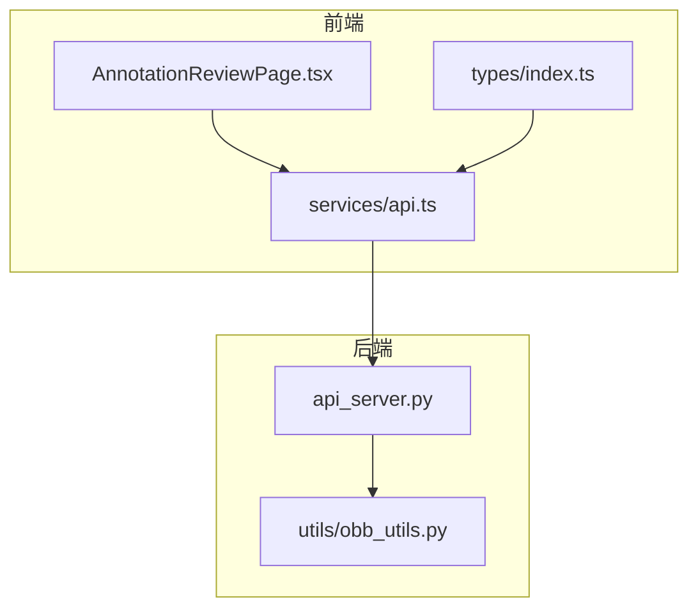
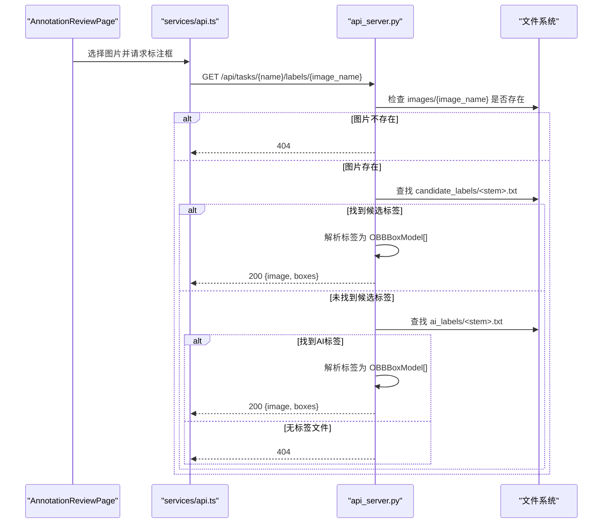
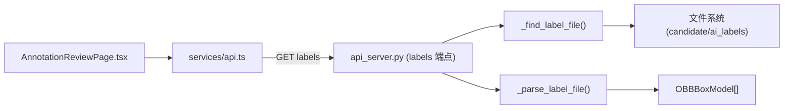

# 标注数据接口

<cite>
**本文引用的文件**
- [src/api_server.py](file://src/api_server.py)
- [specs/per-image-label-api.spec.md](file://specs/per-image-label-api.spec.md)
- [gui/src/services/api.ts](file://gui/src/services/api.ts)
- [gui/src/types/index.ts](file://gui/src/types/index.ts)
- [gui/src/pages/AnnotationReviewPage.tsx](file://gui/src/pages/AnnotationReviewPage.tsx)
- [tests/test_api_server.py](file://tests/test_api_server.py)
- [src/utils/obb_utils.py](file://src/utils/obb_utils.py)
</cite>

## 目录
1. [简介](#简介)
2. [项目结构](#项目结构)
3. [核心组件](#核心组件)
4. [架构总览](#架构总览)
5. [详细端点说明](#详细端点说明)
6. [依赖关系分析](#依赖关系分析)
7. [性能与健壮性](#性能与健壮性)
8. [故障排查指南](#故障排查指南)
9. [结论](#结论)
10. [附录：前端集成与解析示例](#附录前端集成与解析示例)

## 简介
本文件面向标注数据相关的前后端接口，聚焦以下两个只读端点：
- GET /api/tasks/{name}/labels：列出任务中已标注的图片名称（存在候选或AI标签）
- GET /api/tasks/{name}/labels/{image_name}：获取单张图像的旋转边界框（OBB）列表

文档同时说明数据结构 LabelBoxesResponse、OBBBoxModel、LabeledImagesResponse，解释旋转边界框坐标格式（8个归一化数值表示4个顶点），并明确标注文件的优先级机制（candidate_labels 优先于 ai_labels）。文末提供前端调用示例与解析要点。

## 项目结构
与标注数据接口直接相关的代码分布在后端 FastAPI 服务、前端 API 客户端、类型定义以及测试用例中：
- 后端：FastAPI 路由与模型定义、标签解析逻辑
- 前端：Axios 封装的 API 客户端与页面调用
- 规范：逐图标签接口的规格说明
- 工具：OBB 几何与坐标归一化工具
- 测试：覆盖优先级、404、空文件、畸形行等场景

图表来源
- [gui/src/pages/AnnotationReviewPage.tsx:1-118](file://gui/src/pages/AnnotationReviewPage.tsx#L1-L118)
- [gui/src/services/api.ts:1-80](file://gui/src/services/api.ts#L1-L80)
- [gui/src/types/index.ts:1-89](file://gui/src/types/index.ts#L1-L89)
- [src/api_server.py:1-384](file://src/api_server.py#L1-L384)
- [src/utils/obb_utils.py:1-151](file://src/utils/obb_utils.py#L1-L151)

章节来源
- [src/api_server.py:1-384](file://src/api_server.py#L1-L384)
- [specs/per-image-label-api.spec.md:1-38](file://specs/per-image-label-api.spec.md#L1-L38)

## 核心组件
- 后端模型
  - OBBBoxModel：单个旋转框，包含类别 cls、8个归一化坐标 points、置信度 conf（默认1.0）
  - LabelBoxesResponse：单图响应体，包含 image 文件名与 boxes 列表
  - LabeledImagesResponse：列表响应体，包含 images 字符串数组
- 标签解析与查找
  - _parse_label_file：按行解析 YOLO-OBB 标签，跳过畸形行，返回 OBBBoxModel 列表
  - _find_label_file：按 candidate_labels → ai_labels 顺序查找最佳标签文件
- 前端类型与客户端
  - types/index.ts 中的 OBBBox 与 ImageItem 等
  - services/api.ts 中的 listLabeledImages 与 getLabelBoxes 封装

章节来源
- [src/api_server.py:70-89](file://src/api_server.py#L70-L89)
- [src/api_server.py:91-136](file://src/api_server.py#L91-L136)
- [gui/src/types/index.ts:1-89](file://gui/src/types/index.ts#L1-L89)
- [gui/src/services/api.ts:67-79](file://gui/src/services/api.ts#L67-L79)

## 架构总览
标注数据读取流程：前端选择任务与图片后，调用后端接口获取该图的 OBB 框；后端根据图片名匹配标签文件（优先 candidate_labels，其次 ai_labels），解析为结构化框数据并返回。

图表来源
- [gui/src/pages/AnnotationReviewPage.tsx:32-40](file://gui/src/pages/AnnotationReviewPage.tsx#L32-L40)
- [gui/src/services/api.ts:73-79](file://gui/src/services/api.ts#L73-L79)
- [src/api_server.py:315-338](file://src/api_server.py#L315-L338)
- [src/api_server.py:121-136](file://src/api_server.py#L121-L136)
- [src/api_server.py:91-118](file://src/api_server.py#L91-L118)

## 详细端点说明

### GET /api/tasks/{name}/labels
- 功能：列出任务中所有“有标签”的图片名称（只要存在 candidate_labels 或 ai_labels 任一标签文件）
- 路径参数：
  - name：任务名
- 成功响应（200）：
  - 结构：LabeledImagesResponse
    - images：string[]，已排序的图片名列表
- 错误：
  - 404：任务不存在

章节来源
- [src/api_server.py:291-312](file://src/api_server.py#L291-L312)
- [specs/per-image-label-api.spec.md:5-21](file://specs/per-image-label-api.spec.md#L5-L21)

### GET /api/tasks/{name}/labels/{image_name}
- 功能：返回指定图片的旋转边界框列表（OBB）
- 路径参数：
  - name：任务名
  - image_name：图片文件名
- 成功响应（200）：
  - 结构：LabelBoxesResponse
    - image：string，图片文件名
    - boxes：OBBBoxModel[]，每个框包含：
      - cls：int，类别索引（从0开始）
      - points：number[]，长度为8的归一化坐标，顺序为 [x1,y1,x2,y2,x3,y3,x4,y4]，取值范围 [0,1]
      - conf：float，置信度（若标签文件无置信度列则默认为 1.0）
- 错误：
  - 404：任务不存在 / 图片不存在 / 无标签文件

章节来源
- [src/api_server.py:70-83](file://src/api_server.py#L70-L83)
- [src/api_server.py:315-338](file://src/api_server.py#L315-L338)
- [specs/per-image-label-api.spec.md:12-28](file://specs/per-image-label-api.spec.md#L12-L28)

### 数据结构说明
- OBBBoxModel（后端 Pydantic 模型）
  - 字段：cls(int)、points(float[])、conf(float=1.0)
  - 用途：描述一个旋转边界框及其置信度
- LabelBoxesResponse（后端响应模型）
  - 字段：image(string)、boxes(OBBBoxModel[])
  - 用途：单图标注结果
- LabeledImagesResponse（后端响应模型）
  - 字段：images(string[])
  - 用途：列出有标签的图片名
- 前端对应类型（OBBBox）
  - 字段：cls(number)、points(number[])、conf(number)
  - 约定：points 为扁平化的8个归一化坐标，顺时针排列

章节来源
- [src/api_server.py:70-89](file://src/api_server.py#L70-L89)
- [gui/src/types/index.ts:1-89](file://gui/src/types/index.ts#L1-L89)

### 旋转边界框坐标格式
- 格式：8个归一化浮点数 [x1,y1,x2,y2,x3,y3,x4,y4]，表示四边形的四个顶点，按顺时针顺序排列
- 坐标系：以图像左上角为原点，x 向右递增，y 向下递增；值域 [0,1]
- 归一化与像素坐标转换可参考工具函数（normalize_points/denormalize_points）

章节来源
- [src/api_server.py:91-118](file://src/api_server.py#L91-L118)
- [src/utils/obb_utils.py:96-137](file://src/utils/obb_utils.py#L96-L137)

### 标注文件优先级机制
- 查找顺序：candidate_labels/<stem>.txt 优先；若不存在则回退到 ai_labels/<stem>.txt
- 行为：仅返回找到的第一个有效标签文件对应的框
- 目的：允许人工修正或候选标注覆盖 AI 原始标注

章节来源
- [src/api_server.py:121-136](file://src/api_server.py#L121-L136)
- [specs/per-image-label-api.spec.md:12-16](file://specs/per-image-label-api.spec.md#L12-L16)

## 依赖关系分析
- 后端依赖
  - TaskManager：任务目录管理
  - Pipeline：流水线执行（与本接口无直接耦合）
  - file_utils.list_images：列举 images 目录下的图片
  - yaml_utils.load_yaml：加载 YAML（用于报告等其它接口）
- 前端依赖
  - axios：HTTP 客户端
  - types：统一类型定义
  - AnnotationReviewPage：页面级调用入口

图表来源
- [gui/src/services/api.ts:67-79](file://gui/src/services/api.ts#L67-L79)
- [gui/src/pages/AnnotationReviewPage.tsx:32-40](file://gui/src/pages/AnnotationReviewPage.tsx#L32-L40)
- [src/api_server.py:121-136](file://src/api_server.py#L121-L136)
- [src/api_server.py:91-118](file://src/api_server.py#L91-L118)

章节来源
- [src/api_server.py:1-384](file://src/api_server.py#L1-L384)
- [gui/src/services/api.ts:1-80](file://gui/src/services/api.ts#L1-L80)
- [gui/src/pages/AnnotationReviewPage.tsx:1-118](file://gui/src/pages/AnnotationReviewPage.tsx#L1-L118)

## 性能与健壮性
- 解析性能：逐行读取文本，遇到畸形行跳过并记录警告，不影响整体响应
- 健壮性：
  - 空标签文件返回 200 且 boxes 为空数组
  - 缺失任务/图片/标签均返回 404，便于前端区分处理
  - 坐标校验：仅接受8个坐标，否则跳过该行
- 建议：
  - 大任务下可按需分页或增量更新（当前实现为全量列举）
  - 对频繁访问的图片可考虑前端缓存

章节来源
- [src/api_server.py:91-118](file://src/api_server.py#L91-L118)
- [specs/per-image-label-api.spec.md:24-28](file://specs/per-image-label-api.spec.md#L24-L28)
- [tests/test_api_server.py:81-110](file://tests/test_api_server.py#L81-L110)

## 故障排查指南
- 404 常见原因
  - 任务不存在：检查 name 是否正确
  - 图片不存在：确认 images/{image_name} 存在
  - 无标签文件：确认 candidate_labels 或 ai_labels 中存在同名 .txt
- 解析异常
  - 畸形行会被跳过，检查日志中的 warning 信息
  - 坐标数量不为8的行将被忽略
- 前端表现
  - 404 时前端应显示空画布而不弹错（见页面捕获逻辑）

章节来源
- [src/api_server.py:315-338](file://src/api_server.py#L315-L338)
- [gui/src/pages/AnnotationReviewPage.tsx:32-40](file://gui/src/pages/AnnotationReviewPage.tsx#L32-L40)
- [tests/test_api_server.py:93-110](file://tests/test_api_server.py#L93-L110)

## 结论
本接口以最小成本暴露标注数据的只读视图，支持候选标注优先覆盖 AI 标注，并以标准化 JSON 返回旋转框。前后端通过清晰的数据结构与错误码协作，满足标注审查与可视化需求。

## 附录：前端集成与解析示例

### 前端调用示例
- 列出有标签的图片
  - 调用：listLabeledImages(task)
  - 返回：string[] 图片名
- 获取单图标注框
  - 调用：getLabelBoxes(task, imageName)
  - 返回：OBBBox[]，每个元素包含 cls、points、conf
- 页面使用
  - AnnotationReviewPage 在选中图片时调用 getLabelBoxes，并将 boxes 传入 OBBCanvas 渲染

章节来源
- [gui/src/services/api.ts:67-79](file://gui/src/services/api.ts#L67-L79)
- [gui/src/pages/AnnotationReviewPage.tsx:32-40](file://gui/src/pages/AnnotationReviewPage.tsx#L32-L40)

### 标注文件解析示例（概念）
- 输入：YOLO-OBB 标签文件，每行形如 “cls x1 y1 x2 y2 x3 y3 x4 y4”
- 处理：
  - 按行分割，尝试解析 cls 与8个坐标
  - 跳过非数字或坐标数不为8的行
  - 将每行转换为 OBBBoxModel（conf 默认 1.0）
- 输出：OBBBoxModel[]，供前端渲染

章节来源
- [src/api_server.py:91-118](file://src/api_server.py#L91-L118)
- [specs/per-image-label-api.spec.md:12-22](file://specs/per-image-label-api.spec.md#L12-L22)

### 坐标与几何辅助
- 归一化/反归一化：normalize_points / denormalize_points
- 四点转旋转矩形：four_points_to_rotated_box
- 旋转矩形转四点：rotated_box_to_four_points
- IoU 计算：obb_iou（凸多边形交集）

章节来源
- [src/utils/obb_utils.py:40-93](file://src/utils/obb_utils.py#L40-L93)
- [src/utils/obb_utils.py:96-137](file://src/utils/obb_utils.py#L96-L137)