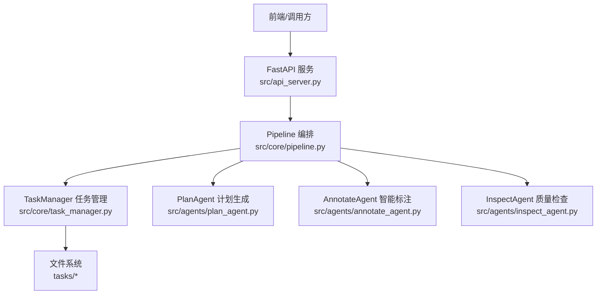
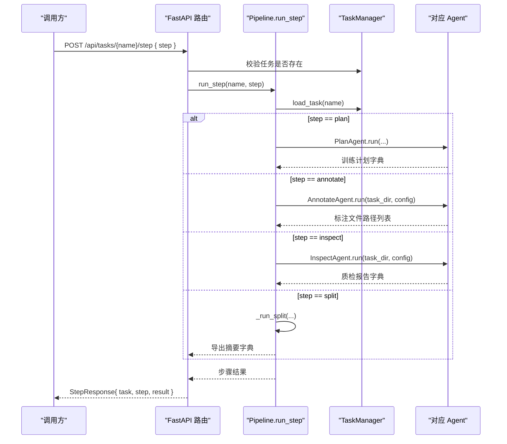
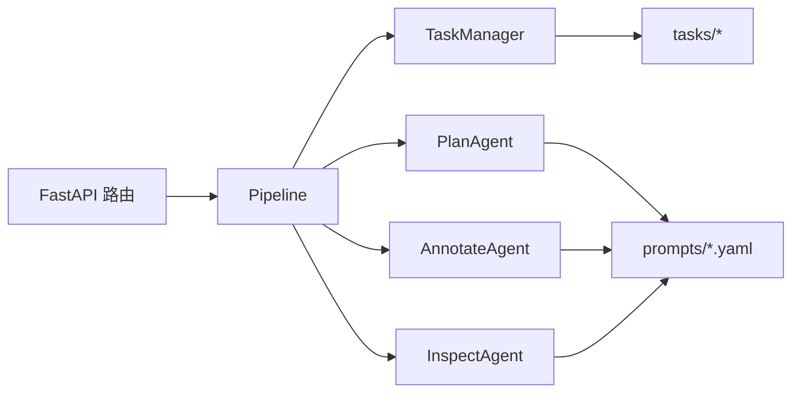

# 管道步骤接口

<cite>
**本文引用的文件**
- [src/api_server.py](file://src/api_server.py)
- [src/core/pipeline.py](file://src/core/pipeline.py)
- [src/core/task_manager.py](file://src/core/task_manager.py)
- [src/agents/plan_agent.py](file://src/agents/plan_agent.py)
- [src/agents/annotate_agent.py](file://src/agents/annotate_agent.py)
- [src/agents/inspect_agent.py](file://src/agents/inspect_agent.py)
- [config/task_template.yaml](file://config/task_template.yaml)
- [gui/src/services/api.ts](file://gui/src/services/api.ts)
- [gui/src/types/index.ts](file://gui/src/types/index.ts)
- [tests/test_api_server.py](file://tests/test_api_server.py)
</cite>

## 目录
1. [简介](#简介)
2. [项目结构](#项目结构)
3. [核心组件](#核心组件)
4. [架构总览](#架构总览)
5. [详细组件分析](#详细组件分析)
6. [依赖关系分析](#依赖关系分析)
7. [性能考虑](#性能考虑)
8. [故障排查指南](#故障排查指南)
9. [结论](#结论)
10. [附录](#附录)

## 简介
本文件面向需要调用“管道步骤执行”相关API的开发者，提供以下端点的完整说明：
- POST /api/tasks/{name}/step（通用步骤执行）
- POST /api/tasks/{name}/plan（训练计划生成）
- POST /api/tasks/{name}/annotate（智能标注）
- POST /api/tasks/{name}/inspect（质量检查）

文档涵盖请求与响应数据结构、支持的步骤类型、错误处理、调用示例与最佳实践。当前实现为同步调用；异步与进度跟踪机制在现有代码中未实现，但提供了扩展建议。

## 项目结构
后端基于FastAPI暴露HTTP接口，通过Pipeline编排各Agent完成任务步骤；TaskManager负责任务目录与配置管理；前端通过Axios客户端调用API。

图表来源
- [src/api_server.py:16-26](file://src/api_server.py#L16-L26)
- [src/core/pipeline.py:22-46](file://src/core/pipeline.py#L22-L46)
- [src/core/task_manager.py:14-38](file://src/core/task_manager.py#L14-L38)

章节来源
- [src/api_server.py:1-30](file://src/api_server.py#L1-L30)
- [src/core/pipeline.py:1-46](file://src/core/pipeline.py#L1-L46)
- [src/core/task_manager.py:1-38](file://src/core/task_manager.py#L1-L38)

## 核心组件
- FastAPI应用与路由：定义任务CRUD与步骤执行端点，统一返回StepResponse。
- Pipeline：按顺序或单步执行plan/annotate/inspect/split，并持久化结果。
- TaskManager：创建/列出/加载/保存任务配置，维护任务目录结构。
- Agents：
  - PlanAgent：根据任务描述生成训练计划，规范化后写入task.yaml与plan.yaml。
  - AnnotateAgent：对images下图片进行标注，输出ai_labels下的YOLO-OBB标签。
  - InspectAgent：校验AI标注，输出candidate_labels与inspection_report.yaml。

章节来源
- [src/api_server.py:139-231](file://src/api_server.py#L139-L231)
- [src/core/pipeline.py:48-94](file://src/core/pipeline.py#L48-L94)
- [src/core/task_manager.py:51-122](file://src/core/task_manager.py#L51-L122)
- [src/agents/plan_agent.py:101-138](file://src/agents/plan_agent.py#L101-L138)
- [src/agents/annotate_agent.py:22-80](file://src/agents/annotate_agent.py#L22-L80)
- [src/agents/inspect_agent.py:34-108](file://src/agents/inspect_agent.py#L34-L108)

## 架构总览
下图展示了从HTTP请求到具体步骤执行的调用链。

图表来源
- [src/api_server.py:169-231](file://src/api_server.py#L169-L231)
- [src/core/pipeline.py:62-94](file://src/core/pipeline.py#L62-L94)
- [src/core/pipeline.py:96-213](file://src/core/pipeline.py#L96-L213)

## 详细组件分析

### 通用步骤执行：POST /api/tasks/{name}/step
- 功能：以统一入口执行指定步骤（plan/annotate/inspect/split）。
- 请求体：StepRequest
  - step: 枚举值，支持 "plan", "annotate", "inspect", "split"。
- 响应体：StepResponse
  - task: 任务名
  - step: 执行的步骤名
  - result: 步骤结果（字典），不同步骤含义不同：
    - plan: 训练计划字典（classes、split、model、hyperparameters、inspection、metrics等）
    - annotate: 生成的标签文件路径列表
    - inspect: 质检报告字典（errors、quality_score、num_images、num_boxes等）
    - split: 数据集导出摘要（splits、dataset_yaml、train_command等）
- 错误处理：
  - 404：任务不存在
  - 500：步骤执行异常（内部异常被捕获并转为HTTP 500）
- 调用示例（curl）：
  - 执行计划：curl -X POST http://127.0.0.1:8765/api/tasks/demo/step -H "Content-Type: application/json" -d '{"step":"plan"}'
  - 执行标注：curl -X POST http://127.0.0.1:8765/api/tasks/demo/step -H "Content-Type: application/json" -d '{"step":"annotate"}'
  - 执行质检：curl -X POST http://127.0.0.1:8765/api/tasks/demo/step -H "Content-Type: application/json" -d '{"step":"inspect"}'
  - 执行拆分：curl -X POST http://127.0.0.1:8765/api/tasks/demo/step -H "Content-Type: application/json" -d '{"step":"split"}'

章节来源
- [src/api_server.py:43-55](file://src/api_server.py#L43-L55)
- [src/api_server.py:169-192](file://src/api_server.py#L169-L192)
- [src/core/pipeline.py:62-94](file://src/core/pipeline.py#L62-L94)
- [tests/test_api_server.py:113-121](file://tests/test_api_server.py#L113-L121)

### 训练计划生成：POST /api/tasks/{name}/plan
- 功能：为任务生成训练计划，并保存到task.yaml与plan.yaml。
- 请求体：无
- 响应体：StepResponse（result为训练计划字典）
- 行为细节：
  - 读取任务描述与数据集规模提示，调用PlanAgent生成计划。
  - 将计划规范化为模板schema，合并到training_plan字段。
- 调用示例（curl）：
  - curl -X POST http://127.0.0.1:8765/api/tasks/demo/plan
- 前端封装：
  - gui/src/services/api.ts中的runPlan函数直接调用/runStep(..., "plan")。

章节来源
- [src/api_server.py:195-206](file://src/api_server.py#L195-L206)
- [src/core/pipeline.py:96-122](file://src/core/pipeline.py#L96-L122)
- [src/agents/plan_agent.py:119-138](file://src/agents/plan_agent.py#L119-L138)
- [gui/src/services/api.ts:23-36](file://gui/src/services/api.ts#L23-L36)

### 智能标注：POST /api/tasks/{name}/annotate
- 功能：对任务images目录下的所有图片进行标注，输出ai_labels下的YOLO-OBB标签。
- 请求体：无
- 响应体：StepResponse（result为标注文件路径列表）
- 行为细节：
  - 依据training_plan中的conf_threshold与min_defect_pixels过滤检测结果。
  - 将检测框转换为YOLO-OBB格式并写入ai_labels。
- 调用示例（curl）：
  - curl -X POST http://127.0.0.1:8765/api/tasks/demo/annotate
- 前端封装：
  - gui/src/services/api.ts中的runAnnotate函数直接调用/runStep(..., "annotate")。

章节来源
- [src/api_server.py:208-219](file://src/api_server.py#L208-L219)
- [src/core/pipeline.py:124-137](file://src/core/pipeline.py#L124-L137)
- [src/agents/annotate_agent.py:25-80](file://src/agents/annotate_agent.py#L25-L80)
- [gui/src/services/api.ts:23-36](file://gui/src/services/api.ts#L23-L36)

### 质量检查：POST /api/tasks/{name}/inspect
- 功能：校验ai_labels的质量，输出candidate_labels与inspection_report.yaml。
- 请求体：无
- 响应体：StepResponse（result为质检报告字典）
- 行为细节：
  - 检查缺失标签、重复框、类别错误、坐标越界、尺寸异常。
  - 计算质量分数quality_score，并写入inspection_report.yaml。
- 调用示例（curl）：
  - curl -X POST http://127.0.0.1:8765/api/tasks/demo/inspect
- 前端封装：
  - gui/src/services/api.ts中的runInspect函数直接调用/runStep(..., "inspect")。

章节来源
- [src/api_server.py:221-231](file://src/api_server.py#L221-L231)
- [src/core/pipeline.py:139-153](file://src/core/pipeline.py#L139-L153)
- [src/agents/inspect_agent.py:37-108](file://src/agents/inspect_agent.py#L37-L108)
- [gui/src/services/api.ts:23-36](file://gui/src/services/api.ts#L23-L36)

### 数据拆分与导出：POST /api/tasks/{name}/step (step=split)
- 功能：按训练计划中的split比例划分数据集，生成data.yaml与训练命令。
- 请求体：StepRequest.step = "split"
- 响应体：StepResponse（result为导出摘要字典，包含splits、dataset_yaml、train_command）
- 行为细节：
  - 复制图像与候选标签（优先candidate_labels，否则回退ai_labels）。
  - 写入dataset/data.yaml与train_command.txt，并保存export_summary.yaml。
- 调用示例（curl）：
  - curl -X POST http://127.0.0.1:8765/api/tasks/demo/step -H "Content-Type: application/json" -d '{"step":"split"}'

章节来源
- [src/core/pipeline.py:155-213](file://src/core/pipeline.py#L155-L213)
- [src/api_server.py:169-192](file://src/api_server.py#L169-L192)

### 数据结构说明

#### StepRequest
- 字段：
  - step: 枚举，取值 "plan" | "annotate" | "inspect" | "split"
- 用途：用于通用步骤执行端点选择要运行的步骤。

章节来源
- [src/api_server.py:43-47](file://src/api_server.py#L43-L47)

#### StepResponse
- 字段：
  - task: 字符串，任务名
  - step: 字符串，执行的步骤名
  - result: 字典，内容随步骤不同而变化
    - plan: 训练计划字典（classes、split、model、hyperparameters、inspection、metrics等）
    - annotate: 标注文件路径列表
    - inspect: 质检报告字典（errors、quality_score、num_images、num_boxes、candidate_dir等）
    - split: 导出摘要字典（splits、dataset_yaml、train_command等）

章节来源
- [src/api_server.py:49-55](file://src/api_server.py#L49-L55)
- [src/core/pipeline.py:96-213](file://src/core/pipeline.py#L96-L213)

#### 训练计划模板（training_plan）
- 关键键：
  - classes: 类别映射（id -> name）
  - min_defect_pixels: 最小缺陷像素阈值
  - conf_threshold: 置信度阈值
  - exclude_items: 排除项
  - obb_rule: OBB规则
  - split: train/val/test比例与分层策略
  - model: yolo版本与输入尺寸
  - hyperparameters: 训练超参
  - inspection: 质检开关与阈值
  - metrics: 评估指标

章节来源
- [config/task_template.yaml:8-54](file://config/task_template.yaml#L8-L54)

### 步骤类型与功能总结
- plan：生成训练计划，规范化并持久化到task.yaml与plan.yaml。
- annotate：对images批量标注，输出ai_labels下的YOLO-OBB标签。
- inspect：校验AI标注，输出candidate_labels与inspection_report.yaml。
- split：按split比例划分数据集，生成data.yaml与训练命令，输出export_summary.yaml。

章节来源
- [src/core/pipeline.py:19-94](file://src/core/pipeline.py#L19-L94)
- [src/core/pipeline.py:96-213](file://src/core/pipeline.py#L96-L213)

## 依赖关系分析
- API层依赖Pipeline与TaskManager。
- Pipeline依赖各Agent与TaskManager。
- Agents依赖工具模块（file_utils、image_utils、obb_utils）与提示模板（prompts）。
- 前端通过Axios调用API，使用TypeScript类型定义保证前后端一致性。

图表来源
- [src/api_server.py:16-26](file://src/api_server.py#L16-L26)
- [src/core/pipeline.py:22-46](file://src/core/pipeline.py#L22-L46)
- [src/core/task_manager.py:14-38](file://src/core/task_manager.py#L14-L38)

章节来源
- [src/api_server.py:16-26](file://src/api_server.py#L16-L26)
- [src/core/pipeline.py:22-46](file://src/core/pipeline.py#L22-L46)
- [src/core/task_manager.py:14-38](file://src/core/task_manager.py#L14-L38)

## 性能考虑
- 标注与质检均为逐图处理，I/O密集；建议在大规模数据集上分批处理或增加并发控制。
- 拆分步骤涉及大量文件复制，建议使用SSD存储以提升性能。
- 计划生成与质检报告写入为轻量操作，影响较小。
- 当前实现为同步阻塞；若需高吞吐，可引入任务队列与异步执行（见下文扩展建议）。

[本节为通用指导，不直接分析具体文件]

## 故障排查指南
- 404 任务不存在：
  - 确保先调用POST /api/tasks创建任务。
  - 检查任务名是否正确。
- 404 图像或标签缺失：
  - 确认images目录下存在图像文件。
  - 标注前需先执行annotate；质检前需先执行inspect。
- 500 步骤失败：
  - 查看服务端日志，定位具体异常。
  - 检查任务配置是否完整（training_plan是否存在）。
- 标注结果为空：
  - 检查conf_threshold与min_defect_pixels设置是否过严。
  - 确认images目录中有有效图像。
- 质检报告为空或质量分数低：
  - 检查ai_labels文件格式是否符合YOLO-OBB规范。
  - 关注errors中的具体条目（缺失标签、重复框、类别错误、坐标越界、尺寸异常）。

章节来源
- [src/api_server.py:169-192](file://src/api_server.py#L169-L192)
- [src/agents/annotate_agent.py:115-161](file://src/agents/annotate_agent.py#L115-L161)
- [src/agents/inspect_agent.py:110-175](file://src/agents/inspect_agent.py#L110-L175)

## 结论
本接口提供了统一的管道步骤执行能力，覆盖训练计划生成、智能标注、质量检查与数据集拆分四大关键环节。通过标准化的StepRequest与StepResponse，调用方可灵活组合步骤，构建端到端的标注与训练准备流程。当前实现为同步模式，适合中小规模任务；对于更大规模场景，建议引入异步任务与进度跟踪机制以提升用户体验与系统吞吐。

[本节为总结性内容，不直接分析具体文件]

## 附录

### 异步处理与进度跟踪（扩展建议）
- 现状：当前所有步骤为同步执行，调用方需等待结果返回。
- 建议方案：
  - 引入任务ID与状态机（pending/running/completed/failed）。
  - 提供GET /api/tasks/{name}/steps/{step_id}查询进度。
  - 使用消息队列（如Redis/RabbitMQ）解耦请求与执行。
  - 前端轮询或WebSocket推送进度更新。
- 注意：该部分为概念性建议，当前代码库未实现。

[本节为概念性内容，不直接分析具体文件]

### 前端调用示例（TypeScript）
- 通用步骤执行：
  - runStep("demo", "plan")
  - runStep("demo", "annotate")
  - runStep("demo", "inspect")
  - runStep("demo", "split")
- 便捷方法：
  - runPlan("demo")
  - runAnnotate("demo")
  - runInspect("demo")
  - runSplit("demo")

章节来源
- [gui/src/services/api.ts:23-36](file://gui/src/services/api.ts#L23-L36)

### 测试用例参考
- 创建任务与列出任务
- 标注与质检端点验证
- 计划端点验证

章节来源
- [tests/test_api_server.py:44-130](file://tests/test_api_server.py#L44-L130)