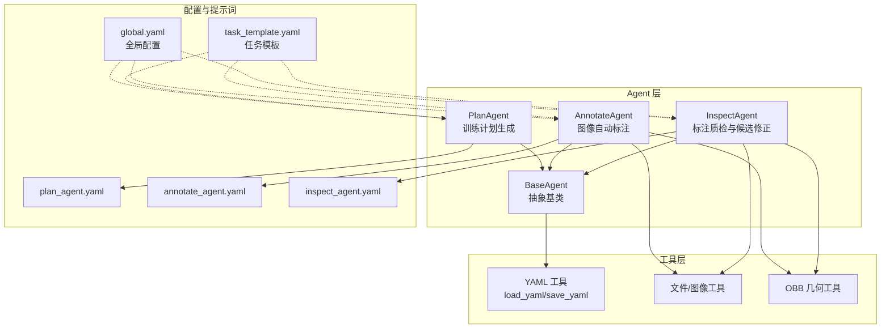
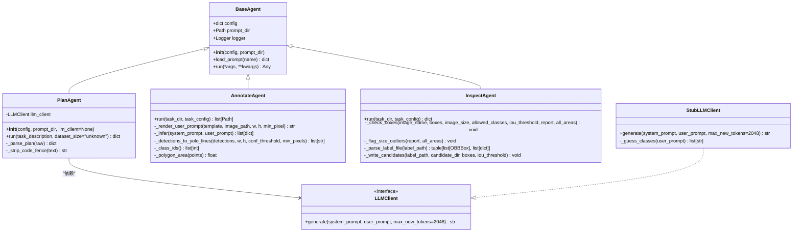
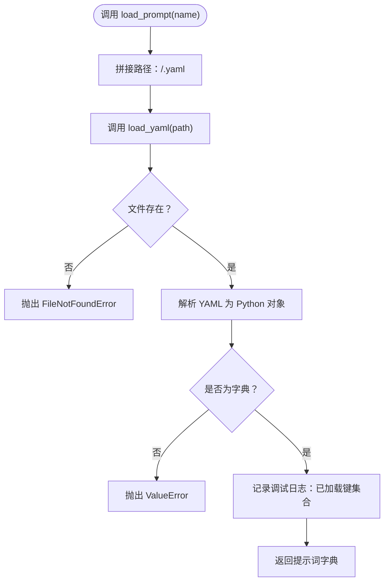
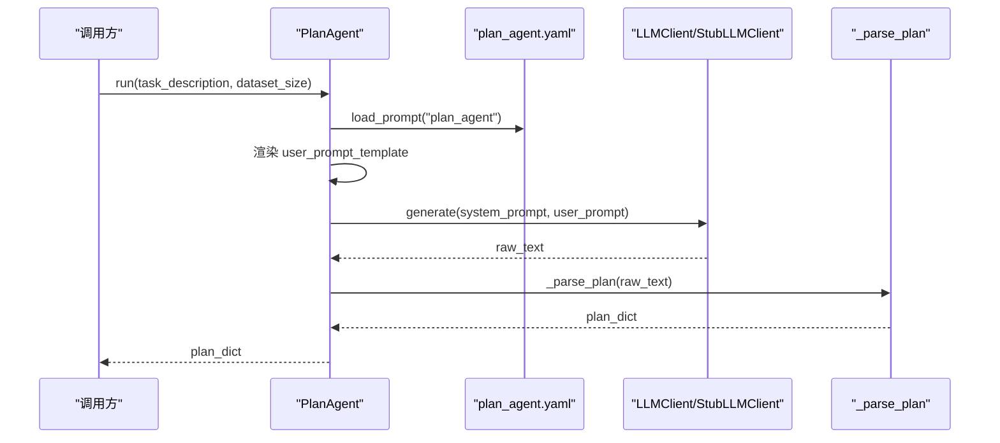
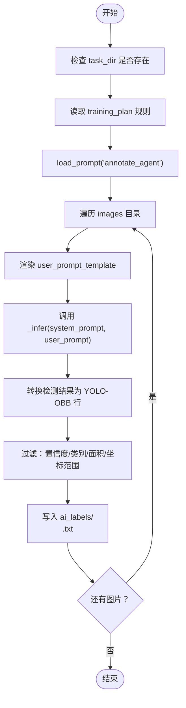
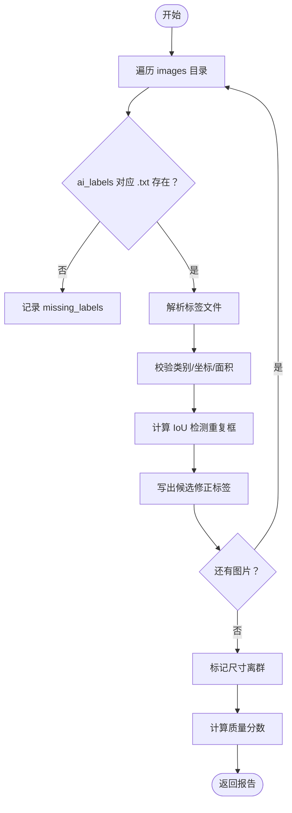
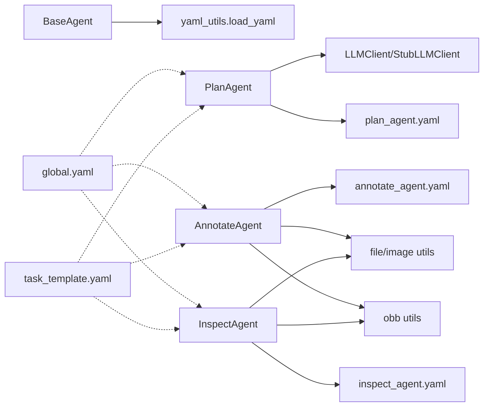
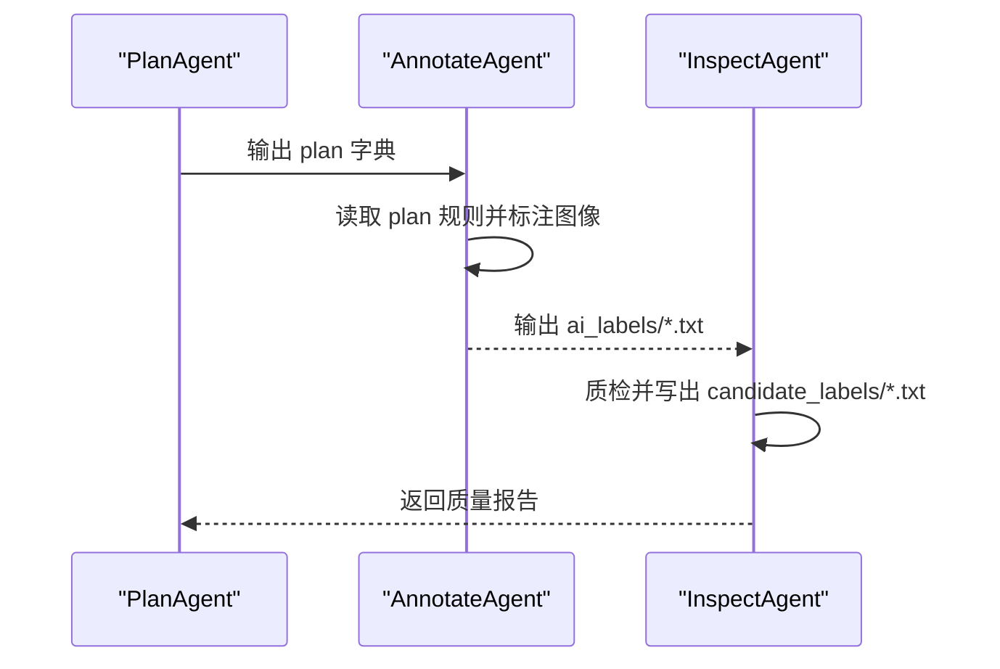

# Agent 框架设计

<cite>
**本文引用的文件**   
- [base_agent.py](file://src/agents/base_agent.py)
- [annotate_agent.py](file://src/agents/annotate_agent.py)
- [inspect_agent.py](file://src/agents/inspect_agent.py)
- [plan_agent.py](file://src/agents/plan_agent.py)
- [yaml_utils.py](file://src/utils/yaml_utils.py)
- [task_template.yaml](file://config/task_template.yaml)
- [global.yaml](file://config/global.yaml)
- [annotate_agent.yaml](file://prompts/annotate_agent.yaml)
- [inspect_agent.yaml](file://prompts/inspect_agent.yaml)
- [plan_agent.yaml](file://prompts/plan_agent.yaml)
</cite>

## 目录
1. [引言](#引言)
2. [项目结构](#项目结构)
3. [核心组件](#核心组件)
4. [架构总览](#架构总览)
5. [详细组件分析](#详细组件分析)
6. [依赖关系分析](#依赖关系分析)
7. [性能与可扩展性](#性能与可扩展性)
8. [自定义 Agent 开发指南](#自定义-agent-开发指南)
9. [Agent 间通信模式](#agent-间通信模式)
10. [错误处理策略](#错误处理策略)
11. [故障排查](#故障排查)
12. [结论](#结论)

## 引言
本文件面向希望理解并扩展该仓库中 Agent 框架的开发者。文档聚焦以下目标：
- 解释 BaseAgent 抽象基类的设计理念、统一接口规范、配置管理、日志记录与提示词加载机制。
- 深入说明 load_prompt 方法的工作原理，包括 YAML 解析、错误处理与调试输出。
- 梳理 Agent 生命周期管理与扩展点设计。
- 提供继承 BaseAgent 的最佳实践、run 方法的实现规范与返回值约定。
- 总结 Agent 间通信模式与错误处理策略，帮助构建可维护、可测试、可扩展的标注与质检流水线。

## 项目结构
Agent 相关代码集中在 src/agents 下，每个具体 Agent 继承自 BaseAgent；提示词以 YAML 形式存放在 prompts 目录；任务配置模板位于 config 目录。

图表来源
- [base_agent.py:13-69](file://src/agents/base_agent.py#L13-L69)
- [plan_agent.py:101-182](file://src/agents/plan_agent.py#L101-L182)
- [annotate_agent.py:22-185](file://src/agents/annotate_agent.py#L22-L185)
- [inspect_agent.py:34-227](file://src/agents/inspect_agent.py#L34-L227)
- [yaml_utils.py:11-45](file://src/utils/yaml_utils.py#L11-L45)
- [task_template.yaml:1-54](file://config/task_template.yaml#L1-L54)
- [global.yaml:1-29](file://config/global.yaml#L1-L29)
- [plan_agent.yaml:1-27](file://prompts/plan_agent.yaml#L1-L27)
- [annotate_agent.yaml:1-25](file://prompts/annotate_agent.yaml#L1-L25)
- [inspect_agent.yaml:1-31](file://prompts/inspect_agent.yaml#L1-L31)

章节来源
- [base_agent.py:13-69](file://src/agents/base_agent.py#L13-L69)
- [task_template.yaml:1-54](file://config/task_template.yaml#L1-L54)
- [global.yaml:1-29](file://config/global.yaml#L1-L29)

## 核心组件
- BaseAgent：所有 Agent 的统一抽象基类，负责配置注入、提示词目录、日志器初始化以及统一的提示词加载接口。
- PlanAgent：将自然语言任务描述转换为结构化训练计划，支持 LLM 后端协议与离线 Stub 实现。
- AnnotateAgent：基于外部 VL 模型（当前为 Stub）对图像进行 OBB 标注，输出 YOLO-OBB 标签文件。
- InspectAgent：校验 AI 生成的标注文件，输出质量报告与候选修正标签。

章节来源
- [base_agent.py:13-69](file://src/agents/base_agent.py#L13-L69)
- [plan_agent.py:101-182](file://src/agents/plan_agent.py#L101-L182)
- [annotate_agent.py:22-185](file://src/agents/annotate_agent.py#L22-L185)
- [inspect_agent.py:34-227](file://src/agents/inspect_agent.py#L34-L227)

## 架构总览
Agent 框架采用“抽象基类 + 具体 Agent”的分层设计，结合外部 YAML 提示词与配置模板，形成“配置驱动 + 提示词驱动”的可扩展流水线。

图表来源
- [base_agent.py:13-69](file://src/agents/base_agent.py#L13-L69)
- [plan_agent.py:13-182](file://src/agents/plan_agent.py#L13-L182)
- [annotate_agent.py:22-185](file://src/agents/annotate_agent.py#L22-L185)
- [inspect_agent.py:34-227](file://src/agents/inspect_agent.py#L34-L227)

## 详细组件分析

### BaseAgent：抽象基类与统一接口
- 设计理念
  - 通过构造参数注入配置与提示词目录，避免在子类中重复实现。
  - 使用 logging.getLogger(self.__class__.__name__) 为每个具体 Agent 提供独立命名日志器，便于定位问题。
  - 暴露统一的 run 抽象方法，强制子类实现业务逻辑，同时允许子类收窄参数与返回类型。
- 配置管理
  - self.config 保存合并后的任务配置，供子类读取 classes、inspection、hyperparameters 等字段。
- 提示词加载机制
  - load_prompt(name) 根据 name 拼接 <prompt_dir>/<name>.yaml，调用 yaml_utils.load_yaml 解析为字典。
  - 成功加载后输出调试日志，包含已加载键名集合，便于排查提示词结构。
- 异常契约
  - FileNotFoundError：提示词文件不存在。
  - ValueError：YAML 根节点不是映射（字典）。

图表来源
- [base_agent.py:36-53](file://src/agents/base_agent.py#L36-L53)
- [yaml_utils.py:11-32](file://src/utils/yaml_utils.py#L11-L32)

章节来源
- [base_agent.py:13-69](file://src/agents/base_agent.py#L13-L69)
- [yaml_utils.py:11-45](file://src/utils/yaml_utils.py#L11-L45)

### PlanAgent：训练计划生成与 LLM 集成
- 职责
  - 接收自然语言任务描述与数据集规模提示，渲染 plan_agent.yaml 中的 system_prompt 与 user_prompt_template。
  - 通过 LLMClient.generate 获取原始文本，再尝试 JSON/YAML 解析，失败时回退到 StubLLMClient 的稳定计划。
- LLM 客户端协议
  - LLMClient 定义最小接口 generate(system_prompt, user_prompt, *, max_new_tokens)，便于替换真实后端。
  - StubLLMClient 提供确定性离线输出，保证端到端流程无需下载模型即可运行。
- 解析与容错
  - _parse_plan 先尝试 json.loads，再尝试 yaml.safe_load，任一成功且结果为字典即返回。
  - 若均失败，记录警告并使用 StubLLMClient 生成稳定计划作为兜底。
  - _strip_code_fence 移除 Markdown 代码围栏，提高鲁棒性。

图表来源
- [plan_agent.py:108-182](file://src/agents/plan_agent.py#L108-L182)
- [plan_agent.yaml:1-27](file://prompts/plan_agent.yaml#L1-L27)

章节来源
- [plan_agent.py:13-182](file://src/agents/plan_agent.py#L13-L182)
- [plan_agent.yaml:1-27](file://prompts/plan_agent.yaml#L1-L27)

### AnnotateAgent：图像自动标注与 OBB 输出
- 职责
  - 遍历 images 目录下的图片，渲染 annotate_agent.yaml 的用户提示词，调用内部推理接口（当前为 Stub），过滤检测结果，写入 ai_labels/*.txt。
- 关键流程
  - 从 task_config.training_plan 读取 classes、conf_threshold、min_defect_pixels、exclude_items 等规则。
  - 渲染 user_prompt_template，传入图像尺寸与最小缺陷像素阈值。
  - 将系统提示词中的占位符替换为 class_mapping、annotation_rules、exclude_items。
  - 将检测结果转换为 YOLO-OBB 行格式，按置信度、类别有效性、面积阈值与坐标范围过滤。
- 坐标与面积
  - 支持归一化坐标与绝对像素坐标混合输入，自动判断是否去归一化。
  - 使用鞋带公式计算多边形面积，用于面积阈值过滤。

图表来源
- [annotate_agent.py:25-80](file://src/agents/annotate_agent.py#L25-L80)
- [annotate_agent.py:82-185](file://src/agents/annotate_agent.py#L82-L185)
- [annotate_agent.yaml:1-25](file://prompts/annotate_agent.yaml#L1-L25)

章节来源
- [annotate_agent.py:22-185](file://src/agents/annotate_agent.py#L22-L185)
- [annotate_agent.yaml:1-25](file://prompts/annotate_agent.yaml#L1-L25)

### InspectAgent：标注质检与候选修正
- 职责
  - 扫描 ai_labels 目录，检测缺失标签、重复框、类别错误、坐标越界与尺寸异常。
  - 不修改原始标签，仅输出 candidate_labels 目录下的候选修正文件。
  - 输出质量报告，包含各类错误计数与整体质量分数。
- 关键流程
  - 解析每张图片的标签文件，统计 box 数量与解析错误。
  - 对每个 box 执行类别合法性、坐标范围检查，并累积面积用于全局尺寸异常检测。
  - 计算两两 IoU，超过阈值的标记为重复框。
  - 基于全量面积均值与标准差，标记离群尺寸。
  - 写出候选修正标签，剔除越界与重复框。

图表来源
- [inspect_agent.py:37-108](file://src/agents/inspect_agent.py#L37-L108)
- [inspect_agent.py:110-227](file://src/agents/inspect_agent.py#L110-L227)

章节来源
- [inspect_agent.py:34-227](file://src/agents/inspect_agent.py#L34-L227)

## 依赖关系分析
- BaseAgent 依赖 yaml_utils.load_yaml 完成提示词加载。
- PlanAgent 依赖 LLMClient 协议与 StubLLMClient 实现，并通过提示词 plan_agent.yaml 驱动。
- AnnotateAgent 依赖文件/图像工具与 OBB 几何工具，使用 annotate_agent.yaml 提示词。
- InspectAgent 依赖 OBB 几何工具与文件工具，使用 inspect_agent.yaml 提示词。
- 配置层面，global.yaml 提供全局路径与模型参数；task_template.yaml 提供任务级默认结构与字段。

图表来源
- [base_agent.py:13-69](file://src/agents/base_agent.py#L13-L69)
- [plan_agent.py:101-182](file://src/agents/plan_agent.py#L101-L182)
- [annotate_agent.py:22-185](file://src/agents/annotate_agent.py#L22-L185)
- [inspect_agent.py:34-227](file://src/agents/inspect_agent.py#L34-L227)
- [yaml_utils.py:11-45](file://src/utils/yaml_utils.py#L11-L45)
- [task_template.yaml:1-54](file://config/task_template.yaml#L1-L54)
- [global.yaml:1-29](file://config/global.yaml#L1-L29)

章节来源
- [base_agent.py:13-69](file://src/agents/base_agent.py#L13-L69)
- [plan_agent.py:101-182](file://src/agents/plan_agent.py#L101-L182)
- [annotate_agent.py:22-185](file://src/agents/annotate_agent.py#L22-L185)
- [inspect_agent.py:34-227](file://src/agents/inspect_agent.py#L34-L227)
- [yaml_utils.py:11-45](file://src/utils/yaml_utils.py#L11-L45)
- [task_template.yaml:1-54](file://config/task_template.yaml#L1-L54)
- [global.yaml:1-29](file://config/global.yaml#L1-L29)

## 性能与可扩展性
- 提示词与配置分离：通过 YAML 提示词与任务模板解耦业务逻辑与数据，便于 A/B 测试与版本管理。
- LLM 后端可插拔：LLMClient 协议允许替换为本地 Qwen2.5-VL 或其他推理后端，不影响上层 Agent 逻辑。
- 批处理与流式处理：AnnotateAgent 逐图处理，适合后续扩展为批量推理或异步队列。
- 指标与质量评分：InspectAgent 的质量分数基于错误数与框数的比例，便于监控与回归检测。

[本节为通用指导，不直接分析具体文件]

## 自定义 Agent 开发指南

### 继承 BaseAgent 的最佳实践
- 构造函数
  - 如需额外依赖（如 PlanAgent 的 LLMClient），请在 __init__ 中显式注入，并调用 super().__init__(config, prompt_dir)。
- 提示词组织
  - 在 prompts 目录下新增 <your_agent>.yaml，包含 system_prompt 与 user_prompt_template。
  - 使用 load_prompt("<your_agent>") 加载，并在调试日志中确认键名是否正确。
- 日志记录
  - 使用 self.logger.info/warning/error 记录关键步骤，便于追踪与排障。
- 配置读取
  - 优先从 self.config 读取任务级配置，避免硬编码。

章节来源
- [base_agent.py:25-34](file://src/agents/base_agent.py#L25-L34)
- [plan_agent.py:108-117](file://src/agents/plan_agent.py#L108-L117)

### run 方法的实现规范与返回值约定
- 参数签名
  - 子类应明确 run 的参数类型与含义，例如 AnnotateAgent.run(task_dir, task_config)、InspectAgent.run(task_dir, task_config)、PlanAgent.run(task_description, dataset_size)。
- 返回值约定
  - PlanAgent：返回结构化 plan 字典，符合 task_template.yaml 的结构。
  - AnnotateAgent：返回已写入的标签文件路径列表。
  - InspectAgent：返回包含 num_images、num_boxes、errors、quality_score、candidate_dir 的报告字典。
- 异常处理
  - 对输入目录不存在等前置条件进行检查，抛出 FileNotFoundError。
  - 对解析失败或非法数据，记录 warning 并跳过或降级处理，确保流水线健壮性。

章节来源
- [plan_agent.py:119-138](file://src/agents/plan_agent.py#L119-L138)
- [annotate_agent.py:25-80](file://src/agents/annotate_agent.py#L25-L80)
- [inspect_agent.py:37-108](file://src/agents/inspect_agent.py#L37-L108)

## Agent 间通信模式
- 顺序流水线
  - PlanAgent 先生成训练计划，AnnotateAgent 依据计划进行标注，InspectAgent 对标注结果进行质检。
- 数据契约
  - PlanAgent 输出 plan 字典，AnnotateAgent 与 InspectAgent 通过 task_config.training_plan 读取规则。
  - AnnotateAgent 输出 YOLO-OBB 标签文件，InspectAgent 消费这些文件并输出候选修正与质量报告。
- 扩展点
  - 可在 AnnotateAgent 与 InspectAgent 之间插入其他质检或增强 Agent，只要遵循相同的输入/输出契约。

图表来源
- [plan_agent.py:119-138](file://src/agents/plan_agent.py#L119-L138)
- [annotate_agent.py:25-80](file://src/agents/annotate_agent.py#L25-L80)
- [inspect_agent.py:37-108](file://src/agents/inspect_agent.py#L37-L108)

## 错误处理策略
- 提示词加载
  - load_prompt 依赖 yaml_utils.load_yaml，当文件不存在或根节点非字典时抛出异常，便于快速发现配置问题。
- 标注阶段
  - AnnotateAgent 对 malformed detection 记录 warning 并跳过，确保单张图失败不影响整体流程。
  - 对未知类别、低置信度、面积过小或坐标异常的检测结果进行过滤。
- 质检阶段
  - InspectAgent 对缺失标签、重复框、类别错误、坐标越界与尺寸异常进行分类记录，并输出候选修正。
- 计划解析
  - PlanAgent 的 _parse_plan 依次尝试 JSON/YAML 解析，失败时回退到 StubLLMClient 的稳定计划，避免流水线中断。

章节来源
- [base_agent.py:36-53](file://src/agents/base_agent.py#L36-L53)
- [yaml_utils.py:11-32](file://src/utils/yaml_utils.py#L11-L32)
- [annotate_agent.py:140-161](file://src/agents/annotate_agent.py#L140-L161)
- [inspect_agent.py:177-227](file://src/agents/inspect_agent.py#L177-L227)
- [plan_agent.py:140-182](file://src/agents/plan_agent.py#L140-L182)

## 故障排查
- 提示词未找到
  - 检查 prompts 目录下是否存在 <agent>.yaml，并确保 BaseAgent.prompt_dir 指向正确路径。
- YAML 解析失败
  - 确认提示词根节点为映射（字典），否则 load_yaml 会抛出 ValueError。
- 标注无结果
  - 检查 conf_threshold 与 min_defect_pixels 设置是否过严；查看日志中是否有 skipped malformed detection 或 unknown class id。
- 质检报告质量分数过低
  - 查看 errors 分类统计，重点关注 duplicate_boxes、coords_out_of_range、size_anomaly。
- LLM 输出无法解析
  - 检查 _strip_code_fence 是否能正确去除代码围栏；必要时调整用户提示词以减少多余文本。

章节来源
- [base_agent.py:36-53](file://src/agents/base_agent.py#L36-L53)
- [yaml_utils.py:11-32](file://src/utils/yaml_utils.py#L11-L32)
- [annotate_agent.py:140-161](file://src/agents/annotate_agent.py#L140-L161)
- [inspect_agent.py:110-175](file://src/agents/inspect_agent.py#L110-L175)
- [plan_agent.py:170-182](file://src/agents/plan_agent.py#L170-L182)

## 结论
该 Agent 框架通过 BaseAgent 抽象基类统一了配置、日志与提示词加载能力，并以 YAML 提示词与任务模板驱动各具体 Agent 的行为。PlanAgent、AnnotateAgent 与 InspectAgent 分别承担计划生成、图像标注与质检修正的职责，形成清晰的数据流与扩展点。借助 LLMClient 协议与 StubLLMClient 实现，平台既支持离线运行，也便于接入真实后端。通过严格的错误处理与日志记录，框架具备良好的可维护性与可观测性，适合进一步扩展更多专用 Agent 与流水线环节。