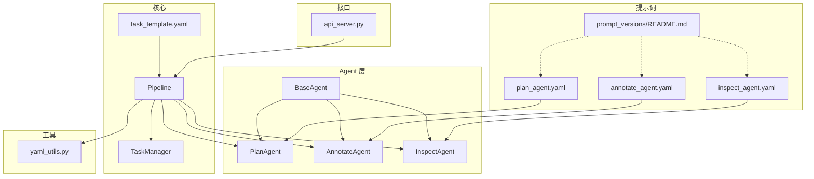
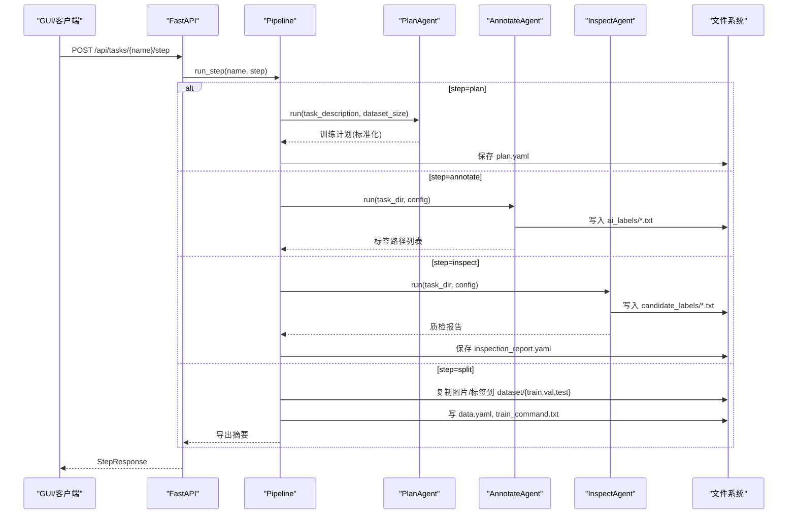
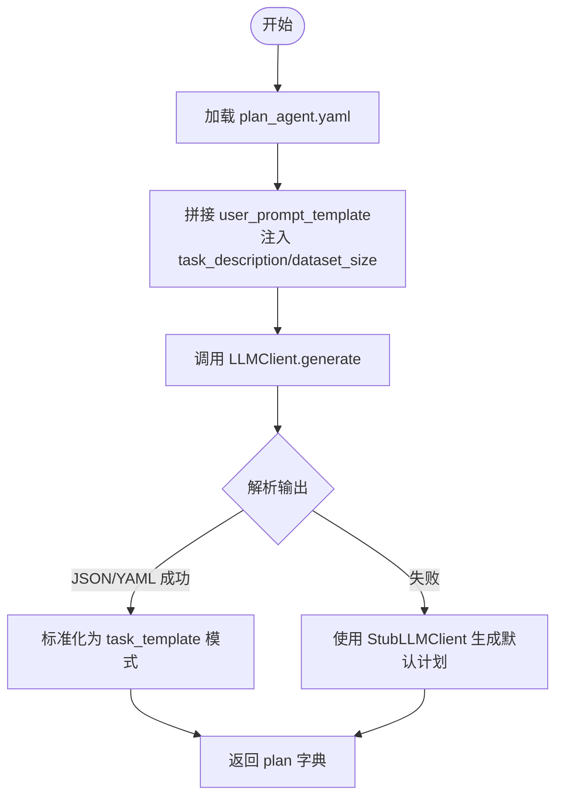
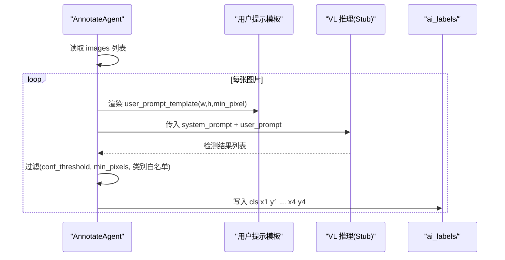
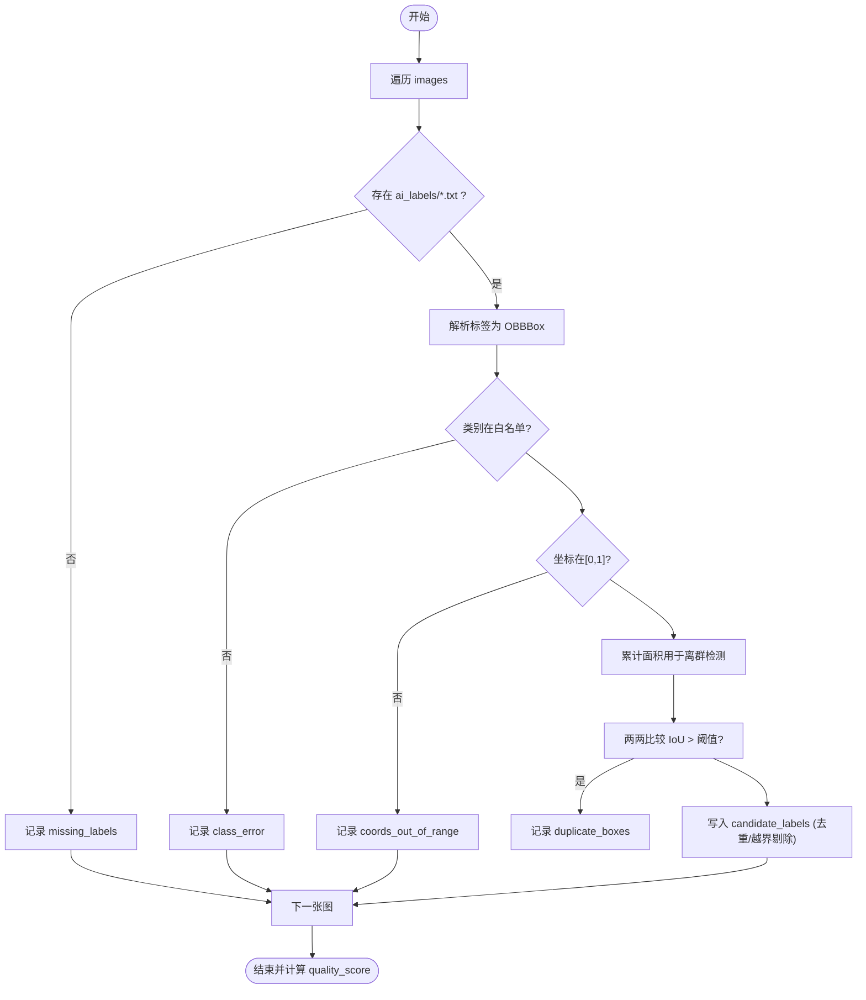
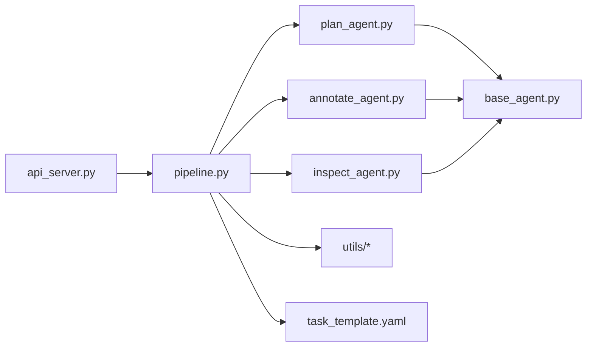

# Agent 系统设计

<cite>
**本文引用的文件**
- [base_agent.py](file://src/agents/base_agent.py)
- [plan_agent.py](file://src/agents/plan_agent.py)
- [annotate_agent.py](file://src/agents/annotate_agent.py)
- [inspect_agent.py](file://src/agents/inspect_agent.py)
- [pipeline.py](file://src/core/pipeline.py)
- [task_template.yaml](file://config/task_template.yaml)
- [plan_agent.yaml](file://prompts/plan_agent.yaml)
- [annotate_agent.yaml](file://prompts/annotate_agent.yaml)
- [inspect_agent.yaml](file://prompts/inspect_agent.yaml)
- [README.md](file://prompts/prompt_versions/README.md)
- [yaml_utils.py](file://src/utils/yaml_utils.py)
- [api_server.py](file://src/api_server.py)
</cite>

## 目录
1. [简介](#简介)
2. [项目结构](#项目结构)
3. [核心组件](#核心组件)
4. [架构总览](#架构总览)
5. [详细组件分析](#详细组件分析)
6. [依赖关系分析](#依赖关系分析)
7. [性能与可扩展性](#性能与可扩展性)
8. [故障排查指南](#故障排查指南)
9. [结论](#结论)
10. [附录：自定义 Agent 开发指南](#附录自定义-agent-开发指南)

## 简介
本系统围绕“基于大语言模型的智能代理”构建，提供从训练计划生成、智能标注到质量检查的端到端流水线。系统通过统一的 BaseAgent 抽象和 YAML 提示词模板，将 LLM 能力与工业缺陷检测（YOLO-OBB）任务解耦；同时提供可插拔的 LLM 客户端抽象，便于接入本地或云端模型。Pipeline 编排 plan → annotate → inspect → split/export 四个阶段，并以 HTTP API 暴露给 GUI 使用。

## 项目结构
- agents：定义统一基类与三个核心 Agent（Plan/Annotate/Inspect）。
- core：Pipeline 编排与任务管理。
- prompts：按 Agent 划分的提示词模板及版本归档说明。
- config：任务配置模板，规范 training_plan 字段。
- utils：YAML、图像、OBB 工具函数。
- api_server：FastAPI 服务，暴露 Pipeline 能力给前端。

图表来源
- [pipeline.py:22-46](file://src/core/pipeline.py#L22-L46)
- [plan_agent.yaml:1-27](file://prompts/plan_agent.yaml#L1-L27)
- [annotate_agent.yaml:1-25](file://prompts/annotate_agent.yaml#L1-L25)
- [inspect_agent.yaml:1-31](file://prompts/inspect_agent.yaml#L1-L31)
- [README.md:1-11](file://prompts/prompt_versions/README.md#L1-L11)
- [task_template.yaml:1-54](file://config/task_template.yaml#L1-L54)
- [yaml_utils.py:11-45](file://src/utils/yaml_utils.py#L11-L45)
- [api_server.py:21-27](file://src/api_server.py#L21-L27)

章节来源
- [pipeline.py:22-46](file://src/core/pipeline.py#L22-L46)
- [api_server.py:21-27](file://src/api_server.py#L21-L27)

## 核心组件
- BaseAgent：统一加载外部 YAML 提示词、日志、run 抽象方法。
- PlanAgent：根据自然语言描述生成结构化训练计划，兼容 JSON/YAML 输出并具备回退策略。
- AnnotateAgent：对每张图渲染提示词，调用 VL 推理（当前为 Stub），过滤后写入 YOLO-OBB 标签。
- InspectAgent：校验 AI 标签，发现缺失、重复、类别错误、坐标越界、尺寸异常等，并输出候选修正。
- Pipeline：编排四步流程，标准化 plan 到 task_template 模式，导出数据集与训练命令。
- API Server：HTTP 接口封装 Pipeline，供 GUI 调用。

章节来源
- [base_agent.py:13-69](file://src/agents/base_agent.py#L13-L69)
- [plan_agent.py:101-182](file://src/agents/plan_agent.py#L101-L182)
- [annotate_agent.py:22-185](file://src/agents/annotate_agent.py#L22-L185)
- [inspect_agent.py:34-227](file://src/agents/inspect_agent.py#L34-L227)
- [pipeline.py:22-325](file://src/core/pipeline.py#L22-L325)
- [api_server.py:139-384](file://src/api_server.py#L139-L384)

## 架构总览
系统采用“提示词驱动 + Agent 抽象 + Pipeline 编排”的分层设计：
- 提示词层：每个 Agent 对应一个 YAML 模板，包含 system_prompt 与 user_prompt_template，支持动态参数注入与版本归档。
- Agent 层：继承 BaseAgent，实现 run；PlanAgent 还定义了 LLMClient 协议以解耦后端。
- 编排层：Pipeline 负责步骤调度、数据流转、结果持久化与导出。
- 接口层：API Server 将 Pipeline 暴露为 RESTful 接口。

图表来源
- [api_server.py:169-192](file://src/api_server.py#L169-L192)
- [pipeline.py:48-94](file://src/core/pipeline.py#L48-L94)
- [pipeline.py:96-153](file://src/core/pipeline.py#L96-L153)
- [pipeline.py:155-213](file://src/core/pipeline.py#L155-L213)

## 详细组件分析

### BaseAgent 与统一接口规范
- 职责：集中加载 prompt YAML、提供 logger、声明 run 抽象。
- 关键点：load_prompt 通过文件名映射到 prompts 目录下的 YAML；run 由子类实现，返回类型因 Agent 而异。
- 扩展点：新增 Agent 只需继承 BaseAgent 并实现 run，即可被 Pipeline 复用。

章节来源
- [base_agent.py:13-69](file://src/agents/base_agent.py#L13-L69)

### PlanAgent（训练计划生成）
- 输入：任务描述、数据集规模提示。
- 处理：加载 plan_agent.yaml，拼接用户提示，调用 LLMClient.generate；解析输出（JSON→YAML→Stub 回退）。
- 输出：标准化的 training_plan 字典，包含 classes、annotation_rules、dataset_strategy、model_selection、hyperparameters、inspection_rules、evaluation_metrics 等。
- 鲁棒性：_strip_code_fence 去除 Markdown 代码块；_parse_plan 多格式解析与回退，确保 Pipeline 不中断。

图表来源
- [plan_agent.py:101-182](file://src/agents/plan_agent.py#L101-L182)
- [pipeline.py:284-325](file://src/core/pipeline.py#L284-L325)

章节来源
- [plan_agent.py:13-182](file://src/agents/plan_agent.py#L13-L182)
- [plan_agent.yaml:1-27](file://prompts/plan_agent.yaml#L1-L27)
- [pipeline.py:284-325](file://src/core/pipeline.py#L284-L325)

### AnnotateAgent（智能标注）
- 输入：任务目录、任务配置（含 training_plan）。
- 处理：遍历 images，渲染 annotate_agent.yaml 的用户提示（注入图像尺寸、最小像素阈值），执行 VL 推理（当前为 Stub），过滤低置信度与小目标，转换为 YOLO-OBB 行格式并写入 ai_labels。
- 关键逻辑：坐标归一化/反归一化、面积计算（鞋带公式）、类别白名单过滤。

图表来源
- [annotate_agent.py:22-185](file://src/agents/annotate_agent.py#L22-L185)
- [annotate_agent.yaml:1-25](file://prompts/annotate_agent.yaml#L1-L25)

章节来源
- [annotate_agent.py:22-185](file://src/agents/annotate_agent.py#L22-L185)
- [annotate_agent.yaml:1-25](file://prompts/annotate_agent.yaml#L1-L25)

### InspectAgent（质量检查）
- 输入：任务目录、任务配置（training_plan.inspection）。
- 处理：逐图解析 ai_labels，检查缺失标签、重复框（OBB IoU）、类别错误、坐标越界、尺寸异常；写入 candidate_labels 作为候选修正；生成质量分数与报告。
- 输出：report 字典（含 errors、quality_score、candidate_dir）。

图表来源
- [inspect_agent.py:34-227](file://src/agents/inspect_agent.py#L34-L227)

章节来源
- [inspect_agent.py:34-227](file://src/agents/inspect_agent.py#L34-L227)

### 提示词工程与设计原则
- 模板结构：每个 Agent 对应一个 YAML，包含 system_prompt（角色、规则、输出约束）与 user_prompt_template（动态占位符）。
- 动态参数注入：
  - PlanAgent：注入 task_description、dataset_size。
  - AnnotateAgent：注入 image_name、w、h、min_pixel；system 中注入 class_mapping、annotation_rules、exclude_items。
  - InspectAgent：注入 iou_threshold、allowed_classes、size_range、w、h。
- 版本管理：active prompts 位于 prompts/*.yaml；变更时快照至 prompt_versions/<agent>_v<n>.yaml，保证结果可追溯。
- 输出约束：严格 JSON/YAML 输出，禁止自然语言，便于程序化解析。

章节来源
- [plan_agent.yaml:1-27](file://prompts/plan_agent.yaml#L1-L27)
- [annotate_agent.yaml:1-25](file://prompts/annotate_agent.yaml#L1-L25)
- [inspect_agent.yaml:1-31](file://prompts/inspect_agent.yaml#L1-L31)
- [README.md:1-11](file://prompts/prompt_versions/README.md#L1-L11)

### LLM 客户端抽象与多模型支持
- 协议：LLMClient 协议仅要求 generate(system_prompt, user_prompt, max_new_tokens) -> str。
- 默认实现：StubLLMClient 提供确定性离线输出，使 Pipeline 无需下载模型即可运行。
- 替换方式：向 PlanAgent 注入任意满足协议的客户端（如本地 Qwen2.5-VL、云端 API），无需改动上层逻辑。

章节来源
- [plan_agent.py:13-33](file://src/agents/plan_agent.py#L13-L33)
- [plan_agent.py:35-99](file://src/agents/plan_agent.py#L35-L99)
- [plan_agent.py:108-118](file://src/agents/plan_agent.py#L108-L118)

### 数据流与规范化
- Plan 标准化：normalize_plan 将 LLM 输出的多种键名映射到 task_template 模式，确保下游一致消费。
- 标签格式：AnnotateAgent 输出 YOLO-OBB 行格式（cls + 8 个归一化坐标）；InspectAgent 解析并生成候选修正。
- 导出：Pipeline 按 split 比例复制图片与标签，生成 data.yaml 与训练命令。

章节来源
- [pipeline.py:284-325](file://src/core/pipeline.py#L284-L325)
- [annotate_agent.py:115-161](file://src/agents/annotate_agent.py#L115-L161)
- [inspect_agent.py:177-227](file://src/agents/inspect_agent.py#L177-L227)
- [pipeline.py:155-213](file://src/core/pipeline.py#L155-L213)

## 依赖关系分析
- Agent 间协作：Pipeline 顺序调用 Plan → Annotate → Inspect → Split，各 Agent 通过任务目录与配置文件交换数据。
- 耦合与内聚：
  - BaseAgent 高内聚地封装提示词加载与日志。
  - PlanAgent 与 LLMClient 松耦合，易于替换。
  - AnnotateAgent/InspectAgent 依赖 utils（image/obb/file/yaml），职责清晰。
- 外部依赖：FastAPI、Pydantic、NumPy、PyYAML。

图表来源
- [api_server.py:21-27](file://src/api_server.py#L21-L27)
- [pipeline.py:22-46](file://src/core/pipeline.py#L22-L46)
- [base_agent.py:13-69](file://src/agents/base_agent.py#L13-L69)

章节来源
- [pipeline.py:22-46](file://src/core/pipeline.py#L22-L46)
- [api_server.py:21-27](file://src/api_server.py#L21-L27)

## 性能与可扩展性
- 性能特征：
  - PlanAgent：解析失败时的回退机制避免阻塞；正则去除代码块提升解析稳定性。
  - AnnotateAgent：批量遍历图片，逐图推理；面积过滤减少无效框；坐标归一化降低数值误差。
  - InspectAgent：O(n^2) 重复框检测可通过索引优化；面积统计一次性累积，线性扫描。
- 可扩展性：
  - 新增 Agent：继承 BaseAgent，实现 run，并在 Pipeline 注册。
  - 新 LLM 后端：实现 LLMClient 协议并注入 PlanAgent。
  - 新提示词：遵循 YAML 模板约定，加入版本归档。

[本节为通用指导，不直接分析具体文件]

## 故障排查指南
- 提示词未找到或格式错误：
  - 现象：BaseAgent.load_prompt 抛出 FileNotFoundError 或 ValueError。
  - 排查：确认 prompts 目录下存在对应 YAML，且根节点为映射。
- Plan 解析失败：
  - 现象：PlanAgent._parse_plan 无法解析 JSON/YAML。
  - 行为：自动回退到 StubLLMClient 生成的默认计划，确保 Pipeline 继续。
- 标注无输出：
  - 可能原因：conf_threshold 过高、min_defect_pixels 过大、类别不在白名单。
  - 建议：调低阈值或放宽规则，检查 training_plan 配置。
- 质检报告为空或质量分异常：
  - 检查是否存在 ai_labels 文件；确认坐标范围与类别合法性；关注重复框阈值设置。
- API 报错：
  - 404：任务不存在或缺少必要文件（如 report、export_summary）。
  - 500：步骤执行异常（查看服务端日志定位）。

章节来源
- [base_agent.py:36-53](file://src/agents/base_agent.py#L36-L53)
- [plan_agent.py:140-182](file://src/agents/plan_agent.py#L140-L182)
- [annotate_agent.py:25-80](file://src/agents/annotate_agent.py#L25-L80)
- [inspect_agent.py:37-108](file://src/agents/inspect_agent.py#L37-L108)
- [api_server.py:169-192](file://src/api_server.py#L169-L192)

## 结论
本系统通过统一的 BaseAgent 抽象、严格的提示词模板与版本管理、以及可插拔的 LLM 客户端，实现了从计划生成、智能标注到质量检查的完整闭环。Pipeline 将各阶段解耦并标准化数据流，API Server 提供友好的交互入口。该设计兼顾了可维护性、可测试性与可扩展性，适合在工业缺陷检测场景中快速落地与迭代。

[本节为总结性内容，不直接分析具体文件]

## 附录：自定义 Agent 开发指南
- 步骤
  1. 新建 Python 文件，继承 BaseAgent，实现 run(self, *args, **kwargs) -> Any。
  2. 如需提示词，创建 prompts/<your_agent>.yaml，定义 system_prompt 与 user_prompt_template。
  3. 在 Pipeline 中注册你的 Agent（或在需要处直接实例化）。
  4. 若涉及 LLM，实现 LLMClient 协议并通过构造函数注入。
- 最佳实践
  - 保持 run 输入/输出契约明确，便于 Pipeline 集成。
  - 使用 BaseAgent.load_prompt 加载提示词，避免硬编码。
  - 对 LLM 输出进行健壮解析与回退，确保 Pipeline 稳定。
  - 所有中间产物落盘（如标签、报告），便于审计与回溯。
  - 变更提示词时，按 README 规范进行版本归档。

章节来源
- [base_agent.py:13-69](file://src/agents/base_agent.py#L13-L69)
- [plan_agent.py:13-33](file://src/agents/plan_agent.py#L13-L33)
- [pipeline.py:22-46](file://src/core/pipeline.py#L22-L46)
- [README.md:1-11](file://prompts/prompt_versions/README.md#L1-L11)