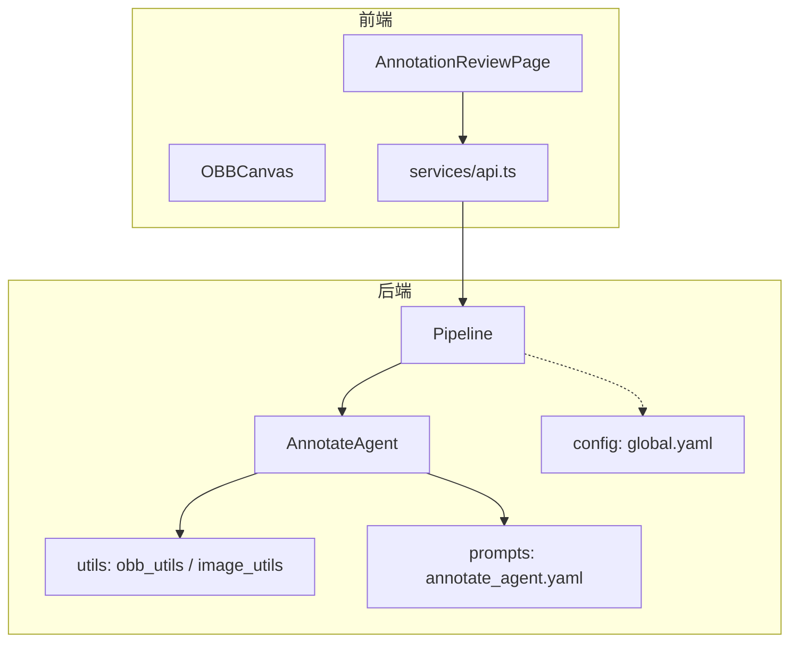
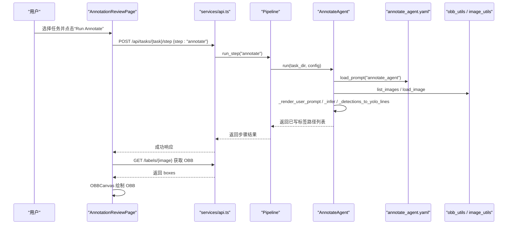
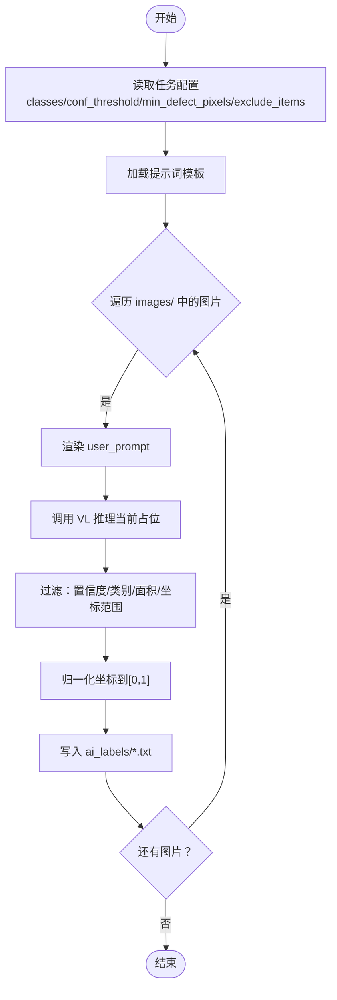
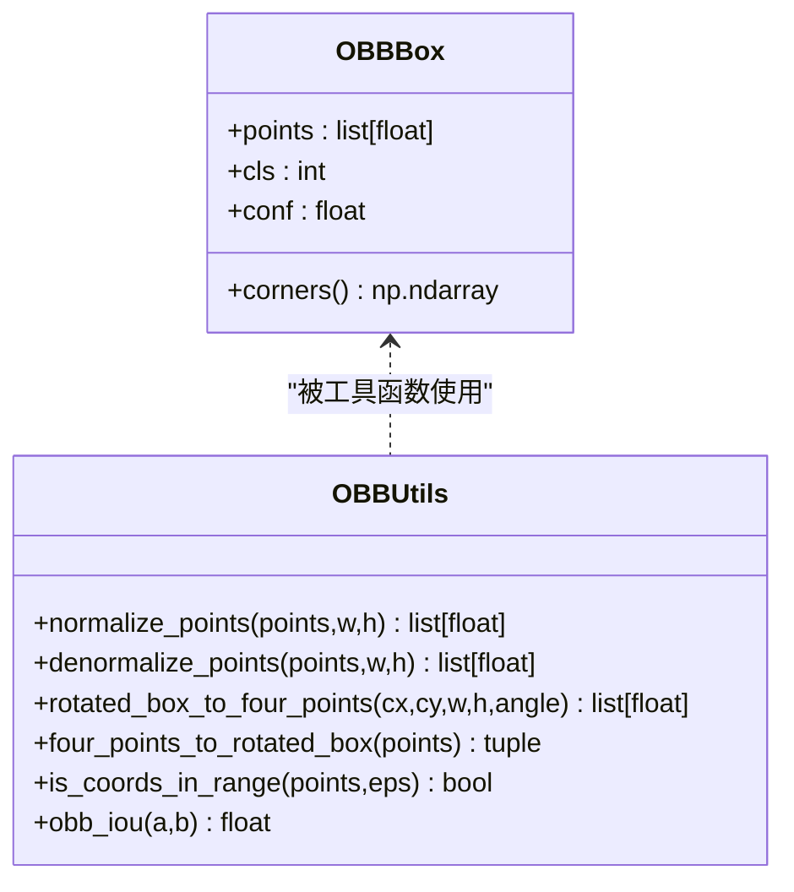
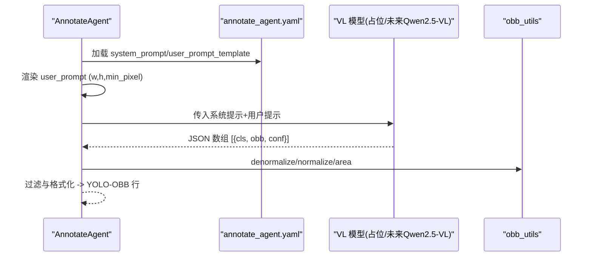
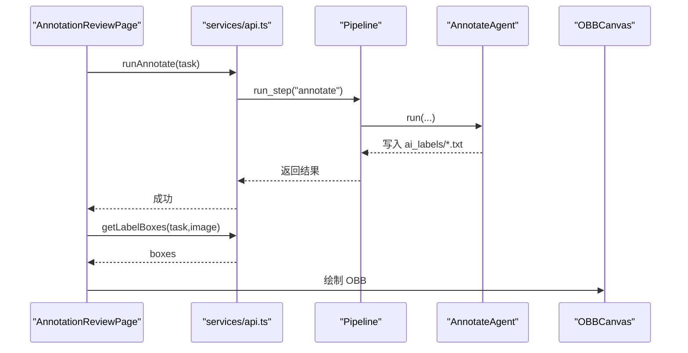
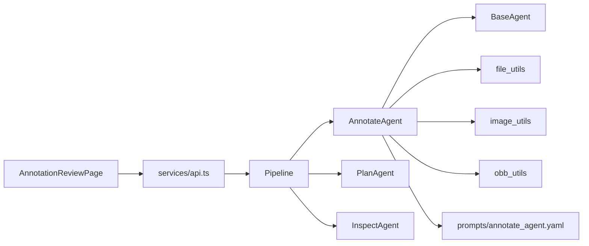

# 智能标注 Agent

<cite>
**本文引用的文件**
- [src/agents/annotate_agent.py](file://src/agents/annotate_agent.py)
- [src/utils/obb_utils.py](file://src/utils/obb_utils.py)
- [src/core/pipeline.py](file://src/core/pipeline.py)
- [prompts/annotate_agent.yaml](file://prompts/annotate_agent.yaml)
- [gui/src/pages/AnnotationReviewPage.tsx](file://gui/src/pages/AnnotationReviewPage.tsx)
- [gui/src/components/OBBCanvas.tsx](file://gui/src/components/OBBCanvas.tsx)
- [gui/src/services/api.ts](file://gui/src/services/api.ts)
- [config/global.yaml](file://config/global.yaml)
- [src/agents/base_agent.py](file://src/agents/base_agent.py)
- [src/utils/image_utils.py](file://src/utils/image_utils.py)
</cite>

## 目录
1. [简介](#简介)
2. [项目结构](#项目结构)
3. [核心组件](#核心组件)
4. [架构总览](#架构总览)
5. [详细组件分析](#详细组件分析)
6. [依赖关系分析](#依赖关系分析)
7. [性能考虑](#性能考虑)
8. [故障排查指南](#故障排查指南)
9. [结论](#结论)
10. [附录](#附录)

## 简介
本文件面向“智能标注 Agent”，聚焦 AnnotateAgent 的核心能力：基于多模态视觉语言模型（VL）的旋转边界框（OBB）检测、AI 标注建议生成与 YOLO-OBB 标注文件输出。文档深入解析 OBB 坐标转换、格式校验、批量处理流程，以及与图像识别模型的集成方式（含多模态输入与结果后处理）。同时提供质量控制机制、人工审核接口、性能优化技巧与批量策略，帮助读者快速理解并高效使用该系统。

## 项目结构
仓库采用分层组织：
- agents：实现各阶段 Agent（计划、标注、检查），AnnotateAgent 负责自动标注。
- core：Pipeline 编排 plan→annotate→inspect→split 全流程。
- utils：通用工具（OBB 几何、图像加载、YAML 读写等）。
- prompts：外部化提示词，便于按任务配置规则。
- gui：前端 Tauri + React 应用，支持任务选择、运行标注、可视化查看 OBB。
- config：全局配置（模型、推理参数、路径、服务端口等）。

图表来源
- [src/core/pipeline.py:22-46](file://src/core/pipeline.py#L22-L46)
- [src/agents/annotate_agent.py:22-80](file://src/agents/annotate_agent.py#L22-L80)
- [prompts/annotate_agent.yaml:1-25](file://prompts/annotate_agent.yaml#L1-L25)
- [config/global.yaml:1-29](file://config/global.yaml#L1-L29)
- [gui/src/pages/AnnotationReviewPage.tsx:1-118](file://gui/src/pages/AnnotationReviewPage.tsx#L1-L118)
- [gui/src/components/OBBCanvas.tsx:1-136](file://gui/src/components/OBBCanvas.tsx#L1-L136)
- [gui/src/services/api.ts:1-80](file://gui/src/services/api.ts#L1-L80)

章节来源
- [src/core/pipeline.py:22-46](file://src/core/pipeline.py#L22-L46)
- [src/agents/annotate_agent.py:22-80](file://src/agents/annotate_agent.py#L22-L80)
- [prompts/annotate_agent.yaml:1-25](file://prompts/annotate_agent.yaml#L1-L25)
- [config/global.yaml:1-29](file://config/global.yaml#L1-L29)
- [gui/src/pages/AnnotationReviewPage.tsx:1-118](file://gui/src/pages/AnnotationReviewPage.tsx#L1-L118)
- [gui/src/components/OBBCanvas.tsx:1-136](file://gui/src/components/OBBCanvas.tsx#L1-L136)
- [gui/src/services/api.ts:1-80](file://gui/src/services/api.ts#L1-L80)

## 核心组件
- AnnotateAgent：遍历任务图片，渲染提示词，调用 VL 推理（当前为占位实现），过滤检测结果，写入 YOLO-OBB 标签文件。
- OBB 工具集：提供四点顺时针表示、归一化/反归一化、面积计算、IoU、范围校验等。
- Pipeline：编排 plan→annotate→inspect→split，管理任务配置与导出。
- 前端：AnnotationReviewPage 提供任务选择、一键标注、图像列表与 OBB 画布；OBBCanvas 渲染缩放/拖拽与 OBB 叠加；api.ts 封装后端接口。
- 配置：global.yaml 定义 VL 模型、推理阈值、设备、路径与服务端口。

章节来源
- [src/agents/annotate_agent.py:22-185](file://src/agents/annotate_agent.py#L22-L185)
- [src/utils/obb_utils.py:1-151](file://src/utils/obb_utils.py#L1-L151)
- [src/core/pipeline.py:22-325](file://src/core/pipeline.py#L22-L325)
- [gui/src/pages/AnnotationReviewPage.tsx:1-118](file://gui/src/pages/AnnotationReviewPage.tsx#L1-L118)
- [gui/src/components/OBBCanvas.tsx:1-136](file://gui/src/components/OBBCanvas.tsx#L1-L136)
- [gui/src/services/api.ts:1-80](file://gui/src/services/api.ts#L1-L80)
- [config/global.yaml:1-29](file://config/global.yaml#L1-L29)

## 架构总览
下图展示从前端触发到后端执行标注、再到结果可视化的完整链路。

图表来源
- [gui/src/pages/AnnotationReviewPage.tsx:42-63](file://gui/src/pages/AnnotationReviewPage.tsx#L42-L63)
- [gui/src/services/api.ts:23-36](file://gui/src/services/api.ts#L23-L36)
- [src/core/pipeline.py:62-94](file://src/core/pipeline.py#L62-L94)
- [src/agents/annotate_agent.py:25-80](file://src/agents/annotate_agent.py#L25-L80)
- [prompts/annotate_agent.yaml:1-25](file://prompts/annotate_agent.yaml#L1-L25)
- [src/utils/image_utils.py:13-33](file://src/utils/image_utils.py#L13-L33)
- [src/utils/obb_utils.py:96-137](file://src/utils/obb_utils.py#L96-L137)

## 详细组件分析

### AnnotateAgent 标注流水线
- 输入：任务目录（包含 images/）、任务配置（classes、conf_threshold、min_defect_pixels、exclude_items、obb_rule）。
- 流程：
  - 读取提示词模板，注入 class_mapping、annotation_rules、exclude_items。
  - 遍历 images/ 下所有图片，加载尺寸，渲染 user prompt。
  - 调用 _infer（当前为占位实现，返回一个中心区域的 OBB 示例）。
  - 将检测结果转换为 YOLO-OBB 行：置信度过滤、类别白名单、最小像素面积过滤、坐标范围判断、归一化。
  - 写入 ai_labels/<image>.txt。
- 输出：每个图片对应一个 .txt 标签文件路径列表。

图表来源
- [src/agents/annotate_agent.py:25-80](file://src/agents/annotate_agent.py#L25-L80)
- [src/agents/annotate_agent.py:115-161](file://src/agents/annotate_agent.py#L115-L161)
- [src/utils/obb_utils.py:96-137](file://src/utils/obb_utils.py#L96-L137)

章节来源
- [src/agents/annotate_agent.py:25-80](file://src/agents/annotate_agent.py#L25-L80)
- [src/agents/annotate_agent.py:115-161](file://src/agents/annotate_agent.py#L115-L161)
- [prompts/annotate_agent.yaml:1-25](file://prompts/annotate_agent.yaml#L1-L25)

### OBB 处理逻辑（坐标转换、验证、文件操作）
- 数据表示：四点顺时针 [x1,y1,x2,y2,x3,y3,x4,y4]，可归一化或像素坐标。
- 关键函数：
  - normalize_points/denormalize_points：在像素与 [0,1] 之间转换，带正尺寸校验。
  - rotated_box_to_four_points/four_points_to_rotated_box：与 OpenCV minAreaRect 互转。
  - is_coords_in_range：校验归一化坐标范围。
  - obb_iou：凸多边形相交求 IoU。
  - 面积计算：鞋带公式用于最小像素面积过滤。
- 文件操作：AnnotateAgent 将每张图片的检测结果写入 ai_labels/<stem>.txt，Pipeline 在 split 阶段优先使用 candidate_labels，否则回退到 ai_labels。

图表来源
- [src/utils/obb_utils.py:16-38](file://src/utils/obb_utils.py#L16-L38)
- [src/utils/obb_utils.py:40-70](file://src/utils/obb_utils.py#L40-L70)
- [src/utils/obb_utils.py:73-93](file://src/utils/obb_utils.py#L73-L93)
- [src/utils/obb_utils.py:96-137](file://src/utils/obb_utils.py#L96-L137)
- [src/utils/obb_utils.py:140-151](file://src/utils/obb_utils.py#L140-L151)

章节来源
- [src/utils/obb_utils.py:1-151](file://src/utils/obb_utils.py#L1-L151)
- [src/core/pipeline.py:215-232](file://src/core/pipeline.py#L215-L232)

### 与图像识别模型的集成（多模态输入与后处理）
- 提示词驱动：system_prompt 指定类映射、标注规则、排除项；user_prompt_template 注入图片尺寸与最小缺陷像素阈值。
- 多模态输入：当前 _infer 为占位实现，直接构造一个中心区域 OBB 示例；真实后端将替换为本地 Qwen2.5-VL（4-bit GPU/CPU 回退）。
- 结果后处理：
  - 置信度阈值 conf_threshold 过滤低质量框。
  - 最小像素面积 min_defect_pixels 过滤噪声点。
  - 坐标范围与归一化：若 max(obb) > 1+ε 视为像素坐标，先反归一化再归一化输出。
  - 类别白名单：仅保留 training_plan.classes 中定义的类别。
- 配置联动：global.yaml 的 inference.conf_threshold、inference.min_defect_pixels 可作为默认值来源。

图表来源
- [src/agents/annotate_agent.py:53-76](file://src/agents/annotate_agent.py#L53-L76)
- [src/agents/annotate_agent.py:97-113](file://src/agents/annotate_agent.py#L97-L113)
- [src/agents/annotate_agent.py:115-161](file://src/agents/annotate_agent.py#L115-L161)
- [prompts/annotate_agent.yaml:1-25](file://prompts/annotate_agent.yaml#L1-L25)
- [config/global.yaml:11-15](file://config/global.yaml#L11-L15)

章节来源
- [src/agents/annotate_agent.py:53-161](file://src/agents/annotate_agent.py#L53-L161)
- [prompts/annotate_agent.yaml:1-25](file://prompts/annotate_agent.yaml#L1-L25)
- [config/global.yaml:11-15](file://config/global.yaml#L11-L15)

### 标注质量控制与人工审核接口
- 质量控制：
  - 置信度阈值与最小像素面积双重过滤。
  - 坐标范围校验与归一化，避免越界。
  - 类别白名单限制，防止非法类别。
  - 面积计算（鞋带公式）确保剔除微小噪声。
- 人工审核：
  - 前端 AnnotationReviewPage 提供“Run Annotate”按钮，完成后刷新并显示 OBB。
  - OBBCanvas 支持缩放、拖拽，直观检查 OBB 位置与类别。
  - 通过 services/api.ts 的 getLabelBoxes 拉取候选或 AI 标签进行可视化。
  - Pipeline 的 split 阶段优先使用 candidate_labels，便于人工修正后再导出训练集。

图表来源
- [gui/src/pages/AnnotationReviewPage.tsx:42-63](file://gui/src/pages/AnnotationReviewPage.tsx#L42-L63)
- [gui/src/services/api.ts:23-36](file://gui/src/services/api.ts#L23-L36)
- [src/core/pipeline.py:124-137](file://src/core/pipeline.py#L124-L137)
- [src/agents/annotate_agent.py:25-80](file://src/agents/annotate_agent.py#L25-L80)
- [gui/src/components/OBBCanvas.tsx:56-98](file://gui/src/components/OBBCanvas.tsx#L56-L98)

章节来源
- [gui/src/pages/AnnotationReviewPage.tsx:42-63](file://gui/src/pages/AnnotationReviewPage.tsx#L42-L63)
- [gui/src/components/OBBCanvas.tsx:56-98](file://gui/src/components/OBBCanvas.tsx#L56-L98)
- [src/core/pipeline.py:215-232](file://src/core/pipeline.py#L215-L232)

### 批量处理策略
- 单图循环：AnnotateAgent 对 images/ 下每张图片独立处理，适合小批量与调试。
- 可扩展批处理：
  - 结合 global.yaml 的 inference.batch_size 与 enable_cpu_fallback，可在真实 VL 后端实现批量推理。
  - 利用 Pipeline 的 run_full 顺序执行 plan→annotate→inspect→split，形成端到端流水线。
  - 使用 ensure_dir 与 list_images 保证目录存在与稳定遍历。
- 导出与训练：
  - split 阶段按 train/val/test 比例复制图片与标签，生成 data.yaml 与训练命令，便于后续训练。

章节来源
- [src/agents/annotate_agent.py:57-80](file://src/agents/annotate_agent.py#L57-L80)
- [config/global.yaml:11-15](file://config/global.yaml#L11-L15)
- [src/core/pipeline.py:48-60](file://src/core/pipeline.py#L48-L60)
- [src/core/pipeline.py:155-213](file://src/core/pipeline.py#L155-L213)

## 依赖关系分析
- AnnotateAgent 依赖：
  - BaseAgent：统一提示词加载与日志。
  - file_utils/image_utils：目录与图片 IO。
  - obb_utils：OBB 几何与坐标转换。
  - prompts：外部化提示词模板。
- Pipeline 依赖：
  - 三个 Agent（plan/annotate/inspect）与 TaskManager（未在本节展开）。
  - yaml_utils：保存 plan 与报告。
- 前端依赖：
  - api.ts：HTTP 客户端，封装任务、标注、报告、导出等接口。
  - OBBCanvas：可视化 OBB。

图表来源
- [src/agents/annotate_agent.py:16-19](file://src/agents/annotate_agent.py#L16-L19)
- [src/agents/base_agent.py:13-53](file://src/agents/base_agent.py#L13-L53)
- [src/core/pipeline.py:11-17](file://src/core/pipeline.py#L11-L17)
- [gui/src/pages/AnnotationReviewPage.tsx:1-118](file://gui/src/pages/AnnotationReviewPage.tsx#L1-L118)
- [gui/src/services/api.ts:1-80](file://gui/src/services/api.ts#L1-L80)

章节来源
- [src/agents/annotate_agent.py:16-19](file://src/agents/annotate_agent.py#L16-L19)
- [src/agents/base_agent.py:13-53](file://src/agents/base_agent.py#L13-L53)
- [src/core/pipeline.py:11-17](file://src/core/pipeline.py#L11-L17)
- [gui/src/pages/AnnotationReviewPage.tsx:1-118](file://gui/src/pages/AnnotationReviewPage.tsx#L1-L118)
- [gui/src/services/api.ts:1-80](file://gui/src/services/api.ts#L1-L80)

## 性能考虑
- 推理层：
  - 启用 4-bit 量化与 GPU 加速（global.yaml 的 model.load_in_4bit、device）。
  - 设置合理的 batch_size（当前为 1，可按需提升）与 max_new_tokens。
  - 开启 CPU fallback 以增强鲁棒性。
- 标注层：
  - 调整 conf_threshold 与 min_defect_pixels 平衡召回与误检。
  - 使用 OBB 面积过滤减少噪声框。
- I/O 与存储：
  - 使用 ensure_dir 与 list_images 避免重复创建与无效遍历。
  - 标签文件按图片名一一对应，便于并行与断点续跑。
- 前端交互：
  - OBBCanvas 支持缩放/拖拽，提高大分辨率图像的审核效率。

[本节为通用性能指导，不直接分析具体代码文件]

## 故障排查指南
- 任务目录不存在：AnnotateAgent.run 会抛出 FileNotFoundError，请确认 task_dir 存在且包含 images/。
- 图片无法解码：image_utils.load_image 抛出 ValueError，检查图片格式与完整性。
- 标注结果为空：
  - 检查 conf_threshold 是否过高。
  - 检查 min_defect_pixels 是否过大导致全部过滤。
  - 确认 VL 模型输出是否为空数组（当前为占位实现，实际部署后需验证）。
- 坐标异常：
  - 使用 is_coords_in_range 校验归一化坐标是否在 [0,1]。
  - 若 VL 输出为像素坐标，确保先反归一化再归一化。
- 前端无法显示 OBB：
  - 确认 getLabelBoxes 接口返回非空。
  - 检查 OBBCanvas 接收的 boxes 格式是否正确（四点顺时针、归一化）。

章节来源
- [src/agents/annotate_agent.py:44-45](file://src/agents/annotate_agent.py#L44-L45)
- [src/utils/image_utils.py:27-33](file://src/utils/image_utils.py#L27-L33)
- [src/agents/annotate_agent.py:140-161](file://src/agents/annotate_agent.py#L140-L161)
- [src/utils/obb_utils.py:140-151](file://src/utils/obb_utils.py#L140-L151)
- [gui/src/pages/AnnotationReviewPage.tsx:37-40](file://gui/src/pages/AnnotationReviewPage.tsx#L37-L40)

## 结论
AnnotateAgent 通过外部化提示词与严格的 OBB 后处理，实现了从多模态输入到 YOLO-OBB 标签文件的自动化标注流程。配合 Pipeline 的全流程编排与前端可视化审核，形成了“计划—标注—检查—导出”的闭环。当前占位推理便于离线运行，未来接入 Qwen2.5-VL 后可获得更强的工业缺陷检测能力。通过合理配置阈值、面积过滤与批量策略，可在保证质量的同时提升效率。

[本节为总结性内容，不直接分析具体代码文件]

## 附录
- 关键配置项（global.yaml）：
  - model.vl_model_name：推荐 Qwen/Qwen2.5-VL-7B-Instruct。
  - inference.conf_threshold、inference.min_defect_pixels：控制标注质量。
  - server.host/port：前端访问后端服务的地址与端口。
- 提示词要点（annotate_agent.yaml）：
  - 强制输出严格 JSON 数组，禁止额外文本。
  - 明确 OBB 四点顺时针与归一化要求。
  - 规定最小缺陷像素阈值与排除项。

章节来源
- [config/global.yaml:1-29](file://config/global.yaml#L1-L29)
- [prompts/annotate_agent.yaml:1-25](file://prompts/annotate_agent.yaml#L1-L25)