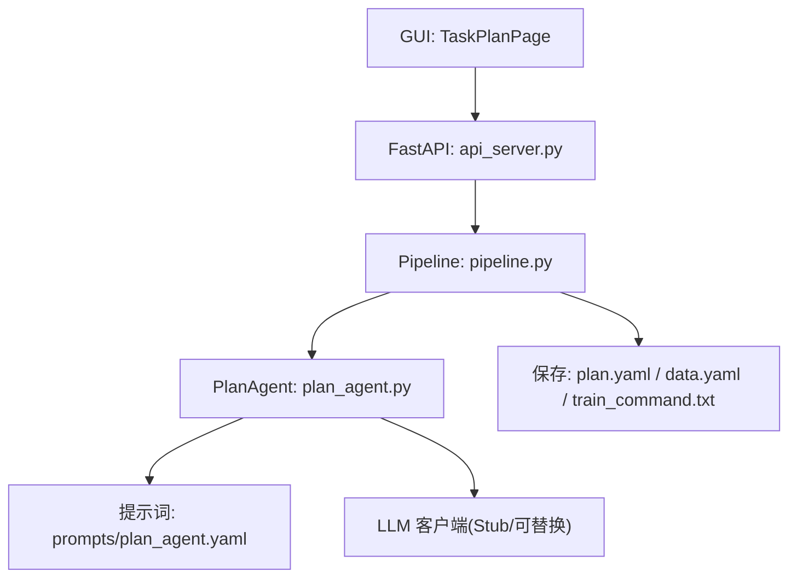
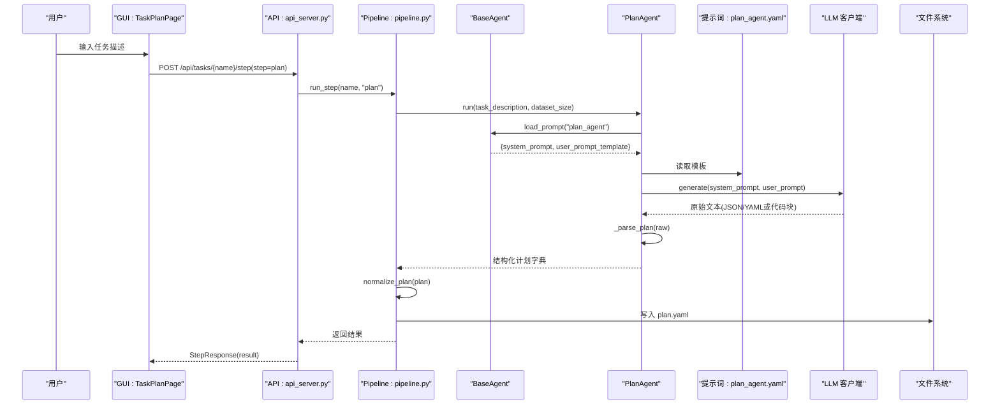
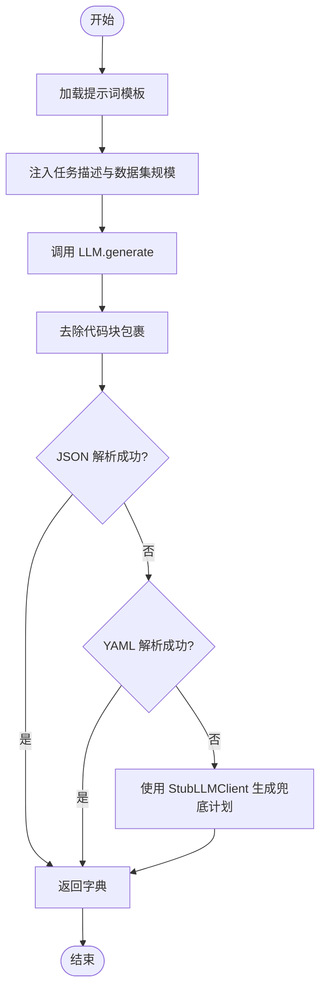
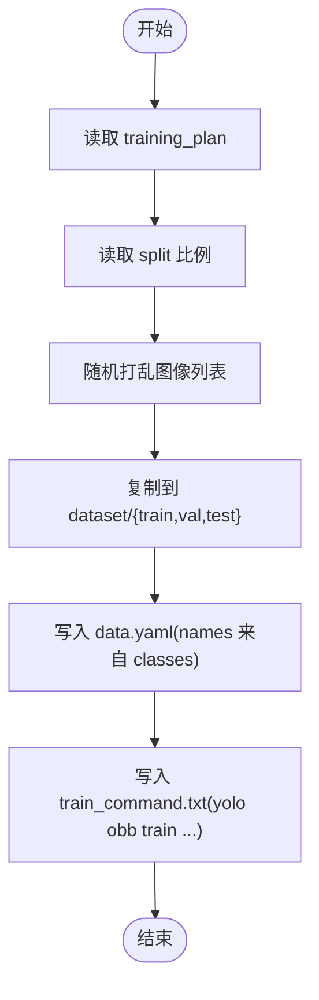
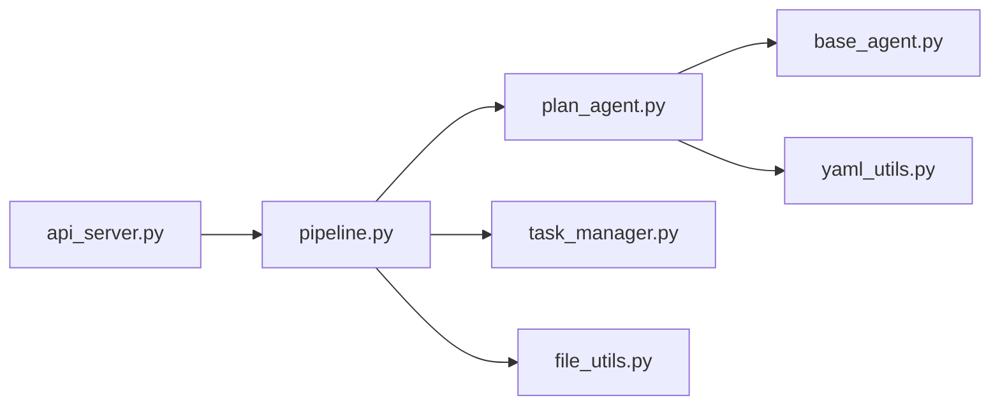

# 训练计划生成 Agent

<cite>
**本文引用的文件**
- [plan_agent.py](file://src/agents/plan_agent.py)
- [base_agent.py](file://src/agents/base_agent.py)
- [pipeline.py](file://src/core/pipeline.py)
- [task_template.yaml](file://config/task_template.yaml)
- [global.yaml](file://config/global.yaml)
- [plan_agent.yaml](file://prompts/plan_agent.yaml)
- [api_server.py](file://src/api_server.py)
- [TaskPlanPage.tsx](file://gui/src/pages/TaskPlanPage.tsx)
- [api.ts](file://gui/src/services/api.ts)
- [index.ts](file://gui/src/types/index.ts)
- [yaml_utils.py](file://src/utils/yaml_utils.py)
</cite>

## 目录
1. [简介](#简介)
2. [项目结构](#项目结构)
3. [核心组件](#核心组件)
4. [架构总览](#架构总览)
5. [详细组件分析](#详细组件分析)
6. [依赖关系分析](#依赖关系分析)
7. [性能考量](#性能考量)
8. [故障排查指南](#故障排查指南)
9. [结论](#结论)
10. [附录](#附录)

## 简介
本文件面向“训练计划生成 Agent”的实现与使用，聚焦 PlanAgent 的工作原理：如何从自然语言任务描述中解析并生成 YOLO-OBB 训练计划，包括类别定义、超参数推荐、数据集分割策略；详细说明与 LLM 的交互流程（提示词模板、动态参数注入、响应解析）；解释训练配置文件生成逻辑（YOLO-OBB 格式适配与最佳实践）；提供配置选项说明与自定义扩展方法；并给出常见问题诊断与解决方案。

## 项目结构
围绕训练计划生成的关键路径如下：
- 前端页面发起“生成计划”请求，调用后端 API。
- FastAPI 服务将请求路由到 Pipeline 的 plan 步骤。
- Pipeline 调用 PlanAgent，加载提示词模板，构造用户提示并调用 LLM。
- PlanAgent 返回结构化计划，Pipeline 将其规范化为 task_template 模式，持久化为 plan.yaml。
- 后续 split 步骤基于 plan 导出 data.yaml 与训练命令。

图表来源
- [api_server.py:169-205](file://src/api_server.py#L169-L205)
- [pipeline.py:96-122](file://src/core/pipeline.py#L96-L122)
- [plan_agent.py:101-138](file://src/agents/plan_agent.py#L101-L138)
- [plan_agent.yaml:1-27](file://prompts/plan_agent.yaml#L1-L27)

章节来源
- [api_server.py:169-205](file://src/api_server.py#L169-L205)
- [pipeline.py:96-122](file://src/core/pipeline.py#L96-L122)
- [plan_agent.py:101-138](file://src/agents/plan_agent.py#L101-L138)
- [plan_agent.yaml:1-27](file://prompts/plan_agent.yaml#L1-L27)

## 核心组件
- PlanAgent：负责将任务描述转换为结构化训练计划，包含类别、标注规则、数据划分、模型选择、超参数、质检规则与评估指标。
- BaseAgent：提供统一的提示词加载与日志能力。
- Pipeline：编排 plan/annotate/inspect/split 四步流程，并将 plan 规范化后落盘。
- 提示词模板：plan_agent.yaml 定义系统提示与用户提示模板。
- 全局与任务模板：global.yaml 与 task_template.yaml 分别提供平台级配置与计划输出模式。
- API 层：FastAPI 暴露创建任务、运行步骤、获取计划等接口。
- GUI：前端页面用于输入任务描述、触发计划生成并展示结果。

章节来源
- [plan_agent.py:101-182](file://src/agents/plan_agent.py#L101-L182)
- [base_agent.py:13-53](file://src/agents/base_agent.py#L13-L53)
- [pipeline.py:22-122](file://src/core/pipeline.py#L22-L122)
- [plan_agent.yaml:1-27](file://prompts/plan_agent.yaml#L1-L27)
- [global.yaml:1-29](file://config/global.yaml#L1-L29)
- [task_template.yaml:1-54](file://config/task_template.yaml#L1-L54)
- [api_server.py:139-205](file://src/api_server.py#L139-L205)
- [TaskPlanPage.tsx:1-128](file://gui/src/pages/TaskPlanPage.tsx#L1-L128)

## 架构总览
下图展示了从用户输入到训练计划落盘的端到端流程，以及各模块之间的职责边界。

图表来源
- [api_server.py:169-205](file://src/api_server.py#L169-L205)
- [pipeline.py:96-122](file://src/core/pipeline.py#L96-L122)
- [plan_agent.py:119-168](file://src/agents/plan_agent.py#L119-L168)
- [plan_agent.yaml:1-27](file://prompts/plan_agent.yaml#L1-L27)

## 详细组件分析

### PlanAgent：实现原理与数据处理
- 任务描述解析
  - 通过 BaseAgent.load_prompt 加载 plan_agent.yaml，提取 system_prompt 与 user_prompt_template。
  - 使用 Python 字符串格式化注入 task_description 与 dataset_size，构造用户提示。
- 类别定义生成
  - LLM 被要求输出 classes 映射（0-based 整数键到名称）。
  - StubLLMClient 在离线模式下根据关键词启发式猜测类别，保证最小可用输出。
- 超参数推荐
  - 提示词约束在单卡 3060Ti（约 8GB VRAM）下保持合理 batch 与 imgsz。
  - 默认回退值来自 StubLLMClient 与 normalize_plan 的默认值。
- 数据集分割策略
  - 提示词要求输出 dataset_strategy.split 比例，normalize_plan 将其归一化为 train_ratio/val_ratio/test_ratio 与 stratified 标志。
  - Pipeline 的 split 步骤按该比例随机打乱并复制图像与标签到 dataset/{train,val,test}。
- 响应解析与容错
  - _strip_code_fence 去除 Markdown 代码块包裹。
  - 先尝试 JSON 解析，再尝试 YAML 解析；失败时回退到 StubLLMClient 的确定性计划，确保流水线不中断。

图表来源
- [plan_agent.py:131-168](file://src/agents/plan_agent.py#L131-L168)
- [plan_agent.py:170-181](file://src/agents/plan_agent.py#L170-L181)
- [plan_agent.py:35-99](file://src/agents/plan_agent.py#L35-L99)

章节来源
- [plan_agent.py:101-182](file://src/agents/plan_agent.py#L101-L182)
- [base_agent.py:36-53](file://src/agents/base_agent.py#L36-L53)

### 与 LLM 的交互流程
- 提示词模板结构
  - system_prompt：限定角色、输出模块与约束（如类别必须连续、参数需符合 3060Ti 显存限制）。
  - user_prompt_template：包含任务描述、数据集规模、目标 GPU 信息。
- 动态参数注入
  - Pipeline 将 task.description 与 dataset_size 注入用户提示。
- 响应解析
  - 支持 JSON 与 YAML 两种结构化输出；自动去除代码块；失败时回退。

章节来源
- [plan_agent.yaml:1-27](file://prompts/plan_agent.yaml#L1-L27)
- [pipeline.py:111-122](file://src/core/pipeline.py#L111-L122)
- [plan_agent.py:131-168](file://src/agents/plan_agent.py#L131-L168)

### 训练配置文件生成逻辑（YOLO-OBB 适配与最佳实践）
- 规范化与模式对齐
  - normalize_plan 将 LLM 输出的多种字段名统一映射到 task_template.yaml 的模式，包括 classes、split、model、hyperparameters、inspection、metrics 等。
  - 对缺失字段提供安全默认值，避免下游异常。
- 数据集导出
  - 按 split 比例复制 images 与 labels 到 dataset/{train,val,test}。
  - 生成 data.yaml（path/train/val/test/names），names 由 classes 映射得到。
  - 生成 train_command.txt，拼装 yolo obb train 命令，包含 model/data/epochs/batch/imgsz/optimizer/lr0/weight_decay/device/project/name 等参数。
- 最佳实践建议
  - 在提示词中约束 batch 与 imgsz 以适配 3060Ti 显存。
  - 使用合理的 split 比例与 stratified 采样，提升小样本稳定性。
  - 明确 OBB 标注规则与最小缺陷像素阈值，减少噪声标注。

图表来源
- [pipeline.py:155-281](file://src/core/pipeline.py#L155-L281)
- [task_template.yaml:8-54](file://config/task_template.yaml#L8-L54)

章节来源
- [pipeline.py:155-281](file://src/core/pipeline.py#L155-L281)
- [task_template.yaml:8-54](file://config/task_template.yaml#L8-L54)

### 配置选项说明与自定义扩展
- 全局配置（global.yaml）
  - model.vl_model_name、load_in_4bit、device、max_new_tokens、max_gpu_memory_mb：控制本地 VL 模型加载与推理资源。
  - inference.batch_size、conf_threshold、min_defect_pixels、enable_cpu_fallback：推理阶段通用参数。
  - paths.tasks_root、prompts_dir、config_dir：任务、提示词与配置根路径。
  - server.host、server.port、server.reload：API 服务绑定与热重载。
  - logging.level、logging.dir：日志级别与目录。
- 任务模板（task_template.yaml）
  - task.name/description/industry/modality：任务元信息。
  - training_plan.classes：类别映射（0-based）。
  - training_plan.annotation_rules：OBB 标注规则、最小缺陷像素、排除项。
  - training_plan.split：train/val/test 比例与分层采样开关。
  - training_plan.model：yolo_version、imgsz。
  - training_plan.hyperparameters：epochs、batch、optimizer、lr0、weight_decay、imgsz、device。
  - training_plan.inspection：重复框 IoU、尺寸异常比例、各类检查开关。
  - training_plan.metrics：评估指标列表。
- 自定义扩展
  - 替换 LLM 客户端：实现 LLMClient 协议（generate 方法），在 PlanAgent 初始化时传入，即可接入任意后端（如本地 Qwen 模型）。
  - 扩展提示词：修改 prompts/plan_agent.yaml 的 system_prompt 与 user_prompt_template，增加领域知识或约束。
  - 调整默认值：在 normalize_plan 中补充默认字段或转换逻辑，使新字段兼容现有流水线。
  - 自定义导出：在 Pipeline._write_train_command 中追加额外参数或脚本封装。

章节来源
- [global.yaml:1-29](file://config/global.yaml#L1-L29)
- [task_template.yaml:1-54](file://config/task_template.yaml#L1-L54)
- [plan_agent.py:13-33](file://src/agents/plan_agent.py#L13-L33)
- [plan_agent.py:108-118](file://src/agents/plan_agent.py#L108-L118)
- [pipeline.py:284-325](file://src/core/pipeline.py#L284-L325)

### 前端与 API 集成
- 前端页面 TaskPlanPage 提供任务创建、选择与“生成计划”按钮，调用 runPlan 并展示 plan 的关键字段。
- API 客户端 api.ts 封装了 listTasks、createTask、runStep、getPlan 等方法，统一访问后端。
- 类型定义 index.ts 定义了 TaskPlan、ExportSummary、InspectionReport 等结构，前后端契约一致。

章节来源
- [TaskPlanPage.tsx:1-128](file://gui/src/pages/TaskPlanPage.tsx#L1-L128)
- [api.ts:1-80](file://gui/src/services/api.ts#L1-L80)
- [index.ts:26-55](file://gui/src/types/index.ts#L26-L55)
- [api_server.py:139-205](file://src/api_server.py#L139-L205)

## 依赖关系分析
- 模块耦合
  - PlanAgent 依赖 BaseAgent 的提示词加载能力与 yaml_utils 的 YAML 工具。
  - Pipeline 依赖 PlanAgent、AnnotateAgent、InspectAgent 及 TaskManager、FileUtils。
  - API 层依赖 Pipeline 与 TaskManager，对外暴露 RESTful 接口。
- 外部依赖
  - LLM 客户端通过 Protocol 抽象，便于替换真实后端。
  - YAML 读写使用 PyYAML。
- 循环依赖
  - 当前未发现循环导入；模块间通过函数与类实例传递数据。

图表来源
- [api_server.py:16-26](file://src/api_server.py#L16-L26)
- [pipeline.py:11-17](file://src/core/pipeline.py#L11-L17)
- [plan_agent.py:5-11](file://src/agents/plan_agent.py#L5-L11)
- [base_agent.py:10-11](file://src/agents/base_agent.py#L10-L11)
- [yaml_utils.py:1-9](file://src/utils/yaml_utils.py#L1-L9)

章节来源
- [api_server.py:16-26](file://src/api_server.py#L16-L26)
- [pipeline.py:11-17](file://src/core/pipeline.py#L11-L17)
- [plan_agent.py:5-11](file://src/agents/plan_agent.py#L5-L11)
- [base_agent.py:10-11](file://src/agents/base_agent.py#L10-L11)
- [yaml_utils.py:1-9](file://src/utils/yaml_utils.py#L1-L9)

## 性能考量
- 提示词与 LLM 调用
  - max_new_tokens 控制生成长度，过大可能影响延迟与成本。
  - 建议在提示词中约束输出结构，减少重试与解析失败。
- 数据分割与导出
  - 大图像集复制与 I/O 可能成为瓶颈，建议在 SSD 上运行。
  - 可通过调整 batch 与 imgsz 平衡显存与吞吐。
- 内存与显存
  - global.yaml 中的 max_gpu_memory_mb 与 load_in_4bit 有助于在有限显存下运行。
  - 若使用本地 VL 模型，注意设备分配与量化策略。

[本节为通用指导，不直接分析具体文件]

## 故障排查指南
- 无法解析 LLM 输出
  - 现象：_parse_plan 多次解析失败，进入 fallback。
  - 处理：检查提示词是否要求严格 JSON/YAML；确认模型未输出多余文本；必要时调整 system_prompt 约束。
  - 参考路径
    - [plan_agent.py:140-168](file://src/agents/plan_agent.py#L140-L168)
- 提示词文件缺失或格式错误
  - 现象：load_prompt 抛出 FileNotFoundError 或 ValueError。
  - 处理：确认 prompts_dir 指向正确目录；检查 YAML 根节点为映射。
  - 参考路径
    - [base_agent.py:36-53](file://src/agents/base_agent.py#L36-L53)
    - [yaml_utils.py:11-32](file://src/utils/yaml_utils.py#L11-L32)
- 无图像可分割
  - 现象：split 步骤警告无图像并返回空摘要。
  - 处理：确认 images 目录存在且包含有效图片；检查任务目录结构。
  - 参考路径
    - [pipeline.py:174-177](file://src/core/pipeline.py#L174-L177)
- 标签文件解析失败
  - 现象：API 解析 OBB 标签时报跳过 malformed line。
  - 处理：检查标签文件格式是否为 cls x1 y1 x2 y2 x3 y3 x4 y4，坐标数量应为 8。
  - 参考路径
    - [api_server.py:91-118](file://src/api_server.py#L91-L118)
- 任务不存在或接口 404
  - 现象：API 返回 404。
  - 处理：确认任务已创建且名称匹配；检查 TaskManager 列表。
  - 参考路径
    - [api_server.py:183-189](file://src/api_server.py#L183-L189)
    - [api_server.py:266-269](file://src/api_server.py#L266-L269)

章节来源
- [plan_agent.py:140-168](file://src/agents/plan_agent.py#L140-L168)
- [base_agent.py:36-53](file://src/agents/base_agent.py#L36-L53)
- [yaml_utils.py:11-32](file://src/utils/yaml_utils.py#L11-L32)
- [pipeline.py:174-177](file://src/core/pipeline.py#L174-L177)
- [api_server.py:91-118](file://src/api_server.py#L91-L118)
- [api_server.py:183-189](file://src/api_server.py#L183-L189)
- [api_server.py:266-269](file://src/api_server.py#L266-L269)

## 结论
PlanAgent 通过“提示词模板 + LLM + 健壮解析”的方式，将自然语言任务描述转化为标准化的 YOLO-OBB 训练计划，并与 Pipeline 无缝衔接，完成数据分割与训练命令生成。其设计具备良好的可扩展性与容错性：可替换 LLM 后端、灵活调整提示词、按需扩展默认值与导出逻辑。结合全局与任务模板配置，可在不同硬件与业务场景下快速落地工业缺陷检测训练流程。

[本节为总结性内容，不直接分析具体文件]

## 附录
- 关键流程图与序列图已在上述章节提供，便于理解端到端数据流与控制流。
- 如需进一步定制，建议优先从以下位置入手：
  - 提示词优化：prompts/plan_agent.yaml
  - 默认值与模式映射：src/core/pipeline.py 的 normalize_plan
  - 训练命令生成：src/core/pipeline.py 的 _write_train_command
  - LLM 后端替换：src/agents/plan_agent.py 的 LLMClient 协议与 StubLLMClient

[本节为附加信息，不直接分析具体文件]