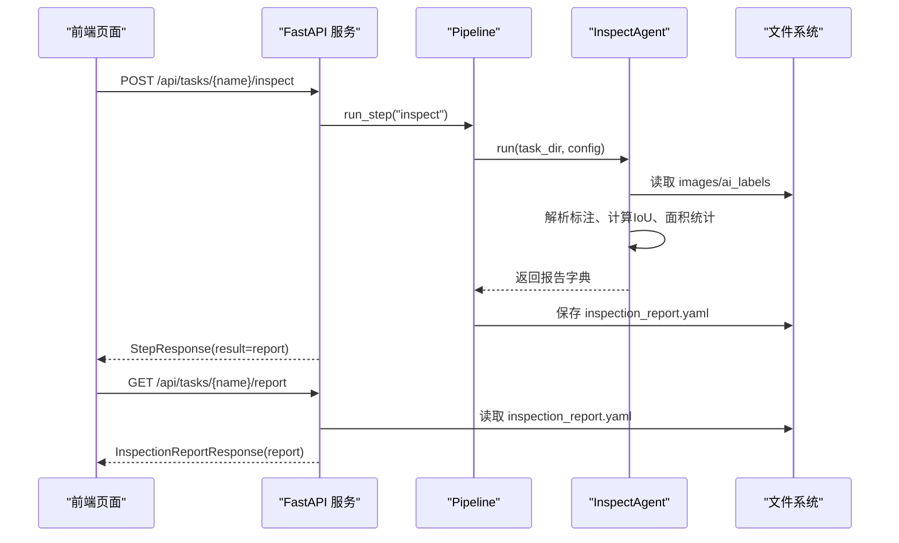
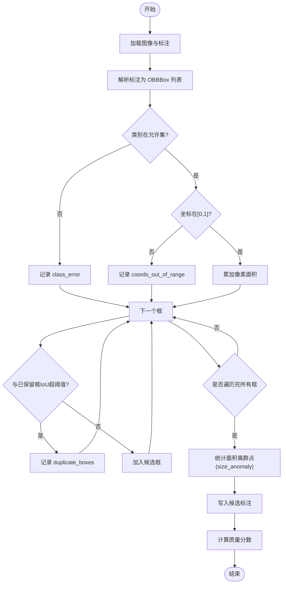
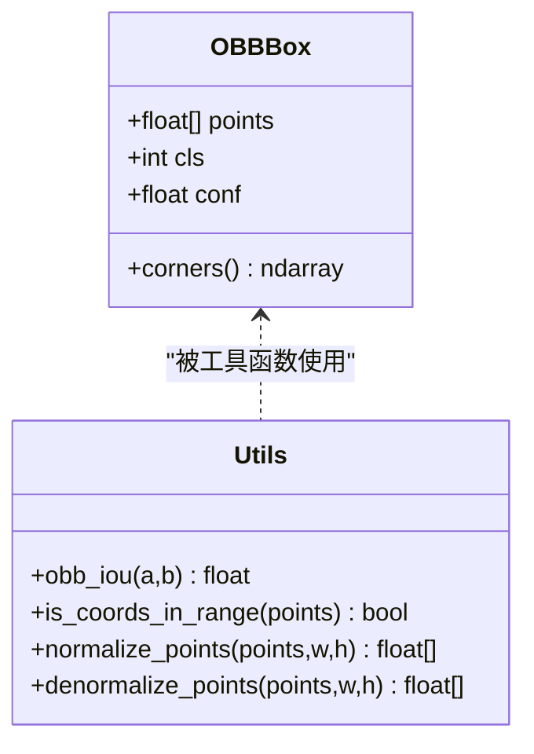
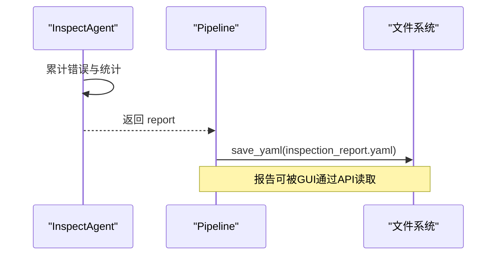
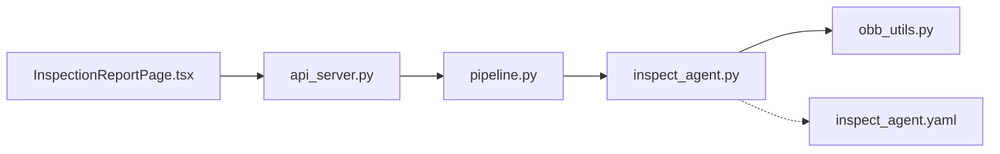

# 质量检查 Agent

<cite>
**本文引用的文件**
- [inspect_agent.py](file://src/agents/inspect_agent.py)
- [obb_utils.py](file://src/utils/obb_utils.py)
- [pipeline.py](file://src/core/pipeline.py)
- [api_server.py](file://src/api_server.py)
- [inspect_agent.yaml](file://prompts/inspect_agent.yaml)
- [InspectionReportPage.tsx](file://gui/src/pages/InspectionReportPage.tsx)
- [index.ts](file://gui/src/types/index.ts)
- [global.yaml](file://config/global.yaml)
</cite>

## 目录
1. [简介](#简介)
2. [项目结构](#项目结构)
3. [核心组件](#核心组件)
4. [架构总览](#架构总览)
5. [详细组件分析](#详细组件分析)
6. [依赖关系分析](#依赖关系分析)
7. [性能与复杂度](#性能与复杂度)
8. [故障排查指南](#故障排查指南)
9. [结论](#结论)
10. [附录：配置与扩展](#附录：配置与扩展)

## 简介
本文件面向“质量检查 Agent”，围绕 InspectAgent 的质量检测规则、报告生成机制、LLM 协作模式、阈值配置与自定义扩展，以及质量趋势与统计能力进行系统化说明。该 Agent 用于对 AI 生成的标注结果进行自动化质检，输出结构化问题清单与质量评分，并生成候选修正标签供后续训练使用。

## 项目结构
与质量检查相关的关键路径与职责如下：
- 后端质检逻辑：InspectAgent（规则检测、报告生成、候选标签写入）
- OBB 几何工具：OBBBox、IoU、坐标范围校验等
- 流水线编排：Pipeline 调用 inspect 步骤并持久化报告
- API 服务：暴露运行质检、获取报告等接口
- GUI 展示：报表页面按类别展示错误、统计指标与进度条
- 提示词模板：定义 LLM 质检的输入输出格式与规则占位符
- 全局配置：模型、推理参数、路径等

```mermaid
graph TB
subgraph "GUI"
IRP["InspectionReportPage.tsx"]
end
subgraph "API"
API["api_server.py"]
end
subgraph "Core"
PIPE["pipeline.py"]
AG["inspect_agent.py"]
UTIL["obb_utils.py"]
end
subgraph "Prompts"
PROMPT["inspect_agent.yaml"]
end
IRP --> API
API --> PIPE
PIPE --> AG
AG --> UTIL
AG -.-> PROMPT
```

图表来源
- [api_server.py:169-231](file://src/api_server.py#L169-L231)
- [pipeline.py:139-153](file://src/core/pipeline.py#L139-L153)
- [inspect_agent.py:34-108](file://src/agents/inspect_agent.py#L34-L108)
- [obb_utils.py:16-93](file://src/utils/obb_utils.py#L16-L93)
- [inspect_agent.yaml:1-31](file://prompts/inspect_agent.yaml#L1-L31)

章节来源
- [api_server.py:169-231](file://src/api_server.py#L169-L231)
- [pipeline.py:139-153](file://src/core/pipeline.py#L139-L153)
- [inspect_agent.py:34-108](file://src/agents/inspect_agent.py#L34-L108)
- [obb_utils.py:16-93](file://src/utils/obb_utils.py#L16-L93)
- [inspect_agent.yaml:1-31](file://prompts/inspect_agent.yaml#L1-L31)

## 核心组件
- InspectAgent：读取任务图像与 AI 标注，执行重复框、坐标越界、类别错误、尺寸异常等检测；生成质量报告与候选修正标签。
- OBB 工具：提供 OBBBox 数据结构、旋转框 IoU、坐标归一化/反归一化、坐标范围判断等。
- Pipeline：编排 plan/annotate/inspect/split 流程，保存 inspection_report.yaml。
- API Server：提供 /api/tasks/{name}/inspect 与 /api/tasks/{name}/report 等接口。
- GUI InspectionReportPage：可视化展示图片数、框数、错误数、质量分及分类错误明细。

章节来源
- [inspect_agent.py:34-108](file://src/agents/inspect_agent.py#L34-L108)
- [obb_utils.py:16-93](file://src/utils/obb_utils.py#L16-L93)
- [pipeline.py:139-153](file://src/core/pipeline.py#L139-L153)
- [api_server.py:221-250](file://src/api_server.py#L221-L250)
- [InspectionReportPage.tsx:36-124](file://gui/src/pages/InspectionReportPage.tsx#L36-L124)

## 架构总览
下图展示了从 GUI 触发质检到报告展示的端到端流程。



图表来源
- [api_server.py:221-250](file://src/api_server.py#L221-L250)
- [pipeline.py:139-153](file://src/core/pipeline.py#L139-L153)
- [inspect_agent.py:34-108](file://src/agents/inspect_agent.py#L34-L108)

## 详细组件分析

### InspectAgent 质量检测规则
- 缺失标注检测：若某图像无对应 .txt 标注文件，记录 missing_labels。
- 重复框检测：基于 OBB IoU 比较同一图像内所有框对，超过阈值的视为重复，建议删除后一个框。
- 类别错误验证：若框类别不在允许集合中，记录 class_error。
- 坐标越界检查：若框点坐标不在 [0,1] 范围内，记录 coords_out_of_range。
- 尺寸异常检测：统计全数据集框像素面积，计算均值与标准差，将偏离均值超过 3σ 的框标记为 size_anomaly。
- 候选修正标签：对每个图像生成 candidate_labels 下的 .txt，剔除越界框与重复框，保留其余框作为“候选”标注。



图表来源
- [inspect_agent.py:110-175](file://src/agents/inspect_agent.py#L110-L175)
- [inspect_agent.py:203-227](file://src/agents/inspect_agent.py#L203-L227)

章节来源
- [inspect_agent.py:34-108](file://src/agents/inspect_agent.py#L34-L108)
- [inspect_agent.py:110-175](file://src/agents/inspect_agent.py#L110-L175)
- [inspect_agent.py:177-227](file://src/agents/inspect_agent.py#L177-L227)

### 数据模型与工具
- OBBBox：包含 points（顺时针四点）、cls、conf。
- obb_iou：基于凸多边形相交计算 IoU。
- is_coords_in_range：判断坐标是否在 [0,1] 范围内。
- normalize/denormalize_points：坐标归一化与反归一化。



图表来源
- [obb_utils.py:16-93](file://src/utils/obb_utils.py#L16-L93)
- [obb_utils.py:96-151](file://src/utils/obb_utils.py#L96-L151)

章节来源
- [obb_utils.py:16-93](file://src/utils/obb_utils.py#L16-L93)
- [obb_utils.py:96-151](file://src/utils/obb_utils.py#L96-L151)

### 质量报告生成机制
- 报告字段：
  - num_images、num_boxes：统计量
  - errors：按类型组织的错误列表（missing_labels、duplicate_boxes、class_error、coords_out_of_range、size_anomaly）
  - quality_score：质量分，基于错误数量与框总数估算
  - candidate_dir：候选标注目录路径
- 质量分计算：以 1.0 减去“错误数/框数”的比例，下限为 0.0，四舍五入至四位小数。
- 持久化：Pipeline 将报告保存为 inspection_report.yaml，API 提供读取接口。



图表来源
- [inspect_agent.py:69-108](file://src/agents/inspect_agent.py#L69-L108)
- [pipeline.py:139-153](file://src/core/pipeline.py#L139-L153)

章节来源
- [inspect_agent.py:69-108](file://src/agents/inspect_agent.py#L69-L108)
- [pipeline.py:139-153](file://src/core/pipeline.py#L139-L153)

### 与 LLM 的协作模式
- 提示词模板定义了质检规则占位符（如 IoU 阈值、允许类别、尺寸范围），并要求输出严格 JSON 对象，包含 errors 列表与 quality_score。
- 当前代码中 InspectAgent 主要执行确定性规则检测；提示词可用于未来引入 LLM 进行复杂语义级质检或给出更丰富的修复建议。
- 建议在 pipeline 中预留 LLM 质检步骤，将规则检测结果与 LLM 分析结果合并，形成更全面的报告与建议。

章节来源
- [inspect_agent.yaml:1-31](file://prompts/inspect_agent.yaml#L1-L31)

### 质量阈值配置与自定义扩展
- 重复框 IoU 阈值：来自 training_plan.inspection.iou_duplicate_threshold，默认由 normalize_plan 设置。
- 尺寸异常判定：当前实现使用 3σ 原则（绝对偏差大于 3 倍标准差）。可通过扩展 _flag_size_outliers 增加相对比例阈值或动态阈值策略。
- 新增检测规则：可在 InspectAgent.run 或 _check_boxes 中插入新检查项，并在 report.errors 中新增键值；同时在 GUI 的 ERROR_KEYS 中添加对应 tab。
- 全局配置：global.yaml 中的 paths/prompts 等路径影响提示词与任务根目录，便于统一环境管理。

章节来源
- [pipeline.py:284-325](file://src/core/pipeline.py#L284-L325)
- [inspect_agent.py:156-175](file://src/agents/inspect_agent.py#L156-L175)
- [InspectionReportPage.tsx:8-14](file://gui/src/pages/InspectionReportPage.tsx#L8-L14)
- [global.yaml:17-20](file://config/global.yaml#L17-L20)

### 质量趋势分析与统计报告
- 单任务统计：GUI 展示图片数、框数、错误总数、质量分百分比，并按错误类别分页展示明细。
- 趋势分析建议：
  - 定期运行 inspect 并归档 inspection_report.yaml，结合时间戳构建趋势表（例如每日/每批次）。
  - 可基于历史报告计算各错误类型的占比变化、质量分移动平均、离群样本分布等。
  - 导出 CSV/JSON 后使用 BI 工具绘制折线图、堆叠柱状图，监控质量改进效果。
- 可扩展字段：如需更丰富统计，可在 InspectAgent 中增加 per-image 错误计数、类别错误分布、重复框密度等字段，并在 GUI 中新增图表。

章节来源
- [InspectionReportPage.tsx:36-124](file://gui/src/pages/InspectionReportPage.tsx#L36-L124)
- [api_server.py:234-250](file://src/api_server.py#L234-L250)

## 依赖关系分析
- InspectAgent 依赖 OBB 工具进行几何计算与范围校验。
- Pipeline 负责调度 InspectAgent 并持久化报告。
- API Server 暴露 HTTP 接口，使 GUI 能触发质检与获取报告。
- GUI 类型定义与后端报告结构保持一致，确保前后端契约稳定。



图表来源
- [InspectionReportPage.tsx:36-124](file://gui/src/pages/InspectionReportPage.tsx#L36-L124)
- [api_server.py:169-250](file://src/api_server.py#L169-L250)
- [pipeline.py:139-153](file://src/core/pipeline.py#L139-L153)
- [inspect_agent.py:34-108](file://src/agents/inspect_agent.py#L34-L108)
- [obb_utils.py:16-93](file://src/utils/obb_utils.py#L16-L93)
- [inspect_agent.yaml:1-31](file://prompts/inspect_agent.yaml#L1-L31)

章节来源
- [api_server.py:169-250](file://src/api_server.py#L169-L250)
- [pipeline.py:139-153](file://src/core/pipeline.py#L139-L153)
- [inspect_agent.py:34-108](file://src/agents/inspect_agent.py#L34-L108)
- [obb_utils.py:16-93](file://src/utils/obb_utils.py#L16-L93)
- [inspect_agent.yaml:1-31](file://prompts/inspect_agent.yaml#L1-L31)

## 性能与复杂度
- 重复框检测：对每幅图像的 N 个框进行两两比较，时间复杂度 O(N^2)。对于大图密集标注场景，可考虑先按网格或聚类预筛再计算 IoU。
- 面积统计：一次线性扫描累积面积，计算均值与标准差 O(M)，M 为总框数。
- 坐标范围检查与类别检查：线性 O(N)。
- 总体复杂度：主要为 O(N^2) 的重复框检测，其他步骤近似线性。
- 内存占用：主要在于存储 boxes 列表与 all_areas 累积数组，通常可控。

优化建议
- 对超大图像或极多框场景，采用空间索引（如 R-tree）或分块比较降低重复框检测开销。
- 对尺寸异常检测，可引入稳健统计（如中位数与 MAD）替代均值/标准差，提升抗噪性。
- 并行化：按图像并行处理，减少 I/O 等待。

章节来源
- [inspect_agent.py:143-154](file://src/agents/inspect_agent.py#L143-L154)
- [inspect_agent.py:156-175](file://src/agents/inspect_agent.py#L156-L175)

## 故障排查指南
- 任务目录不存在：InspectAgent 会抛出 FileNotFoundError，需确认 task_dir 是否正确。
- 标注文件格式错误：解析时若坐标数量不为 8，将记录 parse error 并跳过该行；检查 ai_labels 下文本格式。
- 无标注文件：images 目录下存在图像但缺少对应 .txt，将记录 missing_labels。
- 坐标越界：若坐标超出 [0,1]，记录 coords_out_of_range；检查标注生成管线是否使用了归一化坐标。
- 类别错误：类别不在 allowed_classes 中，需核对 classes 配置与标注类别映射。
- 重复框过多：调整 iou_duplicate_threshold 以降低或提高敏感度。
- 报告未生成：确认 inspect 步骤成功执行且 inspection_report.yaml 已写入；API 读取失败时检查路径权限。

章节来源
- [inspect_agent.py:57-59](file://src/agents/inspect_agent.py#L57-L59)
- [inspect_agent.py:177-201](file://src/agents/inspect_agent.py#L177-L201)
- [inspect_agent.py:85-96](file://src/agents/inspect_agent.py#L85-L96)
- [inspect_agent.py:138-141](file://src/agents/inspect_agent.py#L138-L141)
- [inspect_agent.py:134-137](file://src/agents/inspect_agent.py#L134-L137)
- [pipeline.py:139-153](file://src/core/pipeline.py#L139-L153)
- [api_server.py:234-250](file://src/api_server.py#L234-L250)

## 结论
InspectAgent 提供了针对 YOLO-OBB 标注的完整规则式质检能力，覆盖缺失标注、重复框、类别错误、坐标越界与尺寸异常等常见问题，并通过候选标注与质量评分辅助人工复核与训练准备。结合 GUI 的可视化报表与 API 的数据访问，可实现端到端的质量监控与改进闭环。未来可引入 LLM 增强复杂语义问题的诊断与建议，并扩展统计维度以支持长期质量趋势分析。

## 附录：配置与扩展
- 阈值配置
  - 重复框 IoU 阈值：training_plan.inspection.iou_duplicate_threshold（默认由 normalize_plan 设置）
  - 尺寸异常阈值：当前使用 3σ 原则；可按需改为相对比例或自适应阈值
- 自定义检测规则
  - 在 InspectAgent._check_boxes 中新增检查项，并在 report.errors 中新增键值
  - 在 GUI 的 ERROR_KEYS 中添加对应 tab，显示新错误类别
- 提示词扩展
  - 在 inspect_agent.yaml 中扩展 user_prompt_template，注入更多上下文（如图像分辨率、类别名映射）
  - 要求 LLM 输出结构化 JSON，便于与规则检测结果融合
- 趋势与统计
  - 定期归档 inspection_report.yaml，构建时间序列
  - 导出 CSV/JSON，使用 BI 工具绘制质量分趋势、错误类型占比变化、离群样本分布等

章节来源
- [pipeline.py:284-325](file://src/core/pipeline.py#L284-L325)
- [inspect_agent.py:110-175](file://src/agents/inspect_agent.py#L110-L175)
- [inspect_agent.yaml:1-31](file://prompts/inspect_agent.yaml#L1-L31)
- [InspectionReportPage.tsx:8-14](file://gui/src/pages/InspectionReportPage.tsx#L8-L14)