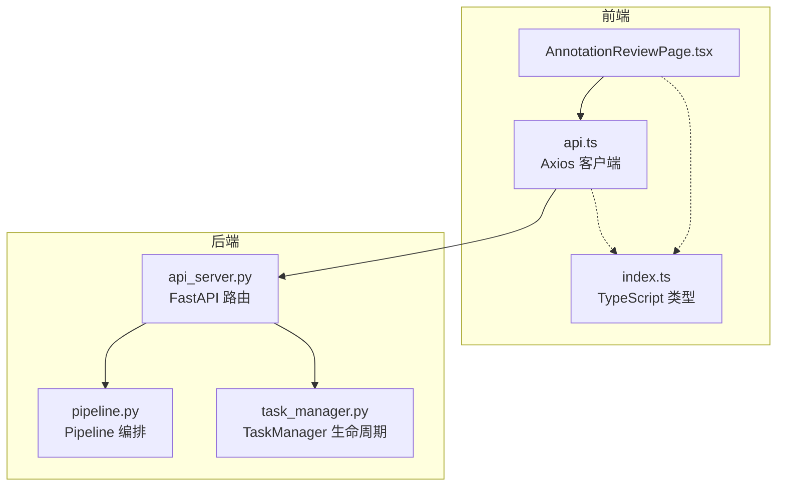
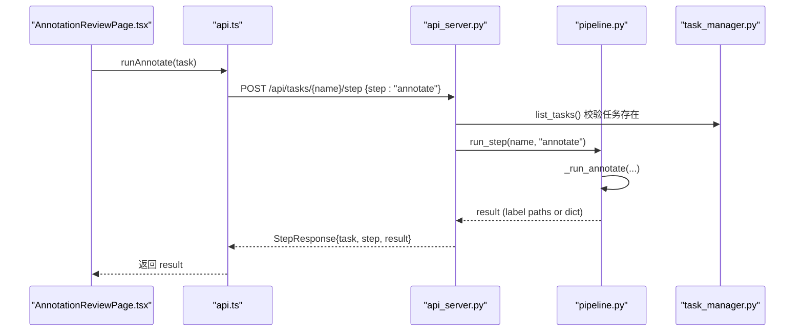
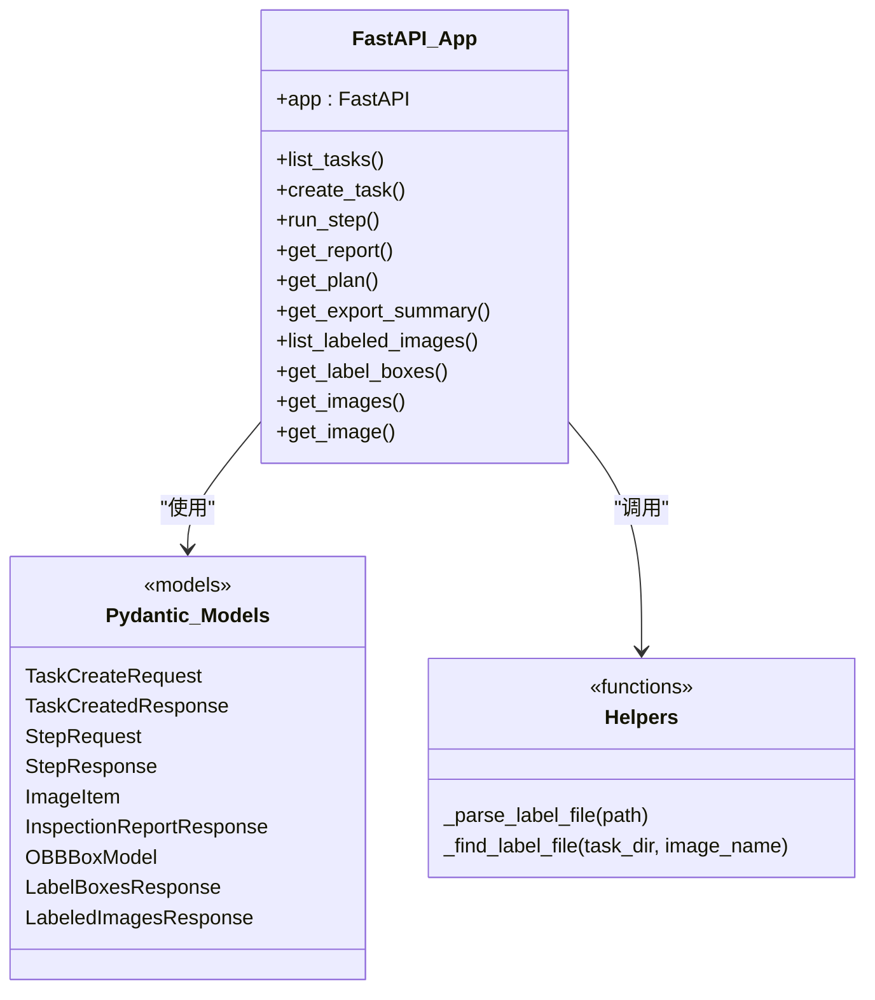
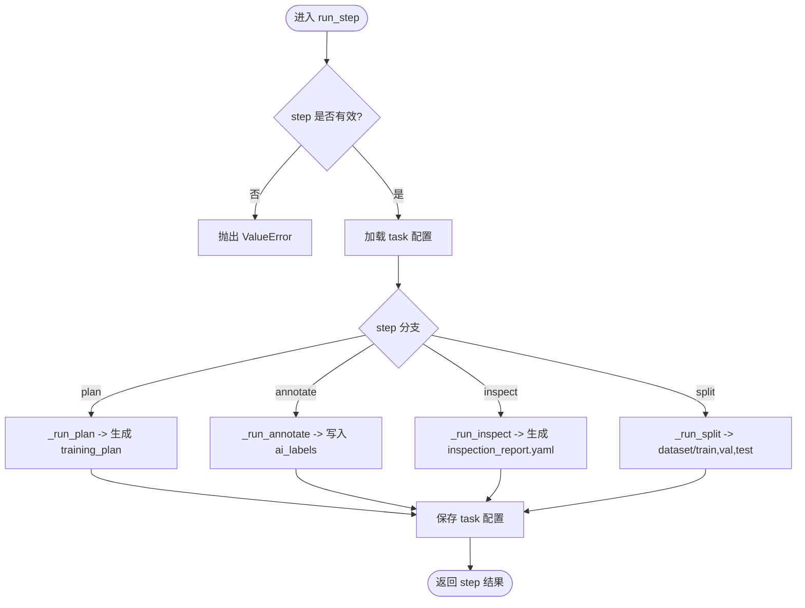
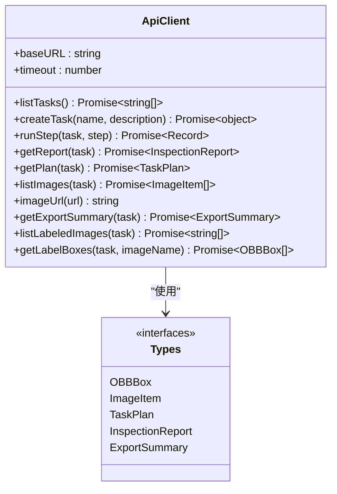
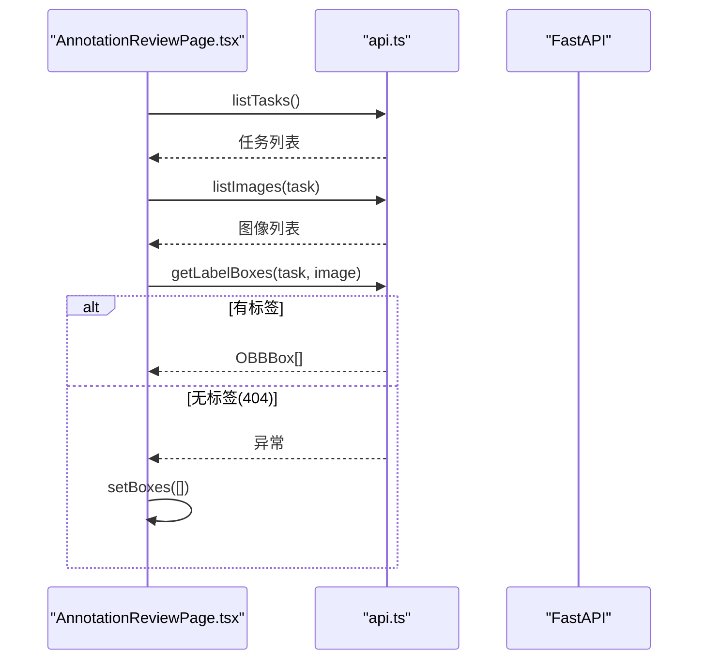
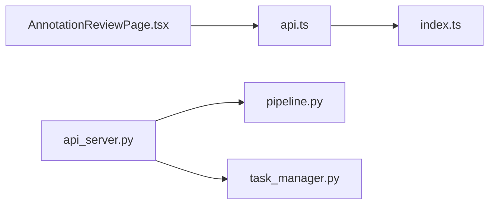

# API 集成层

<cite>
**本文引用的文件**   
- [src/api_server.py](file://src/api_server.py)
- [gui/src/services/api.ts](file://gui/src/services/api.ts)
- [gui/src/types/index.ts](file://gui/src/types/index.ts)
- [specs/per-image-label-api.spec.md](file://specs/per-image-label-api.spec.md)
- [src/core/pipeline.py](file://src/core/pipeline.py)
- [src/core/task_manager.py](file://src/core/task_manager.py)
- [gui/src/pages/AnnotationReviewPage.tsx](file://gui/src/pages/AnnotationReviewPage.tsx)
- [tests/test_api_server.py](file://tests/test_api_server.py)
</cite>

## 目录
1. [简介](#简介)
2. [项目结构](#项目结构)
3. [核心组件](#核心组件)
4. [架构总览](#架构总览)
5. [详细组件分析](#详细组件分析)
6. [依赖关系分析](#依赖关系分析)
7. [性能与并发优化](#性能与并发优化)
8. [错误处理与重试机制](#错误处理与重试机制)
9. [调试与故障排除](#调试与故障排除)
10. [结论](#结论)

## 简介
本文件面向“前端 GUI（Tauri + React）”与“后端 FastAPI 服务”之间的 API 集成层，目标是：
- 明确前后端通信协议、请求封装、响应转换与类型安全。
- 梳理任务管理、流水线步骤执行、图像与标签读取等关键流程。
- 提供接口规范、错误码约定、重试策略建议、网络优化与缓存方案。
- 给出调试工具使用与常见问题排查指南。

该集成层以 FastAPI 为后端入口，Axios 为前端 HTTP 客户端，Pydantic 与 TypeScript Interface 共同保证数据结构一致性。

## 项目结构
本项目采用“后端 Python + 前端 TypeScript”的分离式结构：
- 后端位于 src 目录，FastAPI 应用暴露 REST 接口，调用 Pipeline 与 TaskManager 完成业务逻辑。
- 前端位于 gui 目录，React 页面通过 services/api.ts 统一发起 HTTP 请求，types/index.ts 定义共享数据结构。

图表来源
- [gui/src/pages/AnnotationReviewPage.tsx:1-118](file://gui/src/pages/AnnotationReviewPage.tsx#L1-L118)
- [gui/src/services/api.ts:1-80](file://gui/src/services/api.ts#L1-L80)
- [gui/src/types/index.ts:1-89](file://gui/src/types/index.ts#L1-L89)
- [src/api_server.py:1-384](file://src/api_server.py#L1-L384)
- [src/core/pipeline.py:1-325](file://src/core/pipeline.py#L1-L325)
- [src/core/task_manager.py:1-150](file://src/core/task_manager.py#L1-L150)

章节来源
- [src/api_server.py:1-384](file://src/api_server.py#L1-L384)
- [gui/src/services/api.ts:1-80](file://gui/src/services/api.ts#L1-L80)
- [gui/src/types/index.ts:1-89](file://gui/src/types/index.ts#L1-L89)

## 核心组件
- FastAPI 应用与路由：负责接收 HTTP 请求、参数校验、调用业务层并返回结构化响应。
- Pipeline：编排 plan/annotate/inspect/split 四个步骤，协调 Agent 与文件系统。
- TaskManager：管理任务目录、配置读写、任务创建与删除。
- Axios 客户端：封装 baseURL、超时、URL 构建与数据解包。
- TypeScript 类型：定义 OBBBox、ImageItem、TaskPlan、InspectionReport、ExportSummary 等接口。

章节来源
- [src/api_server.py:21-384](file://src/api_server.py#L21-L384)
- [src/core/pipeline.py:22-325](file://src/core/pipeline.py#L22-L325)
- [src/core/task_manager.py:14-150](file://src/core/task_manager.py#L14-L150)
- [gui/src/services/api.ts:6-79](file://gui/src/services/api.ts#L6-L79)
- [gui/src/types/index.ts:4-89](file://gui/src/types/index.ts#L4-L89)

## 架构总览
下图展示一次“运行标注步骤”的端到端调用链：前端选择任务后调用 runAnnotate，后端路由将 step=annotate 交给 Pipeline，最终由 AnnotateAgent 写入 ai_labels 目录，并通过 StepResponse 返回结果。

图表来源
- [gui/src/pages/AnnotationReviewPage.tsx:42-63](file://gui/src/pages/AnnotationReviewPage.tsx#L42-L63)
- [gui/src/services/api.ts:24-36](file://gui/src/services/api.ts#L24-L36)
- [src/api_server.py:169-192](file://src/api_server.py#L169-L192)
- [src/core/pipeline.py:62-94](file://src/core/pipeline.py#L62-L94)
- [src/core/task_manager.py:82-90](file://src/core/task_manager.py#L82-L90)

## 详细组件分析

### 后端 FastAPI 路由与模型
- 路由职责
  - 任务 CRUD：/api/tasks（GET/POST）。
  - 步骤执行：/api/tasks/{name}/step 以及便捷路由 /plan、/annotate、/inspect。
  - 报告与计划：/report、/plan、/export。
  - 图像与标签：/images、/labels、/labels/{image_name}。
- 模型设计
  - Pydantic BaseModel 用于请求体与响应体校验，如 TaskCreateRequest、StepRequest、StepResponse、LabelBoxesResponse、OBBBoxModel 等。
  - 标签解析函数 _parse_label_file 与 _find_label_file 实现 YOLO-OBB 标签文件的健壮读取与优先级选择（candidate_labels > ai_labels）。

图表来源
- [src/api_server.py:29-89](file://src/api_server.py#L29-L89)
- [src/api_server.py:91-138](file://src/api_server.py#L91-L138)
- [src/api_server.py:139-377](file://src/api_server.py#L139-L377)

章节来源
- [src/api_server.py:29-89](file://src/api_server.py#L29-L89)
- [src/api_server.py:91-138](file://src/api_server.py#L91-L138)
- [src/api_server.py:139-377](file://src/api_server.py#L139-L377)

### 流水线与任务管理
- Pipeline
  - 支持 run_full 与 run_step，内部根据 step 分发到 _run_plan/_run_annotate/_run_inspect/_run_split。
  - 保存 plan.yaml、inspection_report.yaml、dataset/export_summary.yaml 等中间产物。
  - split 阶段按 train/val/test 比例复制图像与标签，生成 data.yaml 与训练命令。
- TaskManager
  - 维护 tasks_root 下的任务目录结构 images/、ai_labels/、candidate_labels/、dataset/。
  - 提供 create_task/list_tasks/load_task/save_task_config/delete_task 等方法。

图表来源
- [src/core/pipeline.py:62-94](file://src/core/pipeline.py#L62-L94)
- [src/core/pipeline.py:96-213](file://src/core/pipeline.py#L96-L213)
- [src/core/task_manager.py:51-122](file://src/core/task_manager.py#L51-L122)

章节来源
- [src/core/pipeline.py:22-325](file://src/core/pipeline.py#L22-L325)
- [src/core/task_manager.py:14-150](file://src/core/task_manager.py#L14-L150)

### 前端 Axios 客户端与类型系统
- Axios 客户端
  - baseURL 指向本地 FastAPI 服务，timeout 设置为较长值以适配 AI 推理耗时。
  - 提供 listTasks/createTask/runStep/getReport/getPlan/listImages/getExportSummary/listLabeledImages/getLabelBoxes 等函数。
  - imageUrl 辅助函数将相对 URL 转换为绝对地址。
- TypeScript 类型
  - OBBBox：YOLO-OBB 框，包含 cls、points（归一化坐标）、conf。
  - ImageItem：图像条目，含 name/url 及可选宽高。
  - TaskPlan/InspectionReport/ExportSummary：与后端输出对齐的结构化类型。

图表来源
- [gui/src/services/api.ts:6-79](file://gui/src/services/api.ts#L6-L79)
- [gui/src/types/index.ts:4-89](file://gui/src/types/index.ts#L4-L89)

章节来源
- [gui/src/services/api.ts:1-80](file://gui/src/services/api.ts#L1-L80)
- [gui/src/types/index.ts:1-89](file://gui/src/types/index.ts#L1-L89)

### 标注审查页面交互
AnnotationReviewPage 负责：
- 初始化任务列表与图像列表。
- 触发 runAnnotate 并刷新当前图像的 boxes。
- 当 getLabelBoxes 返回 404（无标签）时，显示空画布而不报错。

图表来源
- [gui/src/pages/AnnotationReviewPage.tsx:18-40](file://gui/src/pages/AnnotationReviewPage.tsx#L18-L40)
- [gui/src/services/api.ts:67-79](file://gui/src/services/api.ts#L67-L79)

章节来源
- [gui/src/pages/AnnotationReviewPage.tsx:1-118](file://gui/src/pages/AnnotationReviewPage.tsx#L1-L118)

## 依赖关系分析
- 模块耦合
  - api_server.py 依赖 pipeline.py 与 task_manager.py，同时使用 file_utils/yaml_utils。
  - AnnotationReviewPage.tsx 依赖 api.ts，间接依赖 types/index.ts。
- 外部依赖
  - 后端：FastAPI、Pydantic、Uvicorn。
  - 前端：Axios、Ant Design、React。

图表来源
- [gui/src/services/api.ts:1-80](file://gui/src/services/api.ts#L1-L80)
- [gui/src/types/index.ts:1-89](file://gui/src/types/index.ts#L1-L89)
- [gui/src/pages/AnnotationReviewPage.tsx:1-118](file://gui/src/pages/AnnotationReviewPage.tsx#L1-L118)
- [src/api_server.py:1-384](file://src/api_server.py#L1-L384)
- [src/core/pipeline.py:1-325](file://src/core/pipeline.py#L1-L325)
- [src/core/task_manager.py:1-150](file://src/core/task_manager.py#L1-L150)

章节来源
- [src/api_server.py:1-384](file://src/api_server.py#L1-L384)
- [gui/src/services/api.ts:1-80](file://gui/src/services/api.ts#L1-L80)

## 性能与并发优化
- 网络请求优化
  - 合理设置 Axios timeout，避免长时间阻塞；对长耗时步骤（如 annotate/inspect）可考虑进度提示或轮询状态。
  - 图片资源通过后端 FileResponse 直接返回，减少前端解码压力；必要时可在 Nginx/CDN 层做静态缓存。
- 缓存策略
  - 任务列表与图像列表可短期缓存于前端状态，避免频繁重复请求。
  - 标签数据可按 image_name 建立键值缓存，避免重复解析。
- 并发控制
  - 前端在用户快速切换图像时，应取消上一次未完成的 getLabelBoxes 请求，防止覆盖最新结果。
  - 后端若扩展为异步步骤，需引入队列与限流，避免单任务阻塞整体服务。

[本节为通用指导，不直接分析具体文件]

## 错误处理与重试机制
- 后端错误处理
  - 任务不存在、图片不存在、标签缺失均返回 404。
  - 步骤执行失败捕获异常并返回 500，附带错误详情。
  - 重复任务创建返回 409。
- 前端错误处理
  - 对 404 场景（如无标签）进行友好降级（清空 boxes，不弹窗）。
  - 对 500 等错误进行消息提示，便于用户感知。
- 重试机制建议
  - 对于网络抖动导致的临时失败，可实现指数退避重试（例如最多 3 次，间隔递增）。
  - 对幂等 GET 请求可自动重试；POST 需谨慎，仅在确认服务端已落盘的情况下重试。

章节来源
- [src/api_server.py:149-192](file://src/api_server.py#L149-L192)
- [src/api_server.py:234-338](file://src/api_server.py#L234-L338)
- [gui/src/pages/AnnotationReviewPage.tsx:32-40](file://gui/src/pages/AnnotationReviewPage.tsx#L32-L40)

## 调试与故障排除
- 启动后端
  - 使用 uvicorn 启动 FastAPI 服务，默认监听 127.0.0.1:8765。
- 单元测试
  - 使用 TestClient 验证标签端点、任务 CRUD、步骤执行等路径。
  - 重点覆盖：候选标签优先、回退 ai_labels、404 语义、畸形行跳过、空标签文件。
- 常见问题
  - 404 无标签：检查 candidate_labels/ai_labels 是否存在对应 .txt 文件。
  - 409 重复任务：确保任务名唯一。
  - 500 步骤失败：查看后端日志，定位 agent 或文件 IO 问题。
  - 前端无法渲染：确认 imageUrl 生成的绝对地址可达，且后端图片路径正确。

章节来源
- [tests/test_api_server.py:1-130](file://tests/test_api_server.py#L1-L130)
- [specs/per-image-label-api.spec.md:1-38](file://specs/per-image-label-api.spec.md#L1-L38)

## 结论
本 API 集成层通过 FastAPI 与 Axios 构建了清晰的前后端契约，结合 Pydantic 与 TypeScript 类型实现了强类型约束与数据校验。Pipeline 与 TaskManager 提供了可扩展的任务编排与生命周期管理能力。建议在后续迭代中补充前端重试与取消机制、后端异步化与限流策略，并完善监控与日志采集，以提升系统的稳定性与可观测性。