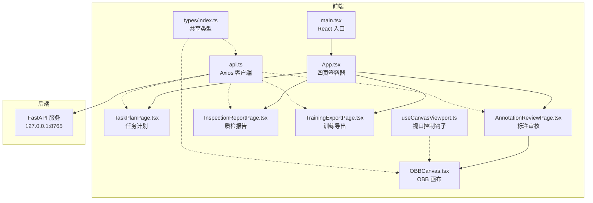
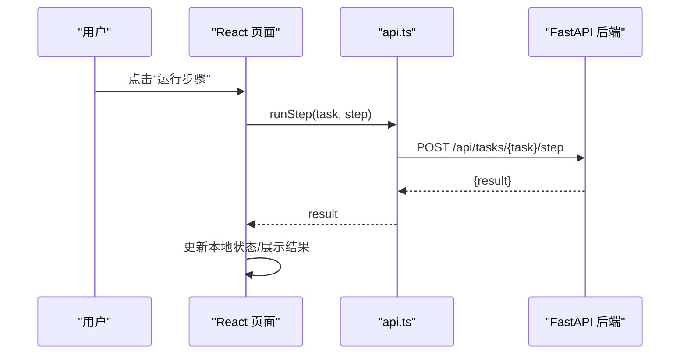
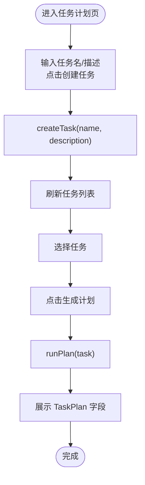
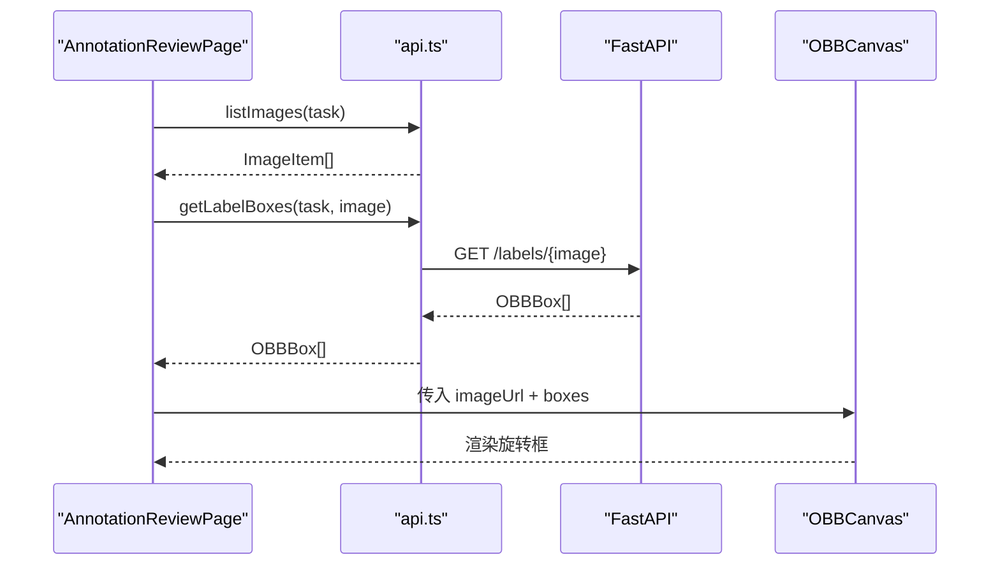
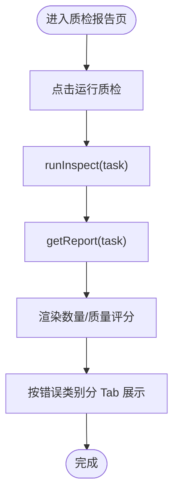
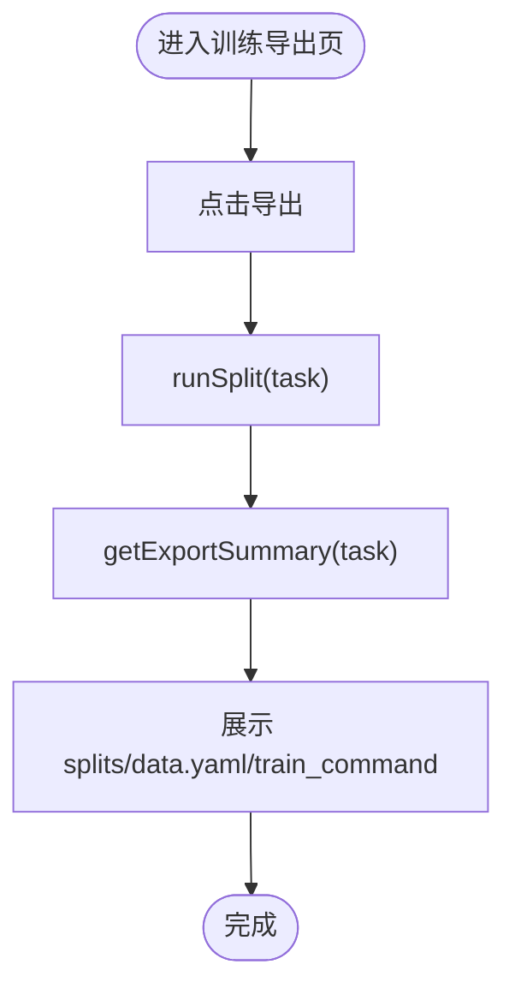
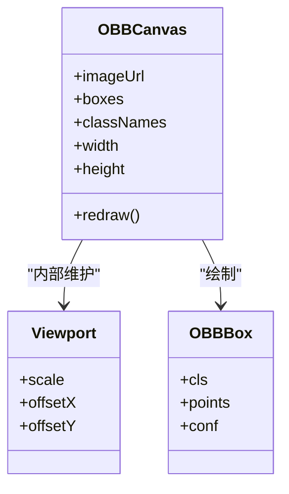
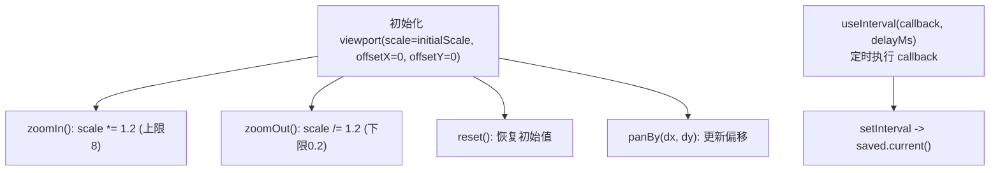
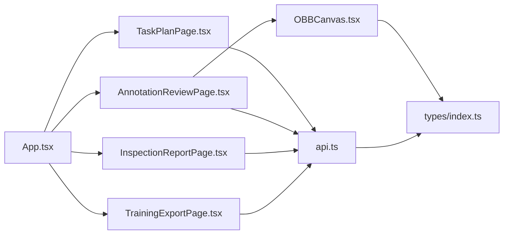

# GUI 桌面应用

<cite>
**本文引用的文件**   
- [App.tsx](file://gui/src/App.tsx)
- [main.tsx](file://gui/src/main.tsx)
- [OBBCanvas.tsx](file://gui/src/components/OBBCanvas.tsx)
- [useCanvasViewport.ts](file://gui/src/hooks/useCanvasViewport.ts)
- [api.ts](file://gui/src/services/api.ts)
- [index.ts](file://gui/src/types/index.ts)
- [TaskPlanPage.tsx](file://gui/src/pages/TaskPlanPage.tsx)
- [AnnotationReviewPage.tsx](file://gui/src/pages/AnnotationReviewPage.tsx)
- [InspectionReportPage.tsx](file://gui/src/pages/InspectionReportPage.tsx)
- [TrainingExportPage.tsx](file://gui/src/pages/TrainingExportPage.tsx)
</cite>

## 目录
1. [简介](#简介)
2. [项目结构](#项目结构)
3. [核心组件](#核心组件)
4. [架构总览](#架构总览)
5. [详细组件分析](#详细组件分析)
6. [依赖关系分析](#依赖关系分析)
7. [性能与体验优化](#性能与体验优化)
8. [故障排查指南](#故障排查指南)
9. [结论](#结论)

## 简介
本 GUI 桌面应用基于 Tauri + React + TypeScript 构建，提供面向 YOLO-OBB 标注与训练的一站式工作流。前端通过 Ant Design 组织四个主要页面：任务计划、标注审核、质检报告、训练导出；后端由 FastAPI 提供服务，Tauri 负责打包为桌面应用。OBB 画布组件实现旋转边界框的可视化、缩放平移交互，并提供可扩展的视口控制钩子，便于后续扩展交互式编辑能力。

## 项目结构
前端采用按功能域组织的目录结构：
- pages：四大业务页面
- components：可复用 UI 组件（如 OBB 画布）
- hooks：通用逻辑封装（如视口控制、定时轮询）
- services：HTTP API 客户端
- types：共享类型定义
- App.tsx：根组件，使用 Tabs 组织四个页面
- main.tsx：React 入口

图表来源
- [App.tsx:1-24](file://gui/src/App.tsx#L1-L24)
- [main.tsx:1-10](file://gui/src/main.tsx#L1-L10)
- [api.ts:1-80](file://gui/src/services/api.ts#L1-L80)
- [index.ts:1-89](file://gui/src/types/index.ts#L1-L89)

章节来源
- [App.tsx:1-24](file://gui/src/App.tsx#L1-L24)
- [main.tsx:1-10](file://gui/src/main.tsx#L1-L10)

## 核心组件
- OBBCanvas：基于 HTML Canvas 渲染图像与旋转边界框，支持滚轮缩放、鼠标拖拽平移。
- useCanvasViewport：提供统一的视口状态（scale、offsetX、offsetY）与缩放、平移、重置方法，并附带一个定时轮询钩子。
- api：Axios 客户端，封装所有后端接口调用，包括任务管理、步骤执行、报告获取、图像与标签查询等。
- 类型定义：集中声明 OBBBox、ImageItem、TaskPlan、InspectionReport、ExportSummary 等数据结构。

章节来源
- [OBBCanvas.tsx:1-136](file://gui/src/components/OBBCanvas.tsx#L1-L136)
- [useCanvasViewport.ts:1-53](file://gui/src/hooks/useCanvasViewport.ts#L1-L53)
- [api.ts:1-80](file://gui/src/services/api.ts#L1-L80)
- [index.ts:1-89](file://gui/src/types/index.ts#L1-L89)

## 架构总览
前端以 React 组件树驱动视图，页面组件通过 api.ts 调用 FastAPI 后端接口，数据模型在 types/index.ts 中统一描述。Tauri 作为宿主环境承载 Web 资源，将前端与 Rust 后端能力结合（当前前端主要依赖 HTTP 接口）。

图表来源
- [api.ts:23-36](file://gui/src/services/api.ts#L23-L36)
- [TaskPlanPage.tsx:40-55](file://gui/src/pages/TaskPlanPage.tsx#L40-L55)
- [AnnotationReviewPage.tsx:42-63](file://gui/src/pages/AnnotationReviewPage.tsx#L42-L63)
- [InspectionReportPage.tsx:42-57](file://gui/src/pages/InspectionReportPage.tsx#L42-L57)
- [TrainingExportPage.tsx:17-32](file://gui/src/pages/TrainingExportPage.tsx#L17-L32)

## 详细组件分析

### 任务计划页（TaskPlanPage）
职责
- 创建任务、选择已有任务、生成训练计划。
- 展示计划关键信息：类别、OBB 规则、置信度阈值、最小缺陷像素、模型配置、数据集划分比例、指标列表。

关键流程
- 创建任务：调用 createTask，成功后刷新任务列表并选中新任务。
- 生成计划：调用 runPlan，返回 TaskPlan 并在 Descriptions 中展示。

图表来源
- [TaskPlanPage.tsx:22-38](file://gui/src/pages/TaskPlanPage.tsx#L22-L38)
- [TaskPlanPage.tsx:40-55](file://gui/src/pages/TaskPlanPage.tsx#L40-L55)
- [api.ts:11-33](file://gui/src/services/api.ts#L11-L33)

章节来源
- [TaskPlanPage.tsx:1-128](file://gui/src/pages/TaskPlanPage.tsx#L1-L128)
- [api.ts:11-33](file://gui/src/services/api.ts#L11-L33)
- [index.ts:26-55](file://gui/src/types/index.ts#L26-L55)

### 标注审核页（AnnotationReviewPage）
职责
- 列出任务与图片，触发自动标注，查看 OBB 标注结果。
- 使用 OBBCanvas 可视化旋转边界框。

关键流程
- 选择任务后加载图片列表，默认选中第一张。
- 根据当前图片名称请求标签框 getLabelBoxes，失败时显示空画布。
- 点击“Run Annotate”执行标注，完成后重新拉取当前图片的 boxes。

图表来源
- [AnnotationReviewPage.tsx:18-40](file://gui/src/pages/AnnotationReviewPage.tsx#L18-L40)
- [api.ts:50-79](file://gui/src/services/api.ts#L50-L79)
- [OBBCanvas.tsx:56-98](file://gui/src/components/OBBCanvas.tsx#L56-L98)

章节来源
- [AnnotationReviewPage.tsx:1-118](file://gui/src/pages/AnnotationReviewPage.tsx#L1-L118)
- [api.ts:50-79](file://gui/src/services/api.ts#L50-L79)
- [index.ts:3-17](file://gui/src/types/index.ts#L3-L17)

### 质检报告页（InspectionReportPage）
职责
- 运行质检步骤，展示质量评分、错误统计与分类明细。

关键流程
- 选择任务后点击“Run Inspect”，调用 runInspect。
- 成功后调用 getReport 获取 InspectionReport，渲染统计卡片与分 Tab 的错误表格。

图表来源
- [InspectionReportPage.tsx:42-57](file://gui/src/pages/InspectionReportPage.tsx#L42-L57)
- [InspectionReportPage.tsx:79-120](file://gui/src/pages/InspectionReportPage.tsx#L79-L120)
- [api.ts:38-42](file://gui/src/services/api.ts#L38-L42)

章节来源
- [InspectionReportPage.tsx:1-124](file://gui/src/pages/InspectionReportPage.tsx#L1-L124)
- [api.ts:38-42](file://gui/src/services/api.ts#L38-L42)
- [index.ts:57-80](file://gui/src/types/index.ts#L57-L80)

### 训练导出页（TrainingExportPage）
职责
- 执行数据集划分与导出，展示 splits 统计、data.yaml 路径与训练命令。

关键流程
- 选择任务后点击“Run Split & Export”，调用 runSplit。
- 成功后调用 getExportSummary 展示导出摘要与训练命令。

图表来源
- [TrainingExportPage.tsx:17-32](file://gui/src/pages/TrainingExportPage.tsx#L17-L32)
- [TrainingExportPage.tsx:54-70](file://gui/src/pages/TrainingExportPage.tsx#L54-L70)
- [api.ts:61-65](file://gui/src/services/api.ts#L61-L65)

章节来源
- [TrainingExportPage.tsx:1-75](file://gui/src/pages/TrainingExportPage.tsx#L1-L75)
- [api.ts:61-65](file://gui/src/services/api.ts#L61-L65)
- [index.ts:82-89](file://gui/src/types/index.ts#L82-L89)

### OBB 画布组件（OBBCanvas）
职责
- 渲染图像与旋转边界框，支持滚轮缩放、鼠标拖拽平移。
- 使用归一化坐标绘制多边形，并根据类别映射颜色与标签。

核心要点
- 图像加载：通过 new Image() 异步加载，设置 crossOrigin 避免跨域问题。
- 视图变换：使用 Canvas 2D 上下文 setTransform 清空并重绘，按 scale 与 offsetX/offsetY 变换绘制图像与框。
- 交互事件：onWheel 调整 scale（限制范围），onMouseDown/move/up/leave 实现拖拽平移。
- 绘制函数：drawBox 根据 points 数组顺序绘制四边形，填充半透明色并描边，同时绘制类别标签。

图表来源
- [OBBCanvas.tsx:8-19](file://gui/src/components/OBBCanvas.tsx#L8-L19)
- [OBBCanvas.tsx:21-53](file://gui/src/components/OBBCanvas.tsx#L21-L53)
- [OBBCanvas.tsx:56-135](file://gui/src/components/OBBCanvas.tsx#L56-L135)
- [index.ts:3-9](file://gui/src/types/index.ts#L3-L9)

章节来源
- [OBBCanvas.tsx:1-136](file://gui/src/components/OBBCanvas.tsx#L1-L136)
- [index.ts:3-9](file://gui/src/types/index.ts#L3-L9)

### 视口控制钩子（useCanvasViewport）
职责
- 提供统一的视口状态与操作方法：zoomIn、zoomOut、reset、panBy。
- 提供 useInterval 钩子用于定时轮询回调。

设计说明
- 使用 useState 管理 viewport，useRef 保持最新值以便在闭包中使用。
- zoomIn/zoomOut 对 scale 进行上下限约束（0.2~8）。
- panBy 增量更新 offsetX/offsetY。
- reset 恢复初始 scale 与偏移。
- useInterval 封装 setInterval/clearInterval，支持动态启用/禁用。

图表来源
- [useCanvasViewport.ts:9-38](file://gui/src/hooks/useCanvasViewport.ts#L9-L38)
- [useCanvasViewport.ts:40-52](file://gui/src/hooks/useCanvasViewport.ts#L40-L52)

章节来源
- [useCanvasViewport.ts:1-53](file://gui/src/hooks/useCanvasViewport.ts#L1-L53)

## 依赖关系分析
- 页面组件依赖 api.ts 提供的函数进行数据获取与操作。
- OBBCanvas 依赖 types/index.ts 中的 OBBBox 类型。
- App.tsx 聚合四个页面组件，作为根布局。
- main.tsx 挂载 React 应用。

图表来源
- [App.tsx:1-24](file://gui/src/App.tsx#L1-L24)
- [api.ts:1-80](file://gui/src/services/api.ts#L1-L80)
- [index.ts:1-89](file://gui/src/types/index.ts#L1-L89)

章节来源
- [App.tsx:1-24](file://gui/src/App.tsx#L1-L24)
- [api.ts:1-80](file://gui/src/services/api.ts#L1-L80)
- [index.ts:1-89](file://gui/src/types/index.ts#L1-L89)

## 性能与体验优化
- 图像加载与重绘
  - 仅在 imageUrl 变化或视图参数变化时重绘，避免不必要的渲染。
  - 建议对频繁变化的 boxes 使用 useMemo 缓存计算结果，减少重复绘制。
- 交互性能
  - 缩放与平移使用 Canvas 原生变换，开销较低；建议在大量标注场景下合并多次 drawBox 调用，减少状态切换。
- 网络请求
  - 合理设置 axios timeout，避免长时间阻塞；对长耗时步骤（plan/annotate/inspect/split）增加进度提示与取消机制。
- 用户体验
  - 在画布上增加工具栏按钮（放大、缩小、复位、平移模式开关），提升可操作性。
  - 为 OBB 框添加悬停高亮与点击选中，便于快速定位与编辑。
- 主题与样式
  - 通过 Ant Design ConfigProvider 定制全局主题色、字号与圆角，确保与品牌一致。
  - 为画布背景与边框提供可配置的主题变量，适配深色模式。

[本节为通用指导，不直接分析具体文件]

## 故障排查指南
- 无法加载图像
  - 检查 imageUrl 是否为绝对地址或可通过 api.imageUrl 转换；确认后端允许跨域访问图像资源。
- 标注为空
  - 若 getLabelBoxes 返回 404，表示尚无标签文件；先执行 runAnnotate 后再查看。
- 步骤执行失败
  - 检查后端是否启动且端口 8765 可达；查看 axios 超时时间是否过短。
- 画布无响应
  - 确认 canvas 宽高已正确设置；检查 onWheel/onMouseDown 等事件是否被其他元素拦截。

章节来源
- [api.ts:56-59](file://gui/src/services/api.ts#L56-L59)
- [AnnotationReviewPage.tsx:32-40](file://gui/src/pages/AnnotationReviewPage.tsx#L32-L40)
- [OBBCanvas.tsx:100-135](file://gui/src/components/OBBCanvas.tsx#L100-L135)

## 结论
该 GUI 桌面应用以清晰的页面分工与可复用的画布组件为核心，结合 Tauri 与 FastAPI 形成完整的数据标注与训练准备流水线。OBB 画布实现了旋转框的可视化与基础交互，视口控制钩子为后续扩展提供了稳定抽象。通过合理的类型定义与 API 封装，前后端通信清晰可控。未来可在画布交互、主题定制与性能优化方面持续增强，以提升标注效率与用户体验。