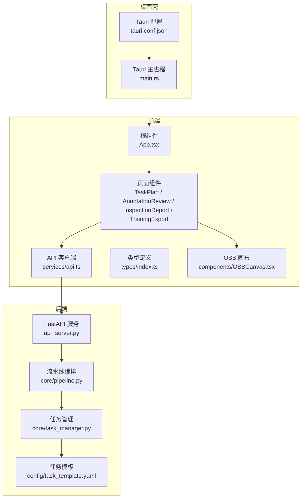
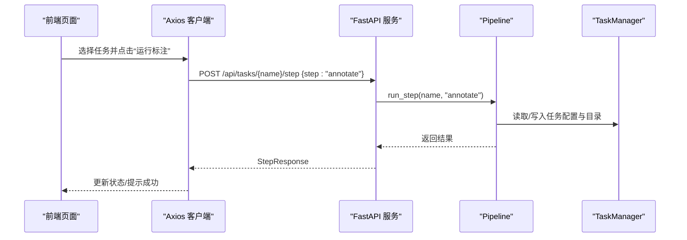
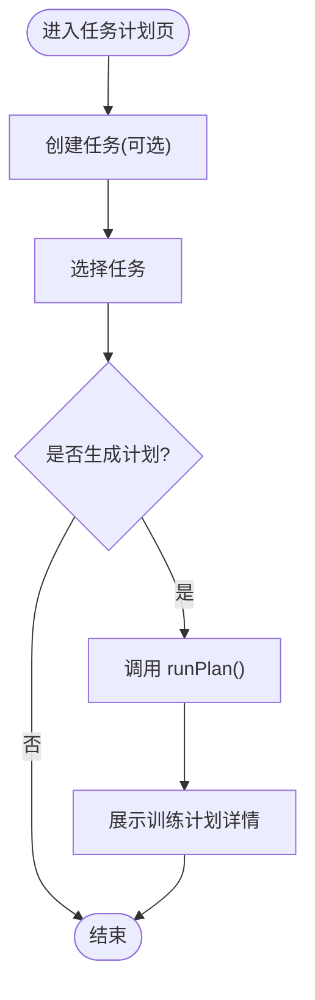
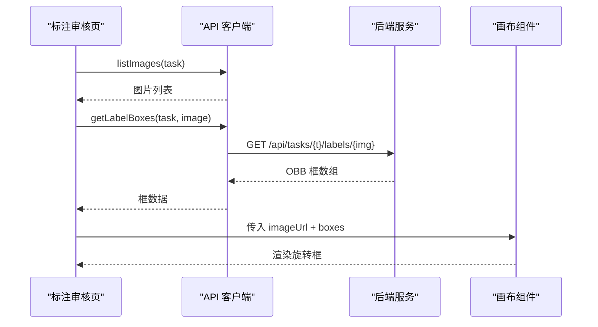
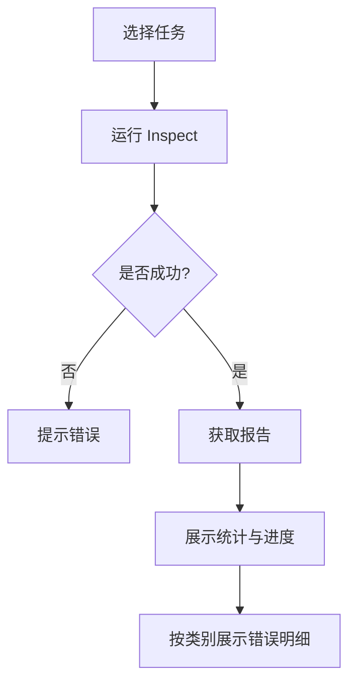
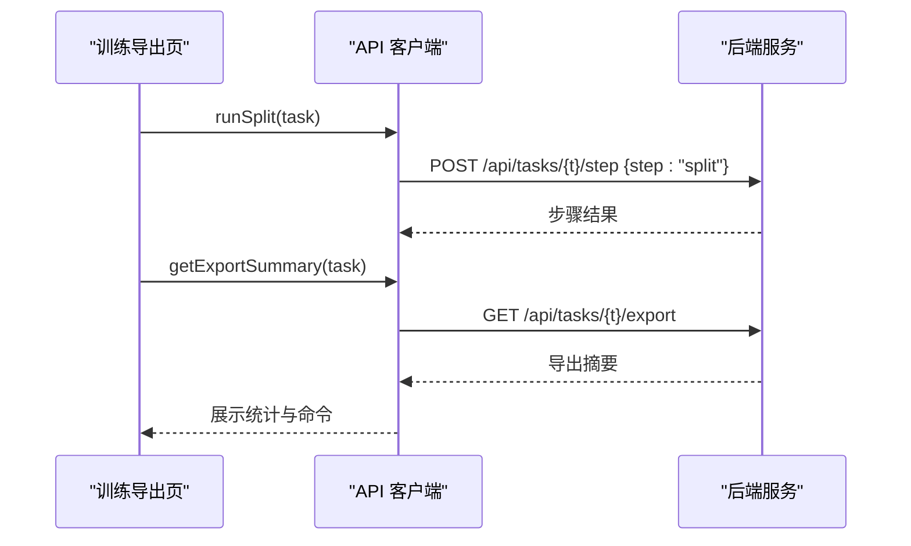
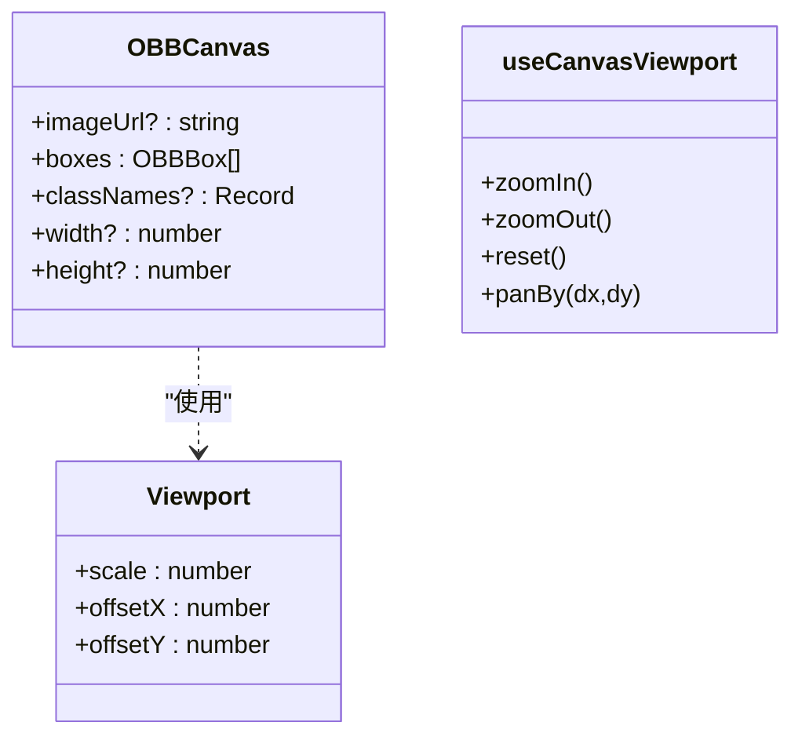
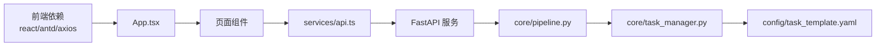

# 应用架构设计

<cite>
**本文引用的文件**
- [App.tsx](file://gui/src/App.tsx)
- [main.tsx](file://gui/src/main.tsx)
- [api.ts](file://gui/src/services/api.ts)
- [index.ts](file://gui/src/types/index.ts)
- [package.json](file://gui/package.json)
- [TaskPlanPage.tsx](file://gui/src/pages/TaskPlanPage.tsx)
- [AnnotationReviewPage.tsx](file://gui/src/pages/AnnotationReviewPage.tsx)
- [InspectionReportPage.tsx](file://gui/src/pages/InspectionReportPage.tsx)
- [TrainingExportPage.tsx](file://gui/src/pages/TrainingExportPage.tsx)
- [OBBCanvas.tsx](file://gui/src/components/OBBCanvas.tsx)
- [useCanvasViewport.ts](file://gui/src/hooks/useCanvasViewport.ts)
- [main.rs](file://gui/src-tauri/src/main.rs)
- [tauri.conf.json](file://gui/src-tauri/tauri.conf.json)
- [api_server.py](file://src/api_server.py)
- [pipeline.py](file://src/core/pipeline.py)
- [task_manager.py](file://src/core/task_manager.py)
- [task_template.yaml](file://config/task_template.yaml)
</cite>

## 目录
1. [简介](#简介)
2. [项目结构](#项目结构)
3. [核心组件](#核心组件)
4. [架构总览](#架构总览)
5. [详细组件分析](#详细组件分析)
6. [依赖关系分析](#依赖关系分析)
7. [性能考虑](#性能考虑)
8. [故障排查指南](#故障排查指南)
9. [结论](#结论)
10. [附录](#附录)

## 简介
本仓库实现了一个基于 Tauri + React + TypeScript 的桌面应用，面向 YOLO-OBB（旋转框）训练数据准备与质量管控。前端通过四个标签页组织工作流：任务计划管理、标注审核、质检报告、训练导出；后端以 FastAPI 提供 HTTP API，封装了任务生命周期管理与流水线执行（计划生成、自动标注、质检检查、数据集拆分导出）。Tauri 仅作为本地桌面壳，负责启动并允许访问本地后端服务。

## 项目结构
- 前端（gui）
  - React + Vite + Ant Design 页面与组件
  - 统一类型定义（types）
  - 统一 API 客户端（services/api.ts）
  - 画布可视化（components/OBBCanvas.tsx）
  - 视图状态 Hook（hooks/useCanvasViewport.ts）
- 后端（src）
  - FastAPI 服务（api_server.py）
  - 流水线编排（core/pipeline.py）
  - 任务管理（core/task_manager.py）
  - 工具与配置（utils/*, config/*）
- 桌面壳（gui/src-tauri）
  - Tauri 入口 main.rs
  - 安全白名单与窗口配置 tauri.conf.json

**图表来源**
- [main.rs:1-9](file://gui/src-tauri/src/main.rs#L1-L9)
- [tauri.conf.json:1-43](file://gui/src-tauri/tauri.conf.json#L1-L43)
- [App.tsx:1-24](file://gui/src/App.tsx#L1-L24)
- [api.ts:1-80](file://gui/src/services/api.ts#L1-L80)
- [api_server.py:1-384](file://src/api_server.py#L1-L384)
- [pipeline.py:1-200](file://src/core/pipeline.py#L1-L200)
- [task_manager.py:1-150](file://src/core/task_manager.py#L1-L150)
- [task_template.yaml:1-54](file://config/task_template.yaml#L1-L54)

**章节来源**
- [App.tsx:1-24](file://gui/src/App.tsx#L1-L24)
- [main.tsx:1-10](file://gui/src/main.tsx#L1-L10)
- [api.ts:1-80](file://gui/src/services/api.ts#L1-L80)
- [api_server.py:1-384](file://src/api_server.py#L1-L384)
- [pipeline.py:1-200](file://src/core/pipeline.py#L1-L200)
- [task_manager.py:1-150](file://src/core/task_manager.py#L1-L150)
- [tauri.conf.json:1-43](file://gui/src-tauri/tauri.conf.json#L1-L43)

## 核心组件
- 路由与布局
  - 使用 Ant Design Tabs 将四大功能模块以标签页形式组织，默认激活“任务与计划”。
  - 根入口由 React 18 createRoot 渲染。
- 状态管理
  - 采用 React 组件内 useState/useEffect 进行局部状态管理，轻量且满足当前场景。
  - 画布缩放平移状态封装在自定义 Hook 中，便于复用。
- 组件组织
  - 页面级组件位于 pages/，每个标签对应一个页面。
  - 通用能力下沉到 components/ 与 hooks/。
  - 类型集中定义于 types/，前后端共享语义。
- 前后端通信
  - 前端通过 axios 封装 API 客户端，统一 baseURL、超时与错误处理。
  - 后端 FastAPI 暴露 RESTful 接口，调用 Pipeline 与 TaskManager 完成业务逻辑。

**章节来源**
- [App.tsx:1-24](file://gui/src/App.tsx#L1-L24)
- [main.tsx:1-10](file://gui/src/main.tsx#L1-L10)
- [index.ts:1-89](file://gui/src/types/index.ts#L1-L89)
- [api.ts:1-80](file://gui/src/services/api.ts#L1-L80)
- [OBBCanvas.tsx:1-136](file://gui/src/components/OBBCanvas.tsx#L1-L136)
- [useCanvasViewport.ts:1-53](file://gui/src/hooks/useCanvasViewport.ts#L1-L53)

## 架构总览
整体为“桌面壳 + Web 前端 + 本地后端”的分层架构：
- 桌面壳：Tauri 启动浏览器窗口，配置安全白名单允许访问本地后端。
- 前端：React + TS 页面与组件，通过 Axios 调用后端 API。
- 后端：FastAPI 提供任务创建、步骤执行、数据读取等接口；内部通过 Pipeline 编排各 Agent，TaskManager 管理任务目录与配置。

**图表来源**
- [api.ts:23-36](file://gui/src/services/api.ts#L23-L36)
- [api_server.py:169-192](file://src/api_server.py#L169-L192)
- [pipeline.py:62-94](file://src/core/pipeline.py#L62-L94)
- [task_manager.py:51-80](file://src/core/task_manager.py#L51-L80)

## 详细组件分析

### 任务计划管理（TaskPlanPage）
- 功能要点
  - 创建任务：输入名称与描述，调用后端创建任务目录与初始配置。
  - 列出任务：下拉选择已有任务。
  - 生成计划：调用 plan 步骤，展示训练计划关键信息（类别、阈值、模型、划分比例等）。
- 数据流
  - 页面调用 listTasks/createTask/runPlan，成功后刷新任务列表或显示计划详情。
- 错误处理
  - 失败时通过 message 提示错误信息；busy 状态控制按钮加载态。

**图表来源**
- [TaskPlanPage.tsx:1-128](file://gui/src/pages/TaskPlanPage.tsx#L1-L128)
- [api.ts:11-48](file://gui/src/services/api.ts#L11-L48)

**章节来源**
- [TaskPlanPage.tsx:1-128](file://gui/src/pages/TaskPlanPage.tsx#L1-L128)
- [api.ts:11-48](file://gui/src/services/api.ts#L11-L48)

### 标注审核（AnnotationReviewPage）
- 功能要点
  - 选择任务后列出图片，支持点击切换当前图片。
  - 一键运行标注，标注完成后从 ai_labels/candidate_labels 读取 OBB 框并在画布上可视化。
  - 画布支持缩放与拖拽平移。
- 数据流
  - 选择任务 -> 获取图片列表 -> 选择图片 -> 获取该图标注框 -> 渲染 OBBCanvas。
- 错误处理
  - 无标注时画布为空；网络或路径错误时捕获并清空框集合。

**图表来源**
- [AnnotationReviewPage.tsx:1-118](file://gui/src/pages/AnnotationReviewPage.tsx#L1-L118)
- [api.ts:50-79](file://gui/src/services/api.ts#L50-L79)
- [api_server.py:315-338](file://src/api_server.py#L315-L338)
- [OBBCanvas.tsx:1-136](file://gui/src/components/OBBCanvas.tsx#L1-L136)

**章节来源**
- [AnnotationReviewPage.tsx:1-118](file://gui/src/pages/AnnotationReviewPage.tsx#L1-L118)
- [api.ts:50-79](file://gui/src/services/api.ts#L50-L79)
- [api_server.py:315-338](file://src/api_server.py#L315-L338)
- [OBBCanvas.tsx:1-136](file://gui/src/components/OBBCanvas.tsx#L1-L136)

### 质检报告（InspectionReportPage）
- 功能要点
  - 选择任务后运行 inspect 步骤，拉取最新质检报告。
  - 展示统计指标（图像数、框数、错误总数、质量分数）与进度条。
  - 按错误类别分 Tab 展示明细表格。
- 数据流
  - runInspect -> getReport -> 渲染统计与错误表。
- 错误处理
  - 未运行或无报告时给出提示信息；异常时提示错误。

**图表来源**
- [InspectionReportPage.tsx:1-124](file://gui/src/pages/InspectionReportPage.tsx#L1-L124)
- [api.ts:38-48](file://gui/src/services/api.ts#L38-L48)
- [api_server.py:221-250](file://src/api_server.py#L221-L250)

**章节来源**
- [InspectionReportPage.tsx:1-124](file://gui/src/pages/InspectionReportPage.tsx#L1-L124)
- [api.ts:38-48](file://gui/src/services/api.ts#L38-L48)
- [api_server.py:221-250](file://src/api_server.py#L221-L250)

### 训练导出（TrainingExportPage）
- 功能要点
  - 选择任务后运行 split 步骤，导出可训练数据集。
  - 展示各划分集数量、data.yaml 路径与可直接运行的训练命令。
- 数据流
  - runSplit -> getExportSummary -> 渲染摘要与命令。
- 错误处理
  - 失败时提示错误；未导出前显示引导信息。

**图表来源**
- [TrainingExportPage.tsx:1-75](file://gui/src/pages/TrainingExportPage.tsx#L1-L75)
- [api.ts:61-65](file://gui/src/services/api.ts#L61-L65)
- [api_server.py:272-288](file://src/api_server.py#L272-L288)

**章节来源**
- [TrainingExportPage.tsx:1-75](file://gui/src/pages/TrainingExportPage.tsx#L1-L75)
- [api.ts:61-65](file://gui/src/services/api.ts#L61-L65)
- [api_server.py:272-288](file://src/api_server.py#L272-L288)

### 画布与视图（OBBCanvas + useCanvasViewport）
- OBBCanvas
  - 基于 HTML5 Canvas 绘制图像与旋转框，支持鼠标滚轮缩放与拖拽平移。
  - 根据类别索引映射颜色，绘制填充与描边，并标注类别名。
- useCanvasViewport
  - 封装缩放、平移、重置等视图操作，提供稳定 ref 避免闭包过期问题。
  - 提供定时轮询 Hook（可用于未来状态同步）。

**图表来源**
- [OBBCanvas.tsx:1-136](file://gui/src/components/OBBCanvas.tsx#L1-L136)
- [useCanvasViewport.ts:1-53](file://gui/src/hooks/useCanvasViewport.ts#L1-L53)

**章节来源**
- [OBBCanvas.tsx:1-136](file://gui/src/components/OBBCanvas.tsx#L1-L136)
- [useCanvasViewport.ts:1-53](file://gui/src/hooks/useCanvasViewport.ts#L1-L53)

## 依赖关系分析
- 前端依赖
  - React 18、Vite、Ant Design、Axios、Tauri API（用于打包与权限配置）。
- 后端依赖
  - FastAPI、Pydantic、Uvicorn；内部依赖 agents、core、utils 模块。
- 运行时依赖
  - Tauri 允许访问 http://127.0.0.1:8765/*，确保前端能调用本地后端。

**图表来源**
- [package.json:1-30](file://gui/package.json#L1-L30)
- [api.ts:1-80](file://gui/src/services/api.ts#L1-L80)
- [api_server.py:1-384](file://src/api_server.py#L1-L384)
- [pipeline.py:1-200](file://src/core/pipeline.py#L1-L200)
- [task_manager.py:1-150](file://src/core/task_manager.py#L1-L150)
- [task_template.yaml:1-54](file://config/task_template.yaml#L1-L54)

**章节来源**
- [package.json:1-30](file://gui/package.json#L1-L30)
- [tauri.conf.json:1-43](file://gui/src-tauri/tauri.conf.json#L1-L43)
- [api_server.py:1-384](file://src/api_server.py#L1-L384)

## 性能考虑
- 前端
  - 大图片渲染：使用 Canvas 按需绘制，结合缩放与平移减少重绘范围。
  - 列表与图片懒加载：仅在选中图片时请求标注框，避免批量请求。
  - 防抖/节流：对频繁交互（如拖拽）可考虑节流以提升流畅度。
- 后端
  - 长耗时步骤（plan/annotate/inspect/split）建议异步化或返回任务 ID 供前端轮询。
  - 文件 I/O 优化：批量复制与写入时使用缓冲与并行策略（注意磁盘 IO 瓶颈）。
  - 日志与监控：记录关键步骤耗时与错误堆栈，便于定位性能热点。
- 网络
  - 合理设置超时与重试策略；对图片资源启用缓存头以减少重复下载。
  - 使用相对路径与后端静态服务，避免跨域与 CORS 开销。

[本节为通用指导，不直接分析具体文件]

## 故障排查指南
- 常见问题
  - 无法连接后端：确认后端已启动在 127.0.0.1:8765，且 Tauri 白名单包含该地址。
  - 任务不存在：创建任务后再执行后续步骤；检查任务目录是否存在 task.yaml。
  - 标注为空：确认 images 目录下有图片，且 ai_labels/candidate_labels 下有对应 txt 文件。
  - 报告缺失：先运行 inspect 步骤，再获取报告。
- 调试建议
  - 查看后端日志：关注 step 执行异常与文件路径错误。
  - 前端控制台：检查 Axios 响应与错误消息。
  - 逐步验证：先调用 list_tasks，再逐个步骤执行，缩小问题范围。

**章节来源**
- [api_server.py:169-192](file://src/api_server.py#L169-L192)
- [api_server.py:234-250](file://src/api_server.py#L234-L250)
- [api_server.py:291-338](file://src/api_server.py#L291-L338)
- [api_server.py:341-377](file://src/api_server.py#L341-L377)

## 结论
本项目采用清晰的“前端页面 + API 客户端 + 后端服务 + 流水线编排”分层架构，通过 Tauri 提供桌面体验，利用 FastAPI 暴露稳定的 HTTP 接口，配合 TaskManager 与 Pipeline 实现任务全生命周期管理。四个功能模块职责明确、数据流转清晰，具备良好的可扩展性与可维护性。后续可引入异步任务、缓存与更丰富的可视化能力，进一步提升用户体验与系统性能。

[本节为总结性内容，不直接分析具体文件]

## 附录
- 技术栈选型说明
  - 前端：React 18 + Vite + Ant Design + Axios，适合快速构建高质量桌面 GUI。
  - 后端：FastAPI + Pydantic，提供高性能异步 API 与强类型校验。
  - 桌面壳：Tauri，轻量、安全，支持本地文件系统与进程集成。
- 最佳实践
  - 统一类型定义：前后端共享 types，降低契约漂移风险。
  - 错误处理：后端抛出明确 HTTP 状态码与详情，前端统一提示。
  - 配置管理：任务模板集中维护，新任务自动继承默认规则。
  - 可观测性：关键步骤记录日志，便于追踪与排障。

[本节为补充信息，不直接分析具体文件]