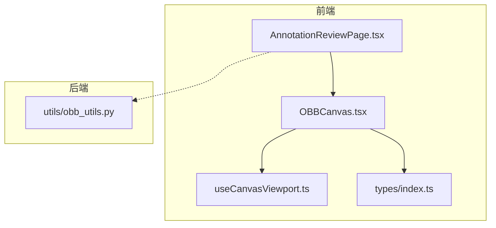
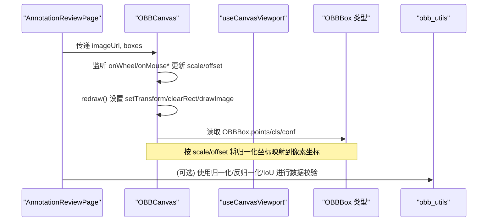
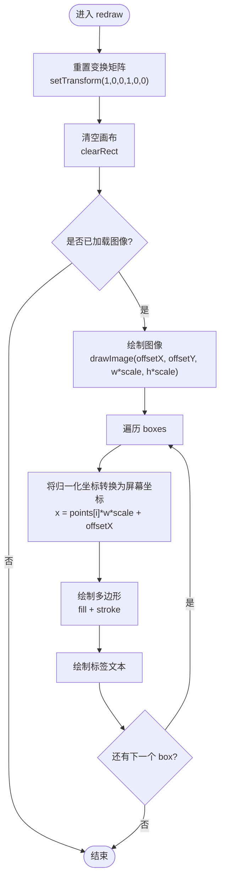
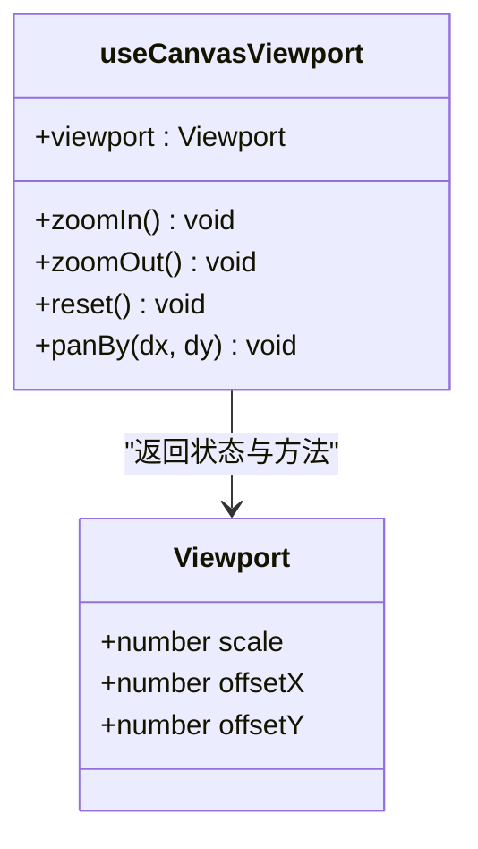
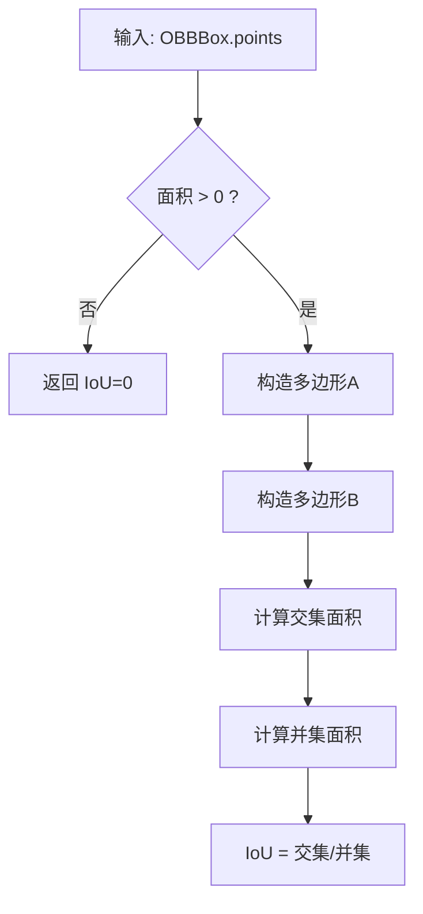
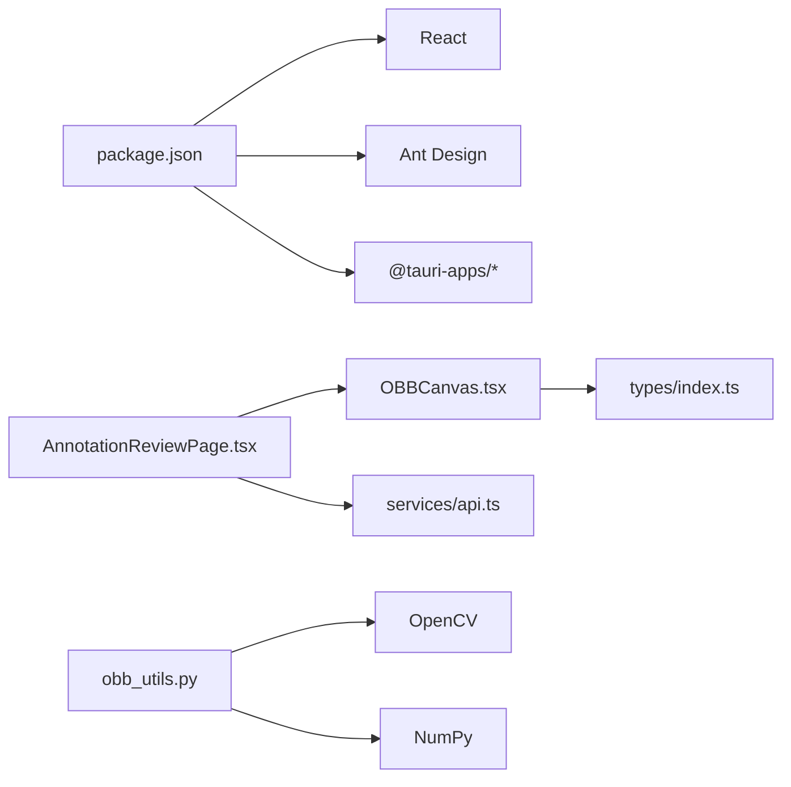

# 画布渲染系统

<cite>
**本文引用的文件**
- [OBBCanvas.tsx](file://gui/src/components/OBBCanvas.tsx)
- [useCanvasViewport.ts](file://gui/src/hooks/useCanvasViewport.ts)
- [obb_utils.py](file://src/utils/obb_utils.py)
- [index.ts](file://gui/src/types/index.ts)
- [AnnotationReviewPage.tsx](file://gui/src/pages/AnnotationReviewPage.tsx)
- [package.json](file://gui/package.json)
</cite>

## 目录
1. [简介](#简介)
2. [项目结构](#项目结构)
3. [核心组件](#核心组件)
4. [架构总览](#架构总览)
5. [详细组件分析](#详细组件分析)
6. [依赖关系分析](#依赖关系分析)
7. [性能考虑](#性能考虑)
8. [故障排查指南](#故障排查指南)
9. [结论](#结论)
10. [附录](#附录)

## 简介
本技术文档围绕画布渲染系统展开，重点解释 OBB（旋转边界框）画布组件的实现原理、坐标变换与绘制算法、图层管理机制；详述视口控制钩子的设计（缩放、平移、选择等交互的数学计算与事件处理）；总结 Canvas API 的使用模式与优化策略（性能、内存、渲染管线）；并提供自定义绘制的扩展指南与常见问题排查方法。

## 项目结构
前端采用 React + TypeScript 构建，核心渲染逻辑集中在 OBBCanvas 组件中，视口状态通过 useCanvasViewport 钩子管理；后端提供 OBB 几何工具函数用于坐标归一化、旋转矩形转换与 IoU 计算。页面层负责数据加载与 UI 编排。

图表来源
- [AnnotationReviewPage.tsx:1-118](file://gui/src/pages/AnnotationReviewPage.tsx#L1-L118)
- [OBBCanvas.tsx:1-136](file://gui/src/components/OBBCanvas.tsx#L1-L136)
- [useCanvasViewport.ts:1-53](file://gui/src/hooks/useCanvasViewport.ts#L1-L53)
- [index.ts:1-89](file://gui/src/types/index.ts#L1-L89)
- [obb_utils.py:1-151](file://src/utils/obb_utils.py#L1-L151)

章节来源
- [AnnotationReviewPage.tsx:1-118](file://gui/src/pages/AnnotationReviewPage.tsx#L1-L118)
- [OBBCanvas.tsx:1-136](file://gui/src/components/OBBCanvas.tsx#L1-L136)
- [useCanvasViewport.ts:1-53](file://gui/src/hooks/useCanvasViewport.ts#L1-L53)
- [index.ts:1-89](file://gui/src/types/index.ts#L1-L89)
- [obb_utils.py:1-151](file://src/utils/obb_utils.py#L1-L151)

## 核心组件
- OBBCanvas：基于 HTMLCanvasElement 的交互式画布，支持鼠标滚轮缩放、拖拽平移，按当前视口绘制图像与 OBB 标注。
- useCanvasViewport：封装视口状态（scale、offsetX、offsetY）及缩放、平移、重置操作，便于在多个组件间复用。
- OBBBox 类型：定义标准化顺时针四点坐标、类别与置信度，贯穿前后端数据结构。
- obb_utils：提供 OBB 几何工具（旋转矩形与四点坐标互转、IoU、坐标归一化/反归一化）。

章节来源
- [OBBCanvas.tsx:1-136](file://gui/src/components/OBBCanvas.tsx#L1-L136)
- [useCanvasViewport.ts:1-53](file://gui/src/hooks/useCanvasViewport.ts#L1-L53)
- [index.ts:1-89](file://gui/src/types/index.ts#L1-L89)
- [obb_utils.py:1-151](file://src/utils/obb_utils.py#L1-L151)

## 架构总览
前端渲染流程：
- AnnotationReviewPage 负责获取任务、图片列表与标注数据，将 imageUrl 与 boxes 传入 OBBCanvas。
- OBBCanvas 内部维护 viewRef（scale、offsetX、offsetY），在 redraw 中设置 Canvas 变换矩阵并绘制图像与 OBB。
- 交互事件（onWheel、onMouseDown/Move/Up）直接更新 viewRef 并触发重绘。
- 可选地，使用 useCanvasViewport 统一管理视口状态，以便跨组件同步。

后端工具：
- obb_utils 提供 OBB 几何计算，供数据处理或校验时使用（如归一化、IoU）。

图表来源
- [AnnotationReviewPage.tsx:1-118](file://gui/src/pages/AnnotationReviewPage.tsx#L1-L118)
- [OBBCanvas.tsx:1-136](file://gui/src/components/OBBCanvas.tsx#L1-L136)
- [useCanvasViewport.ts:1-53](file://gui/src/hooks/useCanvasViewport.ts#L1-L53)
- [index.ts:1-89](file://gui/src/types/index.ts#L1-L89)
- [obb_utils.py:1-151](file://src/utils/obb_utils.py#L1-L151)

## 详细组件分析

### OBBCanvas 组件
- 职责
  - 加载并缓存图像（Image 对象），避免重复请求。
  - 维护视图状态（scale、offsetX、offsetY）与拖拽状态。
  - 在每次重绘时清空画布、应用变换矩阵、绘制图像与 OBB。
- 绘制算法
  - 对每个 OBBBox，将其归一化坐标乘以图像宽高再乘以 scale，并加上 offsetX/OffsetY 得到屏幕坐标。
  - 依次连接四个点形成闭合路径，填充半透明色并描边，同时绘制标签文本。
- 坐标变换
  - 使用 ctx.setTransform(1,0,0,1,0,0) 重置为默认矩阵，确保后续 drawImage 与路径绘制基于当前偏移与缩放。
  - 图像绘制使用 drawImage(img, offsetX, offsetY, img.width*scale, img.height*scale)。
- 交互处理
  - onWheel：以固定系数放大/缩小，限制最小/最大缩放范围。
  - onMouseDown/Move/Up：记录起始位置并在移动过程中累加偏移量实现拖拽平移。
- 图层管理
  - 背景层：深色背景。
  - 图像层：drawImage 绘制原图。
  - 标注层：遍历 boxes 绘制 OBB 与标签。
  - 无显式 z-index 概念，顺序即图层顺序。

图表来源
- [OBBCanvas.tsx:62-79](file://gui/src/components/OBBCanvas.tsx#L62-L79)
- [OBBCanvas.tsx:22-53](file://gui/src/components/OBBCanvas.tsx#L22-L53)

章节来源
- [OBBCanvas.tsx:1-136](file://gui/src/components/OBBCanvas.tsx#L1-L136)

### 视口控制钩子 useCanvasViewport
- 职责
  - 管理 viewport 状态（scale、offsetX、offsetY）。
  - 提供 zoomIn、zoomOut、reset、panBy 等方法。
  - 暴露 useInterval 辅助定时回调。
- 数学与行为
  - 缩放：scale *= 1.2 或 /= 1.2，限制在 [0.2, 8]。
  - 平移：offsetX += dx，offsetY += dy。
  - 重置：恢复初始 scale 与 offset。
- 使用建议
  - 当需要在多个组件共享同一视口状态时，优先使用该钩子。
  - 若仅需局部交互（如单页内），可直接在组件内维护 viewRef。

图表来源
- [useCanvasViewport.ts:1-53](file://gui/src/hooks/useCanvasViewport.ts#L1-L53)

章节来源
- [useCanvasViewport.ts:1-53](file://gui/src/hooks/useCanvasViewport.ts#L1-L53)

### OBB 几何与坐标工具（后端）
- 数据结构
  - OBBBox：包含四点坐标（顺时针）、类别 id、置信度。
- 关键函数
  - four_points_to_rotated_box：将四点转为旋转矩形参数（中心、宽高、角度）。
  - rotated_box_to_four_points：将旋转矩形还原为四点。
  - obb_iou：基于凸多边形交集计算 IoU。
  - normalize_points / denormalize_points：在像素坐标与归一化坐标之间转换。
  - is_coords_in_range：校验坐标是否在 [0,1] 范围内。
- 复杂度
  - IoU 计算涉及凸多边形求交，时间复杂度取决于多边形顶点数（此处为 4），常数级开销。
  - 归一化/反归一化为线性遍历，O(n)。

图表来源
- [obb_utils.py:73-93](file://src/utils/obb_utils.py#L73-L93)

章节来源
- [obb_utils.py:1-151](file://src/utils/obb_utils.py#L1-L151)

### 类型定义与页面集成
- OBBBox 类型：统一前后端数据结构，约定 points 为归一化顺时针四点。
- AnnotationReviewPage：负责从 API 获取任务、图片与标注，并将数据传递给 OBBCanvas。

章节来源
- [index.ts:1-89](file://gui/src/types/index.ts#L1-L89)
- [AnnotationReviewPage.tsx:1-118](file://gui/src/pages/AnnotationReviewPage.tsx#L1-L118)

## 依赖关系分析
- 前端依赖
  - React、TypeScript、Ant Design、Vite、Tauri 相关依赖。
- 模块耦合
  - OBBCanvas 依赖 types/index.ts 中的 OBBBox 类型。
  - AnnotationReviewPage 依赖 OBBCanvas 与 API 服务。
  - useCanvasViewport 独立于具体业务，可被多处复用。
- 外部库
  - 后端使用 OpenCV（cv2）与 NumPy 进行几何计算。

图表来源
- [package.json:1-30](file://gui/package.json#L1-L30)
- [AnnotationReviewPage.tsx:1-118](file://gui/src/pages/AnnotationReviewPage.tsx#L1-L118)
- [OBBCanvas.tsx:1-136](file://gui/src/components/OBBCanvas.tsx#L1-L136)
- [index.ts:1-89](file://gui/src/types/index.ts#L1-L89)
- [obb_utils.py:1-151](file://src/utils/obb_utils.py#L1-L151)

章节来源
- [package.json:1-30](file://gui/package.json#L1-L30)
- [AnnotationReviewPage.tsx:1-118](file://gui/src/pages/AnnotationReviewPage.tsx#L1-L118)
- [OBBCanvas.tsx:1-136](file://gui/src/components/OBBCanvas.tsx#L1-L136)
- [index.ts:1-89](file://gui/src/types/index.ts#L1-L89)
- [obb_utils.py:1-151](file://src/utils/obb_utils.py#L1-L151)

## 性能考虑
- 渲染管线优化
  - 使用 setTransform 重置矩阵后一次性绘制，减少多次变换带来的额外计算。
  - clearRect 仅清空一次，避免重复清屏。
  - 图像绘制使用 drawImage 的缩放参数，避免在 CPU 侧做像素级缩放。
- 内存管理
  - 使用 Image 对象缓存当前图像，避免重复下载与解码。
  - 及时释放不再使用的资源（例如切换图像时清理旧引用）。
- 交互性能
  - 缩放与平移直接修改 viewRef 并触发重绘，避免不必要的状态树更新。
  - 限制缩放范围，防止极端缩放导致绘制成本飙升。
- 批量绘制
  - 遍历 boxes 时尽量保持简单路径绘制，减少 fill/stroke 调用次数。
- 可选优化
  - 对大量标注场景，可引入离屏 Canvas 缓存静态背景或网格。
  - 使用 requestAnimationFrame 平滑动画过渡（如需）。
  - 对超大图像，考虑分块加载与按需绘制可视区域。

[本节为通用性能指导，不直接分析具体代码行]

## 故障排查指南
- 图像未显示
  - 检查 imageUrl 是否正确，crossOrigin 设置是否允许跨域。
  - 确认 Image.onload 回调是否执行并重绘。
- OBB 未绘制或错位
  - 确认 OBBBox.points 是否为归一化顺时针四点。
  - 检查 width/height 与 scale/offset 的计算是否正确。
  - 验证 drawBox 中坐标转换公式与字体大小缩放。
- 交互异常
  - onWheel 是否阻止默认滚动行为。
  - 拖拽时 dragRef 是否正确记录与更新。
  - 缩放范围是否被正确限制。
- 性能问题
  - 大量 boxes 导致卡顿：考虑分页、可视区域裁剪或离屏缓存。
  - 频繁重绘：合并状态更新或使用节流/防抖。
- 后端工具错误
  - 归一化/反归一化时尺寸必须为正数，否则抛出异常。
  - IoU 计算时面积为零需特殊处理。

章节来源
- [OBBCanvas.tsx:62-98](file://gui/src/components/OBBCanvas.tsx#L62-L98)
- [OBBCanvas.tsx:106-133](file://gui/src/components/OBBCanvas.tsx#L106-L133)
- [obb_utils.py:96-151](file://src/utils/obb_utils.py#L96-L151)

## 结论
本画布渲染系统以 OBBCanvas 为核心，结合 useCanvasViewport 提供灵活的视口控制，并通过标准化的 OBBBox 类型与后端几何工具实现一致的标注表示与计算。整体架构清晰、职责分离明确，具备良好的可扩展性与性能基础。针对大规模标注与复杂交互场景，可进一步引入离屏缓存、可视区域裁剪与动画优化等手段。

[本节为总结性内容，不直接分析具体代码行]

## 附录

### 自定义绘制扩展指南
- 新增图层
  - 在 redraw 中按顺序插入新的绘制步骤（如网格、参考线）。
  - 使用统一的坐标变换（scale/offset）保证对齐。
- 自定义标注样式
  - 修改 drawBox 的颜色、线宽、填充透明度与标签位置。
  - 根据 conf 或 cls 动态调整样式。
- 交互增强
  - 在 onMouseDown/Move/Up 中添加选择框、吸附、撤销/重做逻辑。
  - 结合 useCanvasViewport 的 panBy/zoomIn/zoomOut 实现统一交互。
- 性能优化
  - 对静态背景使用离屏 Canvas 缓存。
  - 对大量标注进行可视区域裁剪与增量绘制。

[本节为通用扩展指导，不直接分析具体代码行]