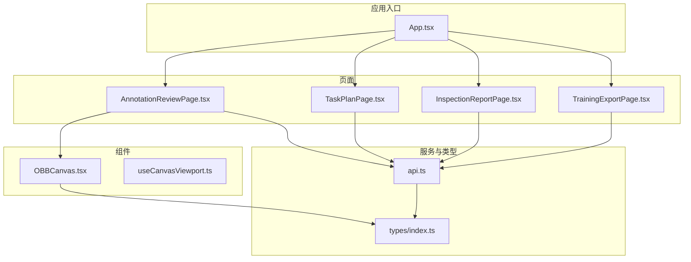
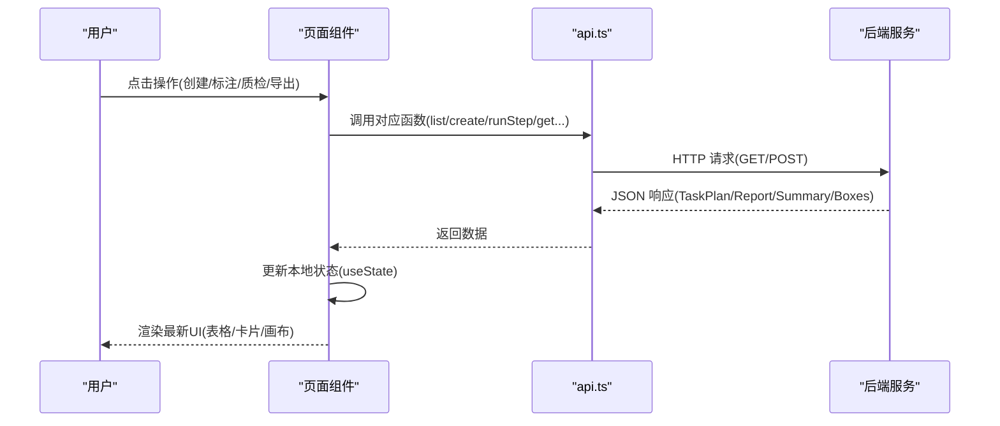
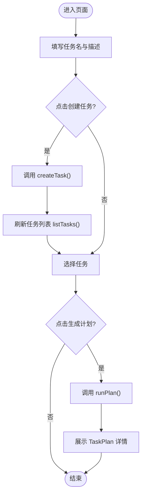
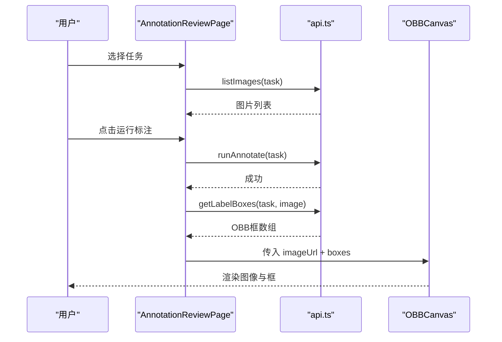
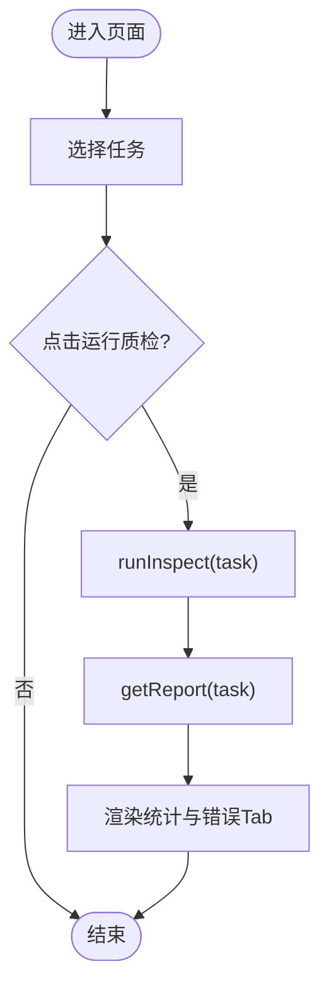
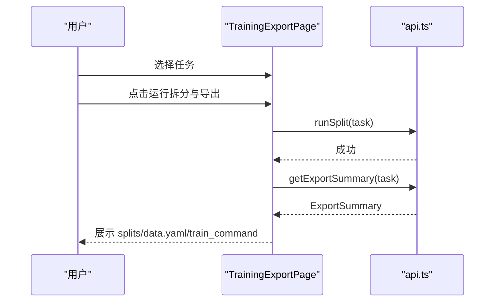
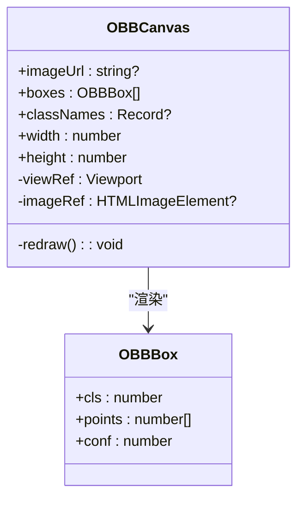
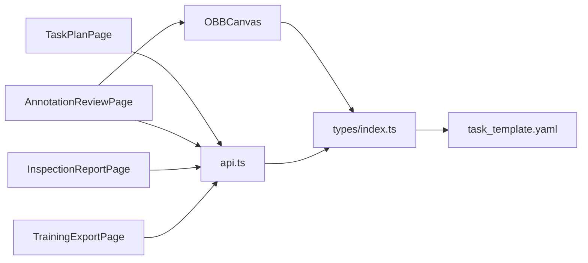

# 页面组件实现

<cite>
**本文引用的文件**
- [App.tsx](file://gui/src/App.tsx)
- [TaskPlanPage.tsx](file://gui/src/pages/TaskPlanPage.tsx)
- [AnnotationReviewPage.tsx](file://gui/src/pages/AnnotationReviewPage.tsx)
- [InspectionReportPage.tsx](file://gui/src/pages/InspectionReportPage.tsx)
- [TrainingExportPage.tsx](file://gui/src/pages/TrainingExportPage.tsx)
- [OBBCanvas.tsx](file://gui/src/components/OBBCanvas.tsx)
- [useCanvasViewport.ts](file://gui/src/hooks/useCanvasViewport.ts)
- [api.ts](file://gui/src/services/api.ts)
- [index.ts](file://gui/src/types/index.ts)
- [task_template.yaml](file://config/task_template.yaml)
- [package.json](file://gui/package.json)
</cite>

## 目录
1. [简介](#简介)
2. [项目结构](#项目结构)
3. [核心组件](#核心组件)
4. [架构总览](#架构总览)
5. [详细组件分析](#详细组件分析)
6. [依赖关系分析](#依赖关系分析)
7. [性能考虑](#性能考虑)
8. [故障排查指南](#故障排查指南)
9. [结论](#结论)
10. [附录](#附录)

## 简介
本仓库提供基于 React + Ant Design 的桌面端 GUI（Tauri 打包），用于 YOLO-OBB 训练计划生成、智能标注与可视化审核、质量检查报告浏览，以及数据集导出。四个核心页面分别承担：
- 任务计划页：创建任务并生成训练计划
- 标注审核页：运行自动标注并在画布上可视化编辑/查看 OBB 框
- 质检报告页：运行质检并展示问题分类与质量评分
- 训练导出页：执行数据集划分并输出可训练的 YOLO-OBB 数据集及命令

每个页面均通过统一的 API 客户端与后端 FastAPI 服务交互，采用 React Hooks 进行状态管理，使用 Ant Design 组件构建 UI，并通过自定义 Canvas 组件完成图像与 OBB 框的渲染。

## 项目结构
前端代码位于 gui/src 下，按功能分层组织：
- pages：四大业务页面
- components：可复用 UI 组件（如 OBBCanvas）
- hooks：通用逻辑封装（如视口缩放平移）
- services：HTTP 请求封装（axios）
- types：共享类型定义
- App.tsx：根组件，以 Tabs 组织四个页面

图表来源
- [App.tsx:1-24](file://gui/src/App.tsx#L1-L24)
- [TaskPlanPage.tsx:1-128](file://gui/src/pages/TaskPlanPage.tsx#L1-L128)
- [AnnotationReviewPage.tsx:1-118](file://gui/src/pages/AnnotationReviewPage.tsx#L1-L118)
- [InspectionReportPage.tsx:1-124](file://gui/src/pages/InspectionReportPage.tsx#L1-L124)
- [TrainingExportPage.tsx:1-75](file://gui/src/pages/TrainingExportPage.tsx#L1-L75)
- [OBBCanvas.tsx:1-136](file://gui/src/components/OBBCanvas.tsx#L1-L136)
- [useCanvasViewport.ts:1-53](file://gui/src/hooks/useCanvasViewport.ts#L1-L53)
- [api.ts:1-80](file://gui/src/services/api.ts#L1-L80)
- [index.ts:1-89](file://gui/src/types/index.ts#L1-L89)

章节来源
- [App.tsx:1-24](file://gui/src/App.tsx#L1-L24)
- [package.json:1-30](file://gui/package.json#L1-L30)

## 核心组件
- 任务计划页：负责创建任务、选择已有任务、调用后端生成训练计划并展示关键配置项（类别、OBB规则、阈值、模型、数据划分比例、指标等）。
- 标注审核页：列出任务下的图片，触发自动标注，加载对应图像的 OBB 框并在画布中显示；支持切换图片、刷新标注结果。
- 质检报告页：触发质检流程，汇总统计（图片数、框数、错误总数、质量分数），并按错误类别分 Tab 展示明细与建议。
- 训练导出页：执行数据集划分，展示各集合数量、生成的 data.yaml 路径与可直接复制的训练命令。
- 画布组件：基于原生 Canvas 绘制图像与 OBB 多边形，支持滚轮缩放与拖拽平移，按类别着色并显示标签。

章节来源
- [TaskPlanPage.tsx:1-128](file://gui/src/pages/TaskPlanPage.tsx#L1-L128)
- [AnnotationReviewPage.tsx:1-118](file://gui/src/pages/AnnotationReviewPage.tsx#L1-L118)
- [InspectionReportPage.tsx:1-124](file://gui/src/pages/InspectionReportPage.tsx#L1-L124)
- [TrainingExportPage.tsx:1-75](file://gui/src/pages/TrainingExportPage.tsx#L1-L75)
- [OBBCanvas.tsx:1-136](file://gui/src/components/OBBCanvas.tsx#L1-L136)

## 架构总览
前端通过 axios 统一访问后端接口，所有页面遵循“选择任务 -> 触发步骤 -> 获取结果 -> 渲染”的流程。类型系统保证前后端数据结构一致，画布组件将二维坐标与视图变换解耦，便于扩展交互能力。

图表来源
- [api.ts:1-80](file://gui/src/services/api.ts#L1-L80)
- [TaskPlanPage.tsx:1-128](file://gui/src/pages/TaskPlanPage.tsx#L1-L128)
- [AnnotationReviewPage.tsx:1-118](file://gui/src/pages/AnnotationReviewPage.tsx#L1-L118)
- [InspectionReportPage.tsx:1-124](file://gui/src/pages/InspectionReportPage.tsx#L1-L124)
- [TrainingExportPage.tsx:1-75](file://gui/src/pages/TrainingExportPage.tsx#L1-L75)

## 详细组件分析

### 任务计划页（TaskPlanPage）
- 功能要点
  - 输入任务名与描述，创建任务
  - 下拉选择已有任务
  - 调用后端生成训练计划，展示类别、OBB 规则、置信度阈值、最小缺陷像素、模型版本、数据划分比例、评估指标等
- 状态管理
  - tasks: 任务列表
  - name/description: 表单输入
  - selected: 当前选中任务
  - plan: 生成的训练计划对象
  - busy: 请求中标志
- 用户交互流程
  - 填写表单 -> 创建任务 -> 刷新任务列表 -> 选择任务 -> 生成计划 -> 展示详情
- 数据绑定方式
  - 受控 Input/Select/Descriptions 与 useState 双向绑定
  - 通过 api.ts 的 createTask/listTasks/runPlan 获取/提交数据
- 样式定制
  - 使用 Ant Design Card/Space/Alert/Spin/Descriptions 组合布局
  - 可通过主题变量或 CSS 覆盖调整间距、边框、字号

图表来源
- [TaskPlanPage.tsx:18-55](file://gui/src/pages/TaskPlanPage.tsx#L18-L55)
- [TaskPlanPage.tsx:57-128](file://gui/src/pages/TaskPlanPage.tsx#L57-L128)
- [api.ts:11-36](file://gui/src/services/api.ts#L11-L36)

章节来源
- [TaskPlanPage.tsx:1-128](file://gui/src/pages/TaskPlanPage.tsx#L1-L128)
- [api.ts:11-36](file://gui/src/services/api.ts#L11-L36)
- [index.ts:26-55](file://gui/src/types/index.ts#L26-L55)
- [task_template.yaml:1-54](file://config/task_template.yaml#L1-L54)

### 标注审核页（AnnotationReviewPage）
- 功能要点
  - 选择任务后列出图片，默认选中第一张
  - 触发自动标注，写入 ai_labels 目录
  - 加载当前图片的 OBB 框并在画布中显示
- 状态管理
  - tasks/selected/images/current/boxes/busy
- 用户交互流程
  - 选择任务 -> 列出图片 -> 可选运行标注 -> 加载标注框 -> 在画布中查看/核对
- 数据绑定方式
  - 通过 listImages/getLabelBoxes/imageUrl 获取图片与标注数据
  - OBBCanvas 接收 imageUrl 与 boxes 渲染
- 样式定制
  - 左侧画布区域固定宽高，右侧图片列表滚动
  - 可使用 Ant Design List/Card/Empty/Alert/Spin 组合布局

图表来源
- [AnnotationReviewPage.tsx:18-63](file://gui/src/pages/AnnotationReviewPage.tsx#L18-L63)
- [AnnotationReviewPage.tsx:65-118](file://gui/src/pages/AnnotationReviewPage.tsx#L65-L118)
- [api.ts:50-79](file://gui/src/services/api.ts#L50-L79)
- [OBBCanvas.tsx:56-99](file://gui/src/components/OBBCanvas.tsx#L56-L99)

章节来源
- [AnnotationReviewPage.tsx:1-118](file://gui/src/pages/AnnotationReviewPage.tsx#L1-L118)
- [api.ts:50-79](file://gui/src/services/api.ts#L50-L79)
- [index.ts:3-17](file://gui/src/types/index.ts#L3-L17)
- [OBBCanvas.tsx:1-136](file://gui/src/components/OBBCanvas.tsx#L1-L136)

### 质检报告页（InspectionReportPage）
- 功能要点
  - 选择任务后运行质检，汇总统计（图片数、框数、错误总数、质量分数）
  - 按错误类别分 Tab 展示明细与建议
- 状态管理
  - tasks/selected/report/busy
- 用户交互流程
  - 选择任务 -> 运行 inspect -> 拉取 report -> 渲染统计与错误表
- 数据绑定方式
  - 通过 runInspect/getReport 获取报告数据
  - 使用 Table/Tabs/Statistic/Progress 展示结构化信息
- 样式定制
  - 顶部统计卡片+进度条，下方按错误类别分 Tab 的表格

图表来源
- [InspectionReportPage.tsx:42-57](file://gui/src/pages/InspectionReportPage.tsx#L42-L57)
- [InspectionReportPage.tsx:59-124](file://gui/src/pages/InspectionReportPage.tsx#L59-L124)
- [api.ts:23-42](file://gui/src/services/api.ts#L23-L42)

章节来源
- [InspectionReportPage.tsx:1-124](file://gui/src/pages/InspectionReportPage.tsx#L1-L124)
- [api.ts:23-42](file://gui/src/services/api.ts#L23-L42)
- [index.ts:57-80](file://gui/src/types/index.ts#L57-L80)

### 训练导出页（TrainingExportPage）
- 功能要点
  - 选择任务后执行 split/export，展示各集合数量、data.yaml 路径与训练命令
- 状态管理
  - tasks/selected/summary/busy
- 用户交互流程
  - 选择任务 -> 运行 split -> 获取 export summary -> 展示结果
- 数据绑定方式
  - 通过 runSplit/getExportSummary 获取导出数据摘要
  - 使用 Statistic/Alert/Typography 展示
- 样式定制
  - 简洁卡片式布局，命令段落支持一键复制

图表来源
- [TrainingExportPage.tsx:17-32](file://gui/src/pages/TrainingExportPage.tsx#L17-L32)
- [TrainingExportPage.tsx:34-75](file://gui/src/pages/TrainingExportPage.tsx#L34-L75)
- [api.ts:61-65](file://gui/src/services/api.ts#L61-L65)

章节来源
- [TrainingExportPage.tsx:1-75](file://gui/src/pages/TrainingExportPage.tsx#L1-L75)
- [api.ts:61-65](file://gui/src/services/api.ts#L61-L65)
- [index.ts:82-88](file://gui/src/types/index.ts#L82-L88)

### 画布组件（OBBCanvas）
- 功能要点
  - 绘制图像与 OBB 多边形，按类别着色，显示标签
  - 支持滚轮缩放（0.2x~8x）与鼠标拖拽平移
- 状态管理
  - 内部使用 useRef 维护 viewRef（scale/offsetX/offsetY）与 imageRef
- 用户交互流程
  - 监听 onWheel/onMouseDown/onMouseMove/onMouseUp/onMouseLeave 更新视图并重绘
- 数据绑定方式
  - props.imageUrl/boxes/classNames/width/height
- 样式定制
  - 背景深色、边框、光标样式；可通过 width/height 控制尺寸
  - 颜色由内置 CLASS_COLORS 决定，可按需扩展

图表来源
- [OBBCanvas.tsx:8-19](file://gui/src/components/OBBCanvas.tsx#L8-L19)
- [OBBCanvas.tsx:21-53](file://gui/src/components/OBBCanvas.tsx#L21-L53)
- [OBBCanvas.tsx:56-136](file://gui/src/components/OBBCanvas.tsx#L56-L136)
- [index.ts:3-9](file://gui/src/types/index.ts#L3-L9)

章节来源
- [OBBCanvas.tsx:1-136](file://gui/src/components/OBBCanvas.tsx#L1-L136)
- [index.ts:3-9](file://gui/src/types/index.ts#L3-L9)

### 概念性概览
以下流程图展示了从“创建任务”到“导出训练数据集”的整体工作流，帮助理解页面间的协作关系。

[此图为概念性流程，不直接映射具体源码文件]

## 依赖关系分析
- 页面与 API
  - 所有页面通过 api.ts 的封装函数与后端通信，避免重复拼接 URL 与处理错误
- 类型与配置
  - types/index.ts 定义了前后端共享的数据结构，确保 TS 编译期校验
  - task_template.yaml 提供任务模板，指导计划生成与质检规则
- 组件复用
  - OBBCanvas 被标注审核页复用，未来可扩展至其他需要图像标注可视化的场景
  - useCanvasViewport 提供通用的视口状态与操作，可用于后续更复杂的画布交互

图表来源
- [api.ts:1-80](file://gui/src/services/api.ts#L1-L80)
- [index.ts:1-89](file://gui/src/types/index.ts#L1-L89)
- [task_template.yaml:1-54](file://config/task_template.yaml#L1-L54)
- [OBBCanvas.tsx:1-136](file://gui/src/components/OBBCanvas.tsx#L1-L136)

章节来源
- [api.ts:1-80](file://gui/src/services/api.ts#L1-L80)
- [index.ts:1-89](file://gui/src/types/index.ts#L1-L89)
- [task_template.yaml:1-54](file://config/task_template.yaml#L1-L54)

## 性能考虑
- 网络请求
  - 使用 axios 设置超时时间，避免长时间阻塞；对耗时步骤（plan/annotate/inspect/split）使用 loading 状态提升体验
- 渲染优化
  - 画布重绘仅在必要时机触发（图片加载完成、视图变化、boxes 变更）
  - 缩放范围限制在 0.2x~8x，防止过度放大导致性能下降
- 内存管理
  - 图片对象通过 ref 缓存，避免重复创建；无 imageUrl 时清空引用并重绘
- 交互体验
  - 列表项高亮当前选中图片，减少视觉干扰
  - 报表统计与进度条直观反馈质量情况

[本节为通用性能建议，不直接分析具体文件]

## 故障排查指南
- 无法加载图片或标注为空
  - 确认已选择任务且图片存在
  - 若标注尚未生成，先运行标注步骤再刷新
  - 检查后端是否返回 404（表示无标注），此时应显示空画布
- 标注结果不显示
  - 检查 imageUrl 是否为绝对地址（api.imageUrl 会补全前缀）
  - 确认 boxes 数组格式符合 OBBBox 定义（归一化顺时针四点）
- 质检报告为空或质量分数异常
  - 确认已运行质检步骤
  - 检查后端是否正确计算 quality_score 与各类别错误
- 导出命令不可用
  - 确认已完成 split/export 步骤
  - 检查 data.yaml 路径与 train_command 是否由后端正确生成
- 开发调试技巧
  - 打开浏览器开发者工具 Network 面板，观察请求与响应
  - 在控制台打印关键状态（selected、images、boxes、report、summary）
  - 逐步验证每一步的后端接口是否正常返回预期数据

章节来源
- [AnnotationReviewPage.tsx:32-40](file://gui/src/pages/AnnotationReviewPage.tsx#L32-L40)
- [api.ts:56-59](file://gui/src/services/api.ts#L56-L59)
- [InspectionReportPage.tsx:42-57](file://gui/src/pages/InspectionReportPage.tsx#L42-L57)
- [TrainingExportPage.tsx:17-32](file://gui/src/pages/TrainingExportPage.tsx#L17-L32)

## 结论
该 GUI 以清晰的页面职责划分与统一的 API 抽象，实现了从任务规划、标注审核、质量检查到数据集导出的完整闭环。通过 React 状态管理与 Ant Design 组件快速构建界面，配合自研画布组件满足 OBB 可视化需求。建议在后续迭代中：
- 引入 useCanvasViewport 统一画布交互逻辑
- 增加撤销/重做、批量编辑标注的能力
- 增强错误提示与重试机制，提升鲁棒性
- 扩展主题与样式定制，适配不同品牌风格

[本节为总结性内容，不直接分析具体文件]

## 附录
- 常用 API 参考
  - 任务管理：listTasks、createTask
  - 步骤执行：runPlan、runAnnotate、runInspect、runSplit
  - 数据获取：getPlan、getReport、listImages、getLabelBoxes、getExportSummary
- 类型说明
  - OBBBox：包含类别、归一化四点坐标、置信度
  - ImageItem：图片名称、URL、尺寸
  - TaskPlan：训练计划各项配置
  - InspectionReport：质检报告结构与质量分数
  - ExportSummary：导出摘要与训练命令
- 配置文件
  - task_template.yaml：任务模板与默认超参、质检规则、评估指标

章节来源
- [api.ts:11-79](file://gui/src/services/api.ts#L11-L79)
- [index.ts:3-88](file://gui/src/types/index.ts#L3-L88)
- [task_template.yaml:1-54](file://config/task_template.yaml#L1-L54)