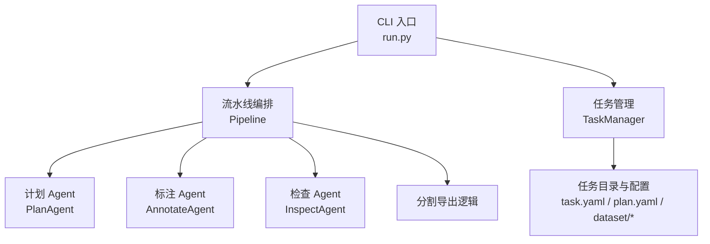
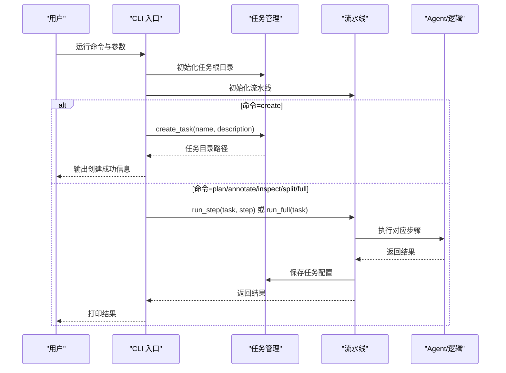
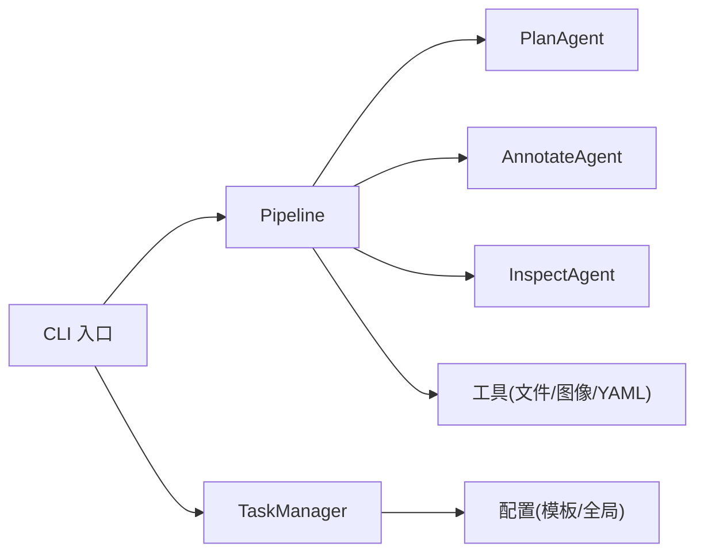

# 命令行接口参考

<cite>
**本文引用的文件**
- [run.py](file://run.py)
- [src/core/pipeline.py](file://src/core/pipeline.py)
- [src/core/task_manager.py](file://src/core/task_manager.py)
- [src/agents/plan_agent.py](file://src/agents/plan_agent.py)
- [src/agents/annotate_agent.py](file://src/agents/annotate_agent.py)
- [src/agents/inspect_agent.py](file://src/agents/inspect_agent.py)
- [config/global.yaml](file://config/global.yaml)
- [config/task_template.yaml](file://config/task_template.yaml)
- [prompts/plan_agent.yaml](file://prompts/plan_agent.yaml)
- [prompts/annotate_agent.yaml](file://prompts/annotate_agent.yaml)
- [prompts/inspect_agent.yaml](file://prompts/inspect_agent.yaml)
- [tests/test_pipeline.py](file://tests/test_pipeline.py)
- [tests/test_task_manager.py](file://tests/test_task_manager.py)
</cite>

## 目录
1. [简介](#简介)
2. [项目结构](#项目结构)
3. [核心组件](#核心组件)
4. [架构总览](#架构总览)
5. [详细命令参考](#详细命令参考)
6. [依赖关系分析](#依赖关系分析)
7. [性能与资源建议](#性能与资源建议)
8. [故障排查指南](#故障排查指南)
9. [结论](#结论)
10. [附录：任务目录结构与输出格式](#附录：任务目录结构与输出格式)

## 简介
本参考文档面向使用 VL-YOLO-Anchor 的 CLI 用户，覆盖全部可用命令、参数说明、示例与输出格式，并解释任务目录结构与常见工作流。CLI 提供创建任务、生成训练计划、智能标注、质量检查、数据集分割以及全流程执行能力，便于快速从原始图像到可训练的 YOLO-OBB 数据集。

## 项目结构
- CLI 入口位于根目录脚本，负责解析参数、初始化任务管理器与流水线，并调度具体步骤。
- 流水线编排包含四个阶段：计划（plan）、标注（annotate）、检查（inspect）、分割导出（split）。
- 任务管理负责创建任务目录、读写任务配置、列举和删除任务。
- 提示词模板位于 prompts 目录，驱动各 Agent 的行为。
- 全局与任务模板配置分别位于 config 目录。

图表来源
- [run.py:20-77](file://run.py#L20-L77)
- [src/core/pipeline.py:22-94](file://src/core/pipeline.py#L22-L94)
- [src/core/task_manager.py:14-122](file://src/core/task_manager.py#L14-L122)

章节来源
- [run.py:20-77](file://run.py#L20-L77)
- [src/core/pipeline.py:22-94](file://src/core/pipeline.py#L22-L94)
- [src/core/task_manager.py:14-122](file://src/core/task_manager.py#L14-L122)

## 核心组件
- CLI 入口：构建参数解析器，注册命令与全局选项；根据命令调用流水线或任务管理。
- 流水线：按顺序执行 plan → annotate → inspect → split，并在每一步后持久化任务配置。
- 任务管理：创建任务目录、写入模板配置、列举/加载/保存任务、删除任务。
- Agent：
  - PlanAgent：基于任务描述生成结构化训练计划，并规范化为统一 schema。
  - AnnotateAgent：对 images 下的每张图片进行 OBB 标注，输出 ai_labels。
  - InspectAgent：校验 ai_labels，输出 candidate_labels 与质量报告。
- 配置：
  - global.yaml：全局模型、推理、路径、服务与日志配置。
  - task_template.yaml：新任务的默认配置模板。

章节来源
- [run.py:20-77](file://run.py#L20-L77)
- [src/core/pipeline.py:22-94](file://src/core/pipeline.py#L22-L94)
- [src/core/task_manager.py:14-122](file://src/core/task_manager.py#L14-L122)
- [src/agents/plan_agent.py:101-138](file://src/agents/plan_agent.py#L101-L138)
- [src/agents/annotate_agent.py:22-80](file://src/agents/annotate_agent.py#L22-L80)
- [src/agents/inspect_agent.py:34-108](file://src/agents/inspect_agent.py#L34-L108)
- [config/global.yaml:1-29](file://config/global.yaml#L1-L29)
- [config/task_template.yaml:1-54](file://config/task_template.yaml#L1-L54)

## 架构总览
CLI 通过 argparse 解析命令与参数，实例化 TaskManager 与 Pipeline，再根据命令分发到对应步骤。每个步骤由相应 Agent 或内部逻辑完成，结果写回任务目录或返回给 CLI。

图表来源
- [run.py:20-77](file://run.py#L20-L77)
- [src/core/pipeline.py:48-94](file://src/core/pipeline.py#L48-L94)
- [src/core/task_manager.py:51-80](file://src/core/task_manager.py#L51-L80)

## 详细命令参考

### 通用参数
- --task：必填，指定任务名称。
- --description：可选，仅在 create 时使用，用于填写任务描述。
- --tasks-root：可选，任务根目录，默认 tasks。
- --log-level：可选，日志级别，默认 INFO。

章节来源
- [run.py:20-36](file://run.py#L20-L36)

### create（创建任务）
- 功能：在任务根目录下创建名为 <task> 的任务目录，并生成初始 task.yaml（基于模板）。
- 参数：
  - --task：任务名（唯一）。
  - --description：任务描述（可选）。
  - --tasks-root：任务根目录（可选）。
- 行为与输出：
  - 若任务已存在，将报错并返回非零退出码。
  - 成功后输出创建的目录路径。
- 示例：
  - uv run python run.py create --task demo --description "光伏板缺陷检测"
- 错误处理：
  - 重复任务名会触发“任务已存在”错误。

章节来源
- [run.py:55-62](file://run.py#L55-L62)
- [src/core/task_manager.py:51-80](file://src/core/task_manager.py#L51-L80)
- [tests/test_task_manager.py:11-28](file://tests/test_task_manager.py#L11-L28)

### plan（生成训练计划）
- 功能：基于任务描述与数据集规模提示，生成结构化训练计划，并保存到 plan.yaml 与任务配置中。
- 参数：--task（必填），其余同上。
- 行为与输出：
  - 生成 classes、annotation_rules、dataset_strategy、model_selection、hyperparameters、inspection_rules、evaluation_metrics 等字段。
  - 输出合并后的 training_plan 摘要。
- 示例：
  - uv run python run.py plan --task demo
- 注意事项：
  - 若未提供真实 LLM 后端，将使用内置占位实现以离线运行。

章节来源
- [run.py:64-73](file://run.py#L64-L73)
- [src/core/pipeline.py:96-122](file://src/core/pipeline.py#L96-L122)
- [src/agents/plan_agent.py:101-138](file://src/agents/plan_agent.py#L101-L138)
- [prompts/plan_agent.yaml:1-27](file://prompts/plan_agent.yaml#L1-L27)

### annotate（智能标注）
- 功能：对 images 下所有图片执行 OBB 标注，输出 ai_labels/*.txt。
- 参数：--task（必填）。
- 行为与输出：
  - 依据 training_plan 中的类别映射、置信度阈值、最小缺陷像素等规则过滤检测结果。
  - 输出写入 ai_labels 目录，返回标注文件路径列表。
- 示例：
  - uv run python run.py annotate --task demo
- 注意事项：
  - 当前默认使用占位推理，确保端到端可运行；可替换为本地 VL 模型。

章节来源
- [run.py:64-73](file://run.py#L64-L73)
- [src/core/pipeline.py:124-137](file://src/core/pipeline.py#L124-L137)
- [src/agents/annotate_agent.py:22-80](file://src/agents/annotate_agent.py#L22-L80)
- [prompts/annotate_agent.yaml:1-25](file://prompts/annotate_agent.yaml#L1-L25)

### inspect（质量检查）
- 功能：校验 ai_labels，识别缺失标签、重复框、类别错误、坐标越界、尺寸异常等，并生成候选修正与质量报告。
- 参数：--task（必填）。
- 行为与输出：
  - 生成 inspection_report.yaml，包含 num_images、num_boxes、errors、quality_score、candidate_dir。
  - 在 candidate_labels 下输出修正后的标签。
- 示例：
  - uv run python run.py inspect --task demo
- 注意事项：
  - 不修改原始 ai_labels，仅输出候选修正。

章节来源
- [run.py:64-73](file://run.py#L64-L73)
- [src/core/pipeline.py:139-153](file://src/core/pipeline.py#L139-L153)
- [src/agents/inspect_agent.py:34-108](file://src/agents/inspect_agent.py#L34-L108)
- [prompts/inspect_agent.yaml:1-31](file://prompts/inspect_agent.yaml#L1-L31)

### split（数据集分割与导出）
- 功能：按训练计划中的比例划分 train/val/test，复制图像与标签，生成 data.yaml 与训练命令。
- 参数：--task（必填）。
- 行为与输出：
  - 输出 dataset/{train,val,test}/images 与 labels。
  - 生成 dataset/data.yaml、dataset/train_command.txt、dataset/export_summary.yaml。
  - 返回导出摘要（含 splits 计数、data.yaml 路径、训练命令）。
- 示例：
  - uv run python run.py split --task demo
- 注意事项：
  - 若无图像，返回空摘要但不崩溃。

章节来源
- [run.py:64-73](file://run.py#L64-L73)
- [src/core/pipeline.py:155-213](file://src/core/pipeline.py#L155-L213)
- [tests/test_pipeline.py:99-103](file://tests/test_pipeline.py#L99-L103)

### full（全流程执行）
- 功能：依次执行 plan → annotate → inspect → split，并汇总每步结果。
- 参数：--task（必填）。
- 行为与输出：
  - 打印每一步的结果摘要。
  - 最终产出包括 plan.yaml、ai_labels、inspection_report.yaml、dataset 包。
- 示例：
  - uv run python run.py full --task demo

章节来源
- [run.py:64-73](file://run.py#L64-L73)
- [src/core/pipeline.py:48-60](file://src/core/pipeline.py#L48-L60)
- [tests/test_pipeline.py:56-97](file://tests/test_pipeline.py#L56-L97)

## 依赖关系分析
- CLI 依赖 Pipeline 与 TaskManager。
- Pipeline 依赖三个 Agent 与工具函数（文件/图像/YAML）。
- TaskManager 依赖 YAML 与文件工具，负责任务生命周期。
- 配置文件影响全局行为（如模型、路径、服务端口、日志级别）。

图表来源
- [run.py:20-77](file://run.py#L20-L77)
- [src/core/pipeline.py:22-94](file://src/core/pipeline.py#L22-L94)
- [src/core/task_manager.py:14-122](file://src/core/task_manager.py#L14-L122)
- [config/global.yaml:1-29](file://config/global.yaml#L1-L29)

章节来源
- [run.py:20-77](file://run.py#L20-L77)
- [src/core/pipeline.py:22-94](file://src/core/pipeline.py#L22-L94)
- [src/core/task_manager.py:14-122](file://src/core/task_manager.py#L14-L122)
- [config/global.yaml:1-29](file://config/global.yaml#L1-L29)

## 性能与资源建议
- 模型与设备：
  - 可通过全局配置设置 VL 模型名称、量化加载、设备选择与显存限制。
  - 推理批大小、置信度阈值、最小缺陷像素等可在全局或任务模板中调整。
- 训练导出：
  - 训练命令由流水线自动生成，包含模型版本、数据路径、超参与设备。
  - 可根据 GPU 显存调整 batch、imgsz 与优化器参数。
- 日志与调试：
  - 通过 --log-level 控制日志级别，便于定位问题。

章节来源
- [config/global.yaml:1-29](file://config/global.yaml#L1-L29)
- [config/task_template.yaml:24-38](file://config/task_template.yaml#L24-L38)
- [src/core/pipeline.py:258-281](file://src/core/pipeline.py#L258-L281)

## 故障排查指南
- 任务不存在：
  - 现象：运行 plan/annotate/inspect/split 时报 FileNotFoundError。
  - 处理：先执行 create 创建任务，或将图像放入 images 目录。
- 任务已存在：
  - 现象：create 时报 FileExistsError。
  - 处理：更换任务名或删除旧任务后再创建。
- 未知步骤：
  - 现象：传入不支持的命令时抛出 ValueError。
  - 处理：仅支持 plan、annotate、inspect、split、full、create。
- 无图像导致分割为空：
  - 现象：split 返回空摘要。
  - 处理：确保 images 目录包含支持的图像格式。
- 标注结果为空或不符合预期：
  - 现象：ai_labels 为空或框数量少。
  - 处理：检查 conf_threshold、min_defect_pixels 与类别映射；必要时替换为真实 VL 后端。
- 质量检查分数低：
  - 现象：inspection_report 中 errors 较多。
  - 处理：查看 candidate_labels 修正建议，必要时人工复核。

章节来源
- [run.py:55-77](file://run.py#L55-L77)
- [src/core/pipeline.py:77-94](file://src/core/pipeline.py#L77-L94)
- [src/core/task_manager.py:51-80](file://src/core/task_manager.py#L51-L80)
- [tests/test_pipeline.py:44-53](file://tests/test_pipeline.py#L44-L53)
- [tests/test_task_manager.py:23-28](file://tests/test_task_manager.py#L23-L28)

## 结论
本 CLI 提供了从任务创建到训练导出的完整闭环，支持离线运行与可扩展的 LLM 后端。通过合理的配置与流程，可快速获得高质量、可直接训练的 YOLO-OBB 数据集。

## 附录：任务目录结构与输出格式
- 任务目录结构（创建后）：
  - task.yaml：任务配置（包含 task 与 training_plan）。
  - images/：输入图像。
  - ai_labels/：AI 生成的 OBB 标签。
  - candidate_labels/：检查阶段的候选修正标签。
  - dataset/：分割导出的训练就绪数据集（包含 train/val/test、data.yaml、train_command.txt、export_summary.yaml）。
- 关键输出：
  - plan.yaml：训练计划（classes、rules、split、model、hyperparameters、inspection、metrics）。
  - inspection_report.yaml：质量报告（num_images、num_boxes、errors、quality_score、candidate_dir）。
  - dataset/data.yaml：YOLO-OBB 数据定义（path、train/val/test、names）。
  - dataset/train_command.txt：可直接运行的训练命令。
  - dataset/export_summary.yaml：导出摘要（splits 计数、data.yaml 路径、训练命令）。

章节来源
- [src/core/task_manager.py:14-24](file://src/core/task_manager.py#L14-L24)
- [src/core/pipeline.py:96-122](file://src/core/pipeline.py#L96-L122)
- [src/core/pipeline.py:139-153](file://src/core/pipeline.py#L139-L153)
- [src/core/pipeline.py:155-213](file://src/core/pipeline.py#L155-L213)
- [config/task_template.yaml:1-54](file://config/task_template.yaml#L1-L54)