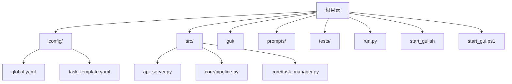
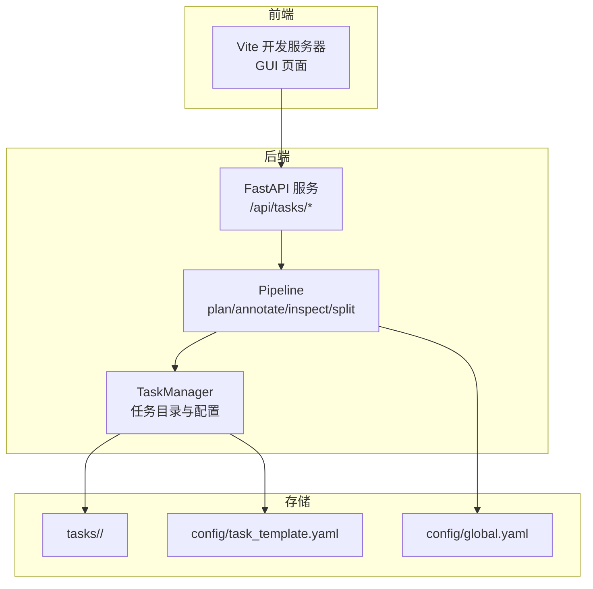
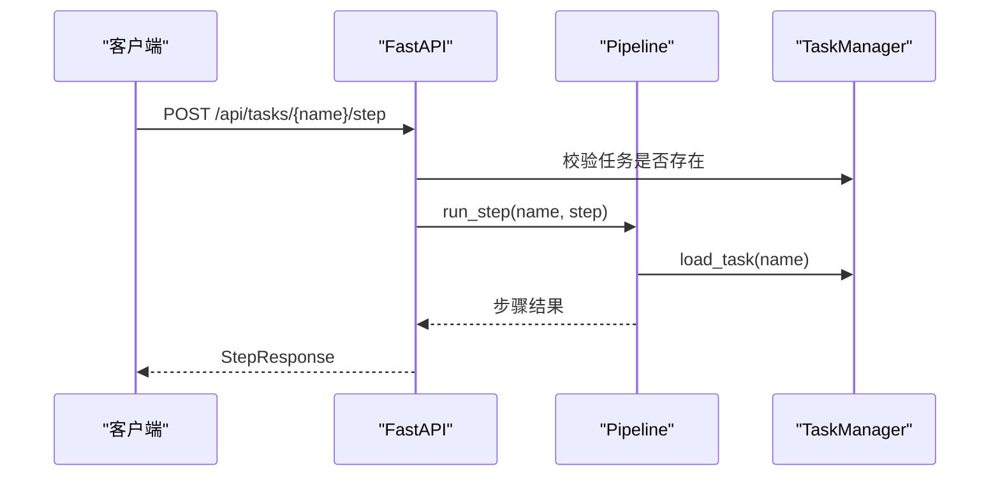
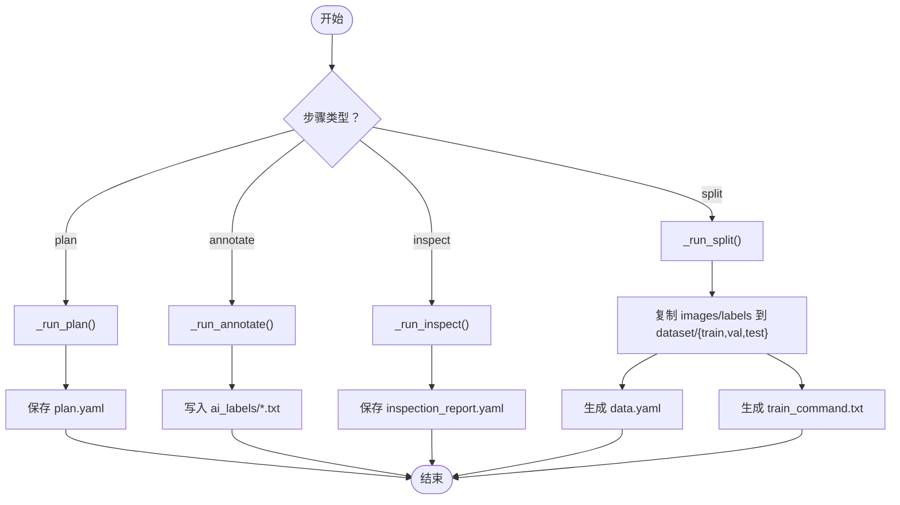
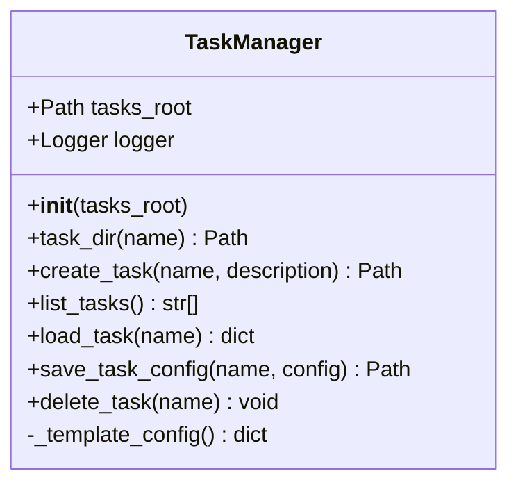
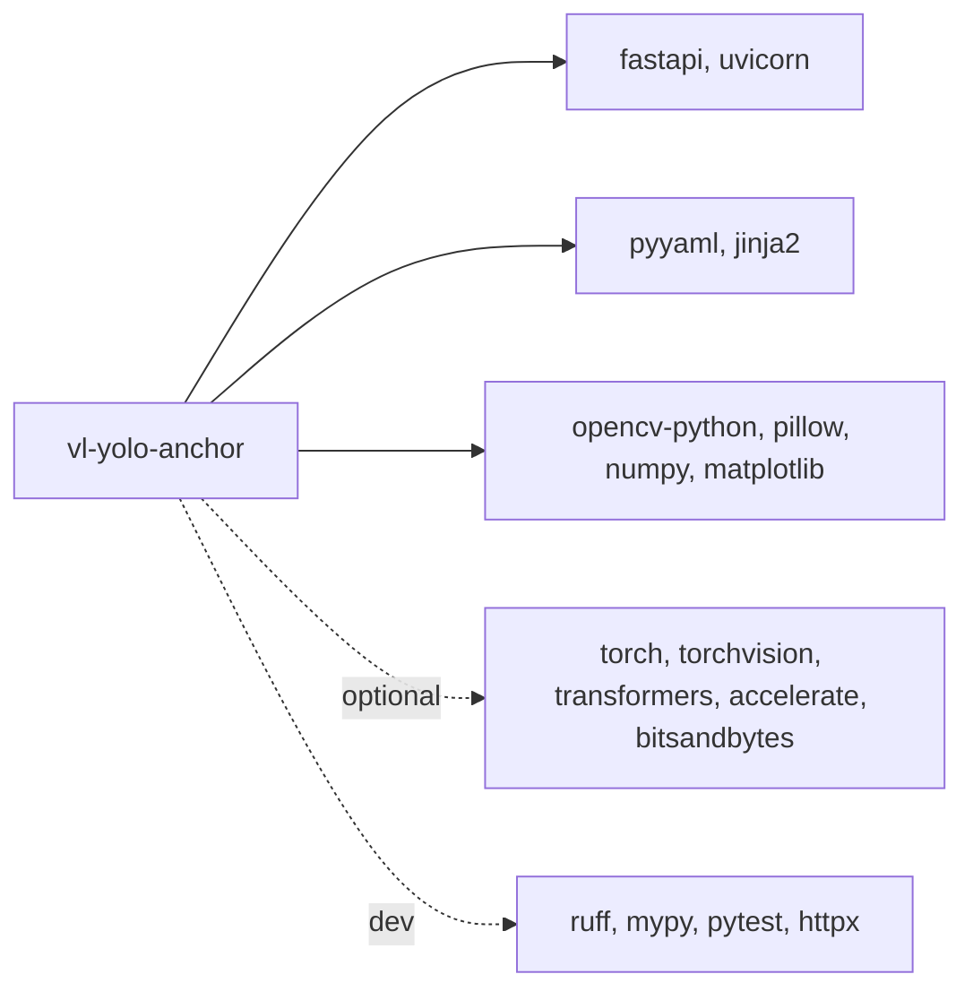

# 安装与配置

<cite>
**本文引用的文件**   
- [config/global.yaml](file://config/global.yaml)
- [config/task_template.yaml](file://config/task_template.yaml)
- [pyproject.toml](file://pyproject.toml)
- [run.py](file://run.py)
- [src/api_server.py](file://src/api_server.py)
- [src/core/pipeline.py](file://src/core/pipeline.py)
- [src/core/task_manager.py](file://src/core/task_manager.py)
- [start_gui.sh](file://start_gui.sh)
- [start_gui.ps1](file://start_gui.ps1)
</cite>

## 目录
1. [简介](#简介)
2. [项目结构](#项目结构)
3. [环境要求与依赖安装](#环境要求与依赖安装)
4. [全局配置 global.yaml](#全局配置-globalyaml)
5. [任务模板 task_template.yaml](#任务模板-task_templateyaml)
6. [启动方式与脚本](#启动方式与脚本)
7. [架构概览](#架构概览)
8. [详细组件分析](#详细组件分析)
9. [依赖关系分析](#依赖关系分析)
10. [性能与部署建议](#性能与部署建议)
11. [故障排除指南](#故障排除指南)
12. [结论](#结论)

## 简介
本仓库提供“多模态 YOLO-OBB 训练计划生成与智能标注平台”。核心能力包括：
- 自动生成训练计划（类别、数据划分、模型与超参推荐）
- 基于视觉语言模型的智能标注
- 标注质量检查与报告
- 数据集切分与导出为 YOLO-OBB 可训练格式
- 通过 FastAPI 暴露 API，配合前端 GUI 使用

本项目使用 Python 3.11+ 与 uv 包管理器管理依赖，支持可选 GPU 加速。

## 项目结构
- config：全局配置与任务模板
- src：后端服务与核心逻辑
- gui：Tauri + Vite 前端应用
- prompts：提示词模板
- tests：单元测试
- run.py：命令行入口
- start_gui.sh / start_gui.ps1：一键启动脚本（Linux/macOS 与 Windows）

**图表来源**
- [run.py:1-82](file://run.py#L1-L82)
- [src/api_server.py:1-384](file://src/api_server.py#L1-L384)
- [src/core/pipeline.py:1-325](file://src/core/pipeline.py#L1-L325)
- [src/core/task_manager.py:1-150](file://src/core/task_manager.py#L1-L150)
- [config/global.yaml:1-29](file://config/global.yaml#L1-L29)
- [config/task_template.yaml:1-54](file://config/task_template.yaml#L1-L54)
- [start_gui.sh:1-40](file://start_gui.sh#L1-L40)
- [start_gui.ps1:1-51](file://start_gui.ps1#L1-L51)

**章节来源**
- [run.py:1-82](file://run.py#L1-L82)
- [src/api_server.py:1-384](file://src/api_server.py#L1-L384)
- [src/core/pipeline.py:1-325](file://src/core/pipeline.py#L1-L325)
- [src/core/task_manager.py:1-150](file://src/core/task_manager.py#L1-L150)
- [config/global.yaml:1-29](file://config/global.yaml#L1-L29)
- [config/task_template.yaml:1-54](file://config/task_template.yaml#L1-L54)
- [start_gui.sh:1-40](file://start_gui.sh#L1-L40)
- [start_gui.ps1:1-51](file://start_gui.ps1#L1-L51)

## 环境要求与依赖安装

### 环境要求
- Python >= 3.11
- uv 包管理器
- Node.js 与 npm（用于 GUI 开发模式）
- 可选：CUDA 驱动与 NVIDIA GPU（启用 GPU 依赖时）

### 基础依赖安装
在项目根目录执行：
- 创建虚拟环境并同步基础依赖：
  - uv venv
  - uv sync
- 验证后端是否可用：
  - uv run uvicorn src.api_server:app --host 127.0.0.1 --port 8765

说明：
- pyproject.toml 定义了基础依赖，包含图像处理、YAML、Web 框架等。
- 默认端口为 8765，监听地址为 127.0.0.1。

**章节来源**
- [pyproject.toml:1-65](file://pyproject.toml#L1-L65)
- [src/api_server.py:1-384](file://src/api_server.py#L1-L384)

### 可选 GPU 支持安装
如需启用 GPU 加速（视觉语言模型推理），安装额外依赖：
- uv sync --extra gpu

说明：
- GPU 依赖包含 PyTorch、Transformers、Accelerate、bitsandbytes 等。
- 在 global.yaml 中设置 device 为 cuda，并根据显存调整 max_gpu_memory_mb。

**章节来源**
- [pyproject.toml:20-27](file://pyproject.toml#L20-L27)
- [config/global.yaml:1-29](file://config/global.yaml#L1-L29)

### 开发依赖安装
如需运行测试、代码检查与类型检查：
- uv sync --extra dev

说明：
- dev 依赖包含 ruff、mypy、pytest、httpx 等。

**章节来源**
- [pyproject.toml:28-33](file://pyproject.toml#L28-L33)

## 全局配置 global.yaml
global.yaml 是平台级配置，控制模型加载、推理参数、路径与服务端口。

### 字段说明
- model
  - vl_model_name：本地或远程视觉语言模型名称（示例使用 Qwen2.5-VL-7B-Instruct）
  - load_in_4bit：是否以 4bit 精度加载模型，降低显存占用
  - device：设备选择 auto | cuda | cpu
  - max_new_tokens：推理最大生成长度
  - max_gpu_memory_mb：GPU 显存上限（MB），用于限制模型加载与推理占用
- inference
  - batch_size：推理批次大小
  - conf_threshold：检测置信度阈值
  - min_defect_pixels：最小缺陷像素面积
  - enable_cpu_fallback：是否启用 CPU 回退
- paths
  - tasks_root：任务根目录
  - prompts_dir：提示词目录
  - config_dir：配置文件目录
- server
  - host：服务监听地址
  - port：服务端口
  - reload：是否开启热重载（开发模式）
- logging
  - level：日志级别
  - dir：日志输出目录

### 常见修改建议
- 生产环境建议将 device 设置为 cuda（有 GPU）或 cpu（无 GPU），并根据显存调整 max_gpu_memory_mb。
- 若需从外部访问服务，将 host 改为 0.0.0.0，并确保防火墙放行端口。
- 开发环境可开启 server.reload 以便快速迭代。

**章节来源**
- [config/global.yaml:1-29](file://config/global.yaml#L1-L29)

## 任务模板 task_template.yaml
task_template.yaml 是新建任务时的默认模板，定义任务元信息、训练计划、数据划分、模型推荐、超参数、质检规则与评估指标。

### 结构与字段
- task
  - name：任务名
  - description：任务描述
  - industry：行业（如光伏、半导体、PCB）
  - modality：模态（如 EL、PL、可见光、红外、X-ray）
- training_plan
  - classes：缺陷类别映射（键为类别 ID，值为类别名）
  - min_defect_pixels：最小缺陷像素面积
  - conf_threshold：置信度阈值
  - exclude_items：排除项列表
  - obb_rule：旋转框标注规则（如 clockwise_normalized）
  - split
    - train_ratio：训练集比例
    - val_ratio：验证集比例
    - test_ratio：测试集比例
    - stratified：是否分层抽样
  - model
    - yolo_version：YOLO-OBB 模型版本（如 yolo11n-obb）
    - imgsz：输入图像尺寸
  - hyperparameters
    - epochs：训练轮数
    - batch：批次大小
    - optimizer：优化器（如 AdamW）
    - lr0：初始学习率
    - weight_decay：权重衰减
    - imgsz：图像尺寸
    - device：训练设备（如 "0"）
  - inspection
    - iou_duplicate_threshold：重复框 IoU 阈值
    - size_outlier_ratio：尺寸异常比例
    - check_missing_labels：检查缺失标签
    - check_duplicate_boxes：检查重复框
    - check_class_errors：检查类别错误
    - check_coords_out_of_range：检查坐标越界
    - check_modality_rule_conflict：检查模态规则冲突
  - metrics：评估指标列表（如 mAP50、mAP50-95、precision、recall）

### 自定义方法
- 复制 task_template.yaml 到具体任务的 task.yaml，并按业务需求修改类别、划分比例、模型与超参。
- 新增行业或模态时，可在 task.task.industry 与 task.task.modality 填写，便于后续分析与筛选。
- 调整 inspection 规则以适配不同场景的质检标准。

**章节来源**
- [config/task_template.yaml:1-54](file://config/task_template.yaml#L1-L54)
- [src/core/task_manager.py:51-80](file://src/core/task_manager.py#L51-L80)

## 启动方式与脚本

### 仅启动后端服务
- 命令：uv run uvicorn src.api_server:app --host 127.0.0.1 --port 8765
- 说明：FastAPI 服务默认监听 127.0.0.1:8765；可通过 global.yaml 的 server.host 与 server.port 调整。

**章节来源**
- [src/api_server.py:1-384](file://src/api_server.py#L1-L384)
- [config/global.yaml:22-25](file://config/global.yaml#L22-L25)

### 启动 GUI（开发模式）
- Linux/macOS：./start_gui.sh [--skip-install]
- Windows：.\start_gui.ps1 [-SkipInstall]

脚本行为：
- 检查 .venv 是否存在，不存在则提示先执行 uv venv 与 uv sync --extra dev
- 后台启动 FastAPI 后端（127.0.0.1:8765）
- 进入 gui 目录，首次运行自动安装 npm 依赖（可跳过）
- 启动 Vite 开发服务器（Ctrl+C 停止前后端）

注意：
- 若已安装依赖，可使用 --skip-install 或 -SkipInstall 跳过 npm install。
- 脚本会捕获进程退出信号，确保后端随前端一起停止。

**章节来源**
- [start_gui.sh:1-40](file://start_gui.sh#L1-L40)
- [start_gui.ps1:1-51](file://start_gui.ps1#L1-L51)

### 命令行工具
- 创建任务：uv run python run.py create --task <name> [--description "<desc>"]
- 单步执行：uv run python run.py plan|annotate|inspect|split --task <name>
- 全流程执行：uv run python run.py full --task <name>

参数说明：
- command：plan、annotate、inspect、split、full、create
- --task：任务名
- --description：任务描述（create 时使用）
- --tasks-root：任务根目录（默认 tasks）
- --log-level：日志级别（默认 INFO）

**章节来源**
- [run.py:1-82](file://run.py#L1-L82)

## 架构概览
系统由前端 GUI、FastAPI 后端、任务管理与流水线编排组成。GUI 通过 HTTP 调用后端 API，后端调度 Pipeline 执行各步骤，TaskManager 负责任务目录与配置读写。

**图表来源**
- [src/api_server.py:1-384](file://src/api_server.py#L1-L384)
- [src/core/pipeline.py:1-325](file://src/core/pipeline.py#L1-L325)
- [src/core/task_manager.py:1-150](file://src/core/task_manager.py#L1-L150)
- [config/global.yaml:1-29](file://config/global.yaml#L1-L29)
- [config/task_template.yaml:1-54](file://config/task_template.yaml#L1-L54)

## 详细组件分析

### API 服务（FastAPI）
职责：
- 暴露任务管理、步骤执行、报告与图片读取等 REST API
- 统一错误处理与响应模型

关键接口：
- GET /api/tasks：列出所有任务
- POST /api/tasks：创建新任务
- POST /api/tasks/{name}/step：执行指定步骤（plan/annotate/inspect/split）
- GET /api/tasks/{name}/report：获取质检报告
- GET /api/tasks/{name}/plan：获取训练计划
- GET /api/tasks/{name}/export：获取数据集导出摘要
- GET /api/tasks/{name}/labels：列出带标签的图片
- GET /api/tasks/{name}/labels/{image}：获取图片的 OBB 框
- GET /api/tasks/{name}/images：列出图片
- GET /api/tasks/{name}/images/{image}：返回图片文件

错误处理：
- 404：任务或资源不存在
- 409：任务已存在
- 500：步骤执行失败

**图表来源**
- [src/api_server.py:169-192](file://src/api_server.py#L169-L192)
- [src/core/pipeline.py:62-94](file://src/core/pipeline.py#L62-L94)
- [src/core/task_manager.py:92-107](file://src/core/task_manager.py#L92-L107)

**章节来源**
- [src/api_server.py:1-384](file://src/api_server.py#L1-L384)

### 流水线（Pipeline）
职责：
- 编排 plan -> annotate -> inspect -> split 四个步骤
- 标准化 LLM 输出的训练计划至 task_template 结构
- 生成 data.yaml 与训练命令

关键流程：
- run_full：依次执行全部步骤
- run_step：根据步骤分发到对应私有方法
- _run_plan：生成并保存 plan.yaml
- _run_annotate：执行标注
- _run_inspect：执行质检并保存 inspection_report.yaml
- _run_split：按策略切分数据集，导出 dataset/data.yaml 与 train_command.txt

**图表来源**
- [src/core/pipeline.py:48-94](file://src/core/pipeline.py#L48-L94)
- [src/core/pipeline.py:96-213](file://src/core/pipeline.py#L96-L213)
- [src/core/pipeline.py:234-281](file://src/core/pipeline.py#L234-L281)

**章节来源**
- [src/core/pipeline.py:1-325](file://src/core/pipeline.py#L1-L325)

### 任务管理（TaskManager）
职责：
- 创建、列出、加载、删除任务
- 初始化任务目录结构（images、ai_labels、candidate_labels、dataset）
- 从 task_template.yaml 生成默认配置

关键点：
- create_task：若同名任务存在则抛出 FileExistsError
- load_task：若 task.yaml 缺失则抛出 FileNotFoundError
- delete_task：删除整个任务目录树

**图表来源**
- [src/core/task_manager.py:14-150](file://src/core/task_manager.py#L14-L150)

**章节来源**
- [src/core/task_manager.py:1-150](file://src/core/task_manager.py#L1-L150)

## 依赖关系分析
- 后端依赖 FastAPI、Uvicorn、Pydantic、Jinja2、OpenCV、NumPy、Pillow、Matplotlib、PyYAML
- GPU 依赖（可选）：torch、torchvision、transformers、accelerate、bitsandbytes
- 开发依赖（可选）：ruff、mypy、pytest、httpx

**图表来源**
- [pyproject.toml:1-65](file://pyproject.toml#L1-L65)

**章节来源**
- [pyproject.toml:1-65](file://pyproject.toml#L1-L65)

## 性能与部署建议

### 开发环境
- 使用 start_gui.sh 或 start_gui.ps1 一键启动前后端
- 开启 server.reload 以便快速迭代
- 使用 dev 依赖进行代码检查与测试

### 生产环境
- 固定 server.host 与 server.port，并通过反向代理（如 Nginx）暴露服务
- 合理设置 model.device 与 max_gpu_memory_mb，避免显存溢出
- 关闭 server.reload，提升稳定性
- 使用 uvicorn 的生产模式（workers、gunicorn）部署后端
- 定期清理 logs 目录与 tasks 中的中间产物

### 推理参数调优
- conf_threshold：提高可减少误检，但可能漏检小目标
- min_defect_pixels：过滤过小噪声区域
- batch_size：根据显存调整，增大可提高吞吐但增加显存压力
- enable_cpu_fallback：在无 GPU 或显存不足时启用 CPU 回退

**章节来源**
- [config/global.yaml:11-15](file://config/global.yaml#L11-L15)
- [src/api_server.py:1-384](file://src/api_server.py#L1-L384)

## 故障排除指南

### 常见问题
- 端口被占用
  - 现象：启动后端时报端口占用
  - 解决：更换 server.port 或释放占用端口
- 任务已存在
  - 现象：创建任务时报 FileExistsError
  - 解决：更换任务名或删除已有任务目录
- 找不到任务或配置
  - 现象：API 返回 404
  - 解决：确认任务已创建且 task.yaml 存在
- 缺少 GPU 依赖
  - 现象：导入 torch/transformers 失败
  - 解决：安装 uv sync --extra gpu
- 前端依赖未安装
  - 现象：GUI 启动时报 npm 相关错误
  - 解决：执行 npm install 或使用脚本的 --skip-install 跳过

### 日志定位
- 查看 logging.dir 指定的日志目录
- 调整 logging.level 为 DEBUG 以获取更详细信息
- 在后端控制台查看 uvicorn 输出

**章节来源**
- [config/global.yaml:27-29](file://config/global.yaml#L27-L29)
- [src/api_server.py:149-192](file://src/api_server.py#L149-L192)
- [src/core/task_manager.py:51-80](file://src/core/task_manager.py#L51-L80)

## 结论
通过本安装与配置文档，您可以完成环境搭建、依赖安装、全局配置与任务模板定制，并使用脚本在不同操作系统下启动 GUI 与后端服务。结合 Pipeline 与 TaskManager 的设计，平台能够高效地完成训练计划生成、智能标注、质检与数据集导出，满足开发与生产环境的多样化需求。