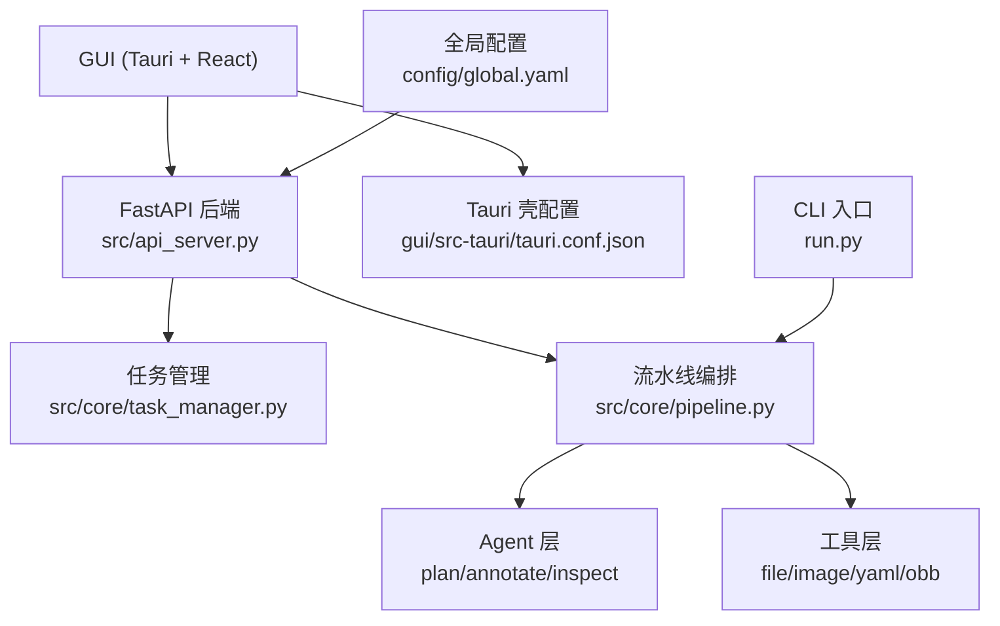
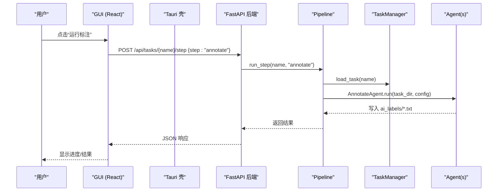
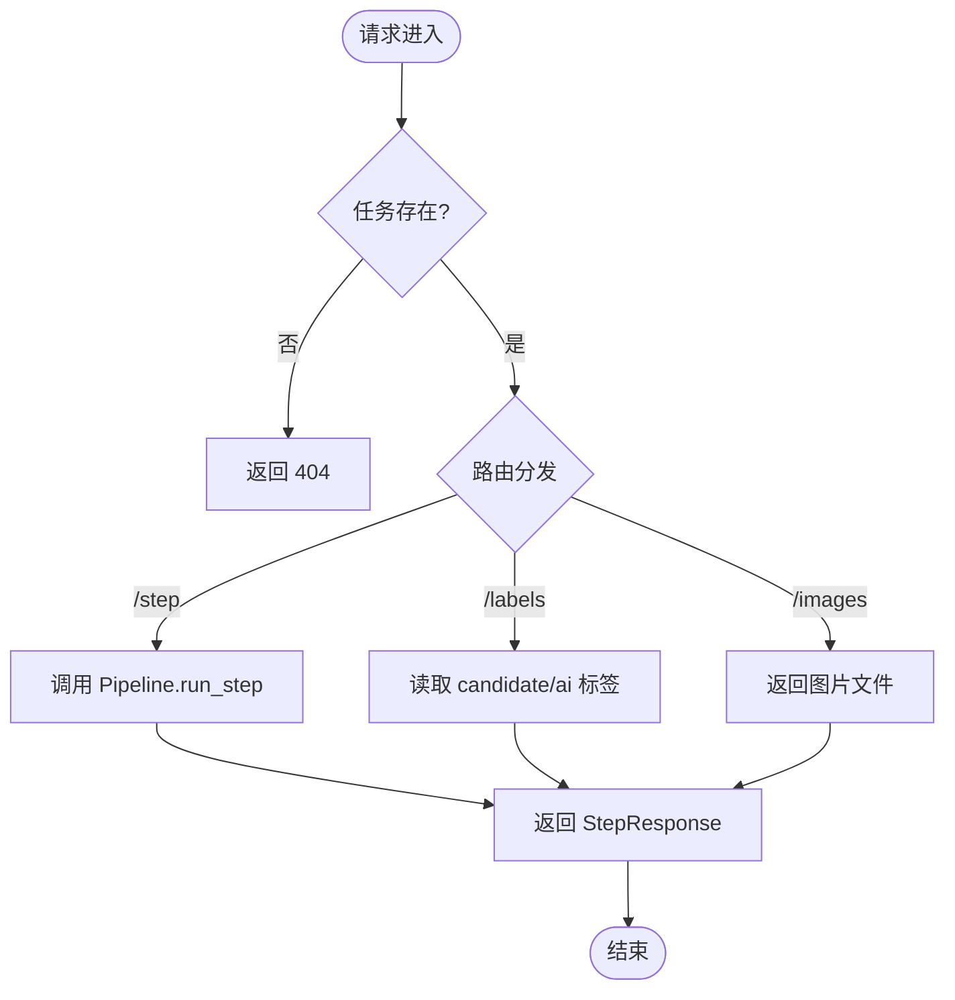
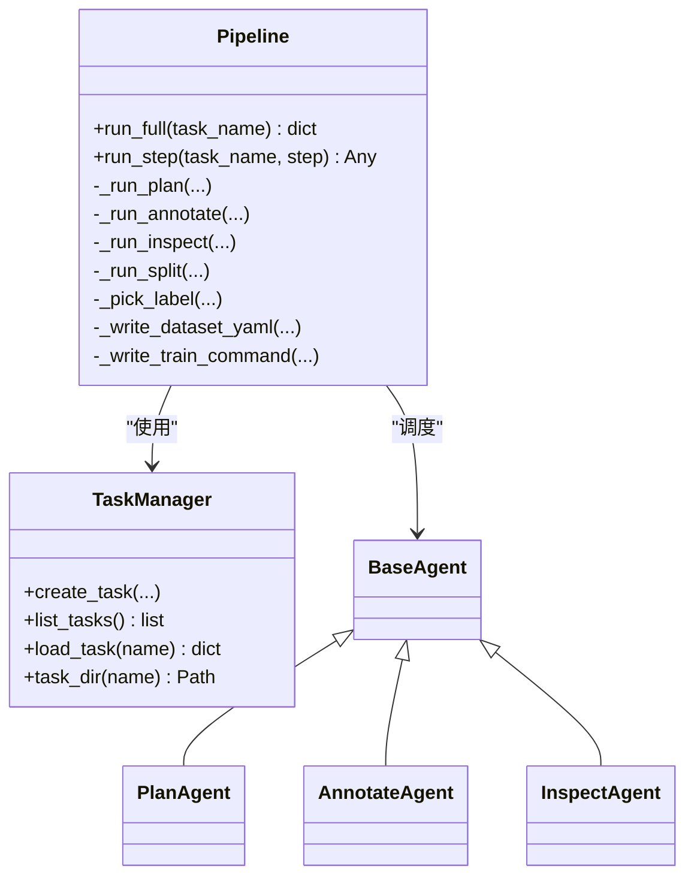
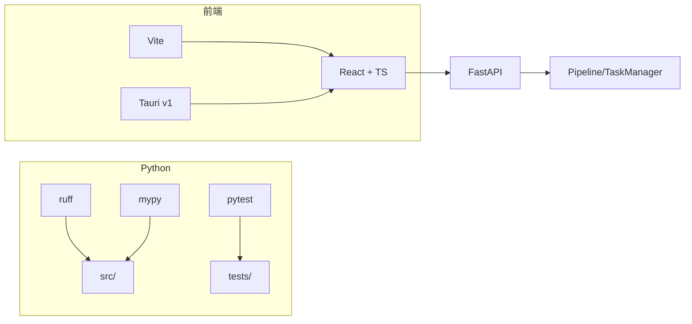

# 开发者指南

<cite>
**本文引用的文件**
- [README.md](file://README.md)
- [CLAUDE.md](file://CLAUDE.md)
- [pyproject.toml](file://pyproject.toml)
- [run.py](file://run.py)
- [src/api_server.py](file://src/api_server.py)
- [src/core/task_manager.py](file://src/core/task_manager.py)
- [src/core/pipeline.py](file://src/core/pipeline.py)
- [config/global.yaml](file://config/global.yaml)
- [specs/README.md](file://specs/README.md)
- [specs/test-suite.spec.md](file://specs/test-suite.spec.md)
- [specs/tauri-shell.spec.md](file://specs/tauri-shell.spec.md)
- [specs/per-image-label-api.spec.md](file://specs/per-image-label-api.spec.md)
- [gui/package.json](file://gui/package.json)
- [gui/src-tauri/tauri.conf.json](file://gui/src-tauri/tauri.conf.json)
- [gui/src-tauri/Cargo.toml](file://gui/src-tauri/Cargo.toml)
- [gui/src/services/api.ts](file://gui/src/services/api.ts)
- [tests/conftest.py](file://tests/conftest.py)
</cite>

## 目录
1. [简介](#简介)
2. [项目结构](#项目结构)
3. [核心组件](#核心组件)
4. [架构总览](#架构总览)
5. [详细组件分析](#详细组件分析)
6. [依赖关系分析](#依赖关系分析)
7. [性能与优化](#性能与优化)
8. [故障排查指南](#故障排查指南)
9. [版本管理与发布流程](#版本管理与发布流程)
10. [社区贡献与问题反馈](#社区贡献与问题反馈)
11. [附录：规范与约定](#附录：规范与约定)

## 简介
本指南面向希望参与 VL-YOLO-Anchor 平台开发与维护的工程师，覆盖代码贡献规范、技术规格体系、新功能开发流程、重构与性能优化最佳实践、调试技巧与工具推荐、版本管理与发布流程，以及社区贡献和问题反馈渠道。平台通过自然语言任务描述生成 YOLO-OBB 训练计划，调用本地视觉语言模型进行自动旋转框标注，执行质检并导出可直接训练的 YOLO-OBB 数据集与命令；前端基于 Tauri + React + TypeScript + Ant Design，后端为 FastAPI。

## 项目结构
仓库采用“功能域 + 分层”组织方式：
- 配置与提示词：config/、prompts/
- 后端核心：src/（agents、core、utils、api_server）
- 前端与桌面壳：gui/（React + Vite + Tauri v1）
- 测试：tests/
- 规格文档：specs/
- CLI 入口：run.py

图表来源
- [src/api_server.py:1-384](file://src/api_server.py#L1-L384)
- [src/core/task_manager.py:1-150](file://src/core/task_manager.py#L1-L150)
- [src/core/pipeline.py:1-325](file://src/core/pipeline.py#L1-L325)
- [gui/src-tauri/tauri.conf.json:1-43](file://gui/src-tauri/tauri.conf.json#L1-L43)
- [config/global.yaml:1-29](file://config/global.yaml#L1-L29)
- [run.py:1-82](file://run.py#L1-L82)

章节来源
- [README.md:16-38](file://README.md#L16-L38)
- [pyproject.toml:1-65](file://pyproject.toml#L1-L65)

## 核心组件
- 任务管理（TaskManager）：负责任务目录创建、列举、加载、删除及模板配置合并。
- 流水线（Pipeline）：编排 plan → annotate → inspect → split/export，输出 data.yaml 与训练命令。
- API 服务（FastAPI）：暴露任务 CRUD、步骤执行、报告与标签读取等接口，供 GUI 调用。
- Agent 层：PlanAgent/AnnotateAgent/InspectAgent，按任务隔离规则，支持占位推理以便离线验证。
- 工具层：图像、OBB、文件与 YAML 工具函数。
- GUI/Tauri：React + AntD 页面与画布，Tauri v1 壳加载本地 Vite 开发服务器。

章节来源
- [src/core/task_manager.py:14-150](file://src/core/task_manager.py#L14-L150)
- [src/core/pipeline.py:22-325](file://src/core/pipeline.py#L22-L325)
- [src/api_server.py:21-384](file://src/api_server.py#L21-L384)
- [gui/package.json:1-30](file://gui/package.json#L1-L30)
- [gui/src-tauri/tauri.conf.json:1-43](file://gui/src-tauri/tauri.conf.json#L1-L43)

## 架构总览
系统由“GUI 前端 + Tauri 壳 + FastAPI 后端 + 任务与流水线 + 工具/Agent”构成。GUI 通过 Axios 调用后端 REST API；后端以 Pydantic 校验请求响应，使用 TaskManager 读写任务数据，通过 Pipeline 调度 Agent 完成标注与质检，最终导出可训练数据集。

图表来源
- [src/api_server.py:169-231](file://src/api_server.py#L169-L231)
- [src/core/pipeline.py:62-153](file://src/core/pipeline.py#L62-L153)
- [src/core/task_manager.py:92-107](file://src/core/task_manager.py#L92-L107)
- [gui/src/services/api.ts:23-36](file://gui/src/services/api.ts#L23-L36)

## 详细组件分析

### API 服务（FastAPI）
- 职责：定义路由、Pydantic 模型、错误处理、图片与标签读取。
- 关键端点：
  - 任务：GET/POST /api/tasks
  - 步骤：POST /api/tasks/{name}/step 及快捷 plan/annotate/inspect
  - 报告/计划/导出：/report、/plan、/export
  - 图片与标签：/images、/labels、/labels/{image}
- 错误策略：任务不存在或资源缺失返回 404；步骤异常捕获后返回 500。

图表来源
- [src/api_server.py:139-384](file://src/api_server.py#L139-L384)

章节来源
- [src/api_server.py:1-384](file://src/api_server.py#L1-L384)
- [specs/per-image-label-api.spec.md:1-38](file://specs/per-image-label-api.spec.md#L1-L38)

### 任务管理（TaskManager）
- 职责：创建任务目录树（images、ai_labels、candidate_labels）、加载/保存 task.yaml、列举/删除任务。
- 模板机制：新建任务时从 config/task_template.yaml 填充默认配置，确保 per-task 规则隔离。

章节来源
- [src/core/task_manager.py:14-150](file://src/core/task_manager.py#L14-L150)

### 流水线（Pipeline）
- 职责：顺序执行 plan → annotate → inspect → split/export；规范化计划；生成 data.yaml 与训练命令。
- 关键点：
  - 每步将 agent.config 设置为当前任务配置，实现规则隔离。
  - split 阶段优先使用 candidate_labels，回退到 ai_labels。
  - 无图片时返回空摘要且不崩溃。

图表来源
- [src/core/pipeline.py:22-325](file://src/core/pipeline.py#L22-L325)
- [src/core/task_manager.py:14-150](file://src/core/task_manager.py#L14-L150)

章节来源
- [src/core/pipeline.py:1-325](file://src/core/pipeline.py#L1-L325)

### GUI 与 Tauri Shell
- GUI：React + AntD + Vite，提供任务与计划、标注审核、质检报告、训练导出四个页面；通过 services/api.ts 调用后端。
- Tauri：v1 壳，devPath 指向 Vite 开发服务器，仅允许访问 http://127.0.0.1:8765/*。

章节来源
- [gui/package.json:1-30](file://gui/package.json#L1-L30)
- [gui/src-tauri/tauri.conf.json:1-43](file://gui/src-tauri/tauri.conf.json#L1-L43)
- [gui/src-tauri/Cargo.toml:1-18](file://gui/src-tauri/Cargo.toml#L1-L18)
- [gui/src/services/api.ts:1-80](file://gui/src/services/api.ts#L1-L80)

### CLI 入口
- 命令：plan/annotate/inspect/split/full/create
- 行为：解析参数，初始化 TaskManager 与 Pipeline，打印各步骤结果。

章节来源
- [run.py:1-82](file://run.py#L1-L82)

## 依赖关系分析
- Python 包管理：uv + pyproject.toml，启用 ruff/mypy/pytest；可选 gpu 扩展用于本地 VL 推理。
- 运行时依赖：OpenCV、PyYAML、NumPy、Pillow、Matplotlib、FastAPI、Uvicorn、Pydantic、Jinja2。
- 前端依赖：React、AntD、Axios、Vite、TypeScript、Tauri CLI。
- 桌面壳：Tauri v1，Rust toolchain 与 crates.io 网络可达。

图表来源
- [pyproject.toml:1-65](file://pyproject.toml#L1-L65)
- [gui/package.json:1-30](file://gui/package.json#L1-L30)
- [gui/src-tauri/Cargo.toml:1-18](file://gui/src-tauri/Cargo.toml#L1-L18)

章节来源
- [pyproject.toml:1-65](file://pyproject.toml#L1-L65)
- [gui/package.json:1-30](file://gui/package.json#L1-L30)

## 性能与优化
- 显存目标：RTX 3060Ti（8GB），VL 模型 4-bit 加载，支持 CPU 回退。
- 推理参数：batch_size=1，conf_threshold=0.25，min_defect_pixels=16，enable_cpu_fallback=true。
- 建议：
  - 在 GPU 可用时优先使用 CUDA；否则自动回退 CPU。
  - 控制 conf_threshold 与 min_defect_pixels 平衡召回与误检。
  - 对大分辨率图像，合理设置 imgsz，避免 OOM。
  - 批量处理时注意磁盘 IO 与临时目录空间。

章节来源
- [config/global.yaml:1-29](file://config/global.yaml#L1-L29)
- [README.md:7-14](file://README.md#L7-L14)

## 故障排查指南
- 常见问题定位：
  - 任务不存在或路径错误：检查 tasks_root 与任务名大小写。
  - 标签未渲染：确认 candidate_labels 优先于 ai_labels；畸形行会被跳过并记录警告。
  - GUI 无法连接后端：确认后端已启动且端口 8765 未被占用；Tauri allowlist 仅放行 127.0.0.1:8765。
  - 构建失败：Tauri 需要 Rust toolchain 与 crates.io 网络；图标缺失会导致打包失败。
- 日志与调试：
  - 后端日志级别可通过 global.yaml 的 logging.level 调整。
  - CLI 支持 --log-level 控制输出。
  - 使用 FastAPI 交互式文档 http://127.0.0.1:8765/docs 快速验证接口。

章节来源
- [src/api_server.py:8-22](file://src/api_server.py#L8-L22)
- [config/global.yaml:27-29](file://config/global.yaml#L27-L29)
- [specs/tauri-shell.spec.md:19-22](file://specs/tauri-shell.spec.md#L19-L22)
- [specs/per-image-label-api.spec.md:24-28](file://specs/per-image-label-api.spec.md#L24-L28)

## 版本管理与发布流程
- 版本信息：
  - Python 包：pyproject.toml 中 name/version。
  - Tauri 应用：gui/src-tauri/tauri.conf.json 与 Cargo.toml 中的 productName/version。
- 发布前检查：
  - 静态检查：ruff check src/ run.py tests/；mypy strict 模式零错误。
  - 单元测试：pytest 全绿。
  - 端到端：GUI 能正常加载后端接口；Tauri dev 窗口可打开。
- 发布产物：
  - 后端：uvicorn 启动脚本或容器镜像。
  - 桌面端：Tauri build 生成的安装包（需满足图标与依赖要求）。

章节来源
- [pyproject.toml:1-10](file://pyproject.toml#L1-L10)
- [gui/src-tauri/tauri.conf.json:1-12](file://gui/src-tauri/tauri.conf.json#L1-L12)
- [gui/src-tauri/Cargo.toml:1-18](file://gui/src-tauri/Cargo.toml#L1-L18)
- [specs/test-suite.spec.md:24-28](file://specs/test-suite.spec.md#L24-L28)

## 社区贡献与问题反馈
- 贡献流程：遵循 Spec-Driven Development（Spec-First → Design → Implement → Verify → Archive）。
- 变更管理：所有变更需在 changes/<id>/ 产出 proposal/design/delta spec/tasks，验收后归档至 specs/。
- 提交规范：
  - 代码风格：Google 风格 docstring、完整类型注解、ruff/mypy 零告警。
  - 提交信息：建议包含变更范围、动机、影响面与关联 spec id。
- 反馈渠道：通过仓库 Issue 提交问题，附上最小复现、日志与环境信息。

章节来源
- [docs/sdd-workflow.md:1-14](file://docs/sdd-workflow.md#L1-L14)
- [specs/README.md:1-8](file://specs/README.md#L1-L8)
- [CLAUDE.md:149-155](file://CLAUDE.md#L149-L155)

## 附录：规范与约定

### 编码风格与质量门禁
- Python：
  - 版本：3.11+，模块顶部 from __future__ import annotations。
  - 类型：全部公开函数/类带类型注解，禁止裸 Any。
  - 文档：Google 风格 docstrings。
  - 工具链：ruff（line-length=120，select E/W/F/I/N/UP/B/SIM）、mypy（strict=true）。
- 前端：
  - TypeScript + Vite + React + AntD。
  - 通过 npm scripts 管理 dev/build/preview。
- 质量门禁：
  - ruff check src/ run.py tests/ 零告警。
  - mypy src/ 零错误。
  - pytest 全绿。

章节来源
- [CLAUDE.md:149-155](file://CLAUDE.md#L149-L155)
- [pyproject.toml:39-65](file://pyproject.toml#L39-L65)
- [gui/package.json:1-30](file://gui/package.json#L1-L30)

### API 规范（后端）
- 基础 URL：http://127.0.0.1:8765
- 主要端点：
  - GET/POST /api/tasks
  - POST /api/tasks/{name}/step（step ∈ {plan, annotate, inspect, split}）
  - POST /api/tasks/{name}/plan | /annotate | /inspect
  - GET /api/tasks/{name}/plan | /report | /export
  - GET /api/tasks/{name}/images | /images/{img}
  - GET /api/tasks/{name}/labels | /labels/{image}
- 标签格式：cls x1 y1 x2 y2 x3 y4 x4 y4（归一化浮点，范围 [0,1]）
- 优先级：candidate_labels 优先于 ai_labels
- 错误码：404（资源缺失）、500（步骤异常）

章节来源
- [src/api_server.py:139-384](file://src/api_server.py#L139-L384)
- [specs/per-image-label-api.spec.md:1-38](file://specs/per-image-label-api.spec.md#L1-L38)

### 测试套件规范
- 运行：uv run pytest（testpaths=["tests"]，pythonpath=["."]）
- 隔离：使用 tmp_path 构造隔离 tasks root，不触碰仓库 tasks/
- 覆盖：
  - 工具：obb_utils、file_utils、yaml_utils
  - 编排：task_manager、pipeline（全流程）
  - API：任务 CRUD、labels 端点、step 执行
- 边界条件：
  - 无图片 split 返回空摘要且不崩溃
  - 零面积 OBB 的 IoU 为 0.0
  - 测试相互独立，单文件可单独运行

章节来源
- [specs/test-suite.spec.md:1-28](file://specs/test-suite.spec.md#L1-L28)
- [tests/conftest.py:1-30](file://tests/conftest.py#L1-L30)

### Tauri Shell 规范
- 版本：Tauri v1（@tauri-apps/cli ^1.6）
- 配置：
  - devPath: http://localhost:5173
  - distDir: ../dist
  - allowlist.http.scope: ["http://127.0.0.1:8765/*"]
  - 窗口标题：VL-YOLO-Anchor，默认 1280×800
- 依赖：Cargo.toml 依赖 tauri = "1"
- 图标：icons 目录需提供多尺寸图标并在 bundle.icon 声明

章节来源
- [specs/tauri-shell.spec.md:1-30](file://specs/tauri-shell.spec.md#L1-L30)
- [gui/src-tauri/tauri.conf.json:1-43](file://gui/src-tauri/tauri.conf.json#L1-L43)
- [gui/src-tauri/Cargo.toml:1-18](file://gui/src-tauri/Cargo.toml#L1-L18)

### 新功能开发指导流程
- 需求分析：明确 why/what/impact，形成 proposal。
- 设计文档：产出 design.md、delta spec（五要素：功能描述、输入约束、输出约束、边界条件、验收标准）、tasks。
- 实现步骤：严格按 spec 实现，不得在 spec 外定义接口签名或数据结构。
- 测试验证：对照验收标准编写/更新测试，确保 ruff/mypy/pytest 全绿。
- 归档：将 delta spec 合并入 specs/，清理 changes/<id>/。

章节来源
- [docs/sdd-workflow.md:1-14](file://docs/sdd-workflow.md#L1-L14)
- [specs/README.md:1-8](file://specs/README.md#L1-L8)

### 调试技巧与开发工具
- 后端：
  - 使用 uvicorn 启动，并通过 /docs 查看接口定义。
  - 调整 logging.level 提升日志粒度。
- 前端：
  - 使用 Vite dev server 热重载；浏览器 DevTools 观察网络请求。
  - 通过 gui/src/services/api.ts 集中管理请求与 baseURL。
- Tauri：
  - 使用 npm run tauri dev 启动桌面壳；确保 Rust toolchain 可用。
- 通用：
  - 使用 pytest fixtures 构造隔离环境（如 conftest.py 中的 make_image）。

章节来源
- [src/api_server.py:380-384](file://src/api_server.py#L380-L384)
- [config/global.yaml:27-29](file://config/global.yaml#L27-L29)
- [gui/src/services/api.ts:1-10](file://gui/src/services/api.ts#L1-L10)
- [tests/conftest.py:12-29](file://tests/conftest.py#L12-L29)