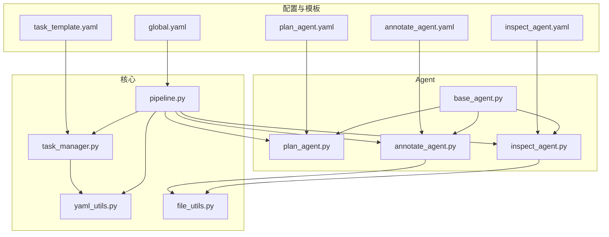
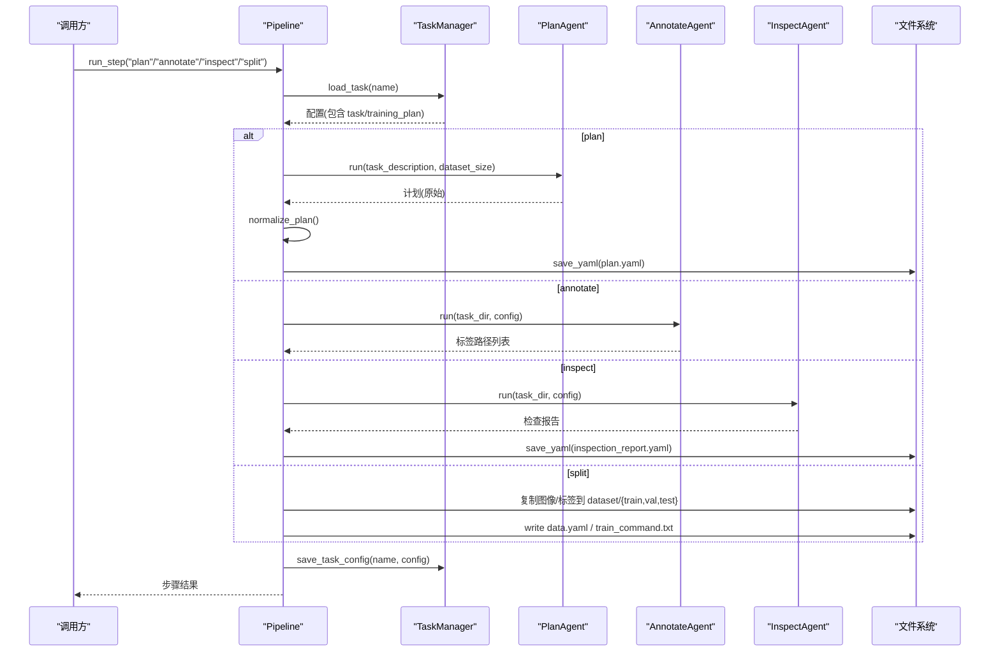
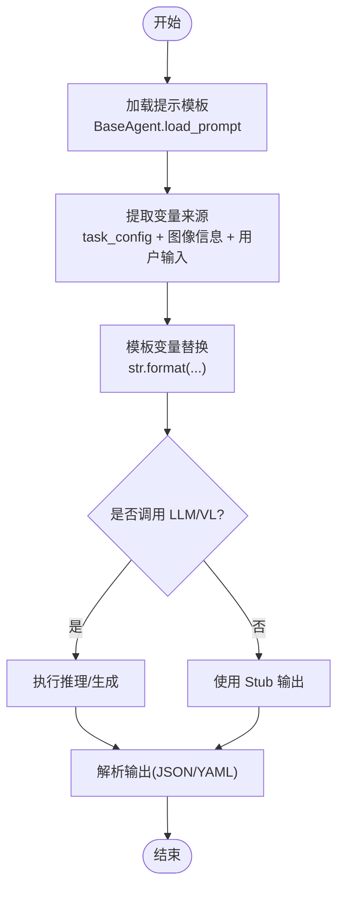
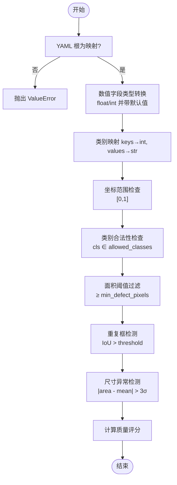
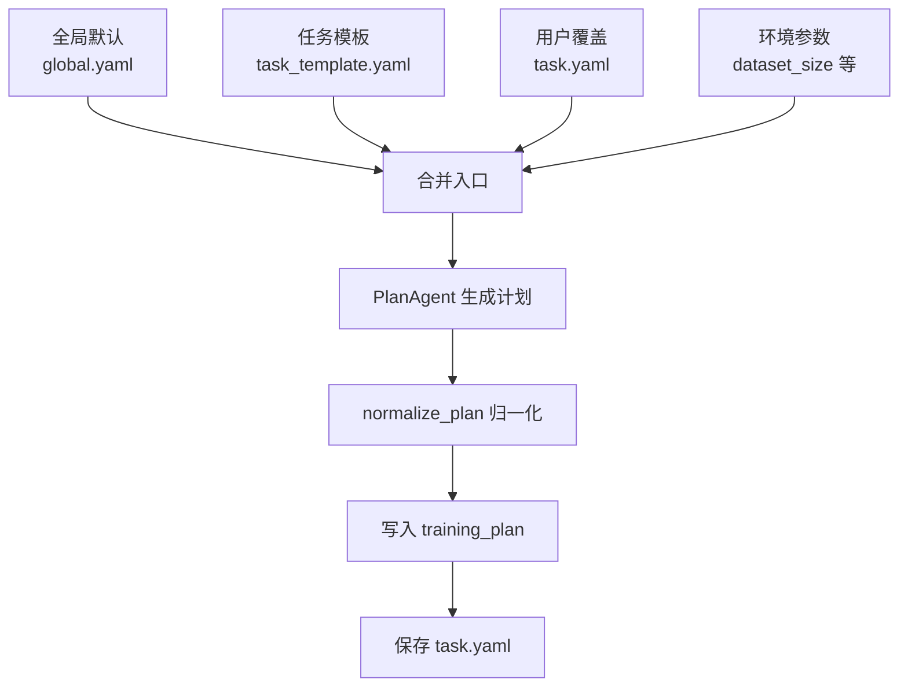
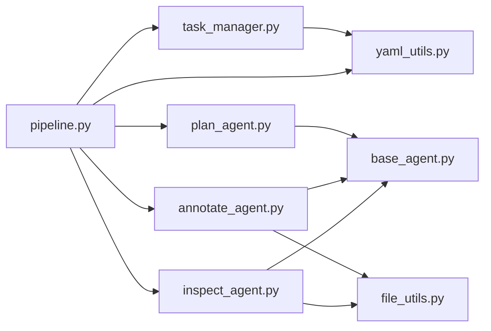

# YAML 配置工具

<cite>
**本文引用的文件**
- [global.yaml](file://config/global.yaml)
- [task_template.yaml](file://config/task_template.yaml)
- [yaml_utils.py](file://src/utils/yaml_utils.py)
- [file_utils.py](file://src/utils/file_utils.py)
- [task_manager.py](file://src/core/task_manager.py)
- [pipeline.py](file://src/core/pipeline.py)
- [base_agent.py](file://src/agents/base_agent.py)
- [plan_agent.py](file://src/agents/plan_agent.py)
- [annotate_agent.py](file://src/agents/annotate_agent.py)
- [inspect_agent.py](file://src/agents/inspect_agent.py)
- [plan_agent.yaml](file://prompts/plan_agent.yaml)
- [annotate_agent.yaml](file://prompts/annotate_agent.yaml)
- [inspect_agent.yaml](file://prompts/inspect_agent.yaml)
- [test_file_yaml_utils.py](file://tests/test_file_yaml_utils.py)
</cite>

## 目录
1. [简介](#简介)
2. [项目结构](#项目结构)
3. [核心组件](#核心组件)
4. [架构总览](#架构总览)
5. [详细组件分析](#详细组件分析)
6. [依赖关系分析](#依赖关系分析)
7. [性能考虑](#性能考虑)
8. [故障排查指南](#故障排查指南)
9. [结论](#结论)
10. [附录：使用示例与最佳实践](#附录使用示例与最佳实践)

## 简介
本仓库提供一套面向工业缺陷检测的 YAML 配置工具与流水线，围绕“任务模板渲染、变量替换、条件分支与循环”“配置验证（类型检查、必填字段、约束）”“配置合并策略（默认/用户/环境优先级）”“配置版本管理与向后兼容”“配置模板库（预定义模板、最佳实践、常见模式）”“调试与诊断（语法检查、依赖关系分析、冲突检测）”等目标进行实现。通过 TaskManager、Pipeline 与各 Agent（Plan/Annotate/Inspect），将 YAML 配置贯穿到计划生成、自动标注、质量检查与数据集导出全流程。

## 项目结构
- 配置与模板
  - config/global.yaml：全局平台配置（模型、推理、路径、服务、日志）。
  - config/task_template.yaml：任务配置模板（类别、标注规则、数据划分、模型推荐、超参、质检规则、评估指标）。
- 提示词模板
  - prompts/*.yaml：各 Agent 的系统提示与用户提示模板，支持占位符变量替换。
- 核心逻辑
  - src/utils/yaml_utils.py：YAML 加载/保存封装，含根节点映射校验。
  - src/utils/file_utils.py：图像列举、目录创建等文件系统辅助。
  - src/core/task_manager.py：任务生命周期管理（创建、列出、加载、保存、删除），从模板初始化任务配置。
  - src/core/pipeline.py：流水线编排（plan -> annotate -> inspect -> split/export），负责步骤调度、结果持久化与数据导出。
- Agent 层
  - src/agents/base_agent.py：抽象基类，统一提示加载与日志。
  - src/agents/plan_agent.py：根据自然语言描述生成结构化训练计划，并归一化为 task_template 模式。
  - src/agents/annotate_agent.py：基于 VL 模型（当前为 stub）按任务规则对图像进行 OBB 标注。
  - src/agents/inspect_agent.py：对 AI 标注进行质量检查，输出候选修正与质量评分。
- 测试
  - tests/test_file_yaml_utils.py：覆盖 YAML 读写、空文件、非映射根、缺失文件等场景。

图表来源
- [pipeline.py:22-94](file://src/core/pipeline.py#L22-L94)
- [task_manager.py:14-149](file://src/core/task_manager.py#L14-L149)
- [yaml_utils.py:11-44](file://src/utils/yaml_utils.py#L11-L44)
- [file_utils.py:10-35](file://src/utils/file_utils.py#L10-L35)
- [plan_agent.py:101-182](file://src/agents/plan_agent.py#L101-L182)
- [annotate_agent.py:22-185](file://src/agents/annotate_agent.py#L22-L185)
- [inspect_agent.py:34-227](file://src/agents/inspect_agent.py#L34-L227)

章节来源
- [global.yaml:1-29](file://config/global.yaml#L1-L29)
- [task_template.yaml:1-54](file://config/task_template.yaml#L1-L54)
- [yaml_utils.py:11-44](file://src/utils/yaml_utils.py#L11-L44)
- [task_manager.py:51-149](file://src/core/task_manager.py#L51-L149)
- [pipeline.py:22-325](file://src/core/pipeline.py#L22-L325)

## 核心组件
- YAML 工具（load/save）
  - 安全加载 YAML 并强制根节点为映射；空文件返回空字典；缺失文件抛出 FileNotFoundError；非映射根抛出 ValueError。
  - 保存时自动创建父目录，保留 Unicode 与键顺序。
- 任务管理器（TaskManager）
  - 维护 tasks_root 下的任务目录树；创建任务时从 task_template.yaml 初始化配置，写入 task.yaml；支持列表、加载、保存、删除。
- 流水线（Pipeline）
  - 编排 plan/annotate/inspect/split 四步；每步完成后持久化配置或中间产物；split 阶段生成 data.yaml 与训练命令。
- Agent 基类与各 Agent
  - BaseAgent 统一加载 prompts/*.yaml 提示模板；PlanAgent 生成并归一化训练计划；AnnotateAgent 按规则标注图像；InspectAgent 执行质量检查并输出候选修正。

章节来源
- [yaml_utils.py:11-44](file://src/utils/yaml_utils.py#L11-L44)
- [task_manager.py:14-149](file://src/core/task_manager.py#L14-L149)
- [pipeline.py:22-325](file://src/core/pipeline.py#L22-L325)
- [base_agent.py:13-53](file://src/agents/base_agent.py#L13-L53)
- [plan_agent.py:101-182](file://src/agents/plan_agent.py#L101-L182)
- [annotate_agent.py:22-185](file://src/agents/annotate_agent.py#L22-L185)
- [inspect_agent.py:34-227](file://src/agents/inspect_agent.py#L34-L227)

## 架构总览
下图展示配置在系统中的流转：全局配置驱动系统行为，任务模板作为初始配置，Agent 生成的计划被归一化后写入任务配置，流水线在各步骤中读取/更新配置并产出中间产物。

图表来源
- [pipeline.py:62-94](file://src/core/pipeline.py#L62-L94)
- [pipeline.py:96-213](file://src/core/pipeline.py#L96-L213)
- [task_manager.py:92-122](file://src/core/task_manager.py#L92-L122)
- [plan_agent.py:119-168](file://src/agents/plan_agent.py#L119-L168)
- [annotate_agent.py:25-80](file://src/agents/annotate_agent.py#L25-L80)
- [inspect_agent.py:37-108](file://src/agents/inspect_agent.py#L37-L108)

## 详细组件分析

### YAML 模板渲染与变量替换
- 提示模板位于 prompts/*.yaml，采用 Python str.format 风格的占位符（如 {class_mapping}、{w}、{h}、{min_pixel}、{task_description} 等）。
- BaseAgent.load_prompt 加载对应提示文件；PlanAgent/AnnotateAgent 在运行前用任务上下文填充模板变量。
- 变量来源包括：
  - 任务配置中的 training_plan.classes、annotation_rules、conf_threshold、min_defect_pixels、exclude_items 等。
  - 图像尺寸 w/h、最小像素阈值等运行时信息。
  - 用户输入的任务描述与数据集规模提示。

图表来源
- [base_agent.py:36-53](file://src/agents/base_agent.py#L36-L53)
- [plan_agent.py:119-168](file://src/agents/plan_agent.py#L119-L168)
- [annotate_agent.py:53-73](file://src/agents/annotate_agent.py#L53-L73)
- [annotate_agent.py:82-95](file://src/agents/annotate_agent.py#L82-L95)
- [plan_agent.yaml:1-27](file://prompts/plan_agent.yaml#L1-L27)
- [annotate_agent.yaml:1-25](file://prompts/annotate_agent.yaml#L1-L25)
- [inspect_agent.yaml:1-31](file://prompts/inspect_agent.yaml#L1-L31)

章节来源
- [base_agent.py:36-53](file://src/agents/base_agent.py#L36-L53)
- [plan_agent.py:119-168](file://src/agents/plan_agent.py#L119-L168)
- [annotate_agent.py:53-95](file://src/agents/annotate_agent.py#L53-L95)
- [plan_agent.yaml:1-27](file://prompts/plan_agent.yaml#L1-L27)
- [annotate_agent.yaml:1-25](file://prompts/annotate_agent.yaml#L1-L25)
- [inspect_agent.yaml:1-31](file://prompts/inspect_agent.yaml#L1-L31)

### 配置验证机制（类型检查、必填字段、约束）
- 基础验证
  - YAML 根必须为映射；空文件视为空映射；缺失文件报错。
  - 保存时确保目录存在，避免 IO 错误。
- 任务配置验证
  - 类别映射 classes：键需可转为整数，值需为字符串；normalize_plan 会做转换与兜底。
  - 数值型参数：conf_threshold、min_defect_pixels、iou_duplicate_threshold、size_outlier_ratio 等会被显式转换为 float/int，并提供默认值。
  - 布尔开关：如 stratified、check_* 系列，若缺失则回退到合理默认。
  - 坐标范围：OBB 坐标需在 [0,1] 范围内；越界将被记录为 coords_out_of_range。
  - 类别合法性：标注与质检阶段均校验 cls 是否在 allowed_classes 集合内。
  - 面积阈值：过滤小于 min_defect_pixels 的检测框。
- 质检规则
  - 重复框：基于 OBB IoU 超过阈值的框标记为 duplicate_boxes。
  - 异常尺寸：统计全量框面积均值与标准差，超出 3σ 的标记为 size_anomaly。
  - 缺失标签：无对应 .txt 的图像记录 missing_labels。
  - 质量评分：quality_score = max(0, 1 - total_errors / max(num_boxes, 1))。

图表来源
- [yaml_utils.py:11-32](file://src/utils/yaml_utils.py#L11-L32)
- [pipeline.py:284-325](file://src/core/pipeline.py#L284-L325)
- [annotate_agent.py:115-170](file://src/agents/annotate_agent.py#L115-L170)
- [inspect_agent.py:110-175](file://src/agents/inspect_agent.py#L110-L175)

章节来源
- [yaml_utils.py:11-32](file://src/utils/yaml_utils.py#L11-L32)
- [pipeline.py:284-325](file://src/core/pipeline.py#L284-L325)
- [annotate_agent.py:115-170](file://src/agents/annotate_agent.py#L115-L170)
- [inspect_agent.py:110-175](file://src/agents/inspect_agent.py#L110-L175)
- [test_file_yaml_utils.py:32-58](file://tests/test_file_yaml_utils.py#L32-L58)

### 配置合并策略（默认/用户/环境）
- 默认配置
  - 全局默认来自 config/global.yaml（模型、推理、路径、服务、日志）。
  - 任务默认来自 config/task_template.yaml（类别、标注规则、数据划分、模型推荐、超参、质检规则、评估指标）。
- 用户配置
  - 每个任务在 tasks/<name>/task.yaml 中维护用户覆盖的配置；创建任务时从模板拷贝并注入 name/description。
- 环境配置
  - 通过命令行或环境变量注入的参数（例如 dataset_size）在 PlanAgent 中参与提示渲染，影响计划生成。
- 合并规则
  - 计划生成后，normalize_plan 将 LLM 输出归一化为 task_template 模式，再写入 training_plan。
  - 任务级 task 段（name/description）在计划生成过程中保持不变，避免被覆盖。
  - 最终配置由 Pipeline 在每步结束后写回 task.yaml，保证增量更新。

图表来源
- [task_manager.py:51-79](file://src/core/task_manager.py#L51-L79)
- [pipeline.py:96-122](file://src/core/pipeline.py#L96-L122)
- [pipeline.py:284-325](file://src/core/pipeline.py#L284-L325)

章节来源
- [global.yaml:1-29](file://config/global.yaml#L1-L29)
- [task_template.yaml:1-54](file://config/task_template.yaml#L1-L54)
- [task_manager.py:51-79](file://src/core/task_manager.py#L51-L79)
- [pipeline.py:96-122](file://src/core/pipeline.py#L96-L122)
- [pipeline.py:284-325](file://src/core/pipeline.py#L284-L325)

### 配置版本管理与向后兼容
- 版本检测
  - 当前未实现显式的 version 字段；可通过新增字段与默认值实现渐进式兼容。
- 向后兼容
  - normalize_plan 对多种历史键名（如 dataset_strategy.split 中的 train/val/test 或 train_ratio/val_ratio/test_ratio）进行兼容处理，确保旧计划仍可工作。
  - 缺失字段均有默认值，避免升级导致崩溃。
- 迁移脚本
  - 可在 Pipeline 或 TaskManager 中增加迁移函数，将旧 schema 字段映射到新 schema，并在首次加载时自动执行。
- 建议
  - 在 global.yaml 或 task_template.yaml 引入 version 字段；在加载时比较版本并触发迁移流程。

章节来源
- [pipeline.py:284-325](file://src/core/pipeline.py#L284-L325)

### 配置模板库（预定义模板、最佳实践、常见模式）
- 预定义模板
  - task_template.yaml：提供完整的任务配置骨架，涵盖类别、标注规则、数据划分、模型推荐、超参、质检规则与评估指标。
  - prompts/*.yaml：为 Plan/Annotate/Inspect 提供标准化提示模板，便于复用与扩展。
- 最佳实践
  - 类别映射使用连续整数从 0 开始。
  - 标注规则明确 OBB 方向与坐标归一化要求。
  - 数据划分建议使用分层抽样（stratified=true）。
  - 质检规则开启缺失标签、重复框、类别错误、坐标越界、模态冲突检查。
- 常见模式
  - 小样本快速迭代：降低 epochs/batch，提高 imgsz 适度，优先关注 mAP50。
  - 多模态任务：在 inspection 中启用 modality_rule_conflict 检查。
  - 资源受限：限制 GPU 显存与 batch，启用 CPU fallback。

章节来源
- [task_template.yaml:1-54](file://config/task_template.yaml#L1-L54)
- [plan_agent.yaml:1-27](file://prompts/plan_agent.yaml#L1-L27)
- [annotate_agent.yaml:1-25](file://prompts/annotate_agent.yaml#L1-L25)
- [inspect_agent.yaml:1-31](file://prompts/inspect_agent.yaml#L1-L31)

### 调试与诊断（语法检查、依赖关系分析、冲突检测）
- 语法检查
  - YAML 根映射校验、空文件处理、缺失文件报错。
- 依赖关系分析
  - 通过 Pipeline 的步骤顺序与 Agent 间的数据流（plan -> annotate -> inspect -> split）体现依赖关系。
- 冲突检测
  - 类别冲突：标注与质检阶段校验 cls 是否在允许集合内。
  - 坐标冲突：越界坐标记录为 coords_out_of_range。
  - 重复框：基于 IoU 阈值识别重复框。
  - 尺寸异常：统计面积分布，标记离群框。
  - 模态冲突：inspection 中可启用 check_modality_rule_conflict。

章节来源
- [yaml_utils.py:11-32](file://src/utils/yaml_utils.py#L11-L32)
- [pipeline.py:22-94](file://src/core/pipeline.py#L22-L94)
- [annotate_agent.py:115-170](file://src/agents/annotate_agent.py#L115-L170)
- [inspect_agent.py:110-175](file://src/agents/inspect_agent.py#L110-L175)

## 依赖关系分析
- 模块耦合
  - Pipeline 强依赖 TaskManager、各 Agent；Agent 依赖 BaseAgent 与 yaml_utils/file_utils。
  - TaskManager 依赖 yaml_utils 与 file_utils。
- 外部依赖
  - PyYAML 用于 YAML 解析与序列化。
  - NumPy 用于几何计算（面积、坐标处理）。
- 潜在循环依赖
  - 当前未见循环导入；Agent 仅向上依赖 BaseAgent。

图表来源
- [pipeline.py:22-94](file://src/core/pipeline.py#L22-L94)
- [task_manager.py:14-149](file://src/core/task_manager.py#L14-L149)
- [base_agent.py:13-53](file://src/agents/base_agent.py#L13-L53)
- [yaml_utils.py:11-44](file://src/utils/yaml_utils.py#L11-L44)
- [file_utils.py:10-35](file://src/utils/file_utils.py#L10-L35)

章节来源
- [pipeline.py:22-94](file://src/core/pipeline.py#L22-L94)
- [task_manager.py:14-149](file://src/core/task_manager.py#L14-L149)
- [base_agent.py:13-53](file://src/agents/base_agent.py#L13-L53)

## 性能考虑
- 批量与显存
  - inference.batch_size、max_gpu_memory_mb 控制推理吞吐与显存占用；建议根据硬件调整。
- 图像尺寸与批次
  - imgsz 与 batch 直接影响训练与标注速度；小数据集建议适中 imgsz 与 batch。
- 过滤与裁剪
  - conf_threshold 与 min_defect_pixels 可减少无效框，提升后续质检效率。
- I/O 优化
  - 使用 ensure_dir 与批量写入减少磁盘操作；split 阶段复制文件时使用高效拷贝。

## 故障排查指南
- YAML 相关
  - 缺失文件：load_yaml 抛出 FileNotFoundError，检查路径与权限。
  - 非映射根：load_yaml 抛出 ValueError，确认 YAML 顶层为对象而非数组。
  - 空文件：视为空映射，注意下游可能期望非空结构。
- 任务相关
  - 任务已存在：create_task 抛出 FileExistsError，更换名称或删除旧任务。
  - 任务不存在：load/delete 抛出 FileNotFoundError，检查任务名与目录。
- 标注相关
  - 未知类别：跳过并记录警告，检查 classes 映射。
  - 置信度过低：低于 conf_threshold 的框被丢弃，调整阈值。
  - 面积过小：小于 min_defect_pixels 的框被丢弃，调整阈值。
- 质检相关
  - 重复框：IoU 超过阈值，检查标注一致性。
  - 坐标越界：记录 coords_out_of_range，检查坐标归一化。
  - 尺寸异常：统计离群框，检查标注质量。
- 流水线相关
  - 未知步骤：run_step 抛出 ValueError，确认步骤名。
  - 无图像：split 阶段返回空摘要，检查 images 目录。

章节来源
- [yaml_utils.py:11-32](file://src/utils/yaml_utils.py#L11-L32)
- [task_manager.py:51-137](file://src/core/task_manager.py#L51-L137)
- [annotate_agent.py:115-170](file://src/agents/annotate_agent.py#L115-L170)
- [inspect_agent.py:110-175](file://src/agents/inspect_agent.py#L110-L175)
- [pipeline.py:62-94](file://src/core/pipeline.py#L62-L94)
- [pipeline.py:155-213](file://src/core/pipeline.py#L155-L213)

## 结论
该 YAML 配置工具以模板化与规范化为核心，结合 Pipeline 与各 Agent，实现了从计划生成、自动标注、质量检查到数据集导出的完整闭环。通过严格的类型与约束检查、合理的合并策略与兼容处理，保证了配置的可维护性与鲁棒性。建议在后续版本中引入显式版本字段与迁移脚本，进一步提升向后兼容性与可观测性。

## 附录：使用示例与最佳实践

### 任务配置
- 创建任务：使用 TaskManager.create_task 从 task_template.yaml 初始化任务目录与配置。
- 编辑任务：修改 task.yaml 中的 task 与 training_plan 字段，覆盖默认值。
- 查看任务：使用 list_tasks 与 load_task 获取任务列表与配置。

章节来源
- [task_manager.py:51-107](file://src/core/task_manager.py#L51-L107)
- [task_template.yaml:1-54](file://config/task_template.yaml#L1-L54)

### Agent 参数设置
- PlanAgent：传入任务描述与数据集规模，生成结构化计划；支持 JSON/YAML 输出解析与失败回退。
- AnnotateAgent：依据 training_plan 的类别、规则与阈值对图像进行 OBB 标注，输出 YOLO-OBB 标签。
- InspectAgent：依据 inspection 规则检查标注质量，输出候选修正与质量评分。

章节来源
- [plan_agent.py:119-168](file://src/agents/plan_agent.py#L119-L168)
- [annotate_agent.py:25-80](file://src/agents/annotate_agent.py#L25-L80)
- [inspect_agent.py:37-108](file://src/agents/inspect_agent.py#L37-L108)

### 系统初始化
- 全局配置：在 global.yaml 中设置模型、推理、路径、服务与日志参数。
- 提示模板：在 prompts/*.yaml 中定义系统与用户提示，使用占位符注入任务上下文。
- 流水线启动：通过 Pipeline.run_full 或 run_step 执行端到端流程。

章节来源
- [global.yaml:1-29](file://config/global.yaml#L1-L29)
- [plan_agent.yaml:1-27](file://prompts/plan_agent.yaml#L1-L27)
- [annotate_agent.yaml:1-25](file://prompts/annotate_agent.yaml#L1-L25)
- [inspect_agent.yaml:1-31](file://prompts/inspect_agent.yaml#L1-L31)
- [pipeline.py:48-94](file://src/core/pipeline.py#L48-L94)