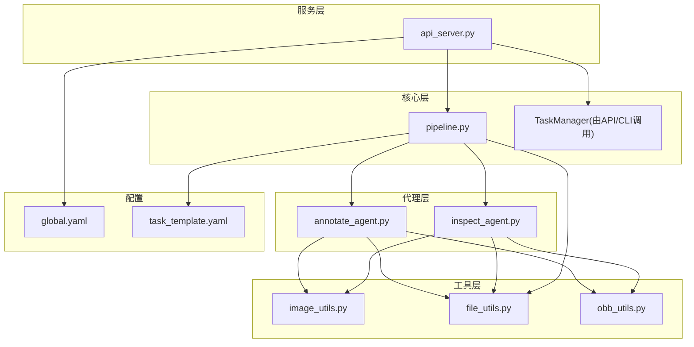
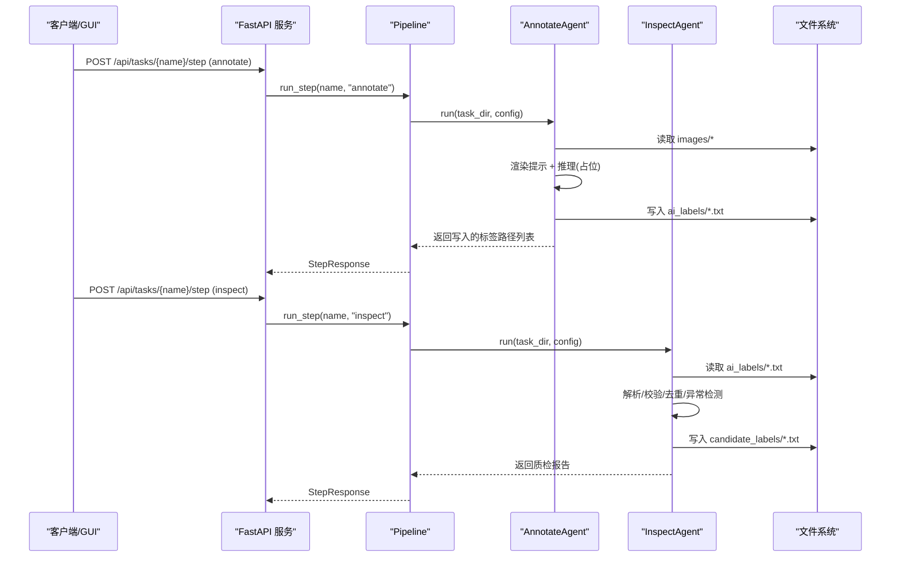
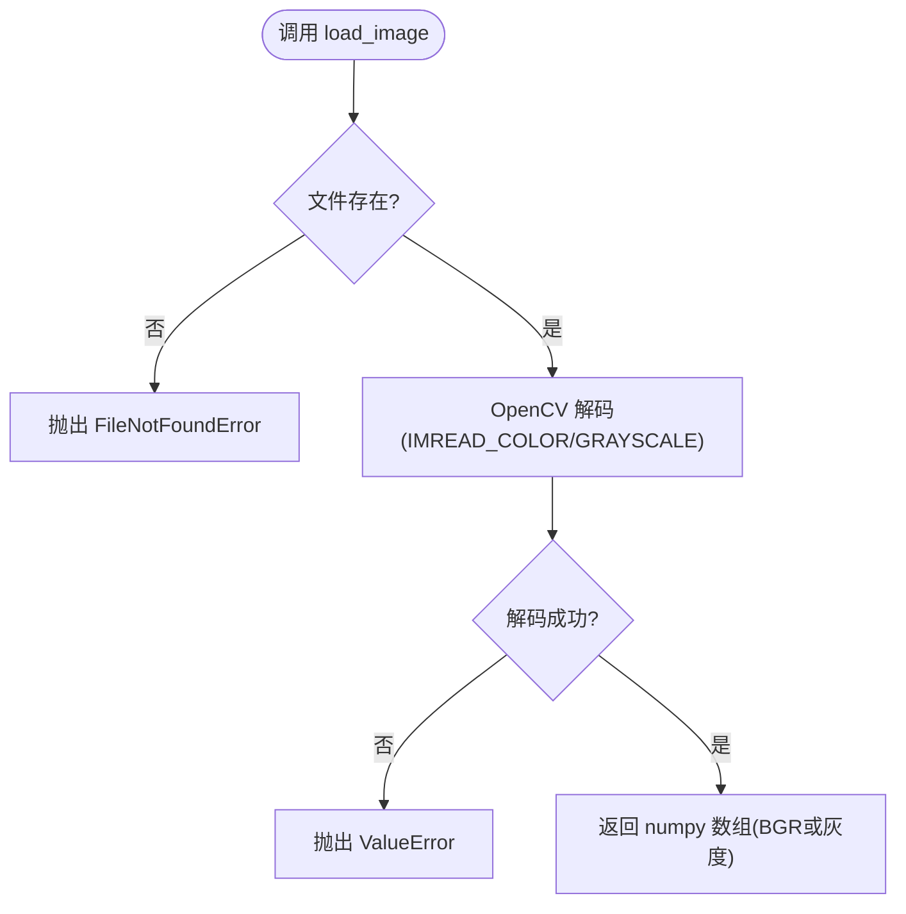
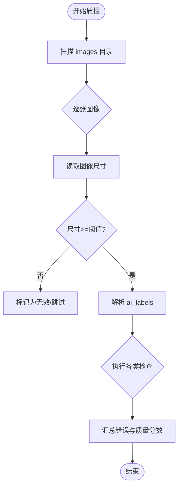
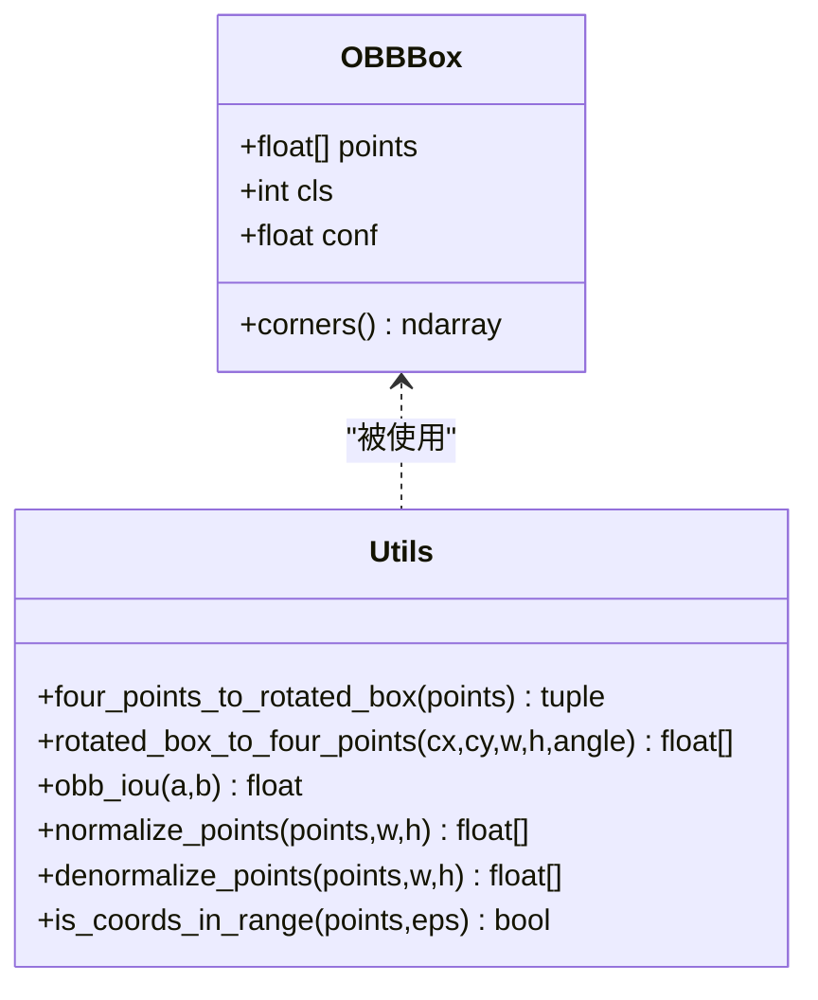
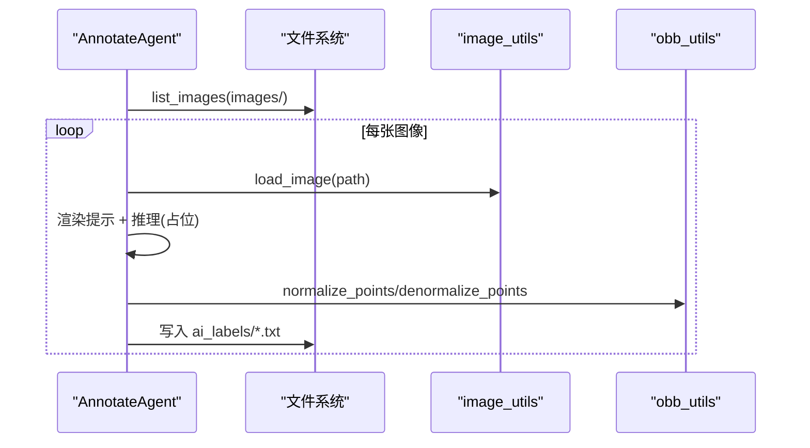
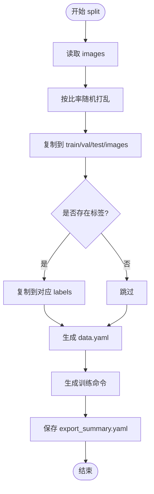
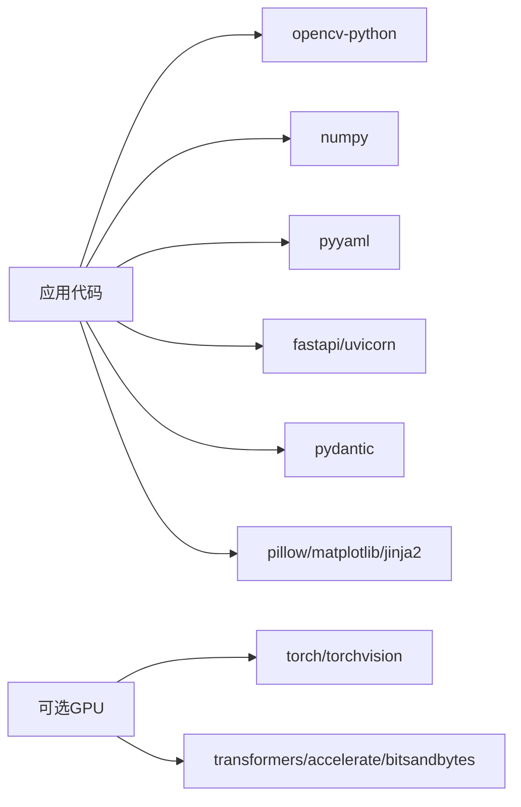

# 图像处理工具

<cite>
**本文引用的文件**
- [image_utils.py](file://src/utils/image_utils.py)
- [file_utils.py](file://src/utils/file_utils.py)
- [obb_utils.py](file://src/utils/obb_utils.py)
- [pipeline.py](file://src/core/pipeline.py)
- [api_server.py](file://src/api_server.py)
- [annotate_agent.py](file://src/agents/annotate_agent.py)
- [inspect_agent.py](file://src/agents/inspect_agent.py)
- [global.yaml](file://config/global.yaml)
- [task_template.yaml](file://config/task_template.yaml)
- [pyproject.toml](file://pyproject.toml)
- [run.py](file://run.py)
</cite>

## 目录
1. [简介](#简介)
2. [项目结构](#项目结构)
3. [核心组件](#核心组件)
4. [架构总览](#架构总览)
5. [详细组件分析](#详细组件分析)
6. [依赖关系分析](#依赖关系分析)
7. [性能考虑](#性能考虑)
8. [故障排查指南](#故障排查指南)
9. [结论](#结论)
10. [附录：使用示例与最佳实践](#附录使用示例与最佳实践)

## 简介
本图像处理工具面向多模态 YOLO-OBB（旋转框）训练计划生成与智能标注平台，提供从图像读取、格式支持、质量检查到标注生成、质检、数据集拆分与导出的完整流水线。当前仓库实现了：
- 图像读取与基础校验（基于 OpenCV 解码）
- 支持的图像格式清单与错误处理
- 旋转框几何计算、坐标归一化/反归一化、IoU 等
- 自动标注（代理模式，含占位推理）、质检与候选标签生成
- 数据集划分与 YOLO-OBB 导出（data.yaml、训练命令）
- FastAPI 服务暴露任务管理、步骤执行、图像与标注查询
- 可选 GPU 加速依赖声明与全局配置项

注意：当前代码未实现通用的图像尺寸调整（缩放/裁剪/填充）、通用图像增强（亮度/对比度/噪声）以及 RGB/BGR/灰度图之间的显式转换函数；但提供了图像读取、尺寸获取与最小尺寸验证能力，可作为扩展点接入上述功能。

## 项目结构
- src/utils：图像与文件工具（读取、列表、OBB 几何）
- src/core：流水线编排（plan/annotate/inspect/split）
- src/agents：标注与质检代理（可插拔后端）
- src/api_server：FastAPI 接口（任务、步骤、图像、标注、报告）
- config：全局与任务模板配置
- run.py：CLI 入口
- pyproject.toml：依赖与可选 GPU 依赖

图表来源
- [api_server.py:16-26](file://src/api_server.py#L16-L26)
- [pipeline.py:22-94](file://src/core/pipeline.py#L22-L94)
- [annotate_agent.py:22-80](file://src/agents/annotate_agent.py#L22-L80)
- [inspect_agent.py:34-108](file://src/agents/inspect_agent.py#L34-L108)
- [image_utils.py:13-69](file://src/utils/image_utils.py#L13-L69)
- [file_utils.py:10-22](file://src/utils/file_utils.py#L10-L22)
- [obb_utils.py:16-151](file://src/utils/obb_utils.py#L16-L151)

章节来源
- [pyproject.toml:1-18](file://pyproject.toml#L1-L18)
- [global.yaml:1-29](file://config/global.yaml#L1-L29)
- [task_template.yaml:1-54](file://config/task_template.yaml#L1-L54)

## 核心组件
- 图像工具 image_utils：提供 load_image、image_size、validate_image，负责图像解码与基本有效性校验。
- 文件工具 file_utils：提供 list_images（限定扩展名）与 ensure_dir。
- OBB 工具 obb_utils：提供 OBBBox 数据类、旋转框与四点坐标互转、IoU、坐标归一化/反归一化、范围检查。
- 流水线 pipeline：编排 plan/annotate/inspect/split 四步，输出训练计划、标注、质检报告与数据集导出。
- 代理 annotate_agent：遍历 images，渲染提示，调用 VL 推理（当前为占位），过滤并写入 ai_labels。
- 代理 inspect_agent：解析 ai_labels，执行缺失标签、重复框、类别错误、越界坐标、尺寸异常检测，写 candidate_labels。
- API 服务 api_server：HTTP 接口封装任务管理、步骤执行、图像与标注查询、报告导出。
- CLI run.py：命令行入口，支持 create/plan/annotate/inspect/split/full。

章节来源
- [image_utils.py:13-69](file://src/utils/image_utils.py#L13-L69)
- [file_utils.py:10-22](file://src/utils/file_utils.py#L10-L22)
- [obb_utils.py:16-151](file://src/utils/obb_utils.py#L16-L151)
- [pipeline.py:22-325](file://src/core/pipeline.py#L22-L325)
- [annotate_agent.py:22-185](file://src/agents/annotate_agent.py#L22-L185)
- [inspect_agent.py:34-227](file://src/agents/inspect_agent.py#L34-L227)
- [api_server.py:139-384](file://src/api_server.py#L139-L384)
- [run.py:20-82](file://run.py#L20-L82)

## 架构总览
系统以“任务”为中心组织数据：每个任务包含 images、ai_labels、candidate_labels、dataset 等子目录。Pipeline 驱动各 Agent 完成标注与质检，最终 split 阶段按策略划分数据集并生成 data.yaml 与训练命令。API 层暴露 REST 接口供 GUI 或外部系统调用。

图表来源
- [api_server.py:169-231](file://src/api_server.py#L169-L231)
- [pipeline.py:62-153](file://src/core/pipeline.py#L62-L153)
- [annotate_agent.py:25-80](file://src/agents/annotate_agent.py#L25-L80)
- [inspect_agent.py:37-108](file://src/agents/inspect_agent.py#L37-L108)

## 详细组件分析

### 图像读取与格式支持
- 加载方式：通过 OpenCV 解码，支持常见图像格式（jpg/jpeg/png/bmp/tif/tiff）。
- 灰度模式：load_image 支持 grayscale 参数直接以单通道加载。
- 尺寸获取：image_size 在不完整解码的情况下仅用于获取宽高（内部仍会解码一次）。
- 最小尺寸验证：validate_image 结合最小尺寸阈值判断图像是否可用。
- 错误处理：
  - 文件不存在抛出 FileNotFoundError
  - 解码失败抛出 ValueError
  - validate_image 捕获上述异常并返回 False

图表来源
- [image_utils.py:13-33](file://src/utils/image_utils.py#L13-L33)

章节来源
- [image_utils.py:13-69](file://src/utils/image_utils.py#L13-L69)
- [file_utils.py:7-22](file://src/utils/file_utils.py#L7-L22)

### 图像尺寸调整算法（现状与扩展建议）
- 现状：仓库未提供统一的 resize/crop/pad 函数。可在 image_utils 中新增统一接口，复用 OpenCV 进行缩放、裁剪与填充，并在 pipeline 的 split/export 前按需调用。
- 建议实现要点：
  - 缩放：保持纵横比或强制拉伸，支持最近邻/双线性/双三次插值
  - 裁剪：中心裁剪、随机裁剪、按比例裁剪
  - 填充：黑边/均值填充/镜像填充，配合后续模型输入尺寸对齐
  - 批量处理：对 list_images 结果进行批处理，减少 I/O 与内存抖动
  - 缓存：对同一图像多次变换时缓存中间结果

[本节为概念性说明，不直接分析具体文件]

### 图像增强功能（现状与扩展建议）
- 现状：仓库未实现亮度、对比度、噪声等数据增强。
- 建议实现要点：
  - 在 image_utils 中增加 augment_image(image, params) 统一入口
  - 支持组合增强：亮度/对比度/伽马/高斯噪声/模糊/锐化
  - 随机种子控制与可复现实验
  - 与标注同步更新：若对图像做几何变换，需同步更新 OBB 坐标（利用 obb_utils 的归一化/反归一化）

[本节为概念性说明，不直接分析具体文件]

### 图像格式转换（现状与扩展建议）
- 现状：load_image 默认返回 BGR 数组；grayscale=True 返回单通道灰度图。未提供显式的 RGB↔BGR、BGR↔灰度转换函数。
- 建议实现要点：
  - 新增 convert_color(image, from_space, to_space) 统一接口
  - 支持 RGB/BGR/Gray 之间转换，必要时进行通道数校验
  - 在 pipeline 或 agent 中根据下游需求选择合适色彩空间

[本节为概念性说明，不直接分析具体文件]

### 图像质量检查
- 分辨率验证：validate_image 可设置最小宽高阈值，确保图像满足最低分辨率要求。
- 格式检测：list_images 仅列出受支持的扩展名（jpg/jpeg/png/bmp/tif/tiff）。
- 损坏文件识别：load_image 解码失败时抛出异常，validate_image 将其视为无效图像。
- 标注级质量检查：inspect_agent 检查缺失标签、重复框、类别错误、坐标越界、尺寸异常，并输出 quality_score。

图表来源
- [inspect_agent.py:37-108](file://src/agents/inspect_agent.py#L37-L108)
- [image_utils.py:54-69](file://src/utils/image_utils.py#L54-L69)
- [file_utils.py:10-22](file://src/utils/file_utils.py#L10-L22)

章节来源
- [inspect_agent.py:37-227](file://src/agents/inspect_agent.py#L37-L227)
- [image_utils.py:54-69](file://src/utils/image_utils.py#L54-L69)
- [file_utils.py:10-22](file://src/utils/file_utils.py#L10-L22)

### 旋转框几何与坐标处理
- OBBBox：表示旋转框的四点坐标、类别与置信度。
- 坐标归一化/反归一化：normalize_points/denormalize_points 在像素坐标与 [0,1] 归一化坐标间转换。
- IoU：基于凸多边形交集计算 OBB 的 IoU。
- 旋转框与四点坐标互转：four_points_to_rotated_box/rotated_box_to_four_points。
- 坐标范围检查：is_coords_in_range 用于校验归一化坐标是否在合法范围内。

图表来源
- [obb_utils.py:16-151](file://src/utils/obb_utils.py#L16-L151)

章节来源
- [obb_utils.py:16-151](file://src/utils/obb_utils.py#L16-L151)

### 自动标注流程
- 遍历 images，读取宽高，渲染用户提示，调用 VL 推理（当前为占位，返回一个中心区域的旋转框）。
- 过滤逻辑：类别合法性、置信度阈值、最小缺陷面积、坐标范围。
- 输出：YOLO-OBB 格式的 .txt 标签文件至 ai_labels。

图表来源
- [annotate_agent.py:25-80](file://src/agents/annotate_agent.py#L25-L80)
- [annotate_agent.py:115-161](file://src/agents/annotate_agent.py#L115-L161)
- [image_utils.py:13-33](file://src/utils/image_utils.py#L13-L33)
- [obb_utils.py:96-137](file://src/utils/obb_utils.py#L96-L137)

章节来源
- [annotate_agent.py:25-185](file://src/agents/annotate_agent.py#L25-L185)

### 数据集拆分与导出
- 读取 images，按训练/验证/测试比例随机打乱并复制至 dataset/{train,val,test}/images，同时复制对应标签至 labels。
- 生成 data.yaml 与 train_command.txt，便于直接使用 YOLO-OBB 训练。
- 导出摘要保存为 export_summary.yaml。

图表来源
- [pipeline.py:155-213](file://src/core/pipeline.py#L155-L213)
- [pipeline.py:234-281](file://src/core/pipeline.py#L234-L281)

章节来源
- [pipeline.py:155-281](file://src/core/pipeline.py#L155-L281)

## 依赖关系分析
- 运行时依赖：opencv-python、numpy、pyyaml、pillow、matplotlib、fastapi、uvicorn、pydantic、jinja2
- 可选 GPU 依赖：torch、torchvision、transformers、accelerate、bitsandbytes（用于未来接入本地 VL 模型与推理加速）
- 开发依赖：ruff、mypy、pytest、httpx

图表来源
- [pyproject.toml:8-33](file://pyproject.toml#L8-L33)

章节来源
- [pyproject.toml:8-33](file://pyproject.toml#L8-L33)

## 性能考虑
- 内存管理
  - 图像读取使用 OpenCV，避免不必要的中间对象；建议在批量处理中使用迭代器与及时释放引用。
  - 对大图像或大批量任务，建议分块处理与临时目录清理。
- 批量处理
  - 当前 iterate 方式为逐张处理；可扩展为批处理以减少 I/O 开销。
  - 在 split 阶段已采用顺序复制与计数统计，适合中等规模数据集。
- GPU 加速支持
  - 依赖中声明了 torch/transformers/accelerate/bitsandbytes，可用于未来接入本地 VL 模型与量化推理。
  - global.yaml 提供 vl_model_name、load_in_4bit、device、max_gpu_memory_mb 等配置项，便于切换设备与限制显存。
- 日志与监控
  - 各模块记录关键步骤日志，便于定位瓶颈与问题。

[本节为通用指导，不直接分析具体文件]

## 故障排查指南
- 图像无法解码
  - 现象：load_image 抛出 ValueError
  - 排查：确认文件格式受支持、文件未损坏；尝试用其他工具打开
- 任务目录不存在
  - 现象：FileNotFoundError
  - 排查：确认 tasks_root 下存在对应任务目录，且 images 目录存在
- 无图像可拆分
  - 现象：split 阶段警告无图像
  - 排查：确认 images 目录下有受支持扩展名的图像文件
- 标注解析异常
  - 现象：inspect_agent 记录 malformed label line
  - 排查：检查 ai_labels 文件格式是否为每行 cls x1 y1 x2 y2 x3 y3 x4 y4，坐标数量是否为 8
- 重复框与越界坐标
  - 现象：inspect_agent 报告 duplicate_boxes、coords_out_of_range
  - 排查：降低 iou_duplicate_threshold 或修正标注坐标范围

章节来源
- [image_utils.py:13-33](file://src/utils/image_utils.py#L13-L33)
- [annotate_agent.py:115-161](file://src/agents/annotate_agent.py#L115-L161)
- [inspect_agent.py:177-227](file://src/agents/inspect_agent.py#L177-L227)
- [pipeline.py:174-177](file://src/core/pipeline.py#L174-L177)

## 结论
该工具围绕 YOLO-OBB 任务构建了完整的“计划—标注—质检—拆分导出”流水线，具备稳定的图像读取、格式支持与基础质量检查能力，并通过代理模式预留了 VL 模型接入点。当前版本未实现通用的图像尺寸调整、增强与颜色空间转换，但这些均可在现有 image_utils 与 pipeline 基础上快速扩展。借助可选 GPU 依赖与全局配置，未来可平滑引入本地模型与推理加速，提升标注效率与质量。

## 附录：使用示例与最佳实践
- 创建任务
  - CLI：python run.py create --task demo --description "光伏EL缺陷标注"
  - API：POST /api/tasks，body: {"name":"demo","description":"..."}
- 运行计划
  - CLI：python run.py plan --task demo
  - API：POST /api/tasks/demo/plan
- 自动标注
  - CLI：python run.py annotate --task demo
  - API：POST /api/tasks/demo/annotate
- 质检与报告
  - CLI：python run.py inspect --task demo
  - API：POST /api/tasks/demo/inspect；GET /api/tasks/demo/report
- 数据集拆分与导出
  - CLI：python run.py split --task demo
  - API：POST /api/tasks/demo/split；GET /api/tasks/demo/export
- 查看图像与标注
  - API：GET /api/tasks/demo/images；GET /api/tasks/demo/images/{image_name}
  - API：GET /api/tasks/demo/labels；GET /api/tasks/demo/labels/{image_name}

最佳实践
- 在 split 前执行 inspect，优先使用 candidate_labels 替换 ai_labels，提高数据质量
- 合理设置 min_defect_pixels 与 conf_threshold，平衡召回与误检
- 对于高分辨率图像，可在 pipeline 中插入预处理步骤（缩放/裁剪/填充）以适配模型输入尺寸
- 如需数据增强，请在标注后、训练前对图像与 OBB 坐标同步变换，保证一致性

[本节为使用指引，不直接分析具体文件]