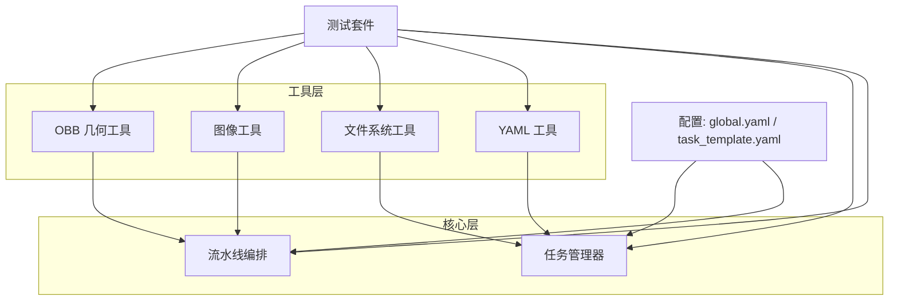
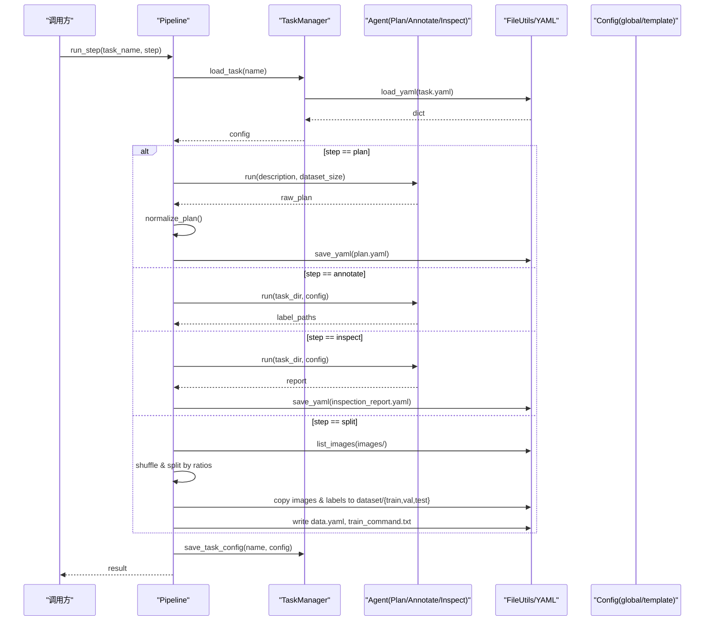
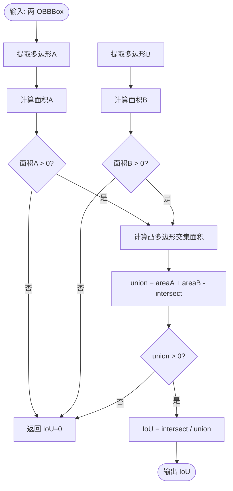
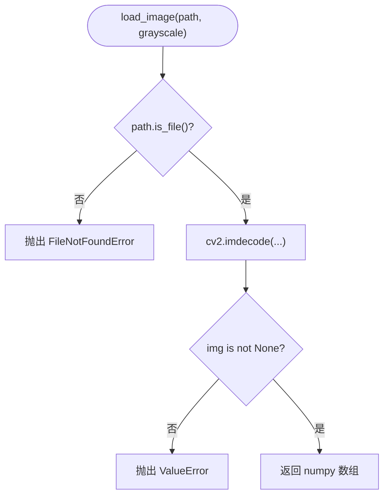
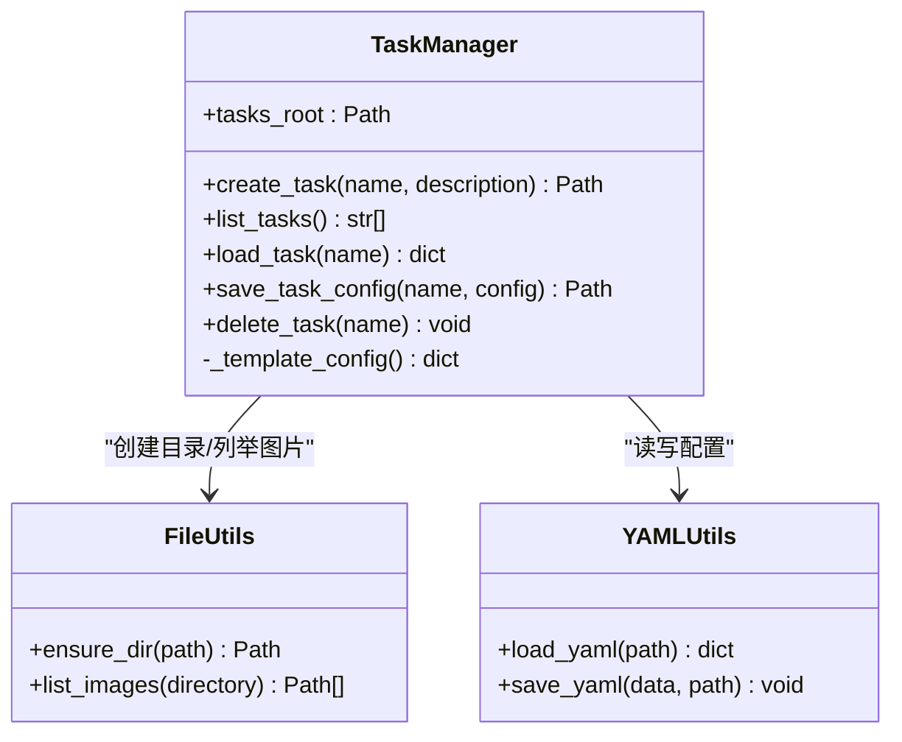
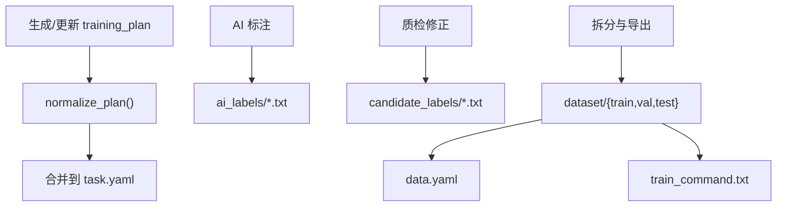
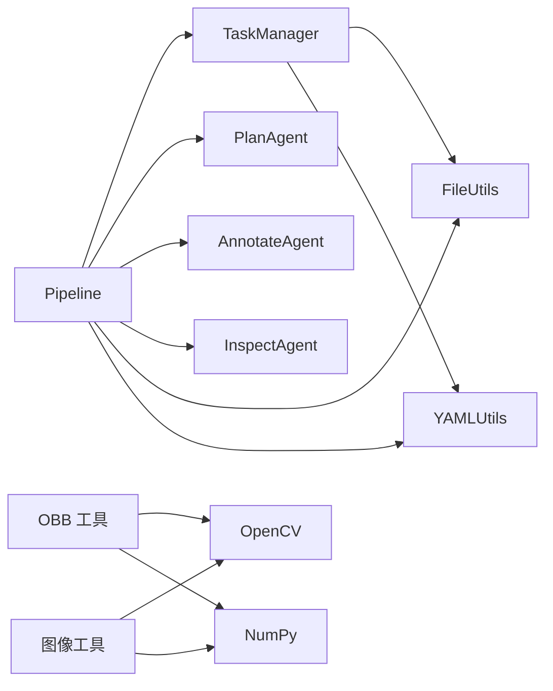

# 数据处理引擎

<cite>
**本文引用的文件**
- [src/utils/obb_utils.py](file://src/utils/obb_utils.py)
- [src/utils/image_utils.py](file://src/utils/image_utils.py)
- [src/utils/file_utils.py](file://src/utils/file_utils.py)
- [src/utils/yaml_utils.py](file://src/utils/yaml_utils.py)
- [config/task_template.yaml](file://config/task_template.yaml)
- [config/global.yaml](file://config/global.yaml)
- [src/core/task_manager.py](file://src/core/task_manager.py)
- [src/core/pipeline.py](file://src/core/pipeline.py)
- [tests/test_obb_utils.py](file://tests/test_obb_utils.py)
- [tests/test_file_yaml_utils.py](file://tests/test_file_yaml_utils.py)
</cite>

## 目录
1. [简介](#简介)
2. [项目结构](#项目结构)
3. [核心组件](#核心组件)
4. [架构总览](#架构总览)
5. [详细组件分析](#详细组件分析)
6. [依赖关系分析](#依赖关系分析)
7. [性能考虑](#性能考虑)
8. [故障排查指南](#故障排查指南)
9. [结论](#结论)
10. [附录](#附录)

## 简介
本文档面向“数据处理引擎”的算法与工程实现，重点覆盖：
- 旋转边界框（OBB）处理：顺时针归一化角点表示、坐标变换、重叠检测（IoU）、面积计算。
- 图像处理工具：读取、格式转换、尺寸校验、基础增强能力。
- 文件操作工具：任务目录结构管理、批量文件处理、元数据读写。
- YAML 配置工具：模板渲染、配置验证、合并策略。
- 数据验证与质量检查：规则定义与执行流程。
- 性能优化与内存管理：关键路径优化建议与注意事项。

## 项目结构
仓库采用分层组织：
- utils：通用工具（OBB几何、图像、文件、YAML）。
- core：任务管理与流水线编排。
- config：全局与任务模板配置。
- tests：单元测试覆盖核心工具与流程。

图表来源
- [src/utils/obb_utils.py:1-151](file://src/utils/obb_utils.py#L1-L151)
- [src/utils/image_utils.py:1-70](file://src/utils/image_utils.py#L1-L70)
- [src/utils/file_utils.py:1-36](file://src/utils/file_utils.py#L1-L36)
- [src/utils/yaml_utils.py:1-45](file://src/utils/yaml_utils.py#L1-L45)
- [src/core/task_manager.py:1-150](file://src/core/task_manager.py#L1-L150)
- [src/core/pipeline.py:1-325](file://src/core/pipeline.py#L1-L325)
- [config/global.yaml:1-29](file://config/global.yaml#L1-L29)
- [config/task_template.yaml:1-54](file://config/task_template.yaml#L1-L54)

章节来源
- [src/core/task_manager.py:14-150](file://src/core/task_manager.py#L14-L150)
- [src/core/pipeline.py:22-325](file://src/core/pipeline.py#L22-L325)
- [config/global.yaml:1-29](file://config/global.yaml#L1-L29)
- [config/task_template.yaml:1-54](file://config/task_template.yaml#L1-L54)

## 核心组件
- OBB 几何工具：提供 OBBBox 数据结构、顺时针四点表示、最小外接矩形转换、凸多边形交集 IoU、归一化/反归一化坐标、范围校验。
- 图像工具：安全加载图像、获取尺寸、最小尺寸校验。
- 文件工具：列出图片、创建目录。
- YAML 工具：加载/保存 YAML，空文件与根类型校验。
- 任务管理器：任务目录脚手架、配置模板填充、增删改查。
- 流水线：计划→标注→质检→拆分导出，串联各 Agent 与工具。

章节来源
- [src/utils/obb_utils.py:16-151](file://src/utils/obb_utils.py#L16-L151)
- [src/utils/image_utils.py:13-70](file://src/utils/image_utils.py#L13-L70)
- [src/utils/file_utils.py:10-36](file://src/utils/file_utils.py#L10-L36)
- [src/utils/yaml_utils.py:11-45](file://src/utils/yaml_utils.py#L11-L45)
- [src/core/task_manager.py:14-150](file://src/core/task_manager.py#L14-L150)
- [src/core/pipeline.py:22-325](file://src/core/pipeline.py#L22-L325)

## 架构总览
流水线驱动的任务处理流程如下：

图表来源
- [src/core/pipeline.py:62-213](file://src/core/pipeline.py#L62-L213)
- [src/core/task_manager.py:92-122](file://src/core/task_manager.py#L92-L122)
- [src/utils/yaml_utils.py:11-45](file://src/utils/yaml_utils.py#L11-L45)
- [src/utils/file_utils.py:10-36](file://src/utils/file_utils.py#L10-L36)
- [config/task_template.yaml:1-54](file://config/task_template.yaml#L1-L54)

## 详细组件分析

### OBB 几何工具
- 数据结构 OBBBox：以顺时针四点 `[x1,y1,x2,y2,x3,y3,x4,y4]` 表示，支持转为 (4,2) 角点数组。
- 坐标变换：
  - 四点 → 旋转矩形中心宽高角度：使用最小外接矩形算法，角度范围在 (-90, 0]。
  - 旋转矩形 → 顺时针四点：通过旋转矩形顶点计算并展平为八点列表。
- 重叠检测与面积：
  - 基于凸多边形交集计算 IoU；对零面积退化情况返回 0.0，避免除零。
- 坐标归一化/反归一化：
  - 将像素坐标映射到 [0,1] 或反向；对非法尺寸抛出异常；提供范围校验函数容忍浮点误差。

图表来源
- [src/utils/obb_utils.py:73-93](file://src/utils/obb_utils.py#L73-L93)

章节来源
- [src/utils/obb_utils.py:16-151](file://src/utils/obb_utils.py#L16-L151)
- [tests/test_obb_utils.py:17-84](file://tests/test_obb_utils.py#L17-L84)

### 图像处理工具
- 读取图像：支持彩色/灰度解码，失败时抛出明确异常。
- 获取尺寸：轻量级读取图像尺寸。
- 校验图像：存在性、可解码性与最小尺寸检查。

图表来源
- [src/utils/image_utils.py:13-33](file://src/utils/image_utils.py#L13-L33)

章节来源
- [src/utils/image_utils.py:13-70](file://src/utils/image_utils.py#L13-L70)

### 文件操作工具
- 列出图片：非递归扫描指定扩展名并按名称排序。
- 确保目录：幂等创建多级目录，便于流水线中构建任务子目录。

章节来源
- [src/utils/file_utils.py:10-36](file://src/utils/file_utils.py#L10-L36)
- [tests/test_file_yaml_utils.py:12-30](file://tests/test_file_yaml_utils.py#L12-L30)

### YAML 配置工具
- 加载 YAML：空文件返回空字典；根节点必须为映射，否则抛错。
- 保存 YAML：自动创建父目录，保持键顺序。

章节来源
- [src/utils/yaml_utils.py:11-45](file://src/utils/yaml_utils.py#L11-L45)
- [tests/test_file_yaml_utils.py:32-59](file://tests/test_file_yaml_utils.py#L32-L59)

### 任务目录结构与模板渲染
- 任务目录约定：每个任务位于 `<tasks_root>/<name>/`，包含 images、ai_labels、candidate_labels、dataset 等子目录。
- 模板渲染：新建任务时从 `config/task_template.yaml` 生成初始 `task.yaml`，缺失模板时使用最小默认结构。
- 配置读写：通过 TaskManager 统一加载/保存任务配置。

图表来源
- [src/core/task_manager.py:14-150](file://src/core/task_manager.py#L14-L150)
- [src/utils/file_utils.py:10-36](file://src/utils/file_utils.py#L10-L36)
- [src/utils/yaml_utils.py:11-45](file://src/utils/yaml_utils.py#L11-L45)

章节来源
- [src/core/task_manager.py:14-150](file://src/core/task_manager.py#L14-L150)
- [config/task_template.yaml:1-54](file://config/task_template.yaml#L1-L54)

### 流水线与配置合并策略
- 步骤顺序：plan → annotate → inspect → split。
- 计划标准化：将 LLM/Agent 输出的原始计划规范化为模板 schema，保留任务描述等 per-task 字段。
- 数据集拆分：按训练/验证/测试比例随机打乱复制图像与标签，生成 data.yaml 与训练命令。
- 配置合并：
  - 模板优先：training_plan 默认值来自 task_template.yaml。
  - 任务覆盖：per-task 配置写入 task.yaml，并在流水线中持久化。
  - 全局参数：global.yaml 提供模型、推理、路径、服务器、日志等全局设置。

图表来源
- [src/core/pipeline.py:96-213](file://src/core/pipeline.py#L96-L213)
- [src/core/pipeline.py:284-325](file://src/core/pipeline.py#L284-L325)
- [config/task_template.yaml:1-54](file://config/task_template.yaml#L1-L54)
- [config/global.yaml:1-29](file://config/global.yaml#L1-L29)

章节来源
- [src/core/pipeline.py:22-325](file://src/core/pipeline.py#L22-L325)
- [config/task_template.yaml:1-54](file://config/task_template.yaml#L1-L54)
- [config/global.yaml:1-29](file://config/global.yaml#L1-L29)

### 数据验证与质量检查
- 坐标范围检查：OBB 坐标归一化后应在 [0,1]，允许微小浮点误差。
- 最小缺陷像素：在计划中定义，用于过滤过小目标。
- 重复框检测：基于 IoU 阈值判定重复标注。
- 类别错误检查：依据 classes 映射校验标注类别。
- 模态冲突检查：根据 modality 与规则判断是否冲突。
- 缺失标签检查：确保每张图片存在对应标签文件。

章节来源
- [config/task_template.yaml:8-54](file://config/task_template.yaml#L8-L54)
- [src/utils/obb_utils.py:140-151](file://src/utils/obb_utils.py#L140-L151)
- [src/core/pipeline.py:284-325](file://src/core/pipeline.py#L284-L325)

## 依赖关系分析
- Pipeline 依赖 TaskManager、Agents、FileUtils、YAMLUtils。
- TaskManager 依赖 FileUtils、YAMLUtils，并读取 task_template.yaml。
- OBB 工具依赖 OpenCV 与 NumPy。
- 图像工具依赖 OpenCV 与 NumPy。
- 配置文件由 global.yaml 与 task_template.yaml 共同构成系统行为。

图表来源
- [src/core/pipeline.py:1-325](file://src/core/pipeline.py#L1-L325)
- [src/core/task_manager.py:1-150](file://src/core/task_manager.py#L1-L150)
- [src/utils/obb_utils.py:1-151](file://src/utils/obb_utils.py#L1-L151)
- [src/utils/image_utils.py:1-70](file://src/utils/image_utils.py#L1-L70)

章节来源
- [src/core/pipeline.py:1-325](file://src/core/pipeline.py#L1-L325)
- [src/core/task_manager.py:1-150](file://src/core/task_manager.py#L1-L150)
- [src/utils/obb_utils.py:1-151](file://src/utils/obb_utils.py#L1-L151)
- [src/utils/image_utils.py:1-70](file://src/utils/image_utils.py#L1-L70)

## 性能考虑
- OBB 计算：
  - 使用凸多边形交集计算 IoU，避免逐像素计算，时间复杂度近似 O(n log n)。
  - 对零面积退化情况进行短路处理，减少无效计算。
- 图像 I/O：
  - 使用 imdecode 直接解码字节流，减少临时文件开销。
  - 仅当需要时进行全量解码；尺寸查询尽量复用已加载对象。
- 批处理与内存：
  - 流水线拆分阶段按批次复制文件，避免一次性加载全部图像到内存。
  - 合理设置推理 batch_size 与设备（参考 global.yaml），控制显存占用。
- 配置与序列化：
  - YAML 写入时关闭排序以保持可读性；大文件分块写入可降低峰值内存。
- 随机性与可复现：
  - 拆分前固定随机种子，保证结果可复现。

[本节为通用性能建议，不直接分析具体代码文件]

## 故障排查指南
- 图像无法解码：
  - 现象：抛出解码失败异常。
  - 排查：确认文件格式与完整性；尝试其他解码器或重新下载。
- 坐标越界：
  - 现象：归一化后超出 [0,1] 或反归一化异常。
  - 排查：检查图像尺寸是否为正；确认归一化/反归一化使用的 w/h 一致。
- 任务配置缺失：
  - 现象：找不到 task.yaml 或模板缺失。
  - 排查：确保任务目录存在且包含 task.yaml；若模板不存在，使用默认结构。
- 空 YAML：
  - 现象：空文件被解析为空字典。
  - 排查：确认业务逻辑能处理空配置；必要时提供默认值。
- 非映射 YAML：
  - 现象：根节点不是映射时报错。
  - 排查：修正 YAML 结构为键值对映射。

章节来源
- [src/utils/image_utils.py:13-33](file://src/utils/image_utils.py#L13-L33)
- [src/utils/obb_utils.py:96-137](file://src/utils/obb_utils.py#L96-L137)
- [src/core/task_manager.py:92-122](file://src/core/task_manager.py#L92-L122)
- [src/utils/yaml_utils.py:11-45](file://src/utils/yaml_utils.py#L11-L45)

## 结论
该数据处理引擎围绕 OBB 几何、图像与文件工具、YAML 配置以及任务流水线构建了完整的数据准备与质检闭环。通过模板化配置与标准化计划，实现了跨任务的灵活扩展与一致性管理。OBB 工具提供了稳健的重叠检测与坐标变换能力，配合流水线中的拆分与导出，形成端到端的数据集生产流程。建议在大规模场景下关注 I/O 与内存占用，并结合全局配置优化推理与训练资源分配。

## 附录
- 全局配置 key 说明（节选）：
  - model.vl_model_name：本地视觉语言模型名称。
  - inference.batch_size：推理批次大小。
  - paths.tasks_root：任务根目录。
  - server.host/port：API 服务地址与端口。
  - logging.level/dir：日志级别与目录。
- 任务模板 key 说明（节选）：
  - training_plan.classes：类别映射（id→名称）。
  - training_plan.split.*：训练/验证/测试比例与分层标志。
  - training_plan.model.yolo_version/imgsz：模型版本与输入尺寸。
  - training_plan.hyperparameters.*：训练超参。
  - training_plan.inspection.*：质检阈值与开关。
  - training_plan.metrics：评估指标列表。

章节来源
- [config/global.yaml:1-29](file://config/global.yaml#L1-L29)
- [config/task_template.yaml:1-54](file://config/task_template.yaml#L1-L54)