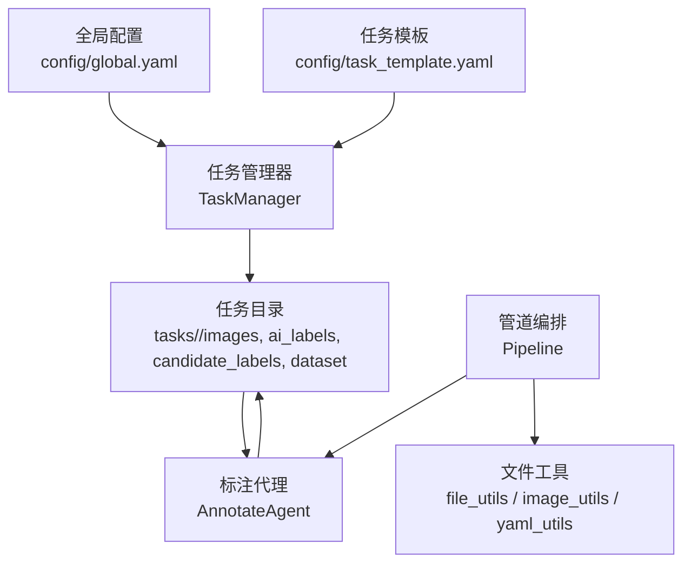
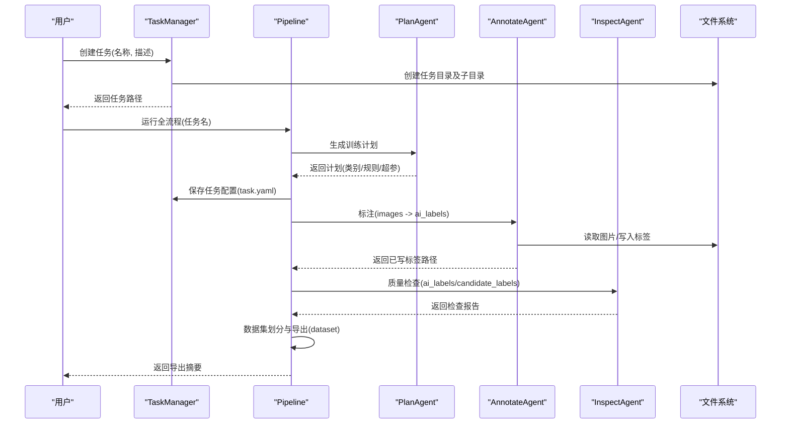
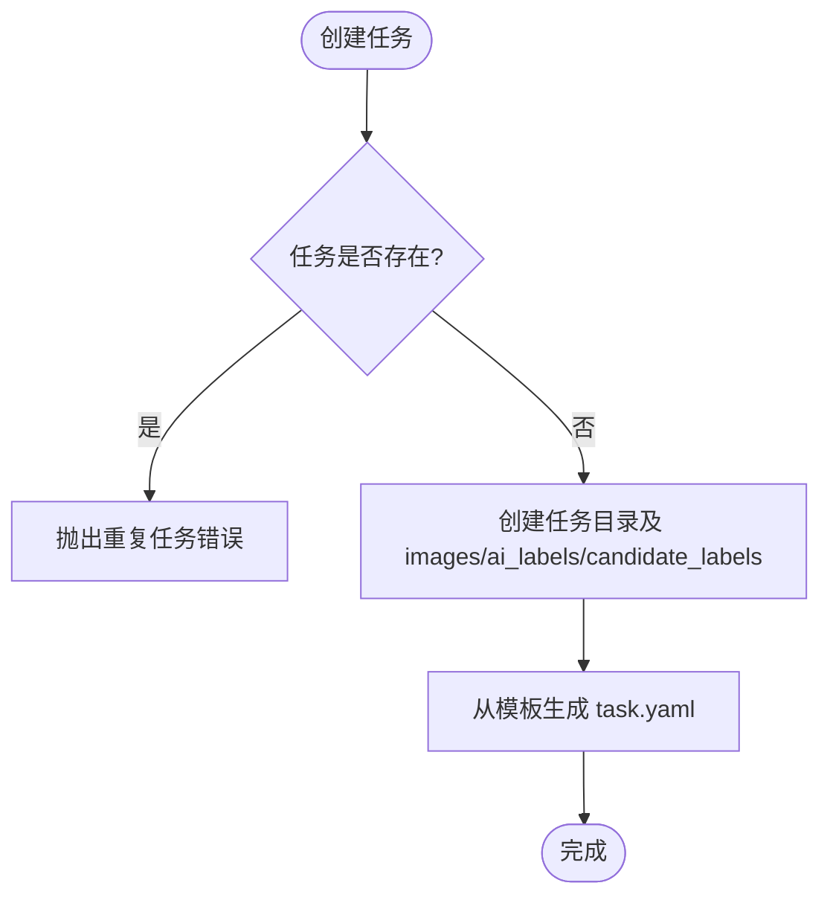
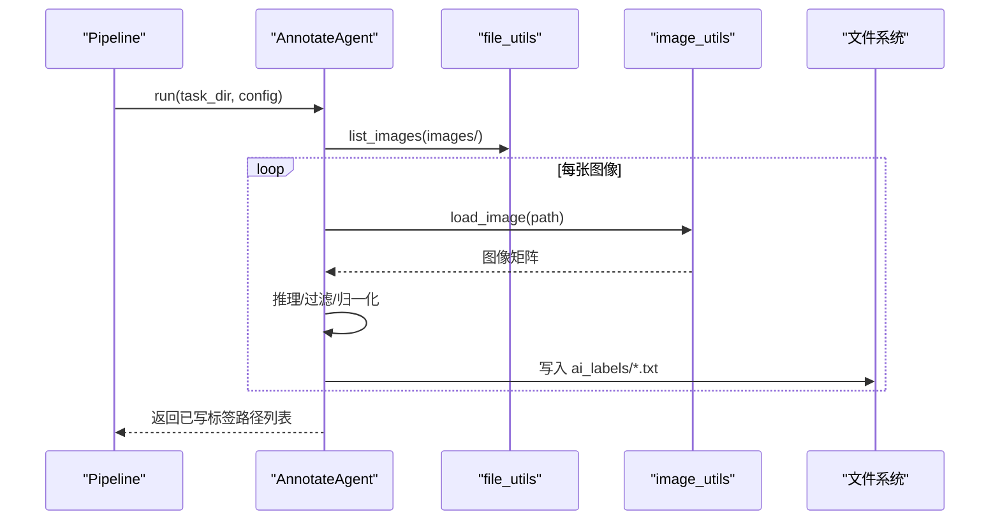
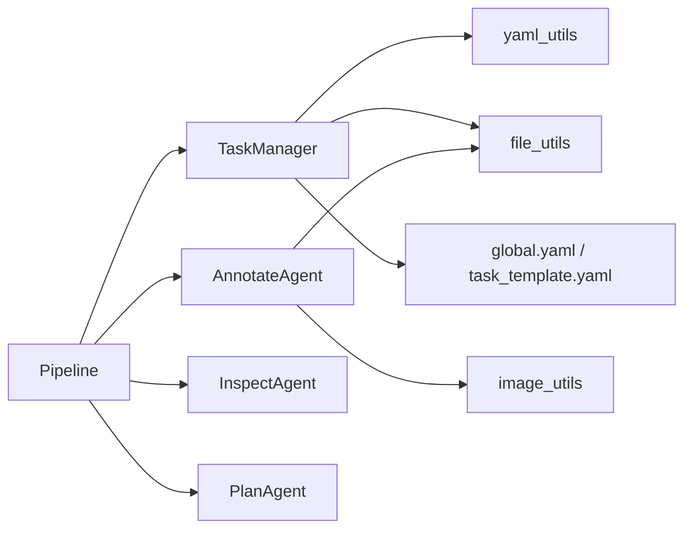

# 文件操作工具

<cite>
**本文引用的文件**
- [src/core/task_manager.py](file://src/core/task_manager.py)
- [src/utils/file_utils.py](file://src/utils/file_utils.py)
- [src/utils/image_utils.py](file://src/utils/image_utils.py)
- [src/utils/yaml_utils.py](file://src/utils/yaml_utils.py)
- [src/agents/annotate_agent.py](file://src/agents/annotate_agent.py)
- [src/core/pipeline.py](file://src/core/pipeline.py)
- [config/global.yaml](file://config/global.yaml)
- [config/task_template.yaml](file://config/task_template.yaml)
- [tests/test_task_manager.py](file://tests/test_task_manager.py)
- [tests/test_file_yaml_utils.py](file://tests/test_file_yaml_utils.py)
</cite>

## 目录
1. [简介](#简介)
2. [项目结构](#项目结构)
3. [核心组件](#核心组件)
4. [架构总览](#架构总览)
5. [详细组件分析](#详细组件分析)
6. [依赖关系分析](#依赖关系分析)
7. [性能考虑](#性能考虑)
8. [故障排查指南](#故障排查指南)
9. [结论](#结论)
10. [附录：使用示例](#附录使用示例)

## 简介
本文件操作工具围绕“任务目录结构管理、批量文件处理、路径管理、验证与错误日志”等能力，为图像标注与数据集准备提供稳定可靠的底层支撑。通过统一的 TaskManager、Pipeline 以及一系列 utils（文件、图像、YAML），实现从任务创建、计划生成、自动标注、质量检查到数据集导出的完整流程。

## 项目结构
- 任务根目录由全局配置指定，默认位于当前工作区下的 tasks 目录。每个任务以独立子目录组织，包含 images、ai_labels、candidate_labels、dataset 等标准子目录。
- 配置文件集中存放于 config 目录，包括全局配置 global.yaml 与任务模板 task_template.yaml。
- 工具层 utils 提供文件列举、目录创建、图像读取与校验、YAML 读写等通用能力。
- 核心流程由 Pipeline 编排，TaskManager 负责任务生命周期与配置持久化。
- 标注流程由 AnnotateAgent 完成，结合提示词与规则将检测结果转换为 YOLO-OBB 标签。

图表来源
- [config/global.yaml:17-20](file://config/global.yaml#L17-L20)
- [src/core/task_manager.py:14-38](file://src/core/task_manager.py#L14-L38)
- [config/task_template.yaml:1-54](file://config/task_template.yaml#L1-L54)
- [src/core/pipeline.py:22-46](file://src/core/pipeline.py#L22-L46)
- [src/utils/file_utils.py:10-35](file://src/utils/file_utils.py#L10-L35)
- [src/utils/image_utils.py:13-69](file://src/utils/image_utils.py#L13-L69)
- [src/utils/yaml_utils.py:11-44](file://src/utils/yaml_utils.py#L11-L44)

章节来源
- [config/global.yaml:17-20](file://config/global.yaml#L17-L20)
- [src/core/task_manager.py:14-38](file://src/core/task_manager.py#L14-L38)
- [config/task_template.yaml:1-54](file://config/task_template.yaml#L1-L54)
- [src/core/pipeline.py:22-46](file://src/core/pipeline.py#L22-L46)
- [src/utils/file_utils.py:10-35](file://src/utils/file_utils.py#L10-L35)
- [src/utils/image_utils.py:13-69](file://src/utils/image_utils.py#L13-L69)
- [src/utils/yaml_utils.py:11-44](file://src/utils/yaml_utils.py#L11-L44)

## 核心组件
- 任务管理器（TaskManager）：负责任务目录的创建、列举、加载与删除，维护任务配置（task.yaml），并基于模板初始化任务元数据。
- 管道（Pipeline）：编排 plan → annotate → inspect → split 四个阶段，统一调度各 Agent 并持久化中间结果。
- 标注代理（AnnotateAgent）：遍历 images 目录，对每张图片进行推理（当前为占位实现），按阈值和规则过滤后输出 YOLO-OBB 标签至 ai_labels。
- 文件工具（file_utils）：提供图片列表枚举、目录安全创建等基础能力。
- 图像工具（image_utils）：提供图像读取、尺寸获取、最小尺寸校验等能力。
- YAML 工具（yaml_utils）：提供安全的 YAML 读写，确保空文件返回空映射、非映射根抛出异常。

章节来源
- [src/core/task_manager.py:14-150](file://src/core/task_manager.py#L14-L150)
- [src/core/pipeline.py:22-325](file://src/core/pipeline.py#L22-L325)
- [src/agents/annotate_agent.py:22-185](file://src/agents/annotate_agent.py#L22-L185)
- [src/utils/file_utils.py:10-35](file://src/utils/file_utils.py#L10-L35)
- [src/utils/image_utils.py:13-69](file://src/utils/image_utils.py#L13-L69)
- [src/utils/yaml_utils.py:11-44](file://src/utils/yaml_utils.py#L11-L44)

## 架构总览
下图展示了从任务创建到数据集导出的端到端流程，以及各组件之间的调用关系。

图表来源
- [src/core/task_manager.py:51-80](file://src/core/task_manager.py#L51-L80)
- [src/core/pipeline.py:48-94](file://src/core/pipeline.py#L48-L94)
- [src/core/pipeline.py:96-153](file://src/core/pipeline.py#L96-L153)
- [src/core/pipeline.py:155-213](file://src/core/pipeline.py#L155-L213)
- [src/agents/annotate_agent.py:25-80](file://src/agents/annotate_agent.py#L25-L80)

## 详细组件分析

### 任务目录结构与层次设计
- 任务根目录：由全局配置 paths.tasks_root 指定，默认相对路径为 tasks。
- 任务目录：<tasks_root>/<name>/，包含 images（输入图）、ai_labels（AI 生成的 YOLO-OBB 标签）、candidate_labels（人工修正候选）、dataset（训练就绪的数据集）。
- 任务配置：task.yaml，由模板 task_template.yaml 填充默认值，并写入任务名与描述。

图表来源
- [src/core/task_manager.py:51-80](file://src/core/task_manager.py#L51-L80)
- [config/task_template.yaml:1-54](file://config/task_template.yaml#L1-L54)

章节来源
- [config/global.yaml:17-20](file://config/global.yaml#L17-L20)
- [src/core/task_manager.py:14-80](file://src/core/task_manager.py#L14-L80)
- [config/task_template.yaml:1-54](file://config/task_template.yaml#L1-L54)

### 批量文件处理
- 批量读取图像：list_images 支持 jpg/jpeg/png/bmp/tif/tiff，非递归扫描并按文件名排序；缺失目录返回空列表。
- 批量写入标注：AnnotateAgent 遍历 images，逐张读取尺寸、渲染提示、执行推理（当前为占位）、过滤与归一化坐标，输出 YOLO-OBB 文本标签到 ai_labels。
- 元数据批量操作：Pipeline 在 split 阶段复制图像与标签到 dataset/{train,val,test}，并生成 data.yaml 与 train_command.txt。

图表来源
- [src/utils/file_utils.py:10-22](file://src/utils/file_utils.py#L10-L22)
- [src/utils/image_utils.py:13-33](file://src/utils/image_utils.py#L13-L33)
- [src/agents/annotate_agent.py:25-80](file://src/agents/annotate_agent.py#L25-L80)
- [src/core/pipeline.py:124-137](file://src/core/pipeline.py#L124-L137)

章节来源
- [src/utils/file_utils.py:10-22](file://src/utils/file_utils.py#L10-L22)
- [src/utils/image_utils.py:13-33](file://src/utils/image_utils.py#L13-L33)
- [src/agents/annotate_agent.py:25-80](file://src/agents/annotate_agent.py#L25-L80)
- [src/core/pipeline.py:124-137](file://src/core/pipeline.py#L124-L137)

### 文件路径管理
- 相对路径解析：全局配置 paths.tasks_root 为相对路径，实际使用时由 Path 对象拼接任务名形成绝对路径。
- 绝对路径转换：所有内部路径均通过 pathlib.Path 构造，便于跨平台兼容。
- 跨平台兼容性：Path 与 os 无关的文件操作，mkdir(parents=True, exist_ok=True) 保证幂等创建。

章节来源
- [config/global.yaml:17-20](file://config/global.yaml#L17-L20)
- [src/core/task_manager.py:30-49](file://src/core/task_manager.py#L30-L49)
- [src/utils/file_utils.py:25-35](file://src/utils/file_utils.py#L25-L35)

### 文件监控与同步机制
- 变更检测：当前未实现文件系统事件监听或增量对比；split 阶段会重新复制 images 与标签到 dataset，属于全量覆盖式同步。
- 增量更新：可通过外部脚本比较时间戳或哈希后再调用 split，以减少不必要拷贝。
- 冲突解决：当存在 candidate_labels 时优先采用；否则回退到 ai_labels。

章节来源
- [src/core/pipeline.py:155-213](file://src/core/pipeline.py#L155-L213)
- [src/core/pipeline.py:215-232](file://src/core/pipeline.py#L215-L232)

### 文件验证功能
- 文件格式检查：list_images 仅接受指定扩展名；load_image 使用 OpenCV 解码，失败抛错。
- 完整性验证：validate_image 尝试解码并校验最小宽高，返回布尔结果。
- 权限检查：当前未显式检查读写权限；若权限不足，底层 IO 将抛出异常，需在上层捕获。

章节来源
- [src/utils/file_utils.py:10-22](file://src/utils/file_utils.py#L10-L22)
- [src/utils/image_utils.py:13-69](file://src/utils/image_utils.py#L13-L69)

### 错误处理与日志记录
- 错误类型：
  - FileNotFoundError：任务不存在、YAML 缺失、图像不存在。
  - FileExistsError：重复创建任务。
  - ValueError：YAML 根不是映射、图像无法解码。
- 日志记录：各模块通过 logging.getLogger 记录关键步骤（创建任务、保存配置、删除任务、标注进度、导出摘要等）。
- 健壮性：ensure_dir 幂等创建；list_images 对缺失目录返回空列表；load_yaml 对空文件返回空映射。

章节来源
- [src/core/task_manager.py:67-137](file://src/core/task_manager.py#L67-L137)
- [src/utils/yaml_utils.py:11-44](file://src/utils/yaml_utils.py#L11-L44)
- [src/agents/annotate_agent.py:115-161](file://src/agents/annotate_agent.py#L115-L161)
- [src/core/pipeline.py:77-94](file://src/core/pipeline.py#L77-L94)

## 依赖关系分析
- Pipeline 依赖 TaskManager、三个 Agent（plan/annotate/inspect）以及 file_utils/yaml_utils。
- AnnotateAgent 依赖 file_utils（列举图像）、image_utils（读取图像）、obb_utils（坐标变换，虽未在引用中展开但被导入）。
- TaskManager 依赖 file_utils（目录创建）与 yaml_utils（配置读写）。
- 全局配置 global.yaml 提供 tasks_root、prompts_dir、config_dir 等路径与模型参数。

图表来源
- [src/core/pipeline.py:22-46](file://src/core/pipeline.py#L22-L46)
- [src/core/task_manager.py:10-11](file://src/core/task_manager.py#L10-L11)
- [src/agents/annotate_agent.py:16-19](file://src/agents/annotate_agent.py#L16-L19)
- [config/global.yaml:17-20](file://config/global.yaml#L17-L20)
- [config/task_template.yaml:1-54](file://config/task_template.yaml#L1-L54)

章节来源
- [src/core/pipeline.py:22-46](file://src/core/pipeline.py#L22-L46)
- [src/core/task_manager.py:10-11](file://src/core/task_manager.py#L10-L11)
- [src/agents/annotate_agent.py:16-19](file://src/agents/annotate_agent.py#L16-L19)
- [config/global.yaml:17-20](file://config/global.yaml#L17-L20)
- [config/task_template.yaml:1-54](file://config/task_template.yaml#L1-L54)

## 性能考虑
- 图像读取：OpenCV 解码可能成为瓶颈，建议按需灰度模式减少计算；批量处理时可考虑缓存图像尺寸。
- 标签写入：小文件频繁写入开销较大，可合并写入或异步落盘（当前实现为逐行追加换行符）。
- 数据集导出：split 阶段全量复制，数据量大时可引入增量复制策略（如基于时间戳或哈希）。
- 随机种子：split 使用固定随机种子以保证可复现性。

[本节为通用指导，不直接分析具体文件]

## 故障排查指南
- 任务不存在：load_task 或 delete_task 会抛出 FileNotFoundError，请确认任务名与 tasks_root 路径。
- 重复任务：create_task 对已存在任务抛出 FileExistsError，请先删除或更换名称。
- 图像无法解码：load_image 抛出 ValueError，检查图像是否损坏或格式不被支持。
- YAML 格式错误：load_yaml 要求根为映射，空文件返回空映射；非映射根抛出 ValueError。
- 无图像可分割：split 阶段若无图像将返回空摘要并记录警告，需先放入 images。

章节来源
- [src/core/task_manager.py:92-137](file://src/core/task_manager.py#L92-L137)
- [src/utils/image_utils.py:13-69](file://src/utils/image_utils.py#L13-L69)
- [src/utils/yaml_utils.py:11-44](file://src/utils/yaml_utils.py#L11-L44)
- [src/core/pipeline.py:155-177](file://src/core/pipeline.py#L155-L177)

## 结论
该文件操作工具以 TaskManager 与 Pipeline 为核心，配合 file/image/yaml 工具，实现了任务目录标准化、批量图像处理与标注、数据集导出的一体化流程。其设计强调可复用性与可观测性（日志与测试覆盖），适合在工业视觉标注与训练准备场景中稳定使用。后续可在文件监控、增量同步与权限检查方面进一步增强。

[本节为总结，不直接分析具体文件]

## 附录：使用示例
以下示例展示如何在任务管理与数据处理流程中使用本工具。为避免泄露实现细节，仅提供调用思路与预期行为说明。

- 创建任务
  - 调用 TaskManager.create_task(name, description)，将在 tasks_root 下创建任务目录与 images/ai_labels/candidate_labels，并生成 task.yaml。
  - 参考：[src/core/task_manager.py:51-80](file://src/core/task_manager.py#L51-L80)

- 列出任务
  - 调用 TaskManager.list_tasks() 获取已存在的任务名列表（仅目录）。
  - 参考：[src/core/task_manager.py:82-90](file://src/core/task_manager.py#L82-L90)

- 加载与保存任务配置
  - 调用 TaskManager.load_task(name) 读取 task.yaml；修改后可用 save_task_config(name, config) 持久化。
  - 参考：[src/core/task_manager.py:92-122](file://src/core/task_manager.py#L92-L122)

- 运行全流程
  - 调用 Pipeline.run_full(task_name) 依次执行 plan、annotate、inspect、split。
  - 参考：[src/core/pipeline.py:48-60](file://src/core/pipeline.py#L48-L60)

- 单步执行
  - 调用 Pipeline.run_step(task_name, step) 执行指定步骤（plan/annotate/inspect/split）。
  - 参考：[src/core/pipeline.py:62-94](file://src/core/pipeline.py#L62-L94)

- 批量标注
  - 将图像放入 <task_dir>/images，运行 annotate 步骤；结果写入 <task_dir>/ai_labels/*.txt。
  - 参考：[src/agents/annotate_agent.py:25-80](file://src/agents/annotate_agent.py#L25-L80)

- 数据集导出
  - 运行 split 步骤，生成 dataset/{train,val,test}、data.yaml 与 train_command.txt。
  - 参考：[src/core/pipeline.py:155-213](file://src/core/pipeline.py#L155-L213)

- 图像校验
  - 使用 validate_image(path, min_size=16) 快速判断图像是否可用。
  - 参考：[src/utils/image_utils.py:54-69](file://src/utils/image_utils.py#L54-L69)

- 单元测试参考
  - 任务管理器的创建、列举、保存/加载、删除等行为已通过测试覆盖。
  - 参考：[tests/test_task_manager.py:11-65](file://tests/test_task_manager.py#L11-L65)
  - 文件与 YAML 工具的边界条件已通过测试覆盖。
  - 参考：[tests/test_file_yaml_utils.py:12-59](file://tests/test_file_yaml_utils.py#L12-L59)