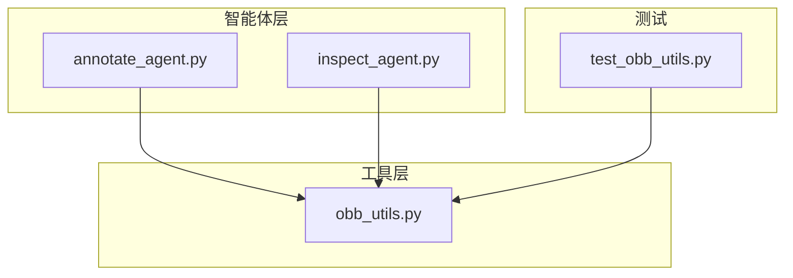
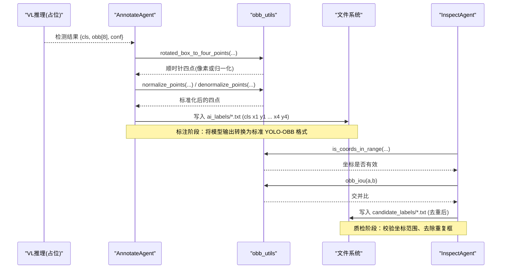
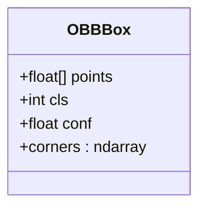
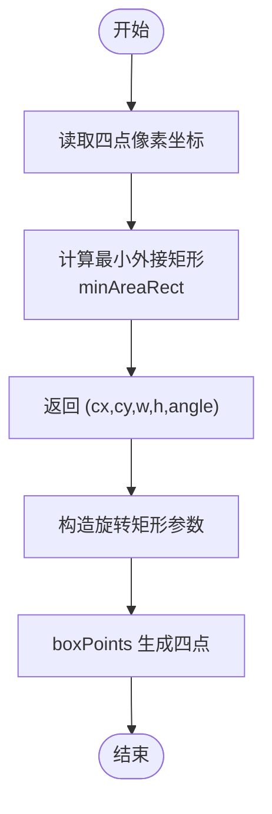
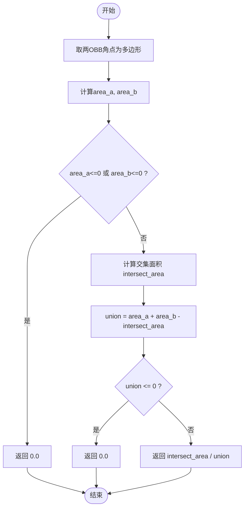
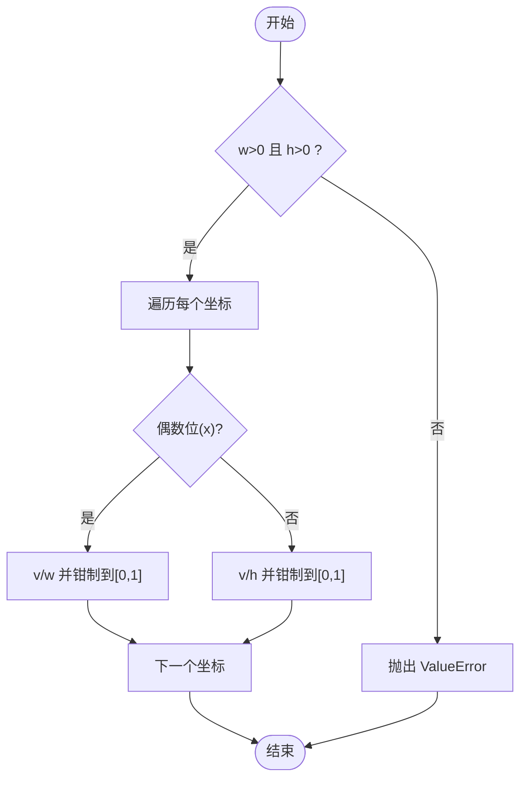
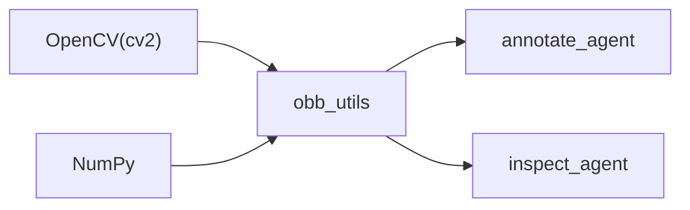

# 旋转边界框几何处理

<cite>
**本文引用的文件**
- [src/utils/obb_utils.py](file://src/utils/obb_utils.py)
- [tests/test_obb_utils.py](file://tests/test_obb_utils.py)
- [src/agents/annotate_agent.py](file://src/agents/annotate_agent.py)
- [src/agents/inspect_agent.py](file://src/agents/inspect_agent.py)
</cite>

## 目录
1. [简介](#简介)
2. [项目结构](#项目结构)
3. [核心组件](#核心组件)
4. [架构总览](#架构总览)
5. [详细组件分析](#详细组件分析)
6. [依赖关系分析](#依赖关系分析)
7. [性能考虑](#性能考虑)
8. [故障排查指南](#故障排查指南)
9. [结论](#结论)
10. [附录：使用示例与场景](#附录使用示例与场景)

## 简介
本文件面向 YOLO-OBB 数据集的旋转边界框（OBB）几何处理，系统化说明 OBBBox 数据类的设计、坐标转换函数、IoU 计算算法、坐标归一化/反归一化以及坐标范围验证的实现细节。文档同时给出在标注与质检流程中的典型使用场景，帮助读者快速理解并正确应用这些工具函数。

## 项目结构
与 OBB 几何处理直接相关的代码集中在 utils 层，并在 agents 层被调用以完成端到端的标注与质检任务：
- 几何工具：src/utils/obb_utils.py
- 单元测试：tests/test_obb_utils.py
- 自动标注：src/agents/annotate_agent.py
- 质检与去重：src/agents/inspect_agent.py

图表来源
- [src/utils/obb_utils.py:1-151](file://src/utils/obb_utils.py#L1-L151)
- [src/agents/annotate_agent.py:1-185](file://src/agents/annotate_agent.py#L1-L185)
- [src/agents/inspect_agent.py:1-227](file://src/agents/inspect_agent.py#L1-L227)
- [tests/test_obb_utils.py:1-84](file://tests/test_obb_utils.py#L1-L84)

章节来源
- [src/utils/obb_utils.py:1-151](file://src/utils/obb_utils.py#L1-L151)
- [src/agents/annotate_agent.py:1-185](file://src/agents/annotate_agent.py#L1-L185)
- [src/agents/inspect_agent.py:1-227](file://src/agents/inspect_agent.py#L1-L227)
- [tests/test_obb_utils.py:1-84](file://tests/test_obb_utils.py#L1-L84)

## 核心组件
- OBBBox 数据类：封装顺时针四点坐标、类别 ID 与置信度，并提供角点矩阵属性。
- 坐标转换：
  - four_points_to_rotated_box()：四点像素坐标 → 旋转矩形参数 (cx, cy, w, h, angle)。
  - rotated_box_to_four_points()：旋转矩形参数 → 顺时针四点坐标。
- IoU 计算：obb_iou() 基于凸多边形交集面积计算两个 OBB 的交并比。
- 坐标归一化/反归一化：normalize_points() 与 denormalize_points() 实现像素坐标与 [0,1] 归一化坐标之间的转换。
- 坐标范围验证：is_coords_in_range() 校验归一化坐标是否在允许范围内。

章节来源
- [src/utils/obb_utils.py:16-151](file://src/utils/obb_utils.py#L16-L151)

## 架构总览
下图展示了从“检测输出”到“YOLO-OBB 标签写入”，再到“质检与去重”的整体流程，突出 OBB 几何工具在各环节的作用。

图表来源
- [src/agents/annotate_agent.py:112-160](file://src/agents/annotate_agent.py#L112-L160)
- [src/utils/obb_utils.py:40-151](file://src/utils/obb_utils.py#L40-L151)
- [src/agents/inspect_agent.py:133-226](file://src/agents/inspect_agent.py#L133-L226)

## 详细组件分析

### OBBBox 数据类
- 设计要点
  - points：顺时针四个角点的扁平列表 [x1,y1,x2,y2,x3,y3,x4,y4]，支持像素或归一化坐标。
  - cls：类别 ID（0 起始）。
  - conf：置信度，默认 1.0。
  - corners：将 points 重塑为 (4,2) 的二维数组，便于后续几何运算。
- 复杂度
  - corners 属性为 O(1) 视图操作（numpy reshape），无额外内存分配。
- 错误处理
  - 若 points 长度不为 8，后续几何函数可能抛出异常；建议在入口处校验。

图表来源
- [src/utils/obb_utils.py:16-38](file://src/utils/obb_utils.py#L16-L38)

章节来源
- [src/utils/obb_utils.py:16-38](file://src/utils/obb_utils.py#L16-L38)

### 坐标转换：四点 ↔ 旋转矩形参数
- four_points_to_rotated_box(points)
  - 输入：顺时针四点像素坐标。
  - 过程：通过最小外接矩形得到中心、宽高与角度。
  - 输出：(cx, cy, w, h, angle)，角度范围为 (-90, 0]。
  - 复杂度：O(1)。
- rotated_box_to_four_points(cx, cy, w, h, angle)
  - 输入：旋转矩形参数。
  - 过程：根据 OpenCV 的 boxPoints 生成四点。
  - 输出：顺时针四点坐标。
  - 复杂度：O(1)。
- 注意事项
  - 由于 minAreaRect 可能交换宽高并调整角度，测试中采用集合比较角点来验证往返一致性。

图表来源
- [src/utils/obb_utils.py:40-70](file://src/utils/obb_utils.py#L40-L70)

章节来源
- [src/utils/obb_utils.py:40-70](file://src/utils/obb_utils.py#L40-L70)
- [tests/test_obb_utils.py:17-31](file://tests/test_obb_utils.py#L17-L31)

### IoU 计算：obb_iou(a, b)
- 算法步骤
  - 将两 OBB 的角点转为浮点多边形。
  - 计算各自面积与交集面积。
  - 若任一面积为 0 或并集为 0，返回 0.0。
  - 否则返回 交集面积 / 并集面积。
- 复杂度
  - 主要开销来自凸多边形交集与面积计算，近似 O(n)（n=4）。
- 鲁棒性
  - 对退化框（零面积）进行保护，避免除零。

图表来源
- [src/utils/obb_utils.py:73-93](file://src/utils/obb_utils.py#L73-L93)

章节来源
- [src/utils/obb_utils.py:73-93](file://src/utils/obb_utils.py#L73-L93)
- [tests/test_obb_utils.py:34-54](file://tests/test_obb_utils.py#L34-L54)

### 坐标归一化与反归一化
- normalize_points(points, w, h)
  - 将像素坐标按宽/高分别缩放至 [0,1]，并对越界值进行钳制。
  - 若 w 或 h 非正，抛出 ValueError。
- denormalize_points(points, w, h)
  - 将归一化坐标还原为像素坐标。
  - 若 w 或 h 非正，抛出 ValueError。
- 复杂度：O(N)，N 为坐标点数。

图表来源
- [src/utils/obb_utils.py:96-137](file://src/utils/obb_utils.py#L96-L137)

章节来源
- [src/utils/obb_utils.py:96-137](file://src/utils/obb_utils.py#L96-L137)
- [tests/test_obb_utils.py:57-83](file://tests/test_obb_utils.py#L57-L83)

### 坐标范围验证：is_coords_in_range(points, eps)
- 功能：检查所有坐标是否在 [-eps, 1+eps] 范围内，用于容差判断。
- 用途：在质检阶段过滤非法坐标。

章节来源
- [src/utils/obb_utils.py:140-151](file://src/utils/obb_utils.py#L140-L151)
- [tests/test_obb_utils.py:71-74](file://tests/test_obb_utils.py#L71-L74)

## 依赖关系分析
- 外部库
  - numpy：数组重塑与数值计算。
  - opencv-python (cv2)：最小外接矩形、boxPoints、凸多边形面积与交集。
- 内部模块
  - annotate_agent 依赖 obb_utils 的坐标转换与归一化，将模型输出转为 YOLO-OBB 文本。
  - inspect_agent 依赖 obb_utils 的 OBBBox、IoU 与坐标范围校验，执行质检与去重。

图表来源
- [src/utils/obb_utils.py:1-151](file://src/utils/obb_utils.py#L1-L151)
- [src/agents/annotate_agent.py:1-185](file://src/agents/annotate_agent.py#L1-L185)
- [src/agents/inspect_agent.py:1-227](file://src/agents/inspect_agent.py#L1-L227)

章节来源
- [src/utils/obb_utils.py:1-151](file://src/utils/obb_utils.py#L1-L151)
- [src/agents/annotate_agent.py:1-185](file://src/agents/annotate_agent.py#L1-L185)
- [src/agents/inspect_agent.py:1-227](file://src/agents/inspect_agent.py#L1-L227)

## 性能考虑
- 时间复杂度
  - 坐标转换与归一化均为 O(1) 或 O(N)（N 为坐标数），开销极低。
  - IoU 计算涉及凸多边形交集，对于 4 点多边形可视为常数级开销。
- 空间复杂度
  - 仅使用少量临时数组，内存占用极小。
- 优化建议
  - 批量处理时尽量向量化（如批量归一化）。
  - 对大量框的去重可采用先验索引或空间划分减少成对比较次数。

## 故障排查指南
- 常见错误与定位
  - 图像尺寸非正：normalize/denormalize 会抛出 ValueError，需检查传入的 w、h。
  - 坐标越界：质检阶段会被标记为 coords_out_of_range，需回溯数据来源。
  - 零面积框：IoU 计算会返回 0.0，避免除零；若出现大量零面积框，应检查标注质量。
  - 角度与宽高歧义：minAreaRect 可能交换宽高与调整角度，建议使用集合比较角点验证往返一致性。
- 调试建议
  - 打印中间结果（如 corners、area_a/b、intersect_area）。
  - 使用单元测试覆盖边界情况（相同框、不相交框、退化框）。

章节来源
- [src/utils/obb_utils.py:96-151](file://src/utils/obb_utils.py#L96-L151)
- [tests/test_obb_utils.py:57-83](file://tests/test_obb_utils.py#L57-L83)

## 结论
本模块提供了一套完整且健壮的 OBB 几何工具，涵盖数据建模、坐标转换、IoU 计算、坐标归一化与范围校验，能够无缝嵌入 YOLO-OBB 的标注与质检流水线。其实现简洁高效，并通过单元测试覆盖了关键路径与边界条件，适合在生产环境中稳定使用。

## 附录：使用示例与场景
- 自动标注（AnnotateAgent）
  - 将模型输出的归一化四点坐标还原为像素坐标，计算多边形面积以过滤过小目标，再归一化回 [0,1] 写入 YOLO-OBB 标签。
  - 参考路径：[src/agents/annotate_agent.py:112-160](file://src/agents/annotate_agent.py#L112-L160)
- 质检与去重（InspectAgent）
  - 解析标签文件为 OBBBox 列表，校验坐标范围，计算任意两框的 IoU，超过阈值则判定为重复并剔除。
  - 参考路径：[src/agents/inspect_agent.py:133-226](file://src/agents/inspect_agent.py#L133-L226)
- 单元测试（test_obb_utils）
  - 验证往返转换一致性、IoU 的极端情况、归一化钳制行为与无效尺寸的错误抛出。
  - 参考路径：[tests/test_obb_utils.py:17-83](file://tests/test_obb_utils.py#L17-L83)

章节来源
- [src/agents/annotate_agent.py:112-160](file://src/agents/annotate_agent.py#L112-L160)
- [src/agents/inspect_agent.py:133-226](file://src/agents/inspect_agent.py#L133-L226)
- [tests/test_obb_utils.py:17-83](file://tests/test_obb_utils.py#L17-L83)