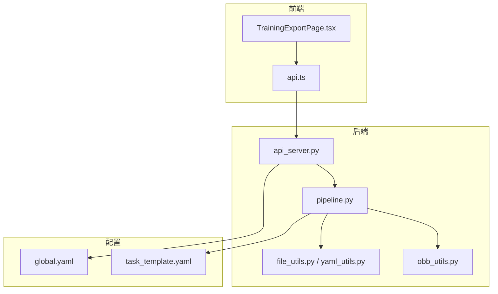
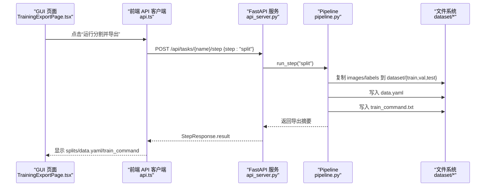
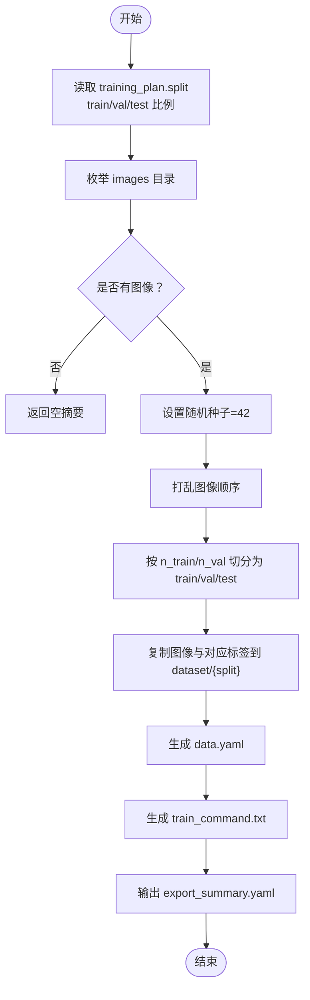
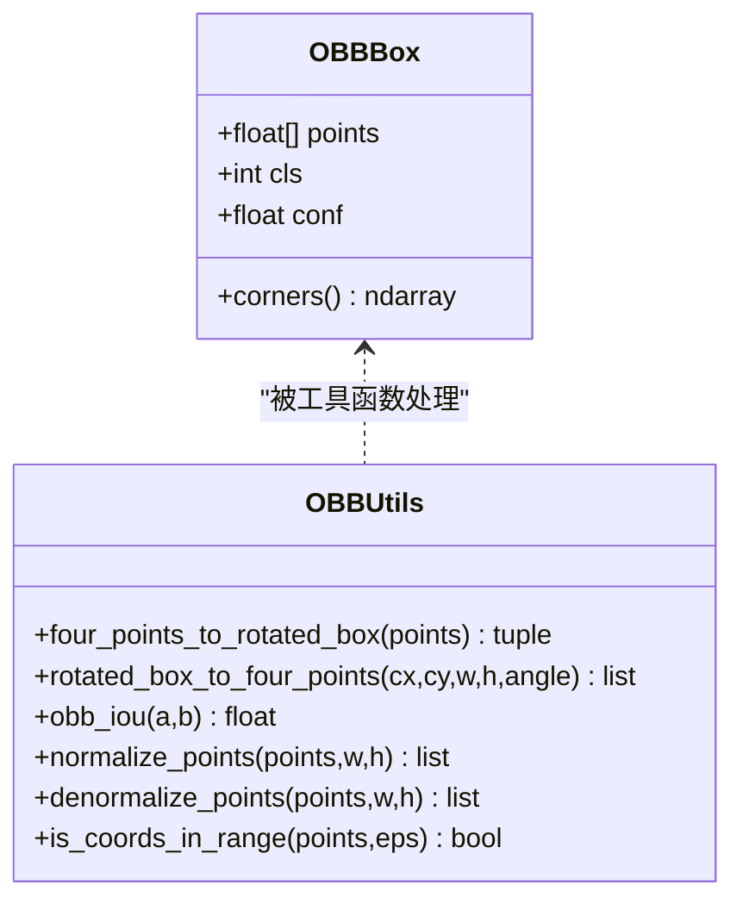
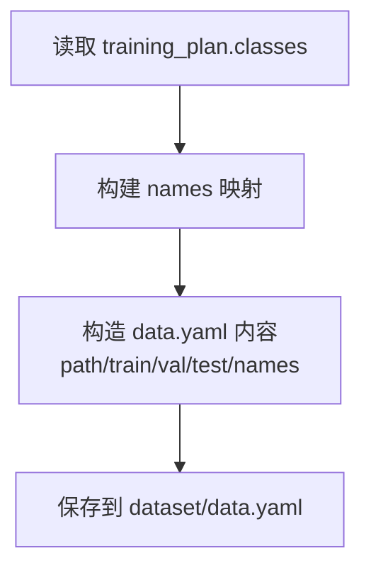
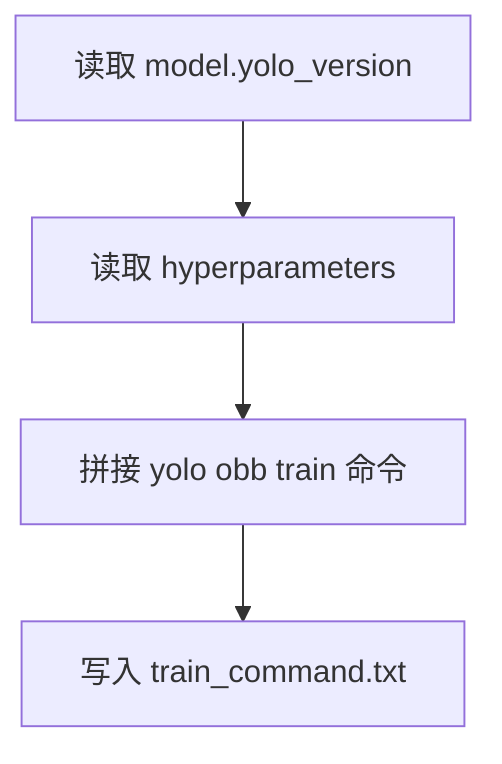
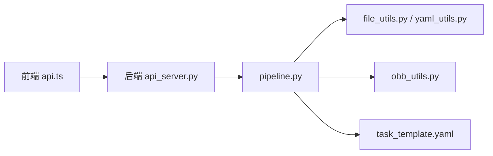

# 数据集导出功能

<cite>
**本文引用的文件**   
- [pipeline.py](file://src/core/pipeline.py)
- [obb_utils.py](file://src/utils/obb_utils.py)
- [api_server.py](file://src/api_server.py)
- [TrainingExportPage.tsx](file://gui/src/pages/TrainingExportPage.tsx)
- [api.ts](file://gui/src/services/api.ts)
- [global.yaml](file://config/global.yaml)
- [task_template.yaml](file://config/task_template.yaml)
- [file_utils.py](file://src/utils/file_utils.py)
- [yaml_utils.py](file://src/utils/yaml_utils.py)
</cite>

## 目录
1. [简介](#简介)
2. [项目结构](#项目结构)
3. [核心组件](#核心组件)
4. [架构总览](#架构总览)
5. [详细组件分析](#详细组件分析)
6. [依赖关系分析](#依赖关系分析)
7. [性能与可扩展性](#性能与可扩展性)
8. [故障排查指南](#故障排查指南)
9. [结论](#结论)
10. [附录：自定义导出格式扩展指南](#附录自定义导出格式扩展指南)

## 简介
本文件面向“数据集导出”能力，围绕 YOLO-OBB 目标检测任务，系统化说明以下方面：
- 数据集分割策略：train/val/test 比例分配、随机种子控制、类别平衡保证。
- YOLO-OBB 标注格式转换：标注文件格式、坐标系统标准化、元数据生成。
- data.yaml 自动生成：类别定义、路径配置、训练参数。
- 训练命令自动生成与优化建议。
- 数据集质量保证：重复检测、异常值过滤、格式验证。
- 自定义导出格式的扩展方法。

该功能通过 GUI 触发后端流水线，最终在任务目录下生成可直接用于 YOLO-OBB 训练的 dataset 包。

## 项目结构
与数据集导出直接相关的代码分布在后端流水线、工具库、API 服务以及前端页面中：
- 后端流水线负责计划、标注、检查与分割导出。
- OBB 几何工具提供旋转框表示、坐标归一化/反归一化、IoU 计算等。
- API 服务暴露 HTTP 接口供 GUI 调用。
- 前端页面提供“运行分割并导出”的交互入口。
- 配置文件定义全局设置与任务模板。

图表来源
- [TrainingExportPage.tsx:1-75](file://gui/src/pages/TrainingExportPage.tsx#L1-L75)
- [api.ts:1-80](file://gui/src/services/api.ts#L1-L80)
- [api_server.py:1-384](file://src/api_server.py#L1-L384)
- [pipeline.py:1-325](file://src/core/pipeline.py#L1-L325)
- [file_utils.py:1-36](file://src/utils/file_utils.py#L1-L36)
- [yaml_utils.py:1-45](file://src/utils/yaml_utils.py#L1-L45)
- [obb_utils.py:1-151](file://src/utils/obb_utils.py#L1-L151)
- [global.yaml:1-29](file://config/global.yaml#L1-L29)
- [task_template.yaml:1-54](file://config/task_template.yaml#L1-L54)

章节来源
- [TrainingExportPage.tsx:1-75](file://gui/src/pages/TrainingExportPage.tsx#L1-L75)
- [api.ts:1-80](file://gui/src/services/api.ts#L1-L80)
- [api_server.py:1-384](file://src/api_server.py#L1-L384)
- [pipeline.py:1-325](file://src/core/pipeline.py#L1-L325)
- [file_utils.py:1-36](file://src/utils/file_utils.py#L1-L36)
- [yaml_utils.py:1-45](file://src/utils/yaml_utils.py#L1-L45)
- [obb_utils.py:1-151](file://src/utils/obb_utils.py#L1-L151)
- [global.yaml:1-29](file://config/global.yaml#L1-L29)
- [task_template.yaml:1-54](file://config/task_template.yaml#L1-L54)

## 核心组件
- Pipeline（流水线）：编排 plan/annotate/inspect/split 四个步骤；split 阶段负责复制图像与标签、写入 data.yaml 与 train_command.txt，并输出 export_summary.yaml。
- OBB 工具：提供 OBBBox 数据结构、四点顺时针表示、旋转框与四点互转、归一化/反归一化、坐标范围校验、OBB IoU。
- API 服务：将 GUI 请求映射到 Pipeline 步骤，并提供导出摘要查询、标注读取等接口。
- 工具库：文件与 YAML 读写、图像列表枚举。
- 配置：全局配置与任务模板，定义默认 split 比例、模型与超参、质检规则等。

章节来源
- [pipeline.py:22-325](file://src/core/pipeline.py#L22-L325)
- [obb_utils.py:16-151](file://src/utils/obb_utils.py#L16-L151)
- [api_server.py:91-138](file://src/api_server.py#L91-L138)
- [file_utils.py:10-35](file://src/utils/file_utils.py#L10-L35)
- [yaml_utils.py:11-44](file://src/utils/yaml_utils.py#L11-L44)
- [task_template.yaml:8-54](file://config/task_template.yaml#L8-L54)

## 架构总览
下图展示从 GUI 到后端导出的完整调用链，以及关键数据产物。

图表来源
- [TrainingExportPage.tsx:17-32](file://gui/src/pages/TrainingExportPage.tsx#L17-L32)
- [api.ts:23-36](file://gui/src/services/api.ts#L23-L36)
- [api_server.py:169-192](file://src/api_server.py#L169-L192)
- [pipeline.py:155-213](file://src/core/pipeline.py#L155-L213)

## 详细组件分析

### 数据集分割策略
- 比例分配
  - 从 training_plan.split 中读取 train_ratio、val_ratio、test_ratio，默认分别为 0.7、0.2、0.1。
  - 对图像列表进行洗牌后按顺序切分：前 n_train 为 train，随后 n_val 为 val，剩余为 test。
- 随机种子控制
  - 使用固定随机种子 42，确保多次运行可复现。
- 类别平衡保证
  - 当前实现未执行基于类别的分层抽样；stratified 字段存在但未被使用。
  - 若需严格类别平衡，可在 shuffle 前按类别分组再按比例抽取，或引入分层采样器。

图表来源
- [pipeline.py:155-213](file://src/core/pipeline.py#L155-L213)

章节来源
- [pipeline.py:155-213](file://src/core/pipeline.py#L155-L213)
- [task_template.yaml:17-22](file://config/task_template.yaml#L17-L22)

### YOLO-OBB 格式转换与坐标系统
- 标注文件格式
  - 每行一个标注：cls x1 y1 x2 y2 x3 y3 x4 y4，其中坐标为归一化值（[0,1]）。
  - API 层解析时跳过格式错误的行，并记录警告日志。
- 坐标系统标准化
  - 支持绝对像素坐标与归一化坐标之间的相互转换。
  - 提供坐标范围校验函数，确保所有点在 [0,1] 范围内。
- 元数据生成
  - 导出摘要包含各 split 的图像数量、data.yaml 路径与训练命令。
  - 训练命令以字符串形式写入 train_command.txt，便于直接复制运行。

图表来源
- [obb_utils.py:16-151](file://src/utils/obb_utils.py#L16-L151)

章节来源
- [api_server.py:91-118](file://src/api_server.py#L91-L118)
- [obb_utils.py:40-151](file://src/utils/obb_utils.py#L40-L151)

### data.yaml 自动生成
- 类别定义
  - 从 training_plan.classes 中读取 id->名称映射，写入 names 字段。
- 路径配置
  - path 设为相对根目录 "."。
  - train/val/test 分别指向各自 images 子目录。
- 训练参数
  - data.yaml 不包含训练超参；训练超参由训练命令携带。

图表来源
- [pipeline.py:234-256](file://src/core/pipeline.py#L234-L256)

章节来源
- [pipeline.py:234-256](file://src/core/pipeline.py#L234-L256)
- [task_template.yaml:8-15](file://config/task_template.yaml#L8-L15)

### 训练命令自动生成与优化建议
- 自动命令
  - 根据 training_plan.model.yolo_version、hyperparameters（epochs/batch/imgsz/optimizer/lr0/weight_decay/device）拼接 yolo obb train 命令。
  - 同时写入 dataset/train_command.txt。
- 优化建议
  - 根据显存与数据规模调整 batch、imgsz。
  - 使用 AdamW 与合适的 lr0、weight_decay。
  - 针对小样本场景增加 epochs 或使用预训练权重。
  - 多卡训练时合理设置 device。

图表来源
- [pipeline.py:258-281](file://src/core/pipeline.py#L258-L281)

章节来源
- [pipeline.py:258-281](file://src/core/pipeline.py#L258-L281)
- [task_template.yaml:24-37](file://config/task_template.yaml#L24-L37)

### 数据集质量保证措施
- 重复检测
  - 质检规则中包含 iou_duplicate_threshold，用于检测重叠度高的重复框。
  - 当前导出流程不直接执行去重，建议在 inspect 阶段完成。
- 异常值过滤
  - 尺寸异常阈值 size_outlier_ratio 可用于过滤面积异常的目标。
  - 坐标越界检查 check_coords_out_of_range 结合 is_coords_in_range 进行校验。
- 格式验证
  - API 层解析标注文件时跳过格式错误行并告警。
  - 图像枚举仅接受常见扩展名，避免无效文件进入导出。

章节来源
- [task_template.yaml:39-47](file://config/task_template.yaml#L39-L47)
- [api_server.py:91-118](file://src/api_server.py#L91-L118)
- [file_utils.py:10-22](file://src/utils/file_utils.py#L10-L22)
- [obb_utils.py:140-151](file://src/utils/obb_utils.py#L140-L151)

## 依赖关系分析
- 前端依赖 FastAPI 后端提供的 REST 接口。
- 后端 API 服务依赖 Pipeline 执行具体步骤。
- Pipeline 依赖 TaskManager（任务管理）、工具库（文件/YAML）、OBB 工具。
- 配置驱动行为：task_template.yaml 决定默认 split、质检规则、模型与超参。

图表来源
- [api.ts:1-80](file://gui/src/services/api.ts#L1-L80)
- [api_server.py:1-384](file://src/api_server.py#L1-L384)
- [pipeline.py:1-325](file://src/core/pipeline.py#L1-L325)
- [file_utils.py:1-36](file://src/utils/file_utils.py#L1-L36)
- [yaml_utils.py:1-45](file://src/utils/yaml_utils.py#L1-L45)
- [obb_utils.py:1-151](file://src/utils/obb_utils.py#L1-L151)
- [task_template.yaml:1-54](file://config/task_template.yaml#L1-L54)

章节来源
- [api.ts:1-80](file://gui/src/services/api.ts#L1-L80)
- [api_server.py:1-384](file://src/api_server.py#L1-L384)
- [pipeline.py:1-325](file://src/core/pipeline.py#L1-L325)
- [file_utils.py:1-36](file://src/utils/file_utils.py#L1-L36)
- [yaml_utils.py:1-45](file://src/utils/yaml_utils.py#L1-L45)
- [obb_utils.py:1-151](file://src/utils/obb_utils.py#L1-L151)
- [task_template.yaml:1-54](file://config/task_template.yaml#L1-L54)

## 性能与可扩展性
- 性能要点
  - 图像与标签复制为 I/O 密集操作，建议使用并行拷贝或批量写入以提升吞吐。
  - 大图像高分辨率下训练命令中的 imgsz 会影响显存占用与训练时长。
- 可扩展点
  - 分层抽样：在 split 前按类别分组，保证每个 split 的类别分布一致。
  - 质量门禁：在导出前集成 inspect 报告，自动拒绝不合格数据集。
  - 多格式导出：除 YOLO-OBB 外，支持导出 COCO-OBB、Pascal VOC-OBB 等格式。

[本节为通用指导，不直接分析具体文件]

## 故障排查指南
- 无图像可分割
  - 现象：返回空 splits 与空 data.yaml 路径。
  - 原因：images 目录为空或不存在。
  - 处理：确认任务 images 目录已填充图像。
- 标注解析失败
  - 现象：日志中出现“跳过格式错误行”的警告。
  - 原因：标注文件行格式不符合 cls x1 y1 x2 y2 x3 y3 x4 y4。
  - 处理：修正标注文件或在上游生成阶段统一格式。
- 找不到导出摘要
  - 现象：GET /export 返回 404。
  - 原因：尚未执行 split 步骤或导出摘要未生成。
  - 处理：先执行 split 步骤，再查询导出摘要。

章节来源
- [pipeline.py:174-177](file://src/core/pipeline.py#L174-L177)
- [api_server.py:91-118](file://src/api_server.py#L91-L118)
- [api_server.py:272-288](file://src/api_server.py#L272-L288)

## 结论
本项目提供了端到端的数据集导出能力：从 GUI 触发，经后端流水线完成图像与标签的划分与复制，自动生成 data.yaml 与训练命令，并输出可复用的导出摘要。坐标系统与标注格式遵循 YOLO-OBB 规范，具备基础的质量检查开关。后续可通过分层抽样、质量门禁与多格式导出进一步增强鲁棒性与兼容性。

[本节为总结性内容，不直接分析具体文件]

## 附录：自定义导出格式扩展指南
- 新增导出格式的步骤
  - 在 Pipeline 中新增导出方法，例如 _write_coco_obb(dataset_dir, plan)。
  - 遍历 dataset/{train,val,test} 下的图像与标签，将 YOLO-OBB 四点坐标转换为目标格式（如 COCO-OBB 的 bbox 与角度）。
  - 生成对应的 metadata 文件（如 coco.json），并在 export_summary.yaml 中记录新格式路径。
- 坐标转换参考
  - 使用 OBB 工具中的旋转框与四点互转函数，确保方向与角度约定一致。
  - 使用 normalize/denormalize 函数在不同坐标系间切换。
- 质量控制
  - 在导出前调用 is_coords_in_range 校验坐标范围。
  - 使用 obb_iou 检测重复框，并结合 inspection 规则进行过滤。
- 配置驱动
  - 在 task_template.yaml 中新增导出格式选项，如 output_formats: ["yolo-obb", "coco-obb"]。
  - 在 Pipeline 中根据配置动态选择要生成的格式。

章节来源
- [obb_utils.py:40-151](file://src/utils/obb_utils.py#L40-L151)
- [pipeline.py:155-213](file://src/core/pipeline.py#L155-L213)
- [task_template.yaml:39-47](file://config/task_template.yaml#L39-L47)