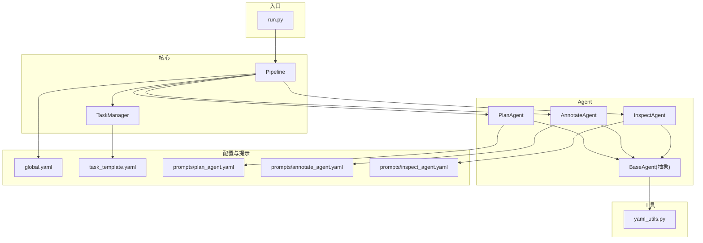
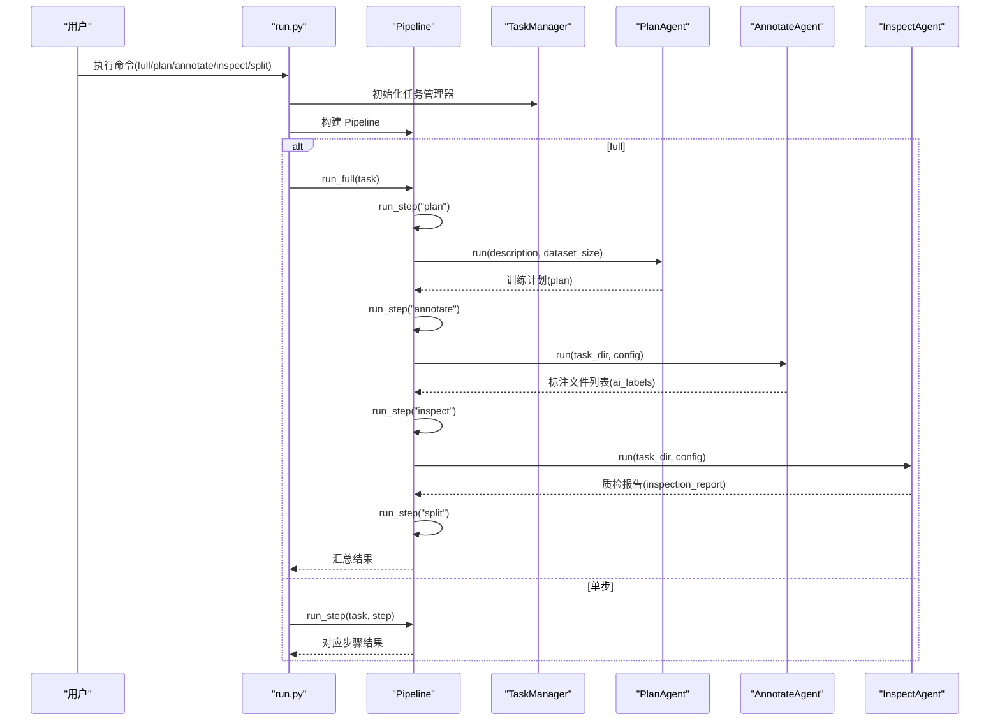
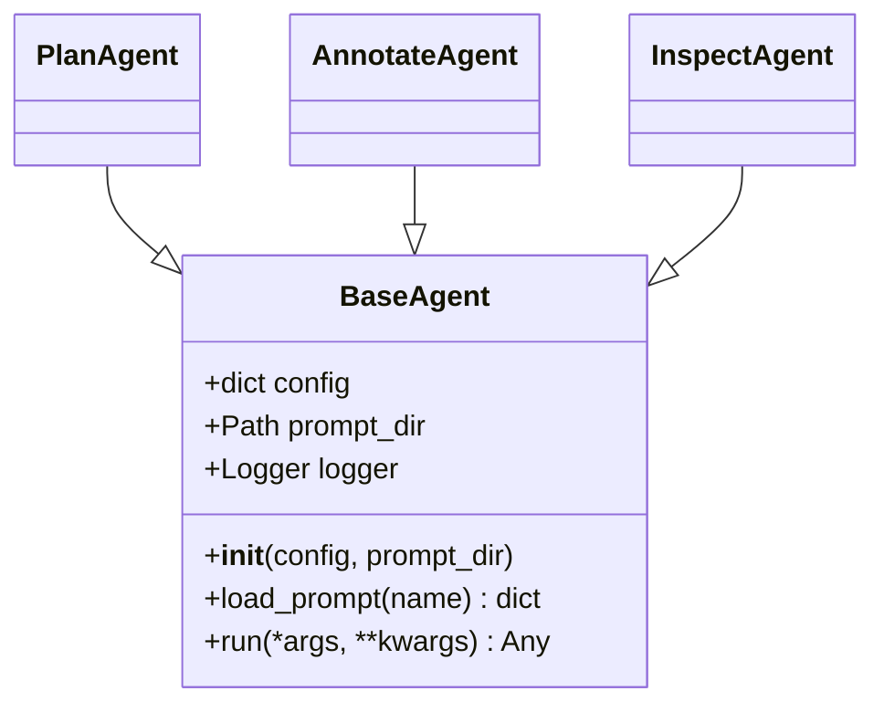
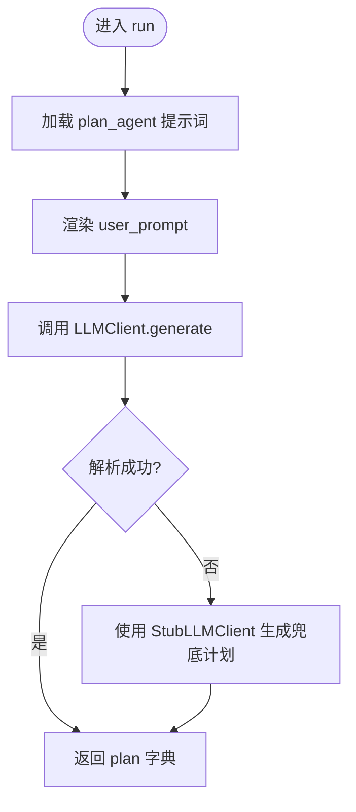
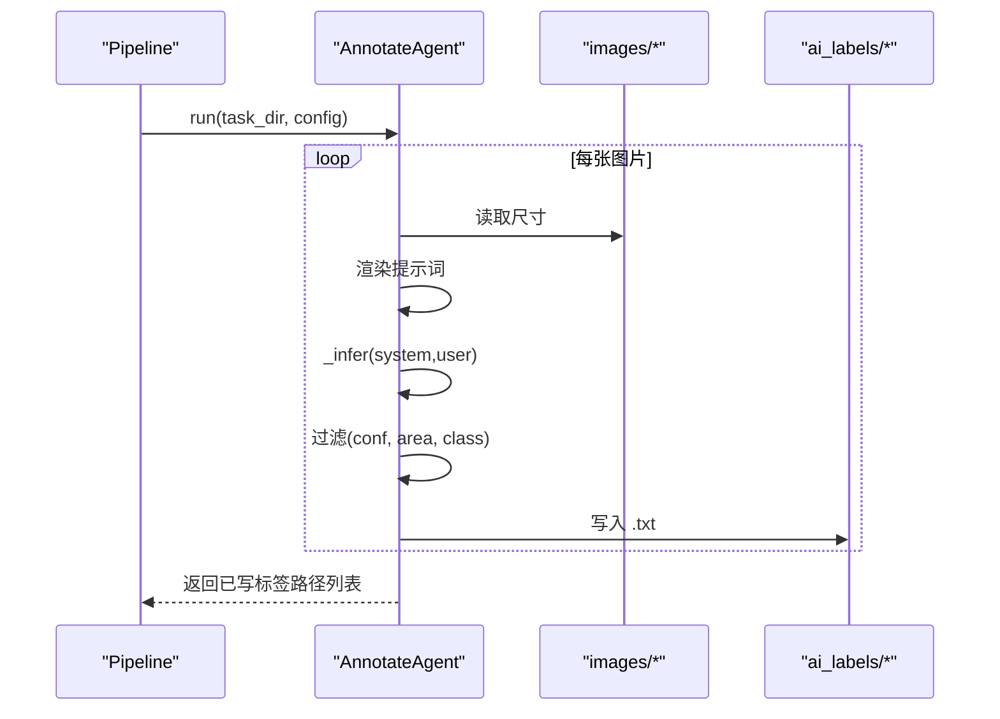
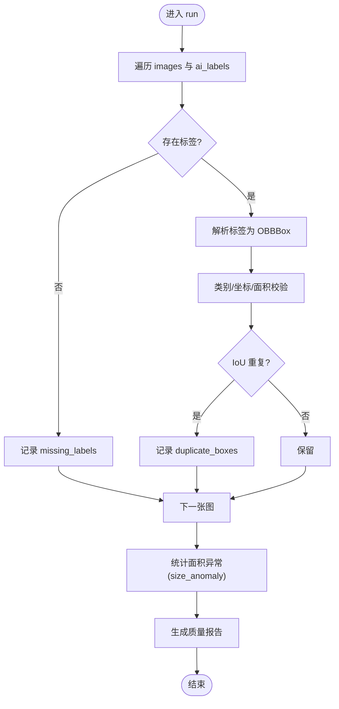
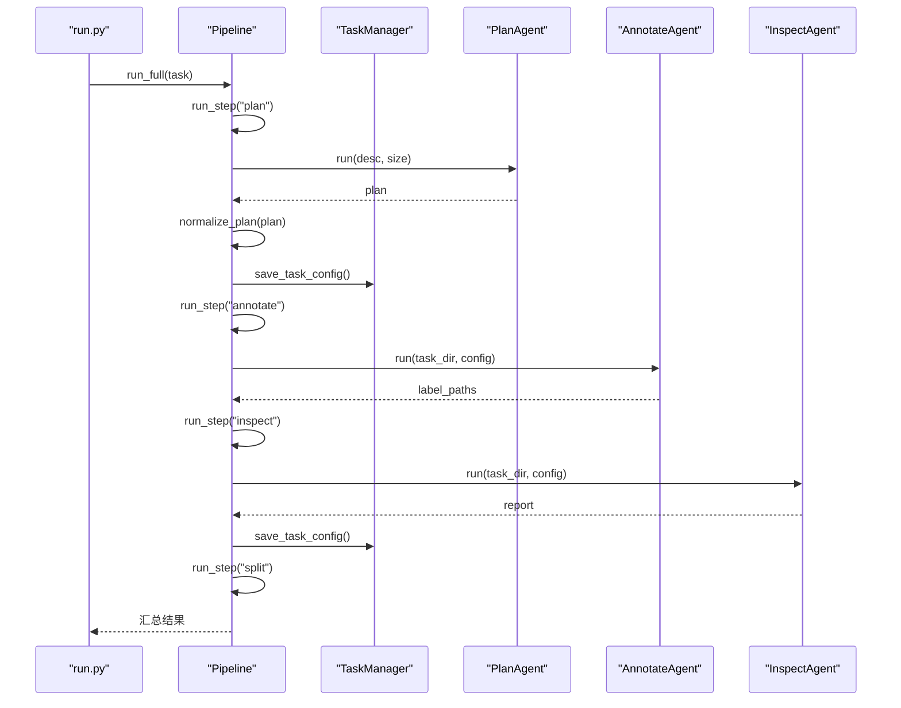
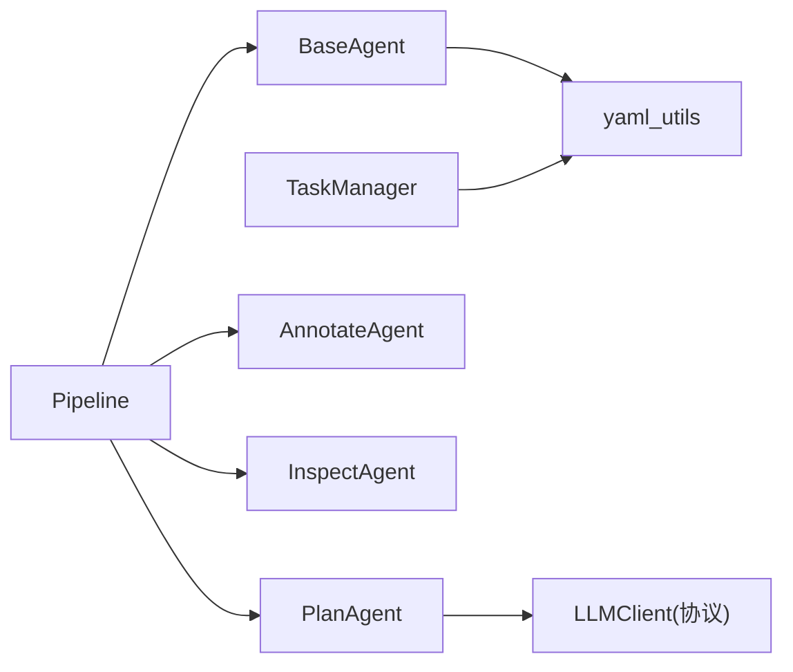
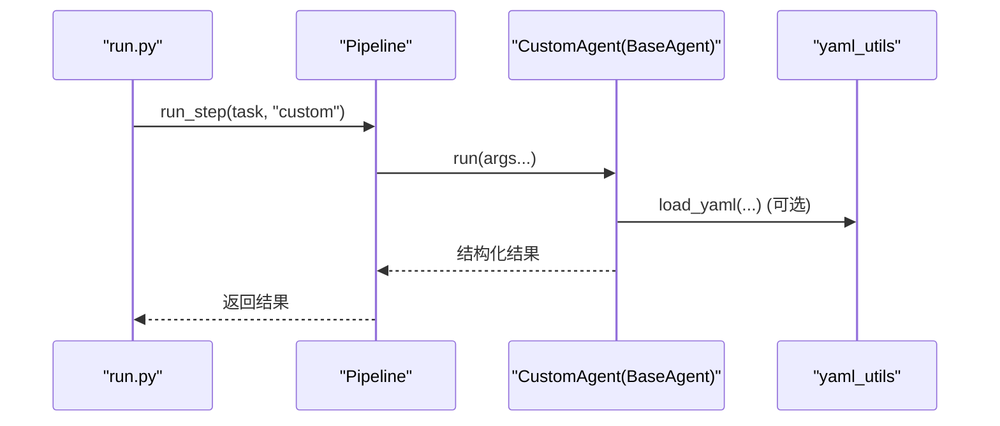

# Agent 框架设计

<cite>
**本文引用的文件**
- [base_agent.py](file://src/agents/base_agent.py)
- [plan_agent.py](file://src/agents/plan_agent.py)
- [annotate_agent.py](file://src/agents/annotate_agent.py)
- [inspect_agent.py](file://src/agents/inspect_agent.py)
- [pipeline.py](file://src/core/pipeline.py)
- [task_manager.py](file://src/core/task_manager.py)
- [yaml_utils.py](file://src/utils/yaml_utils.py)
- [global.yaml](file://config/global.yaml)
- [task_template.yaml](file://config/task_template.yaml)
- [plan_agent.yaml](file://prompts/plan_agent.yaml)
- [annotate_agent.yaml](file://prompts/annotate_agent.yaml)
- [inspect_agent.yaml](file://prompts/inspect_agent.yaml)
- [run.py](file://run.py)
</cite>

## 目录
1. [简介](#简介)
2. [项目结构](#项目结构)
3. [核心组件](#核心组件)
4. [架构总览](#架构总览)
5. [详细组件分析](#详细组件分析)
6. [依赖关系分析](#依赖关系分析)
7. [性能考量](#性能考量)
8. [故障排查指南](#故障排查指南)
9. [结论](#结论)
10. [附录：创建新 Agent 的完整示例与最佳实践](#附录：创建新-agent-的完整示例与最佳实践)

## 简介
本框架围绕“Agent”抽象，提供统一的接口、配置管理、日志记录、错误处理与生命周期编排。通过 BaseAgent 抽象类定义最小契约（run），各具体 Agent 实现各自业务逻辑；Pipeline 负责编排 plan -> annotate -> inspect -> split 的执行流程；TaskManager 负责任务目录与配置的持久化；外部提示词以 YAML 形式解耦，便于替换与扩展。整体目标是让“计划生成、自动标注、质量检查、数据导出”等步骤可插拔、可观测、可维护。

## 项目结构
- agents：Agent 抽象与实现（BaseAgent、PlanAgent、AnnotateAgent、InspectAgent）
- core：流程编排（Pipeline）与任务管理（TaskManager）
- utils：通用工具（YAML 读写、图像与 OBB 工具）
- config：全局配置与任务模板
- prompts：各 Agent 的外部提示词模板
- run.py：命令行入口，驱动 Pipeline

图表来源
- [pipeline.py:22-46](file://src/core/pipeline.py#L22-L46)
- [task_manager.py:14-38](file://src/core/task_manager.py#L14-L38)
- [base_agent.py:13-34](file://src/agents/base_agent.py#L13-L34)
- [plan_agent.py:101-118](file://src/agents/plan_agent.py#L101-L118)
- [annotate_agent.py:22-33](file://src/agents/annotate_agent.py#L22-L33)
- [inspect_agent.py:34-56](file://src/agents/inspect_agent.py#L34-L56)
- [yaml_utils.py:11-44](file://src/utils/yaml_utils.py#L11-L44)
- [global.yaml:1-29](file://config/global.yaml#L1-L29)
- [task_template.yaml:1-54](file://config/task_template.yaml#L1-L54)
- [plan_agent.yaml:1-27](file://prompts/plan_agent.yaml#L1-L27)
- [annotate_agent.yaml:1-25](file://prompts/annotate_agent.yaml#L1-L25)
- [inspect_agent.yaml:1-31](file://prompts/inspect_agent.yaml#L1-L31)

章节来源
- [pipeline.py:22-46](file://src/core/pipeline.py#L22-L46)
- [task_manager.py:14-38](file://src/core/task_manager.py#L14-L38)
- [base_agent.py:13-34](file://src/agents/base_agent.py#L13-L34)

## 核心组件
- BaseAgent：统一抽象基类，提供配置注入、提示词加载、日志器实例化，并强制子类实现 run()。
- PlanAgent：根据任务描述生成结构化训练计划（classes、split、hyperparameters、inspection 等）。
- AnnotateAgent：基于 VL 模型（当前为 Stub）对 images 进行 OBB 标注，输出 ai_labels。
- InspectAgent：校验 ai_labels，输出 candidate_labels 与质量报告。
- Pipeline：编排 plan -> annotate -> inspect -> split，负责结果归一化与持久化。
- TaskManager：任务目录与配置的生命周期管理（创建、读取、保存、删除）。
- yaml_utils：YAML 读写的统一封装。
- global.yaml / task_template.yaml：全局与任务级配置模板。
- prompts/*：各 Agent 的系统提示与用户提示模板。

章节来源
- [base_agent.py:13-69](file://src/agents/base_agent.py#L13-L69)
- [plan_agent.py:101-182](file://src/agents/plan_agent.py#L101-L182)
- [annotate_agent.py:22-185](file://src/agents/annotate_agent.py#L22-L185)
- [inspect_agent.py:34-227](file://src/agents/inspect_agent.py#L34-L227)
- [pipeline.py:22-325](file://src/core/pipeline.py#L22-L325)
- [task_manager.py:14-150](file://src/core/task_manager.py#L14-L150)
- [yaml_utils.py:11-44](file://src/utils/yaml_utils.py#L11-L44)
- [global.yaml:1-29](file://config/global.yaml#L1-L29)
- [task_template.yaml:1-54](file://config/task_template.yaml#L1-L54)

## 架构总览
下图展示了从 CLI 到 Pipeline、再到各 Agent 的调用链路与数据流转。

图表来源
- [run.py:39-77](file://run.py#L39-L77)
- [pipeline.py:48-94](file://src/core/pipeline.py#L48-L94)
- [pipeline.py:96-213](file://src/core/pipeline.py#L96-L213)
- [plan_agent.py:119-138](file://src/agents/plan_agent.py#L119-L138)
- [annotate_agent.py:25-80](file://src/agents/annotate_agent.py#L25-L80)
- [inspect_agent.py:37-108](file://src/agents/inspect_agent.py#L37-L108)

## 详细组件分析

### BaseAgent 抽象类
设计理念
- 统一入口：所有 Agent 继承 BaseAgent，必须实现 run()，保证 Pipeline 可一致调度。
- 配置注入：通过构造参数注入 config，支持 per-task 规则隔离（Pipeline 在运行前将 config 写入 agent.config）。
- 提示词解耦：load_prompt(name) 从 prompt_dir 加载 *.yaml，包含 system_prompt 与 user_prompt_template。
- 日志记录：每个 Agent 自带命名 Logger，便于追踪。
- 错误处理：提示词缺失或格式异常时抛出明确异常，便于上层捕获。

关键职责
- __init__：保存 config、prompt_dir，初始化 logger。
- load_prompt：加载并返回提示词映射。
- run：抽象方法，由子类实现具体业务。

图表来源
- [base_agent.py:13-69](file://src/agents/base_agent.py#L13-L69)
- [plan_agent.py:101-118](file://src/agents/plan_agent.py#L101-L118)
- [annotate_agent.py:22-33](file://src/agents/annotate_agent.py#L22-L33)
- [inspect_agent.py:34-56](file://src/agents/inspect_agent.py#L34-L56)

章节来源
- [base_agent.py:13-69](file://src/agents/base_agent.py#L13-L69)

### PlanAgent
功能
- 加载 plan_agent 提示词，渲染 user_prompt，调用 LLMClient.generate 获取原始文本。
- 解析 JSON/YAML，失败则回退到 StubLLMClient 的保守计划，确保 Pipeline 不中断。
- 返回标准化后的 plan 字典（后续由 Pipeline 的 normalize_plan 进一步规范化）。

关键点
- LLMClient 协议：允许替换真实后端（如本地 Qwen2.5-VL）。
- 鲁棒解析：strip_code_fence + JSON/YAML 双解析 + 兜底策略。

图表来源
- [plan_agent.py:119-168](file://src/agents/plan_agent.py#L119-L168)
- [plan_agent.py:170-182](file://src/agents/plan_agent.py#L170-L182)
- [plan_agent.yaml:1-27](file://prompts/plan_agent.yaml#L1-L27)

章节来源
- [plan_agent.py:101-182](file://src/agents/plan_agent.py#L101-L182)
- [plan_agent.yaml:1-27](file://prompts/plan_agent.yaml#L1-L27)

### AnnotateAgent
功能
- 遍历 images，按任务计划中的 classes、conf_threshold、min_defect_pixels 等规则进行标注。
- 渲染系统提示（含类别映射、标注规则、排除项）与用户提示（图像尺寸、阈值）。
- 调用 _infer（当前为 Stub）得到检测框，过滤后写入 ai_labels/*.txt。

关键点
- 坐标规范：VL 输出为归一化坐标或像素坐标，统一转换为归一化顺时针四点。
- 面积过滤：使用鞋带公式计算多边形面积，剔除过小目标。
- 严格类型校验：对 malformed detection 进行告警并跳过。

图表来源
- [annotate_agent.py:25-80](file://src/agents/annotate_agent.py#L25-L80)
- [annotate_agent.py:97-113](file://src/agents/annotate_agent.py#L97-L113)
- [annotate_agent.py:115-185](file://src/agents/annotate_agent.py#L115-L185)
- [annotate_agent.yaml:1-25](file://prompts/annotate_agent.yaml#L1-L25)

章节来源
- [annotate_agent.py:22-185](file://src/agents/annotate_agent.py#L22-L185)
- [annotate_agent.yaml:1-25](file://prompts/annotate_agent.yaml#L1-L25)

### InspectAgent
功能
- 扫描 ai_labels，执行缺失标签、重复框（OBB IoU）、类别错误、坐标越界、尺寸异常等检查。
- 将修正候选写入 candidate_labels，同时生成质量报告（quality_score）。

关键点
- 不修改原标签，仅产出候选修正，保证可追溯。
- 质量分数基于错误数与框总数估算。

图表来源
- [inspect_agent.py:37-108](file://src/agents/inspect_agent.py#L37-L108)
- [inspect_agent.py:110-175](file://src/agents/inspect_agent.py#L110-L175)
- [inspect_agent.py:177-227](file://src/agents/inspect_agent.py#L177-L227)
- [inspect_agent.yaml:1-31](file://prompts/inspect_agent.yaml#L1-L31)

章节来源
- [inspect_agent.py:34-227](file://src/agents/inspect_agent.py#L34-L227)
- [inspect_agent.yaml:1-31](file://prompts/inspect_agent.yaml#L1-L31)

### Pipeline（流程编排）
职责
- 顺序执行 plan -> annotate -> inspect -> split。
- 将 PlanAgent 的输出规范化为 task_template 模式，并持久化 plan.yaml。
- 将 InspectAgent 的报告持久化为 inspection_report.yaml。
- Split 阶段依据 plan.split 比例划分数据集，生成 data.yaml 与 train_command.txt。

图表来源
- [pipeline.py:48-94](file://src/core/pipeline.py#L48-L94)
- [pipeline.py:96-213](file://src/core/pipeline.py#L96-L213)
- [pipeline.py:284-325](file://src/core/pipeline.py#L284-L325)
- [task_manager.py:92-122](file://src/core/task_manager.py#L92-L122)

章节来源
- [pipeline.py:22-325](file://src/core/pipeline.py#L22-L325)
- [task_manager.py:14-150](file://src/core/task_manager.py#L14-L150)

### TaskManager（任务管理）
职责
- 创建任务目录与子目录（images、ai_labels、candidate_labels）。
- 基于 task_template.yaml 生成初始配置，支持覆盖。
- 提供 list/load/save/delete 能力。

章节来源
- [task_manager.py:14-150](file://src/core/task_manager.py#L14-L150)
- [task_template.yaml:1-54](file://config/task_template.yaml#L1-L54)

## 依赖关系分析
- Pipeline 强耦合于三个 Agent 的约定输入/输出（plan、label paths、report）。
- BaseAgent 弱耦合于 yaml_utils 与 logging，便于替换提示词与日志后端。
- PlanAgent 通过 LLMClient 协议解耦推理后端，便于热插拔。
- TaskManager 与 yaml_utils 形成稳定的 IO 层。

图表来源
- [pipeline.py:22-46](file://src/core/pipeline.py#L22-L46)
- [plan_agent.py:13-33](file://src/agents/plan_agent.py#L13-L33)
- [base_agent.py:13-34](file://src/agents/base_agent.py#L13-L34)
- [task_manager.py:14-38](file://src/core/task_manager.py#L14-L38)
- [yaml_utils.py:11-44](file://src/utils/yaml_utils.py#L11-L44)

章节来源
- [pipeline.py:22-46](file://src/core/pipeline.py#L22-L46)
- [plan_agent.py:13-33](file://src/agents/plan_agent.py#L13-L33)
- [base_agent.py:13-34](file://src/agents/base_agent.py#L13-L34)
- [task_manager.py:14-38](file://src/core/task_manager.py#L14-L38)
- [yaml_utils.py:11-44](file://src/utils/yaml_utils.py#L11-L44)

## 性能考量
- 标注阶段：当前为 Stub 推理，实际接入 VL 模型时应考虑批处理、显存限制与 CPU 回退（参考 global.yaml 的 inference 配置）。
- 分割阶段：固定随机种子保证可复现；大图像复制与 I/O 可能成为瓶颈，建议按需并行或流式处理。
- 质检阶段：O(n^2) 重复框检测可通过索引优化降低复杂度。
- 日志级别：通过 run.py 的 --log-level 控制，生产环境建议 INFO 或 WARNING。

[本节为通用指导，不直接分析具体文件]

## 故障排查指南
常见问题与定位
- 未知步骤名：Pipeline 会抛出 ValueError，检查传入的 step 是否在 plan/annotate/inspect/split 中。
- 任务不存在：TaskManager.load_task 抛 FileNotFoundError，确认 tasks_root 下是否存在该任务目录及 task.yaml。
- 提示词缺失：BaseAgent.load_prompt 抛 FileNotFoundError，检查 prompts 目录与文件名是否匹配。
- 计划解析失败：PlanAgent 会回退到 Stub 计划并记录警告，检查 LLM 输出格式或改用更稳健的后端。
- 标注为空：AnnotateAgent 可能因 conf_threshold 过高或 min_defect_pixels 过大导致无输出，调整 training_plan 中的阈值。
- 质检质量低：InspectAgent 报告 quality_score 较低时，查看 errors 明细（missing/duplicate/class_error/coords_out_of_range/size_anomaly）并修正。

章节来源
- [pipeline.py:77-79](file://src/core/pipeline.py#L77-L79)
- [task_manager.py:92-107](file://src/core/task_manager.py#L92-L107)
- [base_agent.py:36-53](file://src/agents/base_agent.py#L36-L53)
- [plan_agent.py:140-168](file://src/agents/plan_agent.py#L140-L168)
- [annotate_agent.py:115-161](file://src/agents/annotate_agent.py#L115-L161)
- [inspect_agent.py:110-175](file://src/agents/inspect_agent.py#L110-L175)

## 结论
本框架通过 BaseAgent 抽象统一了 Agent 的接口与基础能力，借助 Pipeline 实现了端到端的训练准备流水线。配置与提示词外置使系统具备高度可扩展性；TaskManager 提供了清晰的任务生命周期管理。未来可在 LLMClient 上接入真实 VL 模型，并在分割与质检阶段引入更多优化。

[本节为总结，不直接分析具体文件]

## 附录：创建新 Agent 的完整示例与最佳实践

### 设计要点
- 继承 BaseAgent，实现 run() 方法，接收必要参数并返回结构化结果。
- 如需提示词，新增 prompts/<your_agent>.yaml，并在 run() 中通过 load_prompt 加载。
- 若涉及外部服务或模型，遵循“协议优先”原则（如 LLMClient），便于替换实现。
- 在 Pipeline 中注册新 Agent，并通过 run_step 编排执行。

### 步骤清单
1. 新建 Agent 类
   - 继承 BaseAgent
   - 实现 run(self, *args, **kwargs) -> Any
   - 使用 self.logger 记录关键信息
   - 通过 self.load_prompt("your_agent") 加载提示词

2. 新增提示词
   - 在 prompts/ 下添加 your_agent.yaml
   - 定义 system_prompt 与 user_prompt_template

3. 在 Pipeline 中集成
   - 在 Pipeline.__init__ 的 agents 映射中加入你的 Agent
   - 在 run_step 中添加分支，或在现有步骤中复用

4. 配置与模板
   - 如需新字段，更新 task_template.yaml 或 global.yaml
   - 通过 TaskManager 的 create_task 自动生成任务目录与默认配置

5. 测试与验证
   - 使用 run.py 的 create/plan/annotate/inspect/split/full 命令逐步验证
   - 关注日志与生成的 plan.yaml、inspection_report.yaml、dataset/data.yaml

### 时序图：自定义 Agent 接入 Pipeline

图表来源
- [pipeline.py:62-94](file://src/core/pipeline.py#L62-L94)
- [base_agent.py:36-53](file://src/agents/base_agent.py#L36-L53)
- [yaml_utils.py:11-44](file://src/utils/yaml_utils.py#L11-L44)

### 最佳实践
- 单一职责：每个 Agent 只做一件事，保持 run() 的输入输出稳定。
- 配置隔离：通过 Pipeline 在运行前注入 config，避免跨任务污染。
- 健壮解析：对外部输入（LLM、文件）做容错与降级。
- 可观测性：充分使用日志，记录关键决策点与异常。
- 可测试性：通过协议（如 LLMClient）与纯函数（如 normalize_plan）提升可测性。

[本节为通用指导，不直接分析具体文件]