# 任务管理系统

<cite>
**本文引用的文件**   
- [task_manager.py](file://src/core/task_manager.py)
- [pipeline.py](file://src/core/pipeline.py)
- [api_server.py](file://src/api_server.py)
- [run.py](file://run.py)
- [task_template.yaml](file://config/task_template.yaml)
- [global.yaml](file://config/global.yaml)
- [file_utils.py](file://src/utils/file_utils.py)
- [yaml_utils.py](file://src/utils/yaml_utils.py)
- [test_task_manager.py](file://tests/test_task_manager.py)
</cite>

## 目录
1. [简介](#简介)
2. [项目结构](#项目结构)
3. [核心组件](#核心组件)
4. [架构总览](#架构总览)
5. [详细组件分析](#详细组件分析)
6. [依赖关系分析](#依赖关系分析)
7. [性能与可扩展性](#性能与可扩展性)
8. [故障排查指南](#故障排查指南)
9. [结论](#结论)
10. [附录：任务状态转换与文件结构](#附录任务状态转换与文件结构)

## 简介
本系统围绕“任务”这一核心概念，提供面向 YOLO-OBB（旋转目标检测）的数据标注、质检与训练数据导出流水线。TaskManager 负责任务的创建、配置加载/保存、目录组织与生命周期管理；Pipeline 编排 plan/annotate/inspect/split 四个阶段；API Server 暴露 HTTP 接口供 GUI 或 CLI 调用；CLI run.py 提供命令行入口。

本文件重点深入解析 TaskManager 的设计模式与实现细节，包括任务生命周期、状态跟踪机制、文件系统组织结构，以及任务的创建、配置管理与数据持久化过程。同时说明任务目录结构设计（images、ai_labels、candidate_labels、dataset 等子目录的作用），并提供最佳实践与常见问题解决方案。

## 项目结构
仓库采用按职责分层的组织方式：
- src/core：核心业务逻辑（TaskManager、Pipeline）
- src/utils：通用工具（文件、图像、YAML 处理）
- src/agents：智能体（计划、标注、质检）
- src/api_server.py：FastAPI 服务
- config：全局与任务模板配置
- tests：单元测试
- gui：前端界面（Tauri + React）

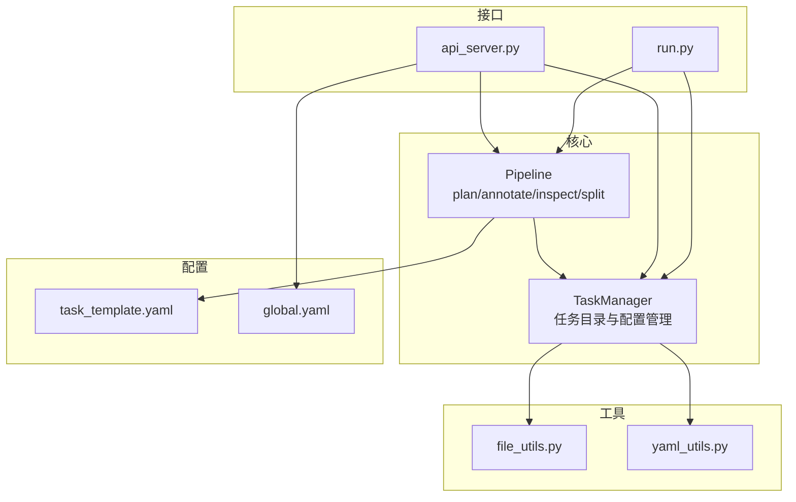

图表来源
- [task_manager.py:14-149](file://src/core/task_manager.py#L14-L149)
- [pipeline.py:22-325](file://src/core/pipeline.py#L22-L325)
- [api_server.py:21-384](file://src/api_server.py#L21-L384)
- [run.py:39-81](file://run.py#L39-L81)
- [task_template.yaml:1-54](file://config/task_template.yaml#L1-L54)
- [global.yaml:1-29](file://config/global.yaml#L1-L29)

章节来源
- [task_manager.py:14-149](file://src/core/task_manager.py#L14-L149)
- [pipeline.py:22-325](file://src/core/pipeline.py#L22-L325)
- [api_server.py:21-384](file://src/api_server.py#L21-L384)
- [run.py:39-81](file://run.py#L39-L81)
- [task_template.yaml:1-54](file://config/task_template.yaml#L1-L54)
- [global.yaml:1-29](file://config/global.yaml#L1-L29)

## 核心组件
- TaskManager：封装任务根目录、任务目录与 task.yaml 的 CRUD，负责初始化子目录结构与模板配置注入。
- Pipeline：编排四阶段流程，读取/更新任务配置，生成 plan、执行标注、质检、数据集拆分与导出。
- API Server：基于 FastAPI 暴露任务与步骤接口，提供图片与标签查询能力。
- CLI run.py：命令行入口，支持 create/plan/annotate/inspect/split/full。
- 工具模块：file_utils（图像列举、目录创建）、yaml_utils（YAML 读写）。

章节来源
- [task_manager.py:14-149](file://src/core/task_manager.py#L14-L149)
- [pipeline.py:22-325](file://src/core/pipeline.py#L22-L325)
- [api_server.py:21-384](file://src/api_server.py#L21-L384)
- [run.py:39-81](file://run.py#L39-L81)
- [file_utils.py:10-35](file://src/utils/file_utils.py#L10-L35)
- [yaml_utils.py:11-44](file://src/utils/yaml_utils.py#L11-L44)

## 架构总览
系统以 TaskManager 为数据与目录中心，Pipeline 作为流程编排器，API Server 对外暴露 REST 接口，CLI 提供脚本式调用。

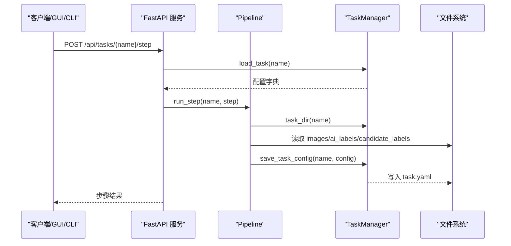

图表来源
- [api_server.py:169-192](file://src/api_server.py#L169-L192)
- [pipeline.py:62-94](file://src/core/pipeline.py#L62-L94)
- [task_manager.py:92-122](file://src/core/task_manager.py#L92-L122)

## 详细组件分析

### TaskManager 类设计
TaskManager 是任务生命周期与文件系统组织的中心。它通过 ensure_dir 保证目录存在，通过 _template_config 注入默认模板，并通过 load/save 完成配置的持久化。

关键职责
- 任务目录定位与创建：task_dir、create_task
- 任务列表：list_tasks
- 配置加载与保存：load_task、save_task_config
- 任务删除：delete_task
- 模板配置合并：_template_config

设计要点
- 单一职责：仅关注任务目录与配置，不耦合具体算法。
- 幂等创建：ensure_dir 保证多次创建安全。
- 模板驱动：从 task_template.yaml 注入默认值，避免硬编码。
- 异常明确：重复创建抛 FileExistsError，缺失抛 FileNotFoundError。

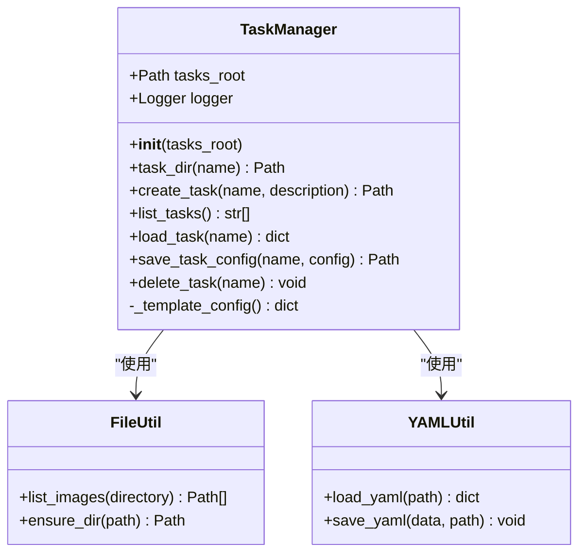

图表来源
- [task_manager.py:14-149](file://src/core/task_manager.py#L14-L149)
- [file_utils.py:10-35](file://src/utils/file_utils.py#L10-L35)
- [yaml_utils.py:11-44](file://src/utils/yaml_utils.py#L11-L44)

章节来源
- [task_manager.py:14-149](file://src/core/task_manager.py#L14-L149)
- [file_utils.py:10-35](file://src/utils/file_utils.py#L10-L35)
- [yaml_utils.py:11-44](file://src/utils/yaml_utils.py#L11-L44)

### 任务生命周期与状态跟踪
任务的生命周期由 Pipeline 驱动，TaskManager 负责持久化当前状态（配置）。每个步骤完成后，Pipeline 会写回 task.yaml，从而形成“配置即状态”的跟踪机制。

状态流转（概念）
- 新建：create_task 生成目录与初始 task.yaml
- 规划：plan 生成 training_plan 并落盘
- 标注：annotate 产出 ai_labels
- 质检：inspect 产出 inspection_report.yaml，并可修正为 candidate_labels
- 导出：split 将 images 与 labels 拆分到 dataset/{train,val,test}，并生成 data.yaml 与 train_command.txt

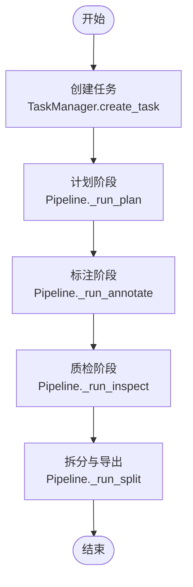

图表来源
- [task_manager.py:51-80](file://src/core/task_manager.py#L51-L80)
- [pipeline.py:96-213](file://src/core/pipeline.py#L96-L213)

章节来源
- [task_manager.py:51-80](file://src/core/task_manager.py#L51-L80)
- [pipeline.py:96-213](file://src/core/pipeline.py#L96-L213)

### 任务目录结构与数据流
每个任务目录遵循统一结构：
- task.yaml：任务配置（包含 task 与 training_plan）
- images：原始输入图像
- ai_labels：AI 生成的 YOLO-OBB 标签（每图一个 .txt）
- candidate_labels：人工修正后的候选标签（优先于 ai_labels）
- dataset：导出的训练数据集（train/val/test 三套 images/labels，data.yaml，export_summary.yaml，train_command.txt）

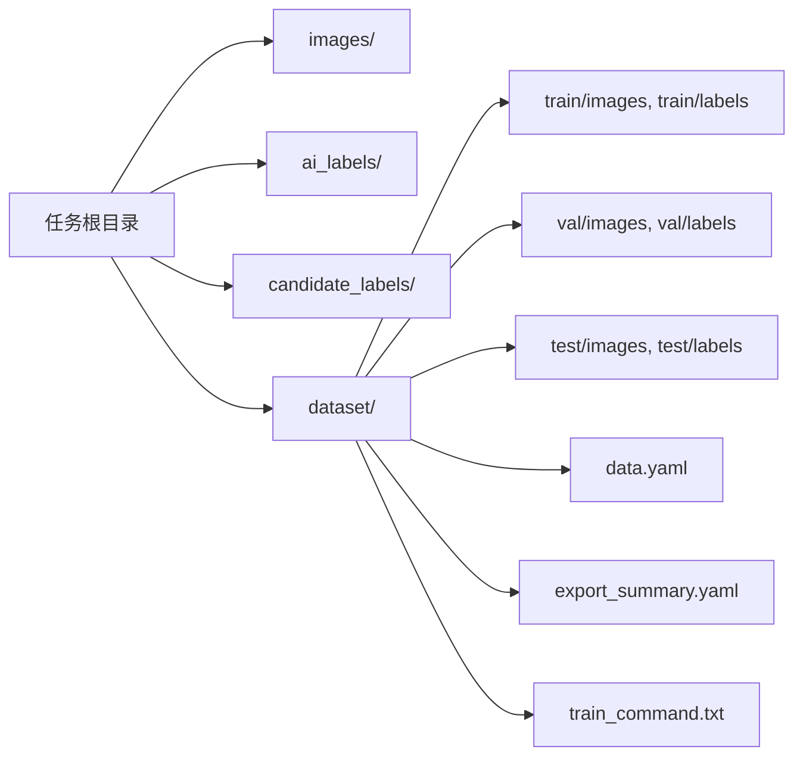

图表来源
- [task_manager.py:17-24](file://src/core/task_manager.py#L17-L24)
- [pipeline.py:155-213](file://src/core/pipeline.py#L155-L213)

章节来源
- [task_manager.py:17-24](file://src/core/task_manager.py#L17-L24)
- [pipeline.py:155-213](file://src/core/pipeline.py#L155-L213)

### 任务配置的加载、保存与验证
- 加载：load_task 读取 task.yaml，若不存在抛出 FileNotFoundError。
- 保存：save_task_config 将完整配置映射序列化到 task.yaml。
- 模板：_template_config 从 config/task_template.yaml 加载默认模板；若缺失则返回最小默认结构。
- 校验：yaml_utils.load_yaml 对空文件返回空字典，非 mapping 抛出 ValueError。

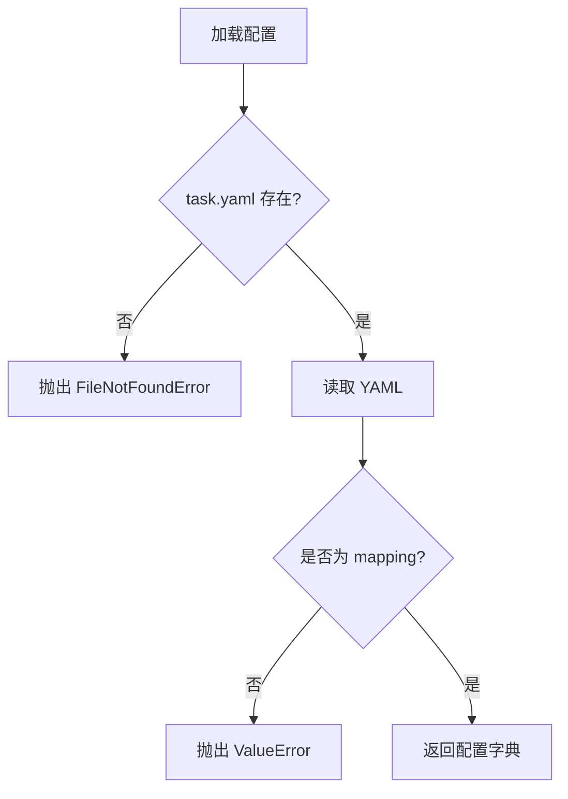

图表来源
- [task_manager.py:92-107](file://src/core/task_manager.py#L92-L107)
- [yaml_utils.py:11-32](file://src/utils/yaml_utils.py#L11-L32)

章节来源
- [task_manager.py:92-107](file://src/core/task_manager.py#L92-L107)
- [yaml_utils.py:11-32](file://src/utils/yaml_utils.py#L11-L32)

### Pipeline 与 TaskManager 协作
Pipeline 在每一步中：
- 读取任务配置
- 执行业务逻辑（计划/标注/质检/拆分）
- 写回任务配置（save_task_config）
- 输出中间产物（plan.yaml、inspection_report.yaml、dataset/*）

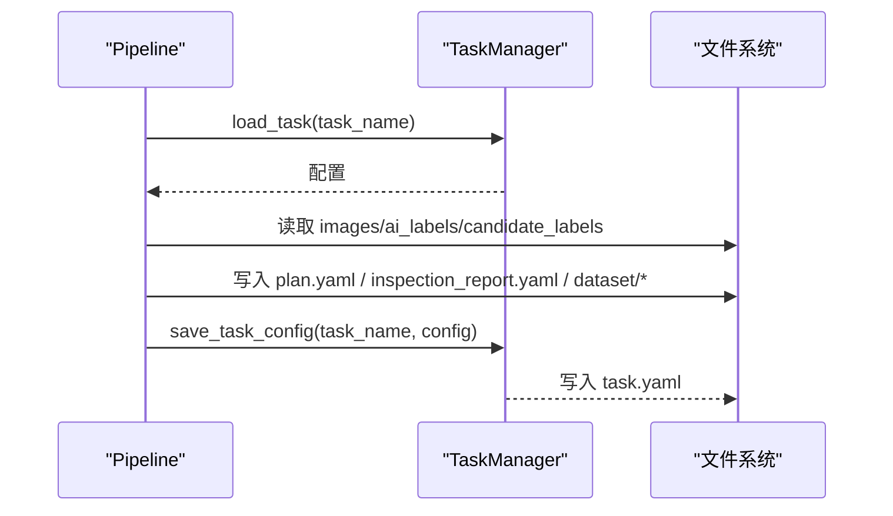

图表来源
- [pipeline.py:62-94](file://src/core/pipeline.py#L62-L94)
- [pipeline.py:96-213](file://src/core/pipeline.py#L96-L213)
- [task_manager.py:92-122](file://src/core/task_manager.py#L92-L122)

章节来源
- [pipeline.py:62-94](file://src/core/pipeline.py#L62-L94)
- [pipeline.py:96-213](file://src/core/pipeline.py#L96-L213)
- [task_manager.py:92-122](file://src/core/task_manager.py#L92-L122)

### API 层与任务管理
API Server 将任务与步骤操作暴露为 REST 接口：
- 任务管理：GET /api/tasks、POST /api/tasks
- 步骤执行：POST /api/tasks/{name}/step（含 plan/annotate/inspect/split）
- 资源访问：/api/tasks/{name}/images、/labels、/report、/export

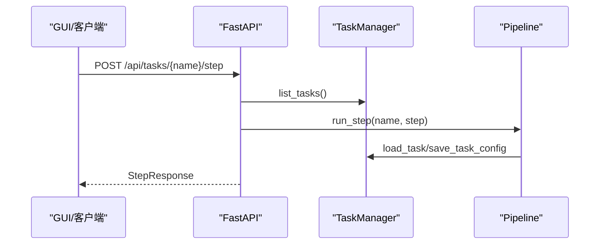

图表来源
- [api_server.py:139-192](file://src/api_server.py#L139-L192)
- [task_manager.py:82-122](file://src/core/task_manager.py#L82-L122)
- [pipeline.py:62-94](file://src/core/pipeline.py#L62-L94)

章节来源
- [api_server.py:139-192](file://src/api_server.py#L139-L192)
- [task_manager.py:82-122](file://src/core/task_manager.py#L82-L122)
- [pipeline.py:62-94](file://src/core/pipeline.py#L62-L94)

## 依赖关系分析
- TaskManager 依赖 file_utils.ensure_dir 与 yaml_utils.load_yaml/save_yaml。
- Pipeline 依赖 TaskManager 与 agents（Plan/Annotate/Inspect），并在 split 阶段依赖 file_utils.list_images。
- API Server 依赖 Pipeline 与 TaskManager，并通过 yaml_utils 读取报告与导出摘要。
- CLI run.py 直接实例化 TaskManager 与 Pipeline。

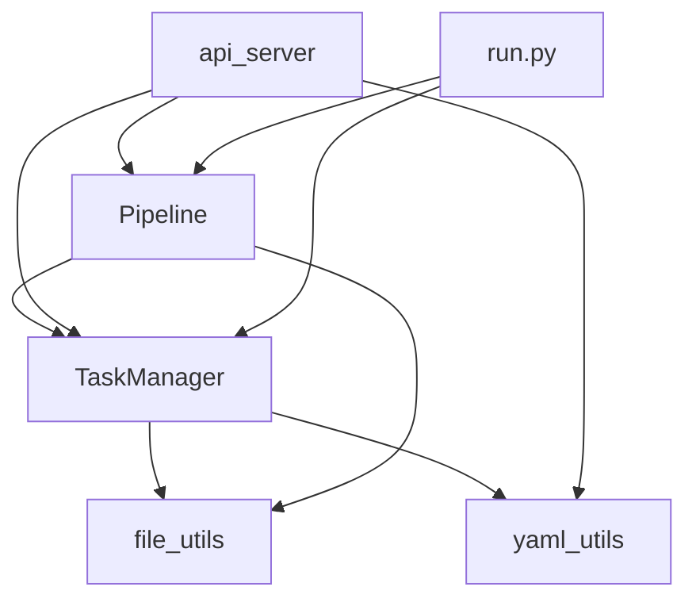

图表来源
- [task_manager.py:10-11](file://src/core/task_manager.py#L10-L11)
- [pipeline.py:11-17](file://src/core/pipeline.py#L11-L17)
- [api_server.py:16-19](file://src/api_server.py#L16-L19)
- [run.py:16-17](file://run.py#L16-L17)

章节来源
- [task_manager.py:10-11](file://src/core/task_manager.py#L10-L11)
- [pipeline.py:11-17](file://src/core/pipeline.py#L11-L17)
- [api_server.py:16-19](file://src/api_server.py#L16-L19)
- [run.py:16-17](file://run.py#L16-L17)

## 性能与可扩展性
- 目录与文件操作：TaskManager 与 Pipeline 大量使用 pathlib 与 shutil，适合中小规模数据集；当图像数量极大时，可考虑并行复制与分批写入以提升 I/O 吞吐。
- 随机分割：Pipeline.split 使用固定随机种子确保可复现；对于超大数据集，建议结合分层抽样策略（已在模板中预留 stratified 字段）。
- 扩展点：
  - 自定义 Agent：通过 Pipeline.agents 注入自定义 Plan/Annotate/Inspect 实现。
  - 模板扩展：在 task_template.yaml 中添加新字段，并在 normalize_plan 中适配。
  - 配置校验：可在 load_task/save_task_config 前后加入 schema 校验（如 Pydantic）提升健壮性。

[本节为通用指导，不涉及具体文件分析]

## 故障排查指南
常见问题与解决思路：
- 任务已存在：创建任务时抛出 FileExistsError。检查同名任务是否已存在，或先删除再创建。
- 找不到任务或配置：load_task 抛出 FileNotFoundError。确认任务目录与 task.yaml 是否存在。
- YAML 格式错误：load_yaml 抛出 ValueError（非 mapping）。检查 task.yaml 是否为合法的映射结构。
- 无图像可拆分：Pipeline.split 返回空 splits。确认 images 目录下有支持的图像格式（jpg/jpeg/png/bmp/tif/tiff）。
- 标签缺失：导出时优先使用 candidate_labels，否则回退 ai_labels。若无任一标签，对应样本不会复制 label。
- 步骤失败：API 层捕获异常并返回 500。查看日志定位具体 agent 或文件路径问题。

章节来源
- [task_manager.py:51-80](file://src/core/task_manager.py#L51-L80)
- [task_manager.py:92-107](file://src/core/task_manager.py#L92-L107)
- [yaml_utils.py:11-32](file://src/utils/yaml_utils.py#L11-L32)
- [pipeline.py:155-213](file://src/core/pipeline.py#L155-L213)
- [api_server.py:169-192](file://src/api_server.py#L169-L192)

## 结论
TaskManager 以简洁的职责边界与明确的异常语义，提供了稳健的任务目录与配置管理能力；Pipeline 将多阶段工作流标准化，并通过“配置即状态”的方式实现任务状态跟踪；API Server 与 CLI 共同构成统一的访问面。整体架构清晰、可扩展性强，适合作为 YOLO-OBB 数据准备与训练导出的基础平台。

[本节为总结性内容，不涉及具体文件分析]

## 附录：任务状态转换与文件结构

### 任务状态转换图
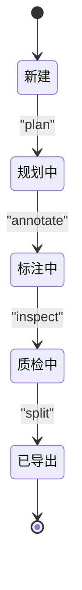

图表来源
- [pipeline.py:19-94](file://src/core/pipeline.py#L19-L94)

### 任务文件结构图
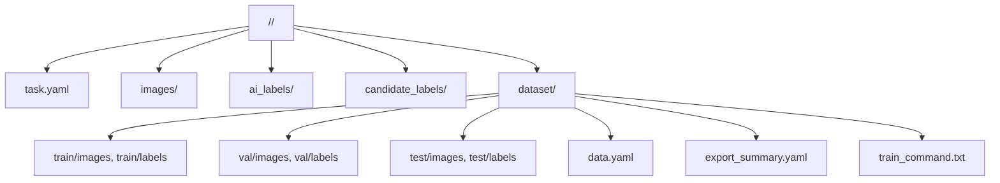

图表来源
- [task_manager.py:17-24](file://src/core/task_manager.py#L17-L24)
- [pipeline.py:155-213](file://src/core/pipeline.py#L155-L213)