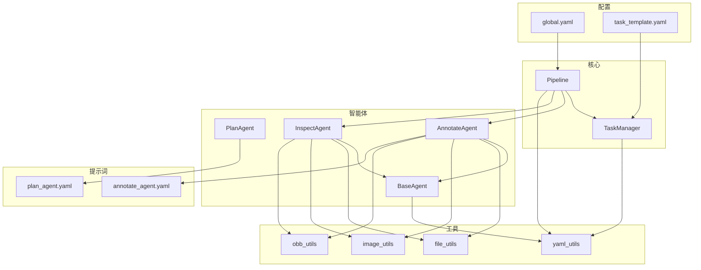
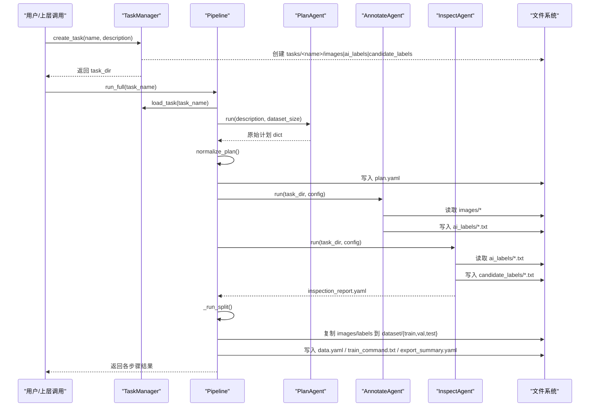
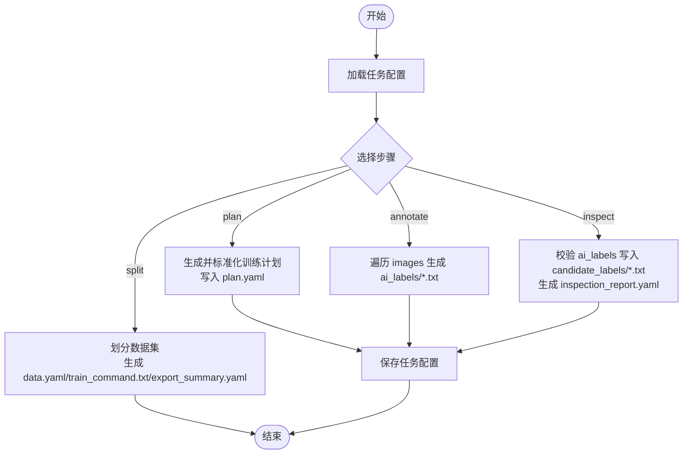
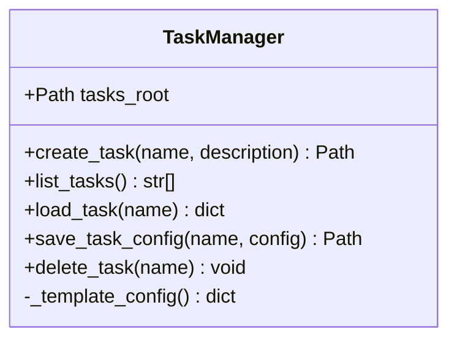
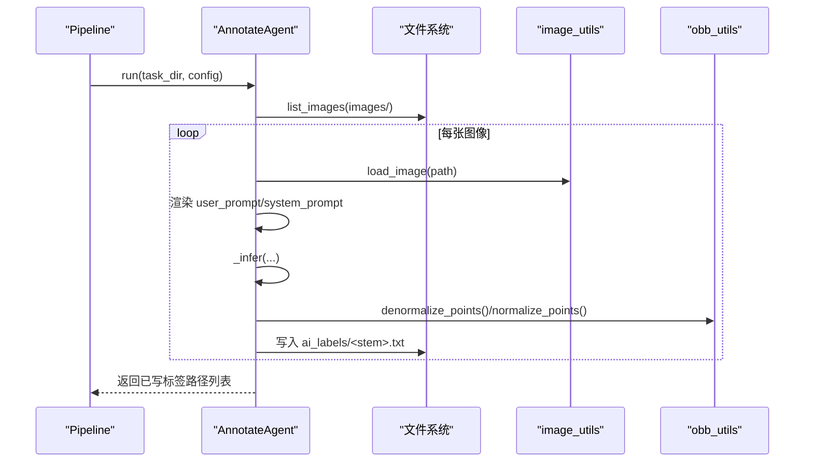
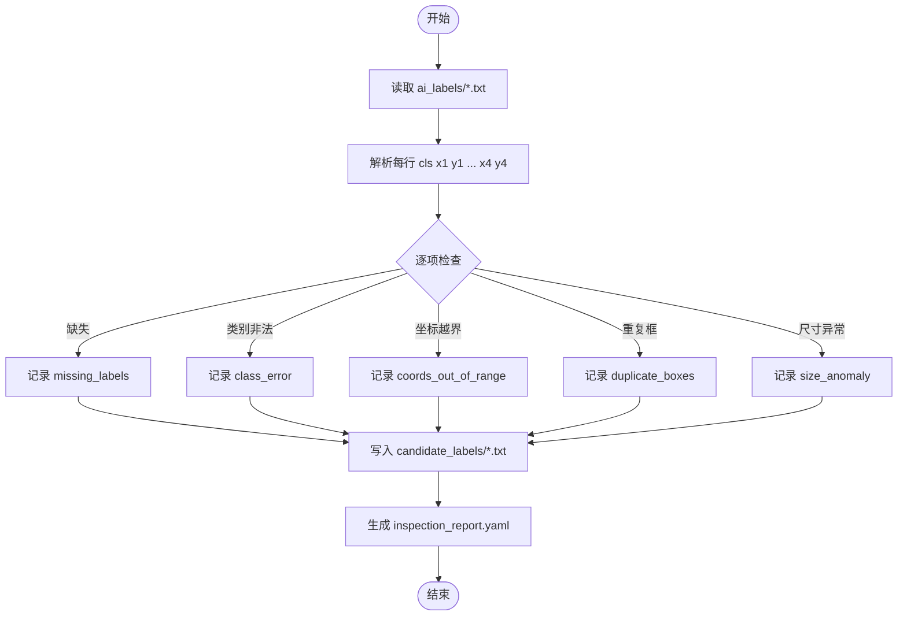
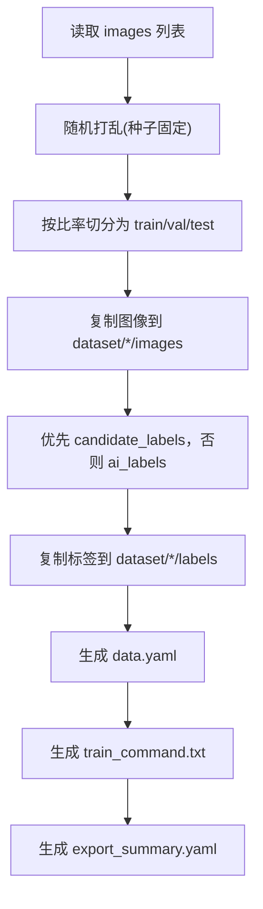
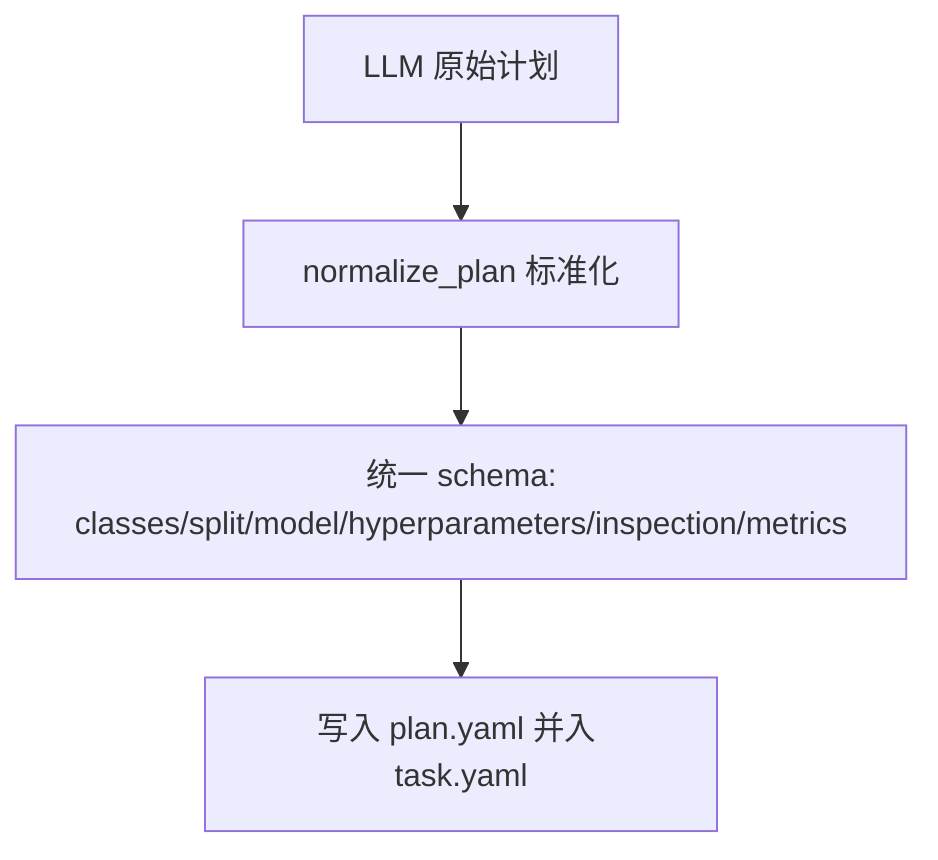
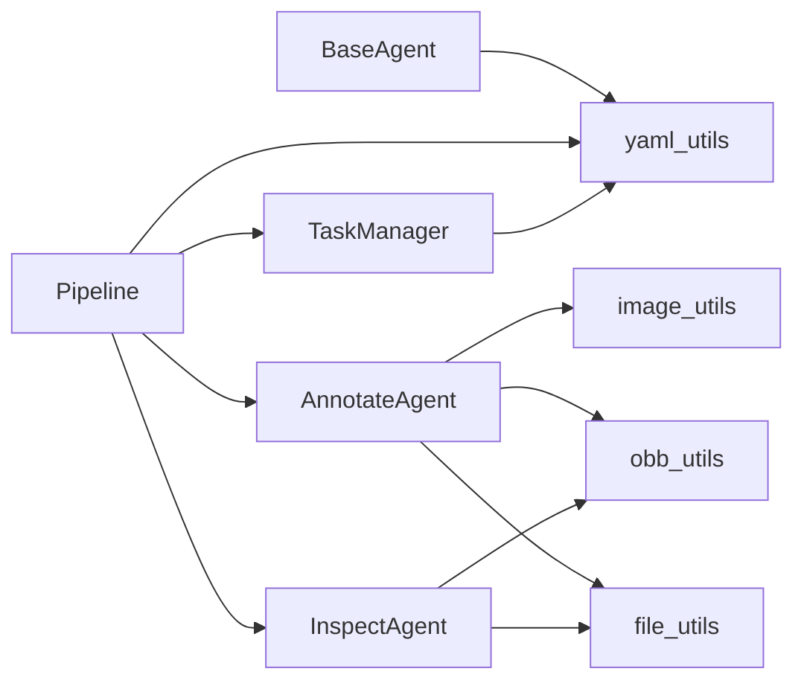

# 数据流转机制

<cite>
**本文引用的文件**   
- [pipeline.py](file://src/core/pipeline.py)
- [task_manager.py](file://src/core/task_manager.py)
- [base_agent.py](file://src/agents/base_agent.py)
- [annotate_agent.py](file://src/agents/annotate_agent.py)
- [inspect_agent.py](file://src/agents/inspect_agent.py)
- [file_utils.py](file://src/utils/file_utils.py)
- [yaml_utils.py](file://src/utils/yaml_utils.py)
- [obb_utils.py](file://src/utils/obb_utils.py)
- [image_utils.py](file://src/utils/image_utils.py)
- [global.yaml](file://config/global.yaml)
- [task_template.yaml](file://config/task_template.yaml)
- [annotate_agent.yaml](file://prompts/annotate_agent.yaml)
- [plan_agent.yaml](file://prompts/plan_agent.yaml)
</cite>

## 目录
1. [引言](#引言)
2. [项目结构](#项目结构)
3. [核心组件](#核心组件)
4. [架构总览](#架构总览)
5. [详细组件分析](#详细组件分析)
6. [依赖关系分析](#依赖关系分析)
7. [性能与可扩展性](#性能与可扩展性)
8. [故障排查指南](#故障排查指南)
9. [结论](#结论)
10. [附录：数据格式与协议](#附录数据格式与协议)

## 引言
本文件面向“从任务创建到最终数据集导出”的完整数据流，系统性说明 VL-YOLO-OBB 标注平台的数据流动路径、转换规则、组件间协议、工具函数使用方式、一致性保证与错误恢复策略。读者无需深入代码即可理解系统如何组织任务、生成训练计划、自动标注、质量检查与导出可训练的 YOLO-OBB 数据集。

## 项目结构
仓库采用分层组织：
- 配置层：全局配置与任务模板
- 核心编排层：Pipeline 与 TaskManager
- Agent 层：Plan/Annotate/Inspect 三个智能体
- 工具层：文件、YAML、图像、OBB 几何等通用能力
- 提示词层：Agent 的外部 YAML 提示定义

图表来源
- [pipeline.py:22-94](file://src/core/pipeline.py#L22-L94)
- [task_manager.py:14-122](file://src/core/task_manager.py#L14-L122)
- [base_agent.py:13-53](file://src/agents/base_agent.py#L13-L53)
- [annotate_agent.py:22-80](file://src/agents/annotate_agent.py#L22-L80)
- [inspect_agent.py:34-108](file://src/agents/inspect_agent.py#L34-L108)
- [file_utils.py:10-35](file://src/utils/file_utils.py#L10-L35)
- [yaml_utils.py:11-44](file://src/utils/yaml_utils.py#L11-L44)
- [image_utils.py:13-33](file://src/utils/image_utils.py#L13-L33)
- [obb_utils.py:16-150](file://src/utils/obb_utils.py#L16-L150)
- [global.yaml:1-29](file://config/global.yaml#L1-L29)
- [task_template.yaml:1-54](file://config/task_template.yaml#L1-L54)
- [annotate_agent.yaml:1-25](file://prompts/annotate_agent.yaml#L1-L25)
- [plan_agent.yaml:1-27](file://prompts/plan_agent.yaml#L1-L27)

章节来源
- [pipeline.py:22-94](file://src/core/pipeline.py#L22-L94)
- [task_manager.py:14-122](file://src/core/task_manager.py#L14-L122)

## 核心组件
- Pipeline：端到端流程编排，顺序执行 plan -> annotate -> inspect -> split/export，负责读取/保存任务配置、调用各 Agent、输出数据集与训练命令。
- TaskManager：任务生命周期管理，负责创建任务目录、加载/保存 task.yaml、列出/删除任务。
- BaseAgent：所有 Agent 的抽象基类，提供 prompt 加载与日志能力。
- PlanAgent：根据任务描述生成结构化训练计划（由 normalize_plan 标准化）。
- AnnotateAgent：对 images 下的图片进行 OBB 标注，输出 ai_labels/*.txt。
- InspectAgent：校验 ai_labels，输出 candidate_labels/*.txt 与 inspection_report.yaml。
- 工具模块：file_utils（目录与图像列表）、yaml_utils（YAML 读写）、image_utils（图像解码与尺寸）、obb_utils（OBB 几何与坐标归一化）。

章节来源
- [pipeline.py:22-94](file://src/core/pipeline.py#L22-L94)
- [task_manager.py:14-122](file://src/core/task_manager.py#L14-L122)
- [base_agent.py:13-53](file://src/agents/base_agent.py#L13-L53)
- [annotate_agent.py:22-80](file://src/agents/annotate_agent.py#L22-L80)
- [inspect_agent.py:34-108](file://src/agents/inspect_agent.py#L34-L108)
- [file_utils.py:10-35](file://src/utils/file_utils.py#L10-L35)
- [yaml_utils.py:11-44](file://src/utils/yaml_utils.py#L11-L44)
- [image_utils.py:13-33](file://src/utils/image_utils.py#L13-L33)
- [obb_utils.py:16-150](file://src/utils/obb_utils.py#L16-L150)

## 架构总览
下图展示从任务创建到数据集导出的关键数据流与控制流。

图表来源
- [task_manager.py:51-80](file://src/core/task_manager.py#L51-L80)
- [pipeline.py:48-94](file://src/core/pipeline.py#L48-L94)
- [pipeline.py:96-122](file://src/core/pipeline.py#L96-L122)
- [pipeline.py:124-153](file://src/core/pipeline.py#L124-L153)
- [pipeline.py:155-213](file://src/core/pipeline.py#L155-L213)
- [annotate_agent.py:25-80](file://src/agents/annotate_agent.py#L25-L80)
- [inspect_agent.py:37-108](file://src/agents/inspect_agent.py#L37-L108)

## 详细组件分析

### Pipeline 与任务编排
- 入口方法 run_full 按固定顺序执行 plan、annotate、inspect、split。
- run_step 在每一步前后加载/保存任务配置，确保中间产物与配置一致。
- plan 阶段：调用 PlanAgent 生成计划，normalize_plan 将任意 LLM 输出标准化为统一 schema，并持久化为 plan.yaml。
- annotate 阶段：调用 AnnotateAgent 遍历 images，输出 ai_labels/*.txt。
- inspect 阶段：调用 InspectAgent 校验 ai_labels，输出 candidate_labels/*.txt 与 inspection_report.yaml。
- split 阶段：依据 training_plan.split 比例打乱并划分 train/val/test，复制图像与标签，生成 data.yaml、train_command.txt、export_summary.yaml。

图表来源
- [pipeline.py:48-94](file://src/core/pipeline.py#L48-L94)
- [pipeline.py:96-122](file://src/core/pipeline.py#L96-L122)
- [pipeline.py:124-153](file://src/core/pipeline.py#L124-L153)
- [pipeline.py:155-213](file://src/core/pipeline.py#L155-L213)

章节来源
- [pipeline.py:48-94](file://src/core/pipeline.py#L48-L94)
- [pipeline.py:96-122](file://src/core/pipeline.py#L96-L122)
- [pipeline.py:124-153](file://src/core/pipeline.py#L124-L153)
- [pipeline.py:155-213](file://src/core/pipeline.py#L155-L213)

### TaskManager 与任务目录约定
- 每个任务位于 tasks_root/name 下，包含 images、ai_labels、candidate_labels、dataset 等子目录。
- create_task 基于 task_template.yaml 初始化 task.yaml，并创建必要目录。
- load_task/save_task_config 通过 yaml_utils 完成配置的读取与持久化。
- list_tasks/delete_task 提供基础的任务管理能力。

图表来源
- [task_manager.py:14-150](file://src/core/task_manager.py#L14-L150)

章节来源
- [task_manager.py:14-150](file://src/core/task_manager.py#L14-L150)

### AnnotateAgent 标注流程
- 输入：task_dir/images 下的图像；task_config.training_plan 中的 classes、conf_threshold、min_defect_pixels、exclude_items、obb_rule。
- 处理：渲染外部提示（prompts/annotate_agent.yaml），调用 VL 推理（当前为 stub），过滤低置信度与过小面积框，转换为 YOLO-OBB 行格式并写入 ai_labels/*.txt。
- 输出：已写入的标签路径列表。

图表来源
- [annotate_agent.py:25-80](file://src/agents/annotate_agent.py#L25-L80)
- [annotate_agent.py:97-161](file://src/agents/annotate_agent.py#L97-L161)
- [file_utils.py:10-22](file://src/utils/file_utils.py#L10-L22)
- [image_utils.py:13-33](file://src/utils/image_utils.py#L13-L33)
- [obb_utils.py:96-137](file://src/utils/obb_utils.py#L96-L137)

章节来源
- [annotate_agent.py:25-80](file://src/agents/annotate_agent.py#L25-L80)
- [annotate_agent.py:97-161](file://src/agents/annotate_agent.py#L97-L161)

### InspectAgent 质检与候选修正
- 输入：task_dir/ai_labels 下的标签；training_plan.inspection 中的阈值与开关。
- 处理：逐图解析 YOLO-OBB 标签，检查缺失标签、类别错误、坐标越界、重复框（IoU 阈值）、尺寸异常（均值±3σ）；将清洗后的候选框写入 candidate_labels/*.txt，不修改原标签。
- 输出：inspection_report.yaml，包含统计、错误明细与质量分数。

图表来源
- [inspect_agent.py:37-108](file://src/agents/inspect_agent.py#L37-L108)
- [inspect_agent.py:110-175](file://src/agents/inspect_agent.py#L110-L175)
- [inspect_agent.py:177-227](file://src/agents/inspect_agent.py#L177-L227)
- [obb_utils.py:73-93](file://src/utils/obb_utils.py#L73-L93)
- [obb_utils.py:140-150](file://src/utils/obb_utils.py#L140-L150)

章节来源
- [inspect_agent.py:37-108](file://src/agents/inspect_agent.py#L37-L108)
- [inspect_agent.py:110-175](file://src/agents/inspect_agent.py#L110-L175)
- [inspect_agent.py:177-227](file://src/agents/inspect_agent.py#L177-L227)

### 数据集拆分与导出
- 依据 training_plan.split 的 train_ratio/val_ratio/test_ratio 对图像进行随机打乱与切分。
- 将 images 与对应标签复制到 dataset/{train,val,test}/images 与 labels。
- 生成 data.yaml（YOLO-OBB 数据配置文件）、train_command.txt（可直接运行的训练命令）、export_summary.yaml（导出摘要）。

图表来源
- [pipeline.py:155-213](file://src/core/pipeline.py#L155-L213)
- [pipeline.py:234-281](file://src/core/pipeline.py#L234-L281)

章节来源
- [pipeline.py:155-213](file://src/core/pipeline.py#L155-L213)
- [pipeline.py:234-281](file://src/core/pipeline.py#L234-L281)

### 配置标准化与模板
- normalize_plan 将任意 agent 输出的计划标准化为统一 schema，包括 classes、annotation_rules、split、model、hyperparameters、inspection、metrics 等字段，并对数值类型进行安全转换与默认值填充。
- task_template.yaml 提供任务初始模板，TaskManager 在创建任务时将其作为 base 配置。

图表来源
- [pipeline.py:284-324](file://src/core/pipeline.py#L284-L324)
- [task_template.yaml:1-54](file://config/task_template.yaml#L1-L54)

章节来源
- [pipeline.py:284-324](file://src/core/pipeline.py#L284-L324)
- [task_template.yaml:1-54](file://config/task_template.yaml#L1-L54)

## 依赖关系分析
- Pipeline 依赖 TaskManager 进行配置 IO，依赖三个 Agent 完成业务逻辑，依赖 file_utils/yaml_utils 进行文件与配置操作。
- AnnotateAgent 依赖 image_utils 获取图像尺寸，依赖 obb_utils 进行坐标归一化/反归一化与多边形面积计算。
- InspectAgent 依赖 obb_utils 进行 IoU 计算与坐标范围校验。
- BaseAgent 依赖 yaml_utils 加载外部提示词。

图表来源
- [pipeline.py:11-17](file://src/core/pipeline.py#L11-L17)
- [task_manager.py:10-11](file://src/core/task_manager.py#L10-L11)
- [annotate_agent.py:16-19](file://src/agents/annotate_agent.py#L16-L19)
- [inspect_agent.py:14-17](file://src/agents/inspect_agent.py#L14-L17)
- [base_agent.py:10-10](file://src/agents/base_agent.py#L10-L10)

章节来源
- [pipeline.py:11-17](file://src/core/pipeline.py#L11-L17)
- [task_manager.py:10-11](file://src/core/task_manager.py#L10-L11)
- [annotate_agent.py:16-19](file://src/agents/annotate_agent.py#L16-L19)
- [inspect_agent.py:14-17](file://src/agents/inspect_agent.py#L14-L17)
- [base_agent.py:10-10](file://src/agents/base_agent.py#L10-L10)

## 性能与可扩展性
- 图像扫描与复制：Pipeline 的 split 阶段会遍历图像并进行复制，建议在大图上考虑并行或增量更新策略。
- 随机性与可复现：split 使用固定随机种子以保证可复现实验。
- 模型后端：AnnotateAgent 当前为 stub，替换为真实 VL 模型时需关注批处理、显存限制与 CPU 回退策略（参考 global.yaml 中 inference 参数）。
- 扩展点：
  - 新增 Agent：继承 BaseAgent 并在 Pipeline.agents 中注册。
  - 自定义提示词：在 prompts 目录下添加 YAML，并通过 BaseAgent.load_prompt 加载。
  - 自定义数据导出：在 Pipeline._write_dataset_yaml/_write_train_command 基础上扩展。

[本节为通用指导，不直接分析具体文件]

## 故障排查指南
- 任务不存在或配置缺失：
  - 现象：抛出 FileNotFoundError。
  - 定位：TaskManager.load_task 与 Pipeline.run_step。
  - 处理：确认任务已创建且 task.yaml 存在。
- 图像无法解码或尺寸过小：
  - 现象：image_utils 抛出 ValueError 或 validate_image 返回 False。
  - 处理：检查图像完整性与最小尺寸要求。
- 标签解析失败：
  - 现象：InspectAgent 解析行时抛出 ValueError，记录 parse_errors。
  - 处理：检查 YOLO-OBB 行格式是否为 cls 后跟 8 个浮点坐标。
- 类别 ID 不在允许集合：
  - 现象：AnnotateAgent/InspectAgent 跳过或记录 class_error。
  - 处理：核对 training_plan.classes 映射。
- 坐标越界：
  - 现象：is_coords_in_range 返回 False。
  - 处理：检查归一化/反归一化逻辑与图像宽高传入是否正确。
- 无图像可拆分：
  - 现象：Pipeline 警告并返回空 splits。
  - 处理：确认 images 目录存在有效图像。

章节来源
- [task_manager.py:92-107](file://src/core/task_manager.py#L92-L107)
- [pipeline.py:62-94](file://src/core/pipeline.py#L62-L94)
- [image_utils.py:13-33](file://src/utils/image_utils.py#L13-L33)
- [inspect_agent.py:177-201](file://src/agents/inspect_agent.py#L177-L201)
- [annotate_agent.py:115-161](file://src/agents/annotate_agent.py#L115-L161)
- [obb_utils.py:140-150](file://src/utils/obb_utils.py#L140-L150)
- [pipeline.py:174-177](file://src/core/pipeline.py#L174-L177)

## 结论
本系统以 Pipeline 为核心编排器，结合 TaskManager 的任务管理与三类 Agent 的职责分工，实现了从任务创建、计划生成、自动标注、质量检查到数据集导出的闭环数据流。通过统一的配置标准化与严格的文件格式约束，系统在保持灵活性的同时确保了数据一致性与可复现性。工具层提供了稳健的文件与几何操作能力，便于后续扩展与集成真实 VL 模型。

[本节为总结性内容，不直接分析具体文件]

## 附录：数据格式与协议

### 配置文件
- global.yaml：全局平台配置，包含 VL 模型、推理参数、路径与服务端口等。
- task_template.yaml：任务模板，定义 classes、annotation_rules、split、model、hyperparameters、inspection、metrics 等默认项。
- task.yaml：每个任务的运行时配置，由 TaskManager 基于模板生成，并由 Pipeline 在各步骤后持久化。

章节来源
- [global.yaml:1-29](file://config/global.yaml#L1-L29)
- [task_template.yaml:1-54](file://config/task_template.yaml#L1-L54)
- [task_manager.py:51-80](file://src/core/task_manager.py#L51-L80)
- [pipeline.py:93-94](file://src/core/pipeline.py#L93-L94)

### 图像文件
- 支持扩展名：jpg/jpeg/png/bmp/tif/tiff。
- 读取与尺寸获取：image_utils.load_image 与 image_size。
- 验证：image_utils.validate_image 用于快速校验图像有效性。

章节来源
- [file_utils.py:7-22](file://src/utils/file_utils.py#L7-L22)
- [image_utils.py:13-51](file://src/utils/image_utils.py#L13-L51)

### 标注文件（YOLO-OBB）
- 位置：ai_labels/<image_stem>.txt（自动标注），candidate_labels/<image_stem>.txt（质检候选）。
- 格式：每行一个框，cls 后跟 8 个浮点坐标 x1 y1 x2 y2 x3 y3 x4 y4，坐标为归一化 [0,1]，四点顺时针排列。
- 转换：AnnotateAgent 内部将 VL 输出（可能为绝对像素或归一化）经 denormalize/normalize 转为标准格式。

章节来源
- [annotate_agent.py:115-161](file://src/agents/annotate_agent.py#L115-L161)
- [inspect_agent.py:177-201](file://src/agents/inspect_agent.py#L177-L201)
- [obb_utils.py:96-137](file://src/utils/obb_utils.py#L96-L137)

### 提示词协议
- plan_agent.yaml：定义训练计划的结构化输出要求。
- annotate_agent.yaml：定义 OBB 标注的输出 JSON 结构与规则。
- BaseAgent.load_prompt 统一加载提示词 YAML。

章节来源
- [plan_agent.yaml:1-27](file://prompts/plan_agent.yaml#L1-L27)
- [annotate_agent.yaml:1-25](file://prompts/annotate_agent.yaml#L1-L25)
- [base_agent.py:36-53](file://src/agents/base_agent.py#L36-L53)

### 工具函数速查
- ensure_dir(path)：递归创建目录并返回 path。
- list_images(directory)：非递归列举图像文件，返回排序后的 Path 列表。
- load_yaml(path)/save_yaml(data, path)：安全的 YAML 读写。
- load_image(path)/image_size(path)/validate_image(path)：图像解码、尺寸与有效性校验。
- normalize_points/denormalize_points/is_coords_in_range：坐标归一化与范围校验。
- four_points_to_rotated_box/rotated_box_to_four_points：旋转矩形与四点坐标互转。
- obb_iou(a, b)：基于凸多边形交集的 OBB IoU。

章节来源
- [file_utils.py:10-35](file://src/utils/file_utils.py#L10-L35)
- [yaml_utils.py:11-44](file://src/utils/yaml_utils.py#L11-L44)
- [image_utils.py:13-70](file://src/utils/image_utils.py#L13-L70)
- [obb_utils.py:40-150](file://src/utils/obb_utils.py#L40-L150)