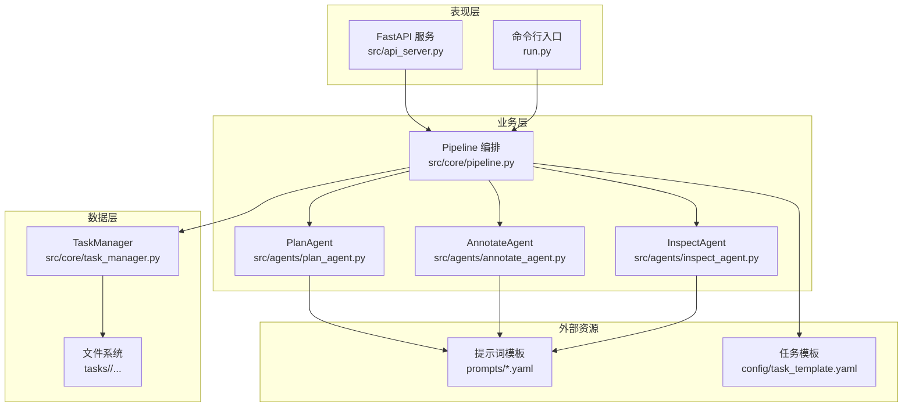
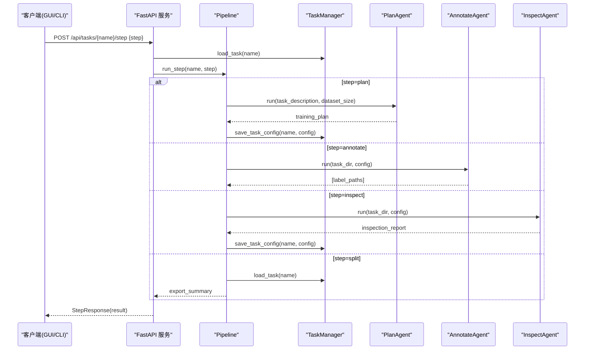
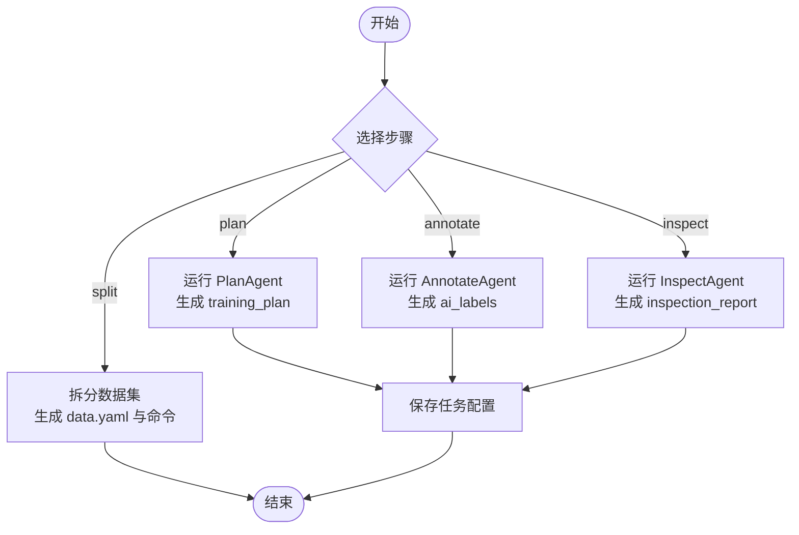
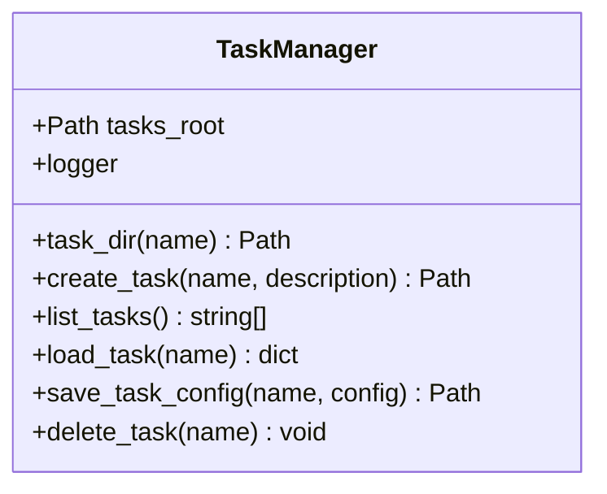
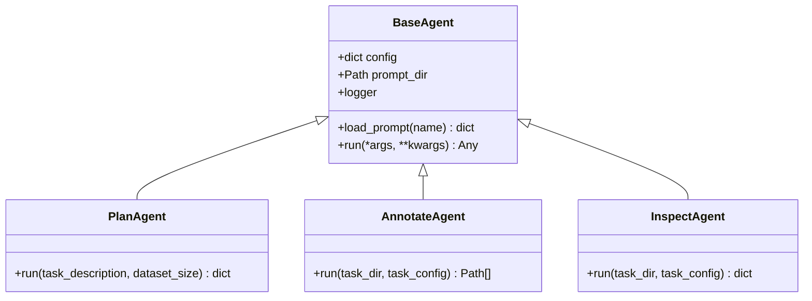
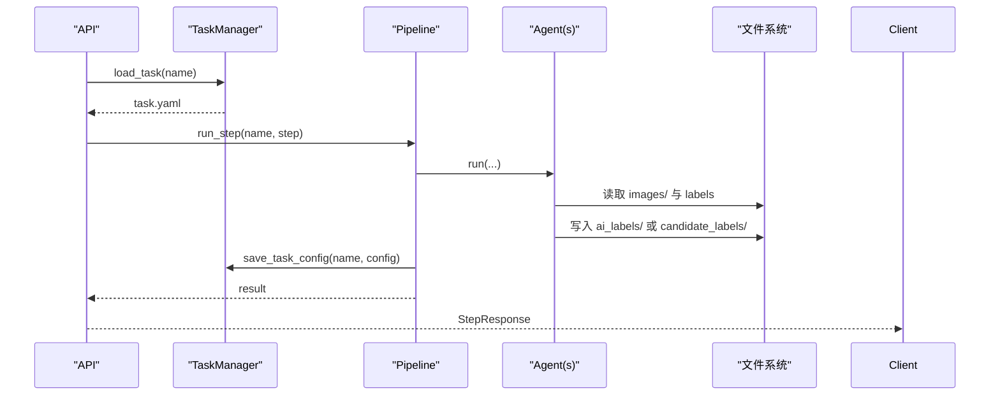
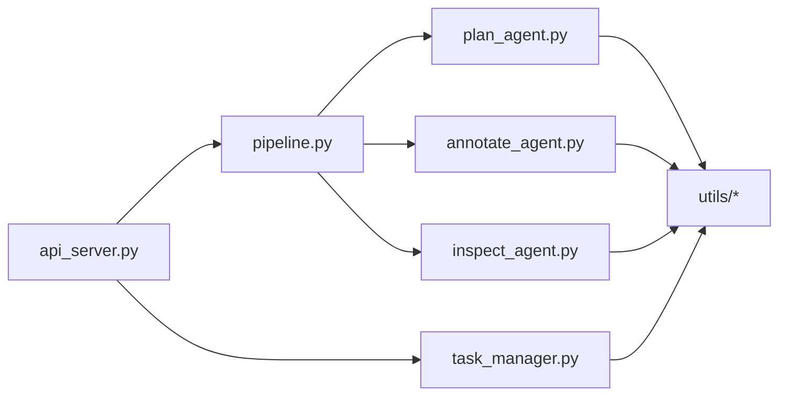

# 核心架构设计

<cite>
**本文引用的文件**
- [src/core/pipeline.py](file://src/core/pipeline.py)
- [src/core/task_manager.py](file://src/core/task_manager.py)
- [src/agents/base_agent.py](file://src/agents/base_agent.py)
- [src/agents/plan_agent.py](file://src/agents/plan_agent.py)
- [src/agents/annotate_agent.py](file://src/agents/annotate_agent.py)
- [src/agents/inspect_agent.py](file://src/agents/inspect_agent.py)
- [src/api_server.py](file://src/api_server.py)
- [run.py](file://run.py)
- [config/task_template.yaml](file://config/task_template.yaml)
- [prompts/plan_agent.yaml](file://prompts/plan_agent.yaml)
</cite>

## 目录
1. [简介](#简介)
2. [项目结构](#项目结构)
3. [核心组件](#核心组件)
4. [架构总览](#架构总览)
5. [详细组件分析](#详细组件分析)
6. [依赖关系分析](#依赖关系分析)
7. [性能考量](#性能考量)
8. [故障排查指南](#故障排查指南)
9. [结论](#结论)
10. [附录](#附录)

## 简介
本系统面向工业缺陷检测的 YOLO-OBB 训练准备与标注工作流，采用分层架构：
- 表现层：FastAPI 服务暴露 HTTP API，供 GUI（Tauri + React）调用；同时提供 CLI 入口。
- 业务层：Pipeline 编排多个 Agent（计划、自动标注、质量检查、数据集拆分导出），实现复杂工作流。
- 数据层：TaskManager 负责任务生命周期管理、状态持久化与文件系统组织。

本文重点阐述管道编排模式、任务管理器设计、BaseAgent 抽象类扩展机制、组件间通信协议与数据流转，并配以架构图与时序图说明关键交互过程。

## 项目结构
仓库按职责划分清晰：
- src/core：核心业务逻辑（Pipeline、TaskManager）
- src/agents：可插拔的 Agent 实现（PlanAgent、AnnotateAgent、InspectAgent），继承自 BaseAgent
- src/utils：通用工具（文件、图像、OBB、YAML）
- src/api_server.py：HTTP API 服务
- run.py：CLI 入口
- config：任务模板配置
- prompts：Agent 提示词模板
- gui：前端与 Tauri 壳（通过 API 与后端交互）

图表来源
- [src/api_server.py:1-384](file://src/api_server.py#L1-L384)
- [src/core/pipeline.py:1-325](file://src/core/pipeline.py#L1-L325)
- [src/core/task_manager.py:1-150](file://src/core/task_manager.py#L1-L150)
- [src/agents/plan_agent.py:1-182](file://src/agents/plan_agent.py#L1-L182)
- [src/agents/annotate_agent.py:1-185](file://src/agents/annotate_agent.py#L1-L185)
- [src/agents/inspect_agent.py:1-227](file://src/agents/inspect_agent.py#L1-L227)
- [config/task_template.yaml:1-54](file://config/task_template.yaml#L1-L54)
- [prompts/plan_agent.yaml:1-27](file://prompts/plan_agent.yaml#L1-L27)

章节来源
- [src/api_server.py:1-384](file://src/api_server.py#L1-L384)
- [run.py:1-82](file://run.py#L1-L82)
- [src/core/pipeline.py:1-325](file://src/core/pipeline.py#L1-L325)
- [src/core/task_manager.py:1-150](file://src/core/task_manager.py#L1-L150)

## 核心组件
- Pipeline：定义步骤顺序 plan -> annotate -> inspect -> split，协调各 Agent 执行，读写任务配置与输出。
- TaskManager：维护 tasks_root 下的任务目录结构与 task.yaml 配置，提供创建、列出、加载、保存、删除等能力。
- BaseAgent：抽象基类，统一日志、提示词加载接口，强制子类实现 run 方法。
- PlanAgent：根据任务描述生成结构化训练计划（classes、split、模型与超参、质检规则等）。
- AnnotateAgent：对 images 进行自动标注，输出 ai_labels；支持置信度阈值与最小缺陷像素过滤。
- InspectAgent：校验 AI 标签，发现缺失、重复、类别错误、坐标越界、尺寸异常，写入 candidate_labels 并提供质量评分。
- API Server：RESTful 接口封装 Pipeline 与 TaskManager，为 GUI 提供任务管理、步骤执行、报告与图像/标签读取。

章节来源
- [src/core/pipeline.py:22-94](file://src/core/pipeline.py#L22-L94)
- [src/core/task_manager.py:14-150](file://src/core/task_manager.py#L14-L150)
- [src/agents/base_agent.py:13-70](file://src/agents/base_agent.py#L13-L70)
- [src/agents/plan_agent.py:101-182](file://src/agents/plan_agent.py#L101-L182)
- [src/agents/annotate_agent.py:22-185](file://src/agents/annotate_agent.py#L22-L185)
- [src/agents/inspect_agent.py:34-227](file://src/agents/inspect_agent.py#L34-L227)
- [src/api_server.py:21-384](file://src/api_server.py#L21-L384)

## 架构总览
系统采用“表现层—业务层—数据层”的分层架构，并通过标准化协议在层间传递数据：
- 表现层：HTTP API（FastAPI）与 CLI（argparse）作为统一入口。
- 业务层：Pipeline 编排 Agent，Agent 之间通过共享的任务配置与文件系统协作。
- 数据层：TaskManager 管理任务目录与 YAML 配置，保证一致性与可追溯性。

图表来源
- [src/api_server.py:169-192](file://src/api_server.py#L169-L192)
- [src/core/pipeline.py:62-94](file://src/core/pipeline.py#L62-L94)
- [src/core/task_manager.py:92-122](file://src/core/task_manager.py#L92-L122)
- [src/agents/plan_agent.py:119-138](file://src/agents/plan_agent.py#L119-L138)
- [src/agents/annotate_agent.py:25-80](file://src/agents/annotate_agent.py#L25-L80)
- [src/agents/inspect_agent.py:37-108](file://src/agents/inspect_agent.py#L37-L108)

## 详细组件分析

### 管道编排模式（Pipeline）
- 步骤顺序：plan -> annotate -> inspect -> split。
- 单步执行：run_step 根据 step 路由到对应私有方法，更新并持久化任务配置。
- 全量执行：run_full 依次调用所有步骤，返回每步结果。
- 数据产出：
  - plan：生成 training_plan 并保存 plan.yaml。
  - annotate：生成 ai_labels 下每个图像的 .txt 标签。
  - inspect：生成 inspection_report.yaml，并在 candidate_labels 中写入候选修正。
  - split：按 plan.split 比例复制图像与标签，生成 dataset/data.yaml 与 train_command.txt。

图表来源
- [src/core/pipeline.py:48-94](file://src/core/pipeline.py#L48-L94)
- [src/core/pipeline.py:96-213](file://src/core/pipeline.py#L96-L213)

章节来源
- [src/core/pipeline.py:1-325](file://src/core/pipeline.py#L1-L325)

### 任务管理器（TaskManager）
- 目录结构：每个任务位于 tasks_root/<name>/，包含 images、ai_labels、candidate_labels、dataset 等子目录。
- 生命周期：
  - create_task：创建任务目录与默认 task.yaml（基于 task_template.yaml）。
  - list_tasks：列出所有任务名。
  - load_task/save_task_config：读取/写入任务配置。
  - delete_task：删除任务目录。
- 模板机制：若存在 config/task_template.yaml，则将其作为初始配置；否则使用最小默认结构。

图表来源
- [src/core/task_manager.py:14-150](file://src/core/task_manager.py#L14-L150)

章节来源
- [src/core/task_manager.py:1-150](file://src/core/task_manager.py#L1-L150)
- [config/task_template.yaml:1-54](file://config/task_template.yaml#L1-L54)

### BaseAgent 抽象类与扩展机制
- 统一能力：
  - 日志记录：每个 Agent 拥有独立命名空间 logger。
  - 提示词加载：load_prompt 从 prompt_dir 加载 *.yaml 提示词模板。
  - 运行契约：run 为抽象方法，具体 Agent 实现各自输入输出。
- 扩展方式：
  - 新增 Agent：继承 BaseAgent，实现 run，并在 Pipeline 中注册。
  - 替换 LLM 后端：PlanAgent 支持注入自定义 LLMClient 接口对象，便于接入本地或云端模型。

图表来源
- [src/agents/base_agent.py:13-70](file://src/agents/base_agent.py#L13-L70)
- [src/agents/plan_agent.py:101-182](file://src/agents/plan_agent.py#L101-L182)
- [src/agents/annotate_agent.py:22-185](file://src/agents/annotate_agent.py#L22-L185)
- [src/agents/inspect_agent.py:34-227](file://src/agents/inspect_agent.py#L34-L227)

章节来源
- [src/agents/base_agent.py:1-70](file://src/agents/base_agent.py#L1-L70)
- [src/agents/plan_agent.py:1-182](file://src/agents/plan_agent.py#L1-L182)
- [src/agents/annotate_agent.py:1-185](file://src/agents/annotate_agent.py#L1-L185)
- [src/agents/inspect_agent.py:1-227](file://src/agents/inspect_agent.py#L1-L227)

### 组件间通信协议与数据流转
- 配置协议：
  - task.yaml：任务元信息与 training_plan（由 PlanAgent 生成并合并）。
  - plan.yaml：训练计划快照。
  - inspection_report.yaml：质检报告。
  - dataset/data.yaml：YOLO-OBB 数据集描述。
  - dataset/export_summary.yaml：导出摘要。
- 标签协议：
  - ai_labels/*.txt：YOLO-OBB 格式，行格式为“类别 8个归一化坐标”。
  - candidate_labels/*.txt：经去重与范围校验后的候选修正标签。
- 数据流转：
  - API 接收请求 -> TaskManager 加载/保存配置 -> Pipeline 调度 Agent -> Agent 读写文件系统 -> 结果回传 API。

图表来源
- [src/api_server.py:169-192](file://src/api_server.py#L169-L192)
- [src/core/pipeline.py:62-94](file://src/core/pipeline.py#L62-L94)
- [src/core/task_manager.py:92-122](file://src/core/task_manager.py#L92-L122)
- [src/agents/annotate_agent.py:25-80](file://src/agents/annotate_agent.py#L25-L80)
- [src/agents/inspect_agent.py:37-108](file://src/agents/inspect_agent.py#L37-L108)

章节来源
- [src/api_server.py:1-384](file://src/api_server.py#L1-L384)
- [src/core/pipeline.py:1-325](file://src/core/pipeline.py#L1-L325)
- [src/core/task_manager.py:1-150](file://src/core/task_manager.py#L1-L150)

## 依赖关系分析
- 模块耦合：
  - API 依赖 Pipeline 与 TaskManager，低耦合，仅通过函数调用交互。
  - Pipeline 依赖具体 Agent 实例，但通过字典映射解耦，易于替换。
  - Agent 依赖 utils 与配置文件，不直接依赖 API。
- 外部依赖：
  - FastAPI、Pydantic：用于 API 建模与响应。
  - NumPy：用于几何计算（面积、IoU）。
  - YAML/JSON：用于配置与提示词解析。

图表来源
- [src/api_server.py:1-384](file://src/api_server.py#L1-L384)
- [src/core/pipeline.py:1-325](file://src/core/pipeline.py#L1-L325)
- [src/core/task_manager.py:1-150](file://src/core/task_manager.py#L1-L150)

章节来源
- [src/api_server.py:1-384](file://src/api_server.py#L1-L384)
- [src/core/pipeline.py:1-325](file://src/core/pipeline.py#L1-L325)
- [src/core/task_manager.py:1-150](file://src/core/task_manager.py#L1-L150)

## 性能考量
- 批量处理：AnnotateAgent 与 InspectAgent 遍历 images 目录，建议结合 I/O 并发或批处理以提升吞吐。
- 随机种子：Pipeline 在 split 步骤设置随机种子以保证可复现性。
- 阈值控制：conf_threshold 与 min_defect_pixels 影响标注数量与质量，需根据场景调优。
- 模型选择：PlanAgent 默认推荐轻量模型与中等 imgsz，适合消费级 GPU。
- 日志与监控：各组件均记录关键事件，便于定位瓶颈与问题。

[本节为通用指导，不直接分析具体文件]

## 故障排查指南
- 任务不存在：API 返回 404，确认任务已创建且名称正确。
- 步骤失败：API 捕获异常并返回 500，查看服务端日志定位具体 Agent 错误。
- 无图像可拆分：Pipeline 发出警告并返回空摘要，检查 images 目录是否包含有效图片。
- 标签解析异常：API 与 InspectAgent 会跳过 malformed 行并记录警告，检查 ai_labels 文件格式。
- 提示词缺失：BaseAgent.load_prompt 抛出 FileNotFoundError，确认 prompts 目录与文件名正确。

章节来源
- [src/api_server.py:169-192](file://src/api_server.py#L169-L192)
- [src/core/pipeline.py:174-177](file://src/core/pipeline.py#L174-L177)
- [src/agents/annotate_agent.py:140-161](file://src/agents/annotate_agent.py#L140-L161)
- [src/agents/inspect_agent.py:177-201](file://src/agents/inspect_agent.py#L177-L201)
- [src/agents/base_agent.py:36-53](file://src/agents/base_agent.py#L36-L53)

## 结论
本系统通过清晰的三层架构与可插拔 Agent 设计，实现了从任务规划、自动标注、质量检查到数据集导出的完整流水线。Pipeline 作为编排核心，TaskManager 提供稳定的数据层支撑，BaseAgent 抽象类确保扩展性与一致性。API 层将内部流程暴露为标准 REST 接口，便于 GUI 集成与自动化调用。整体设计兼顾可扩展性、可维护性与工程实践。

[本节为总结性内容，不直接分析具体文件]

## 附录
- 启动方式：
  - API：uvicorn 运行 api_server，端口 8765。
  - CLI：python run.py 支持 plan/annotate/inspect/split/full/create 等命令。
- 关键路径：
  - 任务根目录：tasks_root（默认 tasks）。
  - 任务目录：tasks_root/<name>/images|ai_labels|candidate_labels|dataset。
  - 配置文件：task.yaml、plan.yaml、inspection_report.yaml、dataset/data.yaml、dataset/export_summary.yaml。

章节来源
- [src/api_server.py:380-384](file://src/api_server.py#L380-L384)
- [run.py:20-77](file://run.py#L20-L77)
- [src/core/task_manager.py:14-80](file://src/core/task_manager.py#L14-L80)