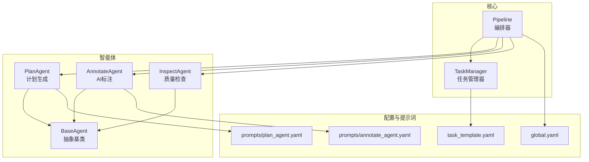
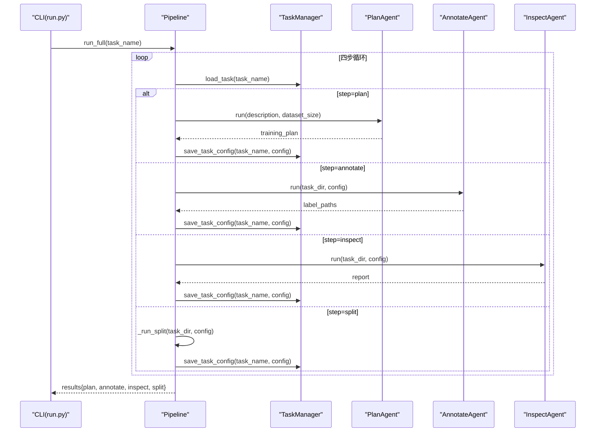
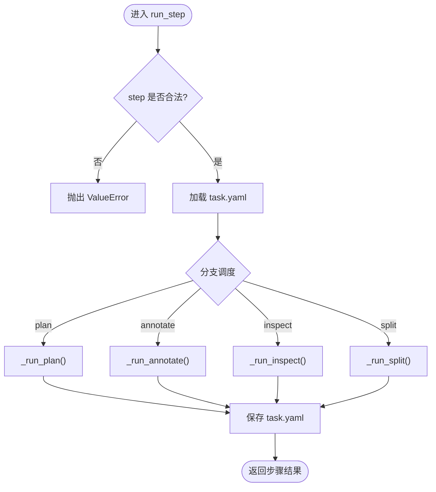
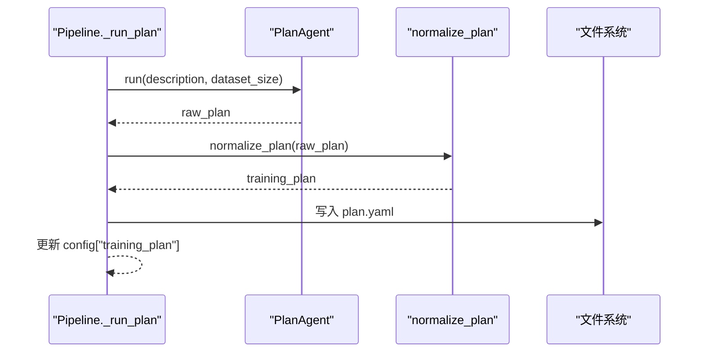
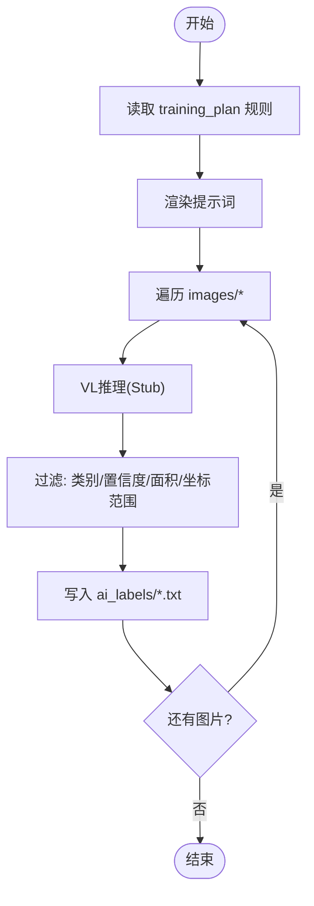
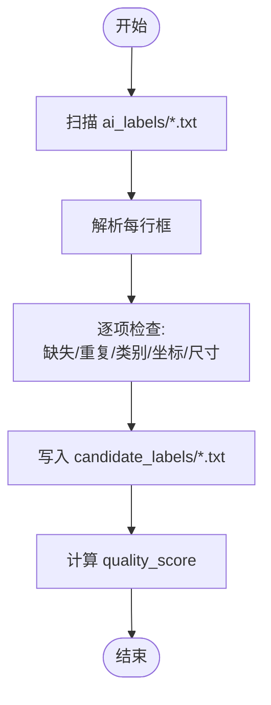
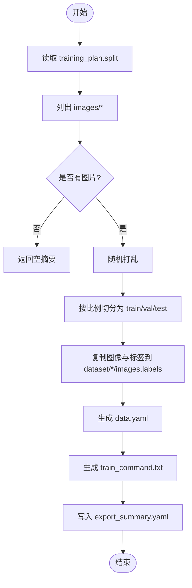
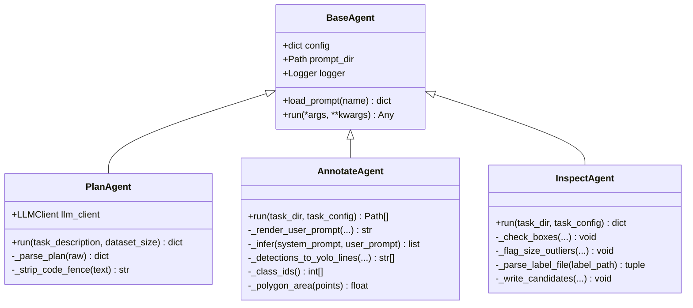
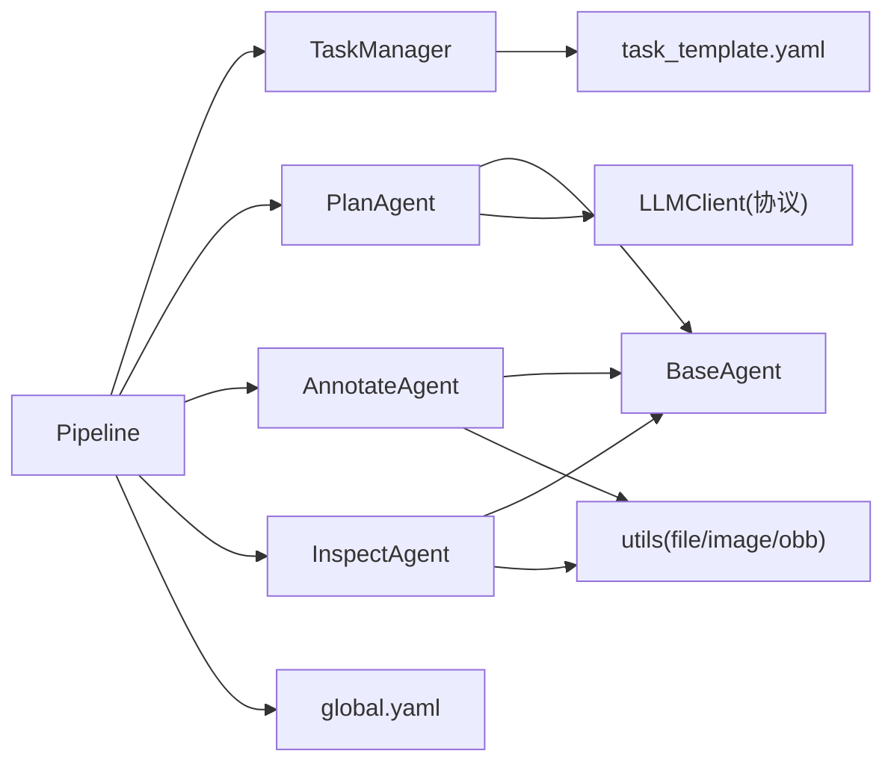

# 管道编排系统

<cite>
**本文引用的文件**   
- [pipeline.py](file://src/core/pipeline.py)
- [base_agent.py](file://src/agents/base_agent.py)
- [plan_agent.py](file://src/agents/plan_agent.py)
- [annotate_agent.py](file://src/agents/annotate_agent.py)
- [inspect_agent.py](file://src/agents/inspect_agent.py)
- [task_manager.py](file://src/core/task_manager.py)
- [global.yaml](file://config/global.yaml)
- [task_template.yaml](file://config/task_template.yaml)
- [plan_agent.yaml](file://prompts/plan_agent.yaml)
- [annotate_agent.yaml](file://prompts/annotate_agent.yaml)
- [test_pipeline.py](file://tests/test_pipeline.py)
- [run.py](file://run.py)
</cite>

## 目录
1. [简介](#简介)
2. [项目结构](#项目结构)
3. [核心组件](#核心组件)
4. [架构总览](#架构总览)
5. [详细组件分析](#详细组件分析)
6. [依赖关系分析](#依赖关系分析)
7. [性能与可扩展性](#性能与可扩展性)
8. [故障排查指南](#故障排查指南)
9. [结论](#结论)
10. [附录：使用示例](#附录使用示例)

## 简介
本仓库实现了一个面向工业缺陷检测的“YOLO-OBB”训练准备流水线。该流水线以 Pipeline 为核心，按四个阶段编排任务：计划生成（plan）、AI标注（annotate）、质量检查（inspect）、数据集分割与导出（split）。每个阶段由独立的 Agent 执行，Agent 通过统一的 BaseAgent 抽象接入外部提示词与可选的大模型后端。Pipeline 负责状态管理、错误处理、结果聚合，以及将中间产物持久化到任务目录中，最终输出可直接用于 YOLO-OBB 训练的数据包。

## 项目结构
- 核心编排位于 src/core/pipeline.py，协调 TaskManager 与各 Agent。
- Agent 层位于 src/agents，包含 PlanAgent、AnnotateAgent、InspectAgent，均继承自 BaseAgent。
- 配置与提示词分别位于 config 与 prompts 目录。
- CLI 入口 run.py 提供命令行调用方式。
- tests/test_pipeline.py 提供了端到端测试用例，展示典型用法。

图表来源
- [pipeline.py:22-94](file://src/core/pipeline.py#L22-L94)
- [base_agent.py:13-69](file://src/agents/base_agent.py#L13-L69)
- [plan_agent.py:101-138](file://src/agents/plan_agent.py#L101-L138)
- [annotate_agent.py:22-80](file://src/agents/annotate_agent.py#L22-L80)
- [inspect_agent.py:34-108](file://src/agents/inspect_agent.py#L34-L108)
- [task_manager.py:14-122](file://src/core/task_manager.py#L14-L122)
- [global.yaml:1-29](file://config/global.yaml#L1-L29)
- [task_template.yaml:1-54](file://config/task_template.yaml#L1-L54)
- [plan_agent.yaml:1-27](file://prompts/plan_agent.yaml#L1-L27)
- [annotate_agent.yaml:1-25](file://prompts/annotate_agent.yaml#L1-L25)

章节来源
- [pipeline.py:22-94](file://src/core/pipeline.py#L22-L94)
- [task_manager.py:14-122](file://src/core/task_manager.py#L14-L122)
- [run.py:20-77](file://run.py#L20-L77)

## 核心组件
- Pipeline：定义四步流程 plan -> annotate -> inspect -> split，提供 run_full() 与 run_step() 两个对外接口，内部委托各 Agent 完成具体工作，并负责结果持久化与汇总。
- BaseAgent：所有 Agent 的抽象基类，提供 prompt_dir、logger 与 load_prompt() 能力，要求子类实现 run()。
- PlanAgent：根据任务描述生成结构化训练计划，支持真实 LLM 客户端或离线 Stub 实现。
- AnnotateAgent：对 images 目录下的图片进行 OBB 标注，输出 ai_labels/*.txt。
- InspectAgent：校验 AI 标注质量，输出 inspection_report.yaml 与 candidate_labels/*.txt。
- TaskManager：管理任务目录结构与 task.yaml 配置，提供创建、加载、保存、删除等生命周期操作。

章节来源
- [pipeline.py:22-94](file://src/core/pipeline.py#L22-L94)
- [base_agent.py:13-69](file://src/agents/base_agent.py#L13-L69)
- [plan_agent.py:101-138](file://src/agents/plan_agent.py#L101-L138)
- [annotate_agent.py:22-80](file://src/agents/annotate_agent.py#L22-L80)
- [inspect_agent.py:34-108](file://src/agents/inspect_agent.py#L34-L108)
- [task_manager.py:14-122](file://src/core/task_manager.py#L14-L122)

## 架构总览
Pipeline 作为编排中枢，按固定顺序驱动四个步骤。每一步都从 TaskManager 加载任务配置，并将结果写回任务目录，保证状态可恢复、可审计。

图表来源
- [pipeline.py:48-94](file://src/core/pipeline.py#L48-L94)
- [task_manager.py:92-122](file://src/core/task_manager.py#L92-L122)
- [plan_agent.py:119-138](file://src/agents/plan_agent.py#L119-L138)
- [annotate_agent.py:25-80](file://src/agents/annotate_agent.py#L25-L80)
- [inspect_agent.py:37-108](file://src/agents/inspect_agent.py#L37-L108)

## 详细组件分析

### Pipeline 设计与工作机制
- 步骤常量：_STEPS = ("plan", "annotate", "inspect", "split")，确保顺序固定且不可变。
- run_full(task_name)：依次调用 run_step() 执行全部步骤，返回字典 {step: result}。
- run_step(task_name, step)：参数校验、加载配置、选择对应私有方法执行，并在完成后统一保存配置。
- 私有方法：
  - _run_plan()：调用 PlanAgent.run()，规范化为 training_plan 并写入 plan.yaml。
  - _run_annotate()：调用 AnnotateAgent.run()，产出 ai_labels/*.txt。
  - _run_inspect()：调用 InspectAgent.run()，产出 inspection_report.yaml。
  - _run_split()：基于 training_plan.split 比例随机打乱图像，复制到 dataset/{train,val,test}，生成 data.yaml 与 train_command.txt，并输出 export_summary.yaml。

图表来源
- [pipeline.py:62-94](file://src/core/pipeline.py#L62-L94)
- [pipeline.py:96-213](file://src/core/pipeline.py#L96-L213)

章节来源
- [pipeline.py:19-94](file://src/core/pipeline.py#L19-L94)
- [pipeline.py:96-213](file://src/core/pipeline.py#L96-L213)

#### _run_plan()：训练计划生成
- 从 config["task"] 提取 description，结合 dataset_size 调用 PlanAgent.run()。
- 将返回的计划经 normalize_plan() 标准化为 schema，合并回 config["training_plan"]。
- 将 training_plan 持久化为 plan.yaml，便于后续步骤复用。

图表来源
- [pipeline.py:96-122](file://src/core/pipeline.py#L96-L122)
- [pipeline.py:284-324](file://src/core/pipeline.py#L284-L324)
- [plan_agent.py:119-138](file://src/agents/plan_agent.py#L119-L138)

章节来源
- [pipeline.py:96-122](file://src/core/pipeline.py#L96-L122)
- [pipeline.py:284-324](file://src/core/pipeline.py#L284-L324)
- [plan_agent.py:101-138](file://src/agents/plan_agent.py#L101-L138)

#### _run_annotate()：AI标注处理
- 读取 training_plan 中的 classes、conf_threshold、min_defect_pixels、exclude_items 等规则。
- 渲染 annotate_agent.yaml 的 system/user 提示词，逐图推理（当前为 Stub），过滤低置信度与小目标，写出 ai_labels/*.txt。
- 返回已写入标签路径列表。

图表来源
- [annotate_agent.py:25-80](file://src/agents/annotate_agent.py#L25-L80)
- [annotate_agent.py:115-161](file://src/agents/annotate_agent.py#L115-L161)
- [annotate_agent.py:163-184](file://src/agents/annotate_agent.py#L163-L184)

章节来源
- [annotate_agent.py:22-80](file://src/agents/annotate_agent.py#L22-L80)
- [annotate_agent.py:115-184](file://src/agents/annotate_agent.py#L115-L184)

#### _run_inspect()：质量检查
- 遍历 ai_labels/*.txt，解析每行框，执行缺失标签、重复框（OBB IoU）、类别错误、坐标越界、尺寸异常等检查。
- 将候选修正写入 candidate_labels/*.txt，不修改原始标签。
- 计算 quality_score 并输出 inspection_report.yaml。

图表来源
- [inspect_agent.py:37-108](file://src/agents/inspect_agent.py#L37-L108)
- [inspect_agent.py:110-175](file://src/agents/inspect_agent.py#L110-L175)
- [inspect_agent.py:177-227](file://src/agents/inspect_agent.py#L177-L227)

章节来源
- [inspect_agent.py:34-108](file://src/agents/inspect_agent.py#L34-L108)
- [inspect_agent.py:110-227](file://src/agents/inspect_agent.py#L110-L227)

#### _run_split()：数据集分割与导出
- 从 training_plan.split 读取 train/val/test 比例，随机打乱 images，按比例切分。
- 复制图像与最佳可用标签（优先 candidate_labels，否则 ai_labels）到 dataset/{train,val,test}/images 与 labels。
- 生成 data.yaml（含 names 映射）与 train_command.txt（含 yolo obb train 命令），并输出 export_summary.yaml。

图表来源
- [pipeline.py:155-213](file://src/core/pipeline.py#L155-L213)
- [pipeline.py:215-281](file://src/core/pipeline.py#L215-L281)

章节来源
- [pipeline.py:155-213](file://src/core/pipeline.py#L155-L213)
- [pipeline.py:215-281](file://src/core/pipeline.py#L215-L281)

### Agent 体系与扩展点
- BaseAgent 提供通用能力：prompt_dir、logger、load_prompt(name)。
- PlanAgent：
  - 支持注入 LLMClient 协议；默认使用 StubLLMClient 离线生成保守计划。
  - run() 渲染提示词，调用 llm_client.generate()，再解析 JSON/YAML，失败时回退到 stub。
- AnnotateAgent：
  - 渲染 annotate_agent.yaml 提示词，逐图推理（Stub），过滤后写出 YOLO-OBB 格式标签。
- InspectAgent：
  - 解析 YOLO-OBB 标签，执行多项检查，输出候选修正与质量报告。

图表来源
- [base_agent.py:13-69](file://src/agents/base_agent.py#L13-L69)
- [plan_agent.py:101-182](file://src/agents/plan_agent.py#L101-L182)
- [annotate_agent.py:22-184](file://src/agents/annotate_agent.py#L22-L184)
- [inspect_agent.py:34-227](file://src/agents/inspect_agent.py#L34-L227)

章节来源
- [base_agent.py:13-69](file://src/agents/base_agent.py#L13-L69)
- [plan_agent.py:101-182](file://src/agents/plan_agent.py#L101-L182)
- [annotate_agent.py:22-184](file://src/agents/annotate_agent.py#L22-L184)
- [inspect_agent.py:34-227](file://src/agents/inspect_agent.py#L34-L227)

## 依赖关系分析
- Pipeline 依赖 TaskManager 进行任务目录与配置的读写。
- Pipeline 组合三个 Agent，并通过 BaseAgent 抽象解耦具体实现。
- PlanAgent 依赖 LLMClient 协议，默认使用 StubLLMClient；可通过注入替换为真实后端。
- AnnotateAgent 与 InspectAgent 依赖 utils 工具集（文件、图像、OBB 几何）。
- 配置来源于 global.yaml 与 task_template.yaml，提示词来源于 prompts/*.yaml。

图表来源
- [pipeline.py:11-17](file://src/core/pipeline.py#L11-L17)
- [task_manager.py:1-12](file://src/core/task_manager.py#L1-L12)
- [plan_agent.py:10-18](file://src/agents/plan_agent.py#L10-L18)
- [annotate_agent.py:14-19](file://src/agents/annotate_agent.py#L14-L19)
- [inspect_agent.py:12-17](file://src/agents/inspect_agent.py#L12-L17)
- [global.yaml:1-29](file://config/global.yaml#L1-L29)
- [task_template.yaml:1-54](file://config/task_template.yaml#L1-L54)

章节来源
- [pipeline.py:11-17](file://src/core/pipeline.py#L11-L17)
- [task_manager.py:1-12](file://src/core/task_manager.py#L1-L12)
- [plan_agent.py:10-18](file://src/agents/plan_agent.py#L10-L18)
- [annotate_agent.py:14-19](file://src/agents/annotate_agent.py#L14-L19)
- [inspect_agent.py:12-17](file://src/agents/inspect_agent.py#L12-L17)

## 性能与可扩展性
- 计划生成：PlanAgent 默认使用 StubLLMClient，零网络开销；若接入真实 LLM，建议控制 max_new_tokens 与批处理策略。
- 标注阶段：AnnotateAgent 当前为 Stub 推理，实际部署时应考虑 GPU 显存限制（参考 global.yaml 的 vl_model_name、load_in_4bit、max_gpu_memory_mb）与批量推理。
- 检查阶段：InspectAgent 在单图上做 O(n^2) 重复框检测，当单图框数较多时需关注复杂度；可按需引入空间索引或近似匹配优化。
- 分割导出：_run_split() 使用 random.shuffle 与 shutil.copy2，I/O 密集；大集合时可考虑并行复制与流式写入。
- 可扩展点：
  - 替换 LLMClient 为本地 Qwen2.5-VL 或其他后端。
  - 自定义 Agent 实现复杂业务逻辑，仍遵循 BaseAgent 契约。
  - 扩展 normalize_plan() 以适配更多训练框架或数据格式。

[本节为通用指导，不直接分析具体文件]

## 故障排查指南
- 未知步骤：run_step(step) 会抛出 ValueError，确认 step 属于 {"plan","annotate","inspect","split"}。
- 任务不存在：run_step() 与 Agent.run() 可能抛出 FileNotFoundError，检查 TaskManager 是否正确创建任务目录与 task.yaml。
- 无图片可分割：_run_split() 在无 images 时返回空摘要，不会崩溃；请确认 images/ 下存在有效图片。
- 计划解析失败：PlanAgent._parse_plan() 会尝试 JSON/YAML 解析，失败则回退到 Stub 计划；检查 LLM 输出格式或提示词约束。
- 标注为空：AnnotateAgent 会根据 conf_threshold 与 min_defect_pixels 过滤，过低阈值或过小目标可能导致结果为空；调整规则或检查推理输出。
- 质量分数低：InspectAgent 的 quality_score 随错误数量下降；查看 inspection_report.yaml 的错误分类定位问题。

章节来源
- [pipeline.py:62-94](file://src/core/pipeline.py#L62-L94)
- [annotate_agent.py:25-80](file://src/agents/annotate_agent.py#L25-L80)
- [inspect_agent.py:37-108](file://src/agents/inspect_agent.py#L37-L108)
- [plan_agent.py:140-168](file://src/agents/plan_agent.py#L140-L168)

## 结论
Pipeline 以清晰的四步流程组织任务，借助 BaseAgent 抽象与 TaskManager 的状态管理，实现了从计划生成到训练数据包导出的完整闭环。Agent 层可插拔、可替换，既支持离线 Stub 快速验证，也便于接入真实视觉语言模型。整体设计强调可观测性（日志与报告）、可恢复性（持久化配置与中间产物）与可扩展性（协议化后端与统一 Agent 接口）。

[本节为总结性内容，不直接分析具体文件]

## 附录：使用示例

### 命令行调用
- 创建任务：
  - uv run python run.py create --task demo --description "光伏板裂纹检测"
- 运行单步：
  - uv run python run.py plan --task demo
  - uv run python run.py annotate --task demo
  - uv run python run.py inspect --task demo
  - uv run python run.py split --task demo
- 运行全流程：
  - uv run python run.py full --task demo

章节来源
- [run.py:20-77](file://run.py#L20-L77)

### Python API 调用
- 初始化：
  - 使用 TaskManager(tasks_root="tasks") 创建任务管理器。
  - 使用 Pipeline(TaskManager(...)) 创建管道。
- 运行全流程：
  - results = pipeline.run_full("demo")
  - 返回字典 keys: ["plan","annotate","inspect","split"]
- 运行单步：
  - result = pipeline.run_step("demo", "annotate")
  - 返回类型取决于步骤：plan 返回 dict，annotate 返回 Path 列表，inspect 返回 dict，split 返回导出摘要 dict。

章节来源
- [test_pipeline.py:15-41](file://tests/test_pipeline.py#L15-L41)
- [test_pipeline.py:56-97](file://tests/test_pipeline.py#L56-L97)
- [test_pipeline.py:99-103](file://tests/test_pipeline.py#L99-L103)