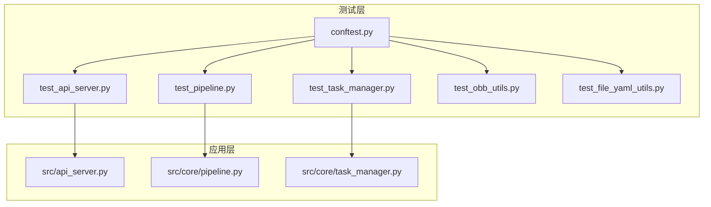
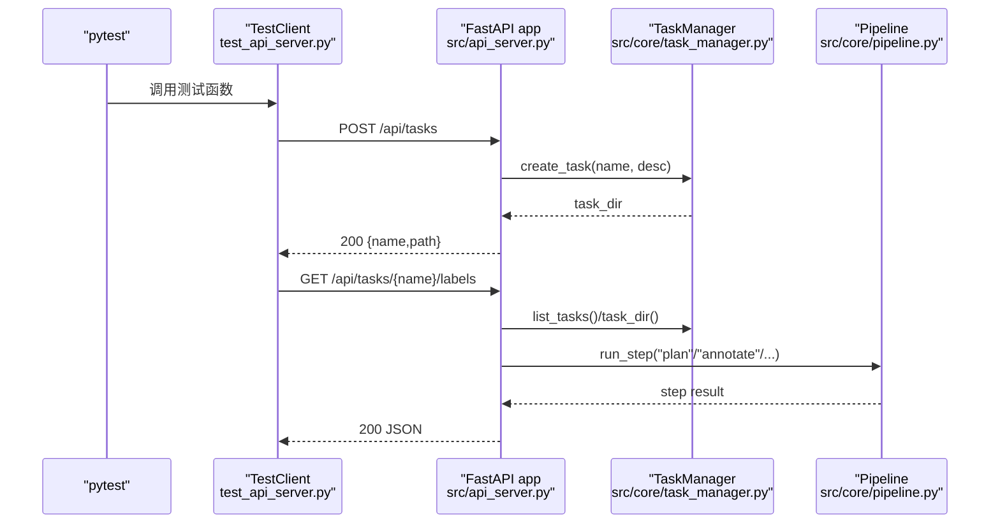
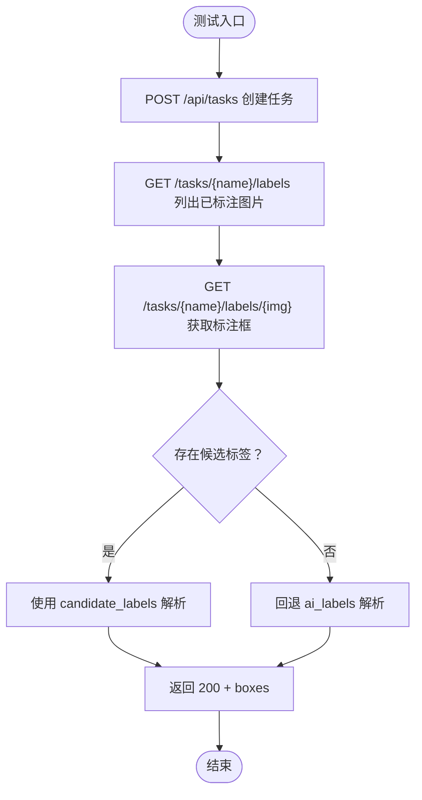
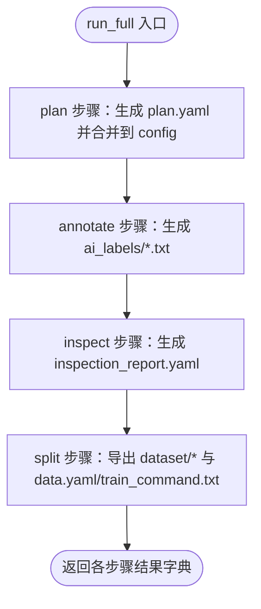
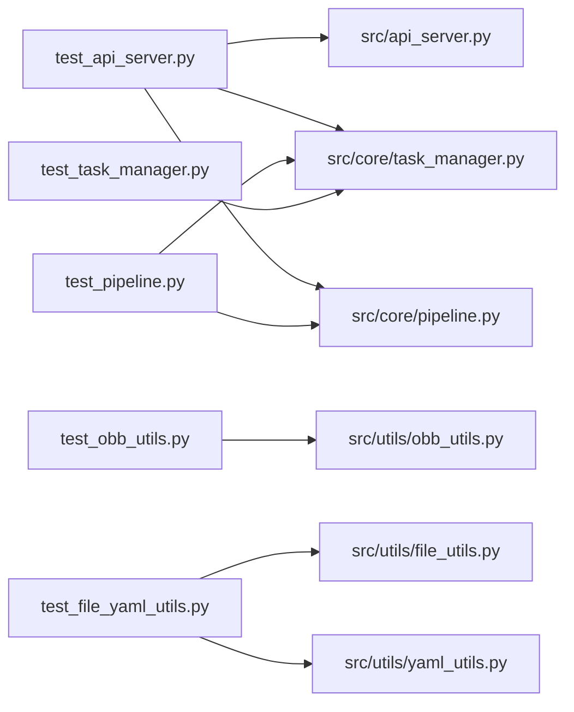

# 测试指南

<cite>
**本文引用的文件**   
- [tests/conftest.py](file://tests/conftest.py)
- [tests/test_api_server.py](file://tests/test_api_server.py)
- [tests/test_pipeline.py](file://tests/test_pipeline.py)
- [tests/test_task_manager.py](file://tests/test_task_manager.py)
- [tests/test_obb_utils.py](file://tests/test_obb_utils.py)
- [tests/test_file_yaml_utils.py](file://tests/test_file_yaml_utils.py)
- [pyproject.toml](file://pyproject.toml)
- [src/api_server.py](file://src/api_server.py)
- [src/core/pipeline.py](file://src/core/pipeline.py)
- [src/core/task_manager.py](file://src/core/task_manager.py)
</cite>

## 目录
1. [简介](#简介)
2. [项目结构](#项目结构)
3. [核心组件](#核心组件)
4. [架构总览](#架构总览)
5. [详细组件分析](#详细组件分析)
6. [依赖关系分析](#依赖关系分析)
7. [性能与稳定性考量](#性能与稳定性考量)
8. [调试与故障排查](#调试与故障排查)
9. [结论](#结论)
10. [附录：最佳实践清单](#附录最佳实践清单)

## 简介
本测试指南面向 VL-YOLO-Anchor 项目的测试策略、架构与实践。文档将解释单元测试与集成测试的组织方式，说明共享夹具 conftest.py 的配置与数据生成方法，并逐一介绍 API 服务器测试、管道测试、任务管理器测试、工具函数测试的职责与断言要点。同时给出编写新测试用例的最佳实践、覆盖率建议以及持续集成配置思路，并提供调试失败和常见问题解决方案。

## 项目结构
测试代码位于 tests 目录，按功能模块划分：
- conftest.py：全局 pytest 夹具与共享测试数据
- test_api_server.py：FastAPI 接口集成测试
- test_pipeline.py：端到端管道与步骤编排测试
- test_task_manager.py：任务生命周期管理测试
- test_obb_utils.py：旋转框几何与坐标归一化工具测试
- test_file_yaml_utils.py：文件与 YAML 工具测试

图表来源
- [tests/conftest.py:1-30](file://tests/conftest.py#L1-L30)
- [tests/test_api_server.py:1-130](file://tests/test_api_server.py#L1-L130)
- [tests/test_pipeline.py:1-119](file://tests/test_pipeline.py#L1-L119)
- [tests/test_task_manager.py:1-65](file://tests/test_task_manager.py#L1-L65)
- [tests/test_obb_utils.py:1-84](file://tests/test_obb_utils.py#L1-L84)
- [tests/test_file_yaml_utils.py:1-59](file://tests/test_file_yaml_utils.py#L1-L59)
- [src/api_server.py:1-384](file://src/api_server.py#L1-L384)
- [src/core/pipeline.py:1-325](file://src/core/pipeline.py#L1-L325)
- [src/core/task_manager.py:1-150](file://src/core/task_manager.py#L1-L150)

章节来源
- [pyproject.toml:63-65](file://pyproject.toml#L63-L65)

## 核心组件
- 共享夹具 conftest.py
  - 提供 make_image 工厂夹具，基于 tmp_path 创建临时 BGR 图像路径，供需要真实图像文件的测试复用。
- API 服务器测试
  - 使用 FastAPI TestClient 对 /api/tasks、/labels、/plan 等接口进行集成测试；通过 monkeypatch 注入隔离的 TaskManager 与 Pipeline。
- 管道测试
  - 验证 run_step 与 run_full 的行为，包括未知步骤、缺失任务、完整流程产物（plan.yaml、ai_labels、inspection_report.yaml、dataset 导出）。
- 任务管理器测试
  - 覆盖 create/list/load/save/delete 等生命周期操作及错误语义。
- OBB 工具测试
  - 覆盖旋转框转换、IoU、坐标归一化/反归一化、边界校验与参数合法性。
- 文件与 YAML 工具测试
  - 覆盖图片列表过滤、ensure_dir 幂等性、YAML 读写与异常场景。

章节来源
- [tests/conftest.py:12-29](file://tests/conftest.py#L12-L29)
- [tests/test_api_server.py:12-26](file://tests/test_api_server.py#L12-L26)
- [tests/test_pipeline.py:15-25](file://tests/test_pipeline.py#L15-L25)
- [tests/test_task_manager.py:11-65](file://tests/test_task_manager.py#L11-L65)
- [tests/test_obb_utils.py:17-84](file://tests/test_obb_utils.py#L17-L84)
- [tests/test_file_yaml_utils.py:12-59](file://tests/test_file_yaml_utils.py#L12-L59)

## 架构总览
下图展示测试如何驱动应用层关键组件，以及数据在测试中的流向。

图表来源
- [tests/test_api_server.py:44-130](file://tests/test_api_server.py#L44-L130)
- [src/api_server.py:139-338](file://src/api_server.py#L139-L338)
- [src/core/task_manager.py:51-122](file://src/core/task_manager.py#L51-L122)
- [src/core/pipeline.py:48-94](file://src/core/pipeline.py#L48-L94)

## 详细组件分析

### 共享夹具与测试数据（conftest.py）
- 目标：为所有测试提供可复用的临时图像生成能力，避免硬编码或外部资源依赖。
- 关键点：
  - 使用 pytest 的 tmp_path 确保每个测试拥有独立的工作目录。
  - 返回一个工厂函数，支持指定文件名与尺寸，内部用 OpenCV 写入最小 BGR 图像。
- 适用场景：需要真实图像路径的 API 测试、管道测试等。

章节来源
- [tests/conftest.py:12-29](file://tests/conftest.py#L12-L29)

### API 服务器测试（test_api_server.py）
- 职责：
  - 验证任务创建、列出、标签查询、计划执行等 HTTP 接口的行为与状态码。
  - 验证候选标签优先于 AI 标签的读取逻辑。
  - 验证非法输入、缺失资源的 404 语义。
- 夹具设计：
  - client 夹具通过 monkeypatch 替换 api_server 模块级 _task_manager 与 _pipeline，绑定到 tmp_path 下的隔离目录，保证测试间互不干扰。
- 典型断言：
  - 状态码断言（200、409、404）。
  - JSON 字段断言（任务名、boxes 结构、plan 字段）。
  - 业务规则断言（候选标签优先级、空标签返回空 boxes）。

图表来源
- [tests/test_api_server.py:44-130](file://tests/test_api_server.py#L44-L130)
- [src/api_server.py:139-338](file://src/api_server.py#L139-L338)

章节来源
- [tests/test_api_server.py:12-26](file://tests/test_api_server.py#L12-L26)
- [tests/test_api_server.py:44-130](file://tests/test_api_server.py#L44-L130)
- [src/api_server.py:139-338](file://src/api_server.py#L139-L338)

### 管道测试（test_pipeline.py）
- 职责：
  - 验证 run_step 的错误处理（未知步骤、缺失任务）。
  - 验证 run_full 的端到端产物：plan.yaml、ai_labels、inspection_report.yaml、dataset 导出结构与命令。
  - 验证 normalize_plan 默认值填充。
- 夹具设计：
  - pipeline 夹具绑定到 tmp_path 下的 tasks 根目录，隔离文件系统。
  - 辅助函数 _make_task 用于快速创建任务并拷贝测试图像。
- 关键断言：
  - 结果键集合断言（plan/annotate/inspect/split）。
  - 文件存在性与内容断言（plan.yaml、data.yaml、train_command.txt）。
  - 空数据集分支断言（无图像时 split 返回空摘要）。

图表来源
- [src/core/pipeline.py:48-94](file://src/core/pipeline.py#L48-L94)
- [src/core/pipeline.py:155-213](file://src/core/pipeline.py#L155-L213)
- [tests/test_pipeline.py:56-97](file://tests/test_pipeline.py#L56-L97)

章节来源
- [tests/test_pipeline.py:15-25](file://tests/test_pipeline.py#L15-L25)
- [tests/test_pipeline.py:44-119](file://tests/test_pipeline.py#L44-L119)
- [src/core/pipeline.py:48-94](file://src/core/pipeline.py#L48-L94)
- [src/core/pipeline.py:155-213](file://src/core/pipeline.py#L155-L213)

### 任务管理器测试（test_task_manager.py）
- 职责：
  - 验证 create_task 目录脚手架与初始配置。
  - 重复创建抛出 FileExistsError。
  - list_tasks 仅返回目录名且排序。
  - save/load 配置持久化与读取。
  - load_task 缺失抛出 FileNotFoundError。
  - delete_task 删除目录树并从列表中消失。
- 断言要点：
  - 子目录 images/ai_labels/candidate_labels 存在。
  - 配置中 task.name/description 正确。
  - 非目录项被忽略。

章节来源
- [tests/test_task_manager.py:11-65](file://tests/test_task_manager.py#L11-L65)
- [src/core/task_manager.py:51-137](file://src/core/task_manager.py#L51-L137)

### OBB 工具测试（test_obb_utils.py）
- 职责：
  - 旋转框四角点与中心宽高角度之间的往返一致性。
  - IoU 计算：相同框为 1.0，不相交为 0.0，退化框面积为 0。
  - 坐标归一化/反归一化往返一致，越界坐标钳制到 [0,1]。
  - 维度校验：非正宽高抛 ValueError。
- 断言要点：
  - 使用 pytest.approx 处理浮点误差。
  - 使用集合比较处理 cv2.minAreaRect 可能的角点顺序差异。

章节来源
- [tests/test_obb_utils.py:17-84](file://tests/test_obb_utils.py#L17-L84)

### 文件与 YAML 工具测试（test_file_yaml_utils.py）
- 职责：
  - list_images 仅返回受支持的图片扩展名并按名称排序。
  - ensure_dir 幂等创建嵌套目录。
  - YAML 读写往返一致，保留映射内容与键序。
  - 空 YAML 文件返回空字典。
  - 非映射根节点抛 ValueError。
  - 缺失文件抛 FileNotFoundError。
- 断言要点：
  - 文件名排序与过滤。
  - 异常类型与消息片段匹配。

章节来源
- [tests/test_file_yaml_utils.py:12-59](file://tests/test_file_yaml_utils.py#L12-L59)

## 依赖关系分析
测试与源码的依赖关系如下：

图表来源
- [tests/test_api_server.py:1-130](file://tests/test_api_server.py#L1-L130)
- [tests/test_pipeline.py:1-119](file://tests/test_pipeline.py#L1-L119)
- [tests/test_task_manager.py:1-65](file://tests/test_task_manager.py#L1-L65)
- [tests/test_obb_utils.py:1-84](file://tests/test_obb_utils.py#L1-L84)
- [tests/test_file_yaml_utils.py:1-59](file://tests/test_file_yaml_utils.py#L1-L59)

章节来源
- [pyproject.toml:63-65](file://pyproject.toml#L63-L65)

## 性能与稳定性考量
- 隔离性：所有测试均使用 tmp_path 作为工作根，避免跨测试污染。
- 确定性：
  - 管道 split 步骤固定随机种子，保证分割结果稳定可复现。
  - 数值断言使用 pytest.approx 容忍浮点误差。
- 轻量依赖：
  - 工具类测试尽量只依赖 numpy/opencv/pyyaml，避免重型模型加载。
- 可扩展性：
  - 通过 fixtures 与 monkeypatch 解耦外部依赖（如 API 模块级变量），便于替换实现或注入模拟对象。

[本节为通用指导，不涉及具体文件分析]

## 调试与故障排查
- 常见失败原因与定位
  - 路径不存在：检查 TaskManager.load_task 与 API 路由中对任务/图片/标签文件的 404 处理。
  - 标签格式错误：API 会跳过格式错误的行并记录警告；确认 candidate_labels 与 ai_labels 的命名与内容。
  - 归一化坐标越界：OBB 工具会将越界坐标钳制到 [0,1]；若断言期望严格范围，需考虑容差。
  - 管道步骤失败：run_step 对未知步骤抛 ValueError；缺失任务抛 FileNotFoundError；Agent 异常会被 API 捕获并转 500。
- 调试技巧
  - 使用 pytest -v 查看详细输出；必要时添加 logging 观察中间状态。
  - 针对 API 测试，打印响应体 res.json() 以核对字段结构。
  - 针对管道测试，检查生成的 plan.yaml、inspection_report.yaml、dataset/data.yaml 与 train_command.txt。
- 修复建议
  - 对于并发或并行运行导致的临时目录冲突，确保 fixture 使用 tmp_path。
  - 对于浮点比较，统一使用 pytest.approx。
  - 对于外部依赖不稳定，使用 monkeypatch 或依赖注入替换实现。

章节来源
- [src/api_server.py:91-138](file://src/api_server.py#L91-L138)
- [src/core/pipeline.py:62-94](file://src/core/pipeline.py#L62-L94)
- [src/core/task_manager.py:92-137](file://src/core/task_manager.py#L92-L137)

## 结论
本项目测试采用清晰的模块化组织：API 集成测试、管道端到端测试、任务管理器单元测试、工具函数单元测试，并通过 conftest.py 提供统一的临时数据与夹具。测试强调隔离性、确定性与可读性，断言覆盖状态码、数据结构与业务规则。遵循本文最佳实践，可高效扩展新的测试用例并保持质量基线。

[本节为总结性内容，不涉及具体文件分析]

## 附录：最佳实践清单
- 测试命名约定
  - 测试函数以 test_ 开头，描述被测行为，例如 test_create_and_list_tasks、test_normalize_denormalize_round_trip。
  - 夹具以 fixture 装饰器声明，命名体现用途，例如 client、pipeline、make_image。
- 断言方法
  - 状态码断言：res.status_code == 200/404/409。
  - 结构断言：res.json()["boxes"]、results["plan"] 等键存在与类型正确。
  - 数值断言：使用 pytest.approx 处理浮点误差。
  - 异常断言：with pytest.raises(FileNotFoundError/ValueError, match=...)。
- 模拟与隔离
  - 使用 monkeypatch 替换模块级变量（如 api_server._task_manager/_pipeline）。
  - 使用 tmp_path 作为任务根目录，确保测试间隔离。
  - 使用夹具工厂（如 make_image）生成轻量测试图像。
- 覆盖率要求
  - 建议在 CI 中启用覆盖率统计，目标行覆盖率不低于 80%，分支覆盖率不低于 70%。
  - 对关键路径（API 路由、管道步骤、工具函数）优先覆盖。
- 持续集成配置
  - 安装开发依赖：uv pip install -e ".[dev]"。
  - 运行测试：pytest -v --tb=short。
  - 可选：结合 coverage 生成报告，上传至覆盖率平台。

章节来源
- [pyproject.toml:28-33](file://pyproject.toml#L28-L33)
- [pyproject.toml:63-65](file://pyproject.toml#L63-L65)