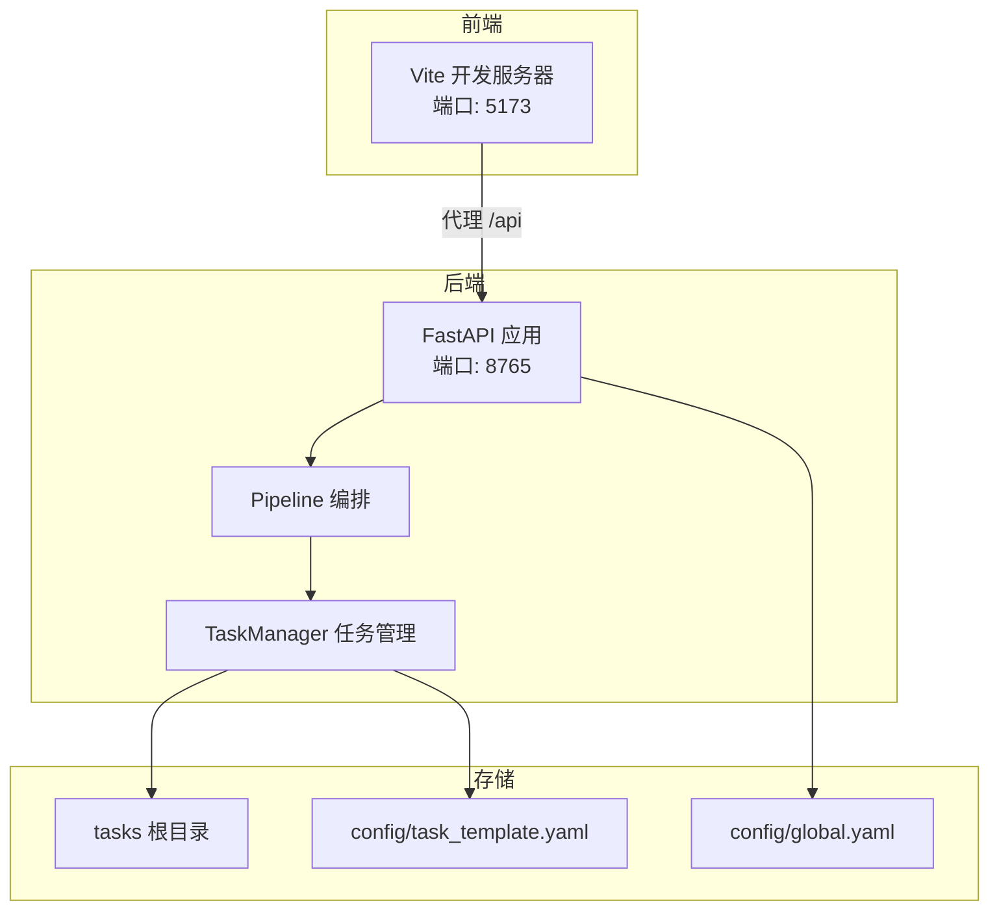
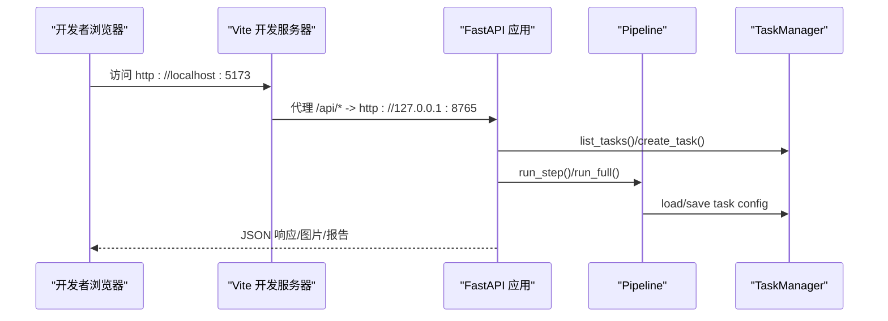
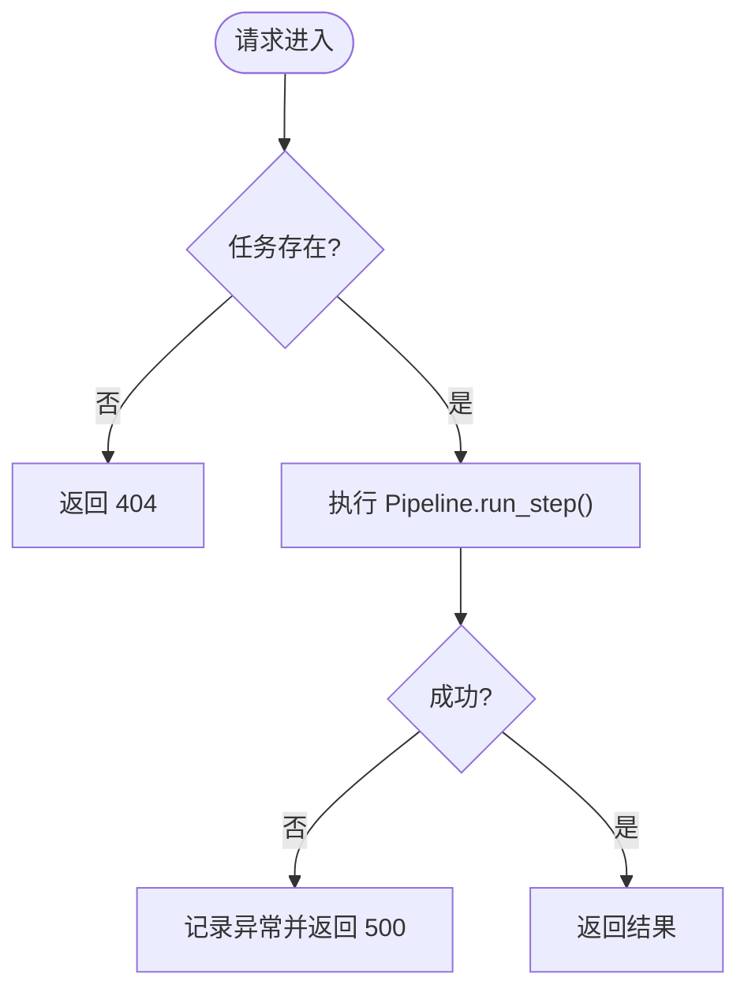
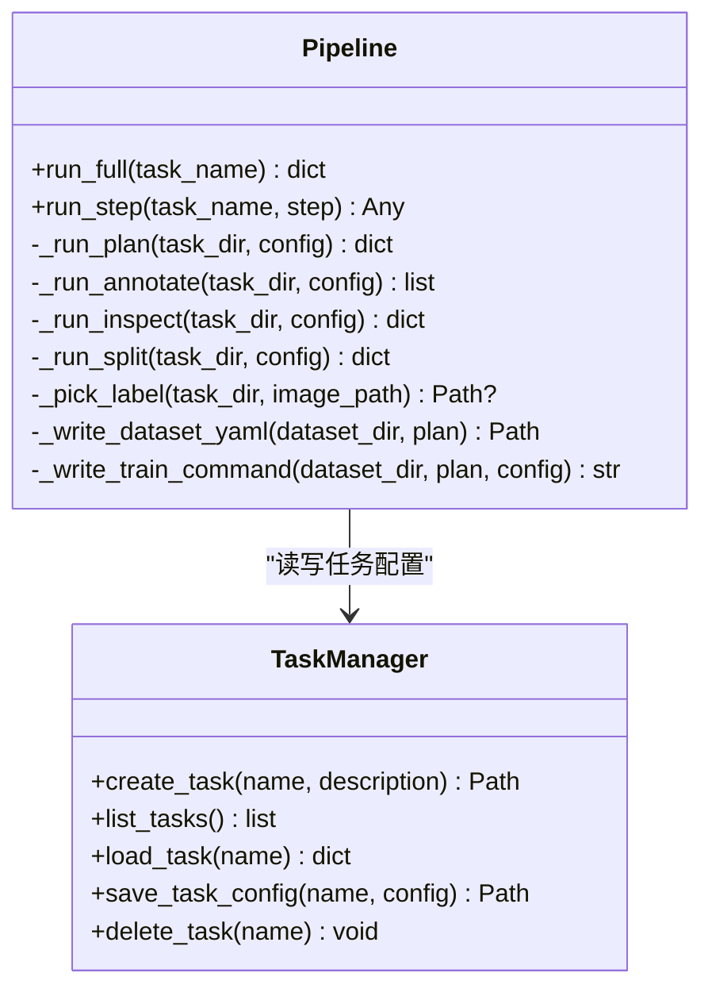
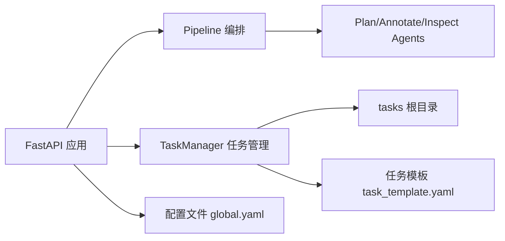

# 部署与运维

<cite>
**本文引用的文件**
- [run.py](file://run.py)
- [src/api_server.py](file://src/api_server.py)
- [config/global.yaml](file://config/global.yaml)
- [gui/package.json](file://gui/package.json)
- [pyproject.toml](file://pyproject.toml)
- [start_gui.sh](file://start_gui.sh)
- [start_gui.ps1](file://start_gui.ps1)
- [gui/vite.config.ts](file://gui/vite.config.ts)
- [src/core/pipeline.py](file://src/core/pipeline.py)
- [src/core/task_manager.py](file://src/core/task_manager.py)
- [config/task_template.yaml](file://config/task_template.yaml)
- [tests/conftest.py](file://tests/conftest.py)
</cite>

## 目录
1. [简介](#简介)
2. [项目结构](#项目结构)
3. [核心组件](#核心组件)
4. [架构总览](#架构总览)
5. [详细组件分析](#详细组件分析)
6. [依赖关系分析](#依赖关系分析)
7. [性能考虑](#性能考虑)
8. [故障排除指南](#故障排除指南)
9. [结论](#结论)
10. [附录](#附录)

## 简介
本指南面向本地开发与生产环境的部署与运维，覆盖以下内容：
- 本地开发环境启动流程（后端 FastAPI + 前端 Vite）
- 生产环境部署选项（容器化、进程管理、日志收集）
- 性能调优建议（内存配置、GPU 加速、并发连接数优化）
- 监控与告警（健康检查、错误日志分析、性能指标）
- 故障排除手册（常见问题与解决方案）
- 备份与恢复策略（数据安全与业务连续性）

## 项目结构
仓库采用前后端分离的模块化结构：
- 后端服务：基于 FastAPI 的 HTTP API，暴露任务创建、流水线步骤执行、图像与标注读取等能力。
- 前端界面：React + Vite 开发服务器，提供可视化标注审查与报告查看。
- 流水线编排：按“计划→标注→检查→拆分/导出”顺序执行，输出可训练数据集。
- 任务管理：以目录树形式组织每个任务的配置、图像、标注与导出产物。
- 配置中心：全局配置与任务模板集中管理。

图表来源
- [src/api_server.py:1-384](file://src/api_server.py#L1-L384)
- [gui/vite.config.ts:1-23](file://gui/vite.config.ts#L1-L23)
- [src/core/pipeline.py:1-325](file://src/core/pipeline.py#L1-L325)
- [src/core/task_manager.py:1-150](file://src/core/task_manager.py#L1-L150)
- [config/global.yaml:1-29](file://config/global.yaml#L1-L29)
- [config/task_template.yaml:1-54](file://config/task_template.yaml#L1-L54)

章节来源
- [src/api_server.py:1-384](file://src/api_server.py#L1-L384)
- [gui/vite.config.ts:1-23](file://gui/vite.config.ts#L1-L23)
- [src/core/pipeline.py:1-325](file://src/core/pipeline.py#L1-L325)
- [src/core/task_manager.py:1-150](file://src/core/task_manager.py#L1-L150)
- [config/global.yaml:1-29](file://config/global.yaml#L1-L29)
- [config/task_template.yaml:1-54](file://config/task_template.yaml#L1-L54)

## 核心组件
- 后端 API 服务：提供任务列表、创建任务、执行流水线步骤、获取报告与导出摘要、列出并读取图像与标注等接口。
- 流水线编排：统一调度 plan/annotate/inspect/split 四个阶段，负责结果持久化与数据导出。
- 任务管理器：维护 tasks 根目录下的任务生命周期（创建、列举、加载、删除），以及 task.yaml 配置读写。
- 配置系统：global.yaml 定义模型、推理、路径、服务与日志；task_template.yaml 为新任务提供默认训练计划与规则。
- CLI 入口：支持命令行运行单步或全量流水线，便于自动化与测试。

章节来源
- [src/api_server.py:1-384](file://src/api_server.py#L1-L384)
- [src/core/pipeline.py:1-325](file://src/core/pipeline.py#L1-L325)
- [src/core/task_manager.py:1-150](file://src/core/task_manager.py#L1-L150)
- [config/global.yaml:1-29](file://config/global.yaml#L1-L29)
- [config/task_template.yaml:1-54](file://config/task_template.yaml#L1-L54)
- [run.py:1-82](file://run.py#L1-L82)

## 架构总览
下图展示本地开发时前后端交互与关键调用链：

图表来源
- [gui/vite.config.ts:1-23](file://gui/vite.config.ts#L1-L23)
- [src/api_server.py:1-384](file://src/api_server.py#L1-L384)
- [src/core/pipeline.py:1-325](file://src/core/pipeline.py#L1-L325)
- [src/core/task_manager.py:1-150](file://src/core/task_manager.py#L1-L150)

## 详细组件分析

### 后端 API 服务（FastAPI）
- 职责：暴露 RESTful 接口，封装任务管理与流水线执行，提供图像与标注读取能力。
- 关键接口：
  - 任务管理：GET /api/tasks、POST /api/tasks
  - 步骤执行：POST /api/tasks/{name}/step（plan/annotate/inspect/split）
  - 报告与导出：GET /api/tasks/{name}/report、GET /api/tasks/{name}/export
  - 图像与标注：GET /api/tasks/{name}/images、GET /api/tasks/{name}/labels、GET /api/tasks/{name}/labels/{image_name}
- 错误处理：对缺失任务/图像/标签返回 404；步骤异常捕获后返回 500 并记录堆栈。
- 启动方式：通过 uvicorn 直接运行，默认监听 127.0.0.1:8765。

图表来源
- [src/api_server.py:139-192](file://src/api_server.py#L139-L192)
- [src/core/pipeline.py:62-94](file://src/core/pipeline.py#L62-L94)

章节来源
- [src/api_server.py:1-384](file://src/api_server.py#L1-L384)
- [src/core/pipeline.py:62-94](file://src/core/pipeline.py#L62-L94)

### 流水线编排（Pipeline）
- 职责：按固定顺序执行 plan → annotate → inspect → split，并持久化中间产物与最终导出。
- 关键点：
  - 步骤路由：根据 step 名称分发到对应私有方法。
  - 计划生成：将 LLM/Agent 输出的计划规范化为统一 schema，写入 plan.yaml。
  - 数据集导出：依据 plan.split 比例随机打乱并划分 train/val/test，生成 data.yaml 与训练命令。
  - 标签选择：优先使用 candidate_labels，回退到 ai_labels。

图表来源
- [src/core/pipeline.py:22-325](file://src/core/pipeline.py#L22-L325)
- [src/core/task_manager.py:14-150](file://src/core/task_manager.py#L14-L150)

章节来源
- [src/core/pipeline.py:1-325](file://src/core/pipeline.py#L1-L325)
- [src/core/task_manager.py:1-150](file://src/core/task_manager.py#L1-L150)

### 任务管理（TaskManager）
- 职责：维护 tasks 根目录下的任务目录结构与配置。
- 行为：
  - 创建任务：初始化 images/ai_labels/candidate_labels 子目录，并写入 task.yaml。
  - 列举任务：扫描 tasks_root 下所有子目录名。
  - 配置读写：从 task.yaml 加载/保存任务配置。
  - 删除任务：递归删除任务目录。

章节来源
- [src/core/task_manager.py:1-150](file://src/core/task_manager.py#L1-L150)

### 配置与模板
- global.yaml：定义模型加载参数、设备、最大显存、推理批大小、阈值、路径、服务监听地址与端口、日志级别与目录。
- task_template.yaml：新任务默认的训练计划、分割比例、超参、质检规则与评估指标。

章节来源
- [config/global.yaml:1-29](file://config/global.yaml#L1-L29)
- [config/task_template.yaml:1-54](file://config/task_template.yaml#L1-L54)

### 前端开发服务器（Vite）
- 职责：提供 React 应用的开发体验，并在开发时将 /api 请求代理至后端。
- 关键点：
  - 默认端口 5173，严格端口关闭以避免冲突。
  - 代理规则：/api → http://127.0.0.1:8765，changeOrigin 开启。
  - 脚本：dev/build/preview 等。

章节来源
- [gui/vite.config.ts:1-23](file://gui/vite.config.ts#L1-L23)
- [gui/package.json:1-30](file://gui/package.json#L1-L30)

### CLI 入口
- 支持命令：plan/annotate/inspect/split/full/create。
- 作用：快速执行单步或全量流水线，便于自动化与测试。

章节来源
- [run.py:1-82](file://run.py#L1-L82)

## 依赖关系分析
- Python 依赖：OpenCV、PyYAML、NumPy、Pillow、Matplotlib、FastAPI、Uvicorn、Pydantic、Jinja2。
- GPU 可选依赖：torch、torchvision、transformers、accelerate、bitsandbytes。
- 开发依赖：ruff、mypy、pytest、httpx。
- 前端依赖：React、Ant Design、Axios、Vite、TypeScript。

图表来源
- [pyproject.toml:1-65](file://pyproject.toml#L1-L65)
- [src/api_server.py:1-384](file://src/api_server.py#L1-L384)
- [src/core/pipeline.py:1-325](file://src/core/pipeline.py#L1-L325)
- [src/core/task_manager.py:1-150](file://src/core/task_manager.py#L1-L150)
- [config/global.yaml:1-29](file://config/global.yaml#L1-L29)
- [config/task_template.yaml:1-54](file://config/task_template.yaml#L1-L54)

章节来源
- [pyproject.toml:1-65](file://pyproject.toml#L1-L65)

## 性能考虑
- 内存配置
  - 在 global.yaml 中调整 max_gpu_memory_mb 限制模型显存占用，避免 OOM。
  - 合理设置 inference.batch_size，小批量更稳定，大批量吞吐更高但需更大显存。
  - 对于 CPU 回退场景，确保 enable_cpu_fallback 开启，提升鲁棒性。
- GPU 加速设置
  - 通过 device 字段选择 auto/cuda/cpu；若使用 GPU，请安装 gpu 可选依赖。
  - 结合 bitsandbytes 的 4bit 加载降低显存压力。
- 并发连接数优化
  - 生产环境建议使用多 worker 的 Uvicorn 部署，worker 数量约为 CPU 核心数。
  - 调整反向代理（如 Nginx）的 keepalive 与并发上限，匹配后端处理能力。
- I/O 与磁盘
  - 将 tasks 根目录置于高性能 SSD，减少图像与标注复制开销。
  - 导出阶段会复制大量文件，建议在只读挂载或缓存层上执行。

[本节为通用指导，不直接分析具体文件]

## 故障排除指南
- 无法启动后端
  - 现象：端口占用或服务未监听。
  - 排查：确认 127.0.0.1:8765 未被占用；检查 .venv 已激活且依赖已安装。
  - 参考：后端启动命令与默认端口配置。
- 前端无法访问后端接口
  - 现象：浏览器控制台出现跨域或连接失败。
  - 排查：确认 Vite 代理目标为 http://127.0.0.1:8765；后端服务已启动。
  - 参考：Vite 代理配置。
- 任务不存在或配置缺失
  - 现象：404 错误。
  - 排查：确认任务已创建且 task.yaml 存在；必要时重新创建任务。
  - 参考：任务管理器的加载逻辑。
- 步骤执行失败
  - 现象：500 错误及日志堆栈。
  - 排查：查看日志目录 logs；检查输入图像与标注格式是否符合 YOLO-OBB；确认 Agent 所需依赖是否安装。
  - 参考：API 层的异常捕获与日志记录。
- 标注解析异常
  - 现象：跳过畸形行或坐标数量不符。
  - 排查：修正标注文件格式；确保每行包含类别与 8 个归一化坐标。
  - 参考：标注解析函数的校验逻辑。
- 数据集导出为空
  - 现象：无图像或无标签。
  - 排查：确认 images 目录有图像；candidate_labels 或 ai_labels 存在对应 txt 文件。
  - 参考：split 阶段的图像与标签选择逻辑。

章节来源
- [src/api_server.py:139-192](file://src/api_server.py#L1-L384)
- [src/core/pipeline.py:155-213](file://src/core/pipeline.py#L155-L213)
- [config/global.yaml:1-29](file://config/global.yaml#L1-L29)
- [gui/vite.config.ts:1-23](file://gui/vite.config.ts#L1-L23)

## 结论
本项目提供了完整的本地开发与生产部署基础：后端 FastAPI 提供稳定的任务与流水线接口，前端 Vite 提供便捷的开发体验；通过配置与模板实现灵活的模型与训练参数管理。在生产环境中，建议结合容器化与进程管理器进行部署，配合日志与监控系统保障稳定性与可观测性。

[本节为总结性内容，不直接分析具体文件]

## 附录

### 本地开发环境启动流程
- 前置条件
  - Python 3.11+，Node.js 与 npm。
  - 在项目根目录创建虚拟环境并同步依赖（含 dev 可选依赖）。
- 启动后端
  - 使用 uvicorn 启动 FastAPI 应用，监听 127.0.0.1:8765。
  - 可通过全局配置的 server.host/server.port 调整监听地址与端口。
- 启动前端
  - 进入 gui 目录，安装依赖后运行开发服务器（默认端口 5173）。
  - 开发模式下，/api 请求将被代理到后端。
- 一键启动脚本
  - Linux/macOS：执行 start_gui.sh，自动拉起后端与前端。
  - Windows：执行 start_gui.ps1，功能相同。

章节来源
- [start_gui.sh:1-40](file://start_gui.sh#L1-L40)
- [start_gui.ps1:1-51](file://start_gui.ps1#L1-L51)
- [gui/vite.config.ts:1-23](file://gui/vite.config.ts#L1-L23)
- [src/api_server.py:380-384](file://src/api_server.py#L380-L384)
- [config/global.yaml:22-25](file://config/global.yaml#L22-L25)

### 生产环境部署选项
- 容器化部署
  - 构建镜像：将 Python 依赖与前端静态资源打包进镜像。
  - 运行时：使用多 worker 的 Uvicorn 启动后端；Nginx 作为反向代理提供 HTTPS 与静态资源服务。
  - 环境变量：通过环境变量注入 server.host/server.port、logging.level/logging.dir 等。
- 进程管理
  - 使用 systemd、Supervisor 或 Docker Compose 管理服务生命周期与重启策略。
  - 设置健康检查端点（例如 /api/tasks）供负载均衡器探测。
- 日志收集
  - 将日志输出到标准输出或指定目录（由 logging.dir 控制），由日志采集器（如 Filebeat/Fluent Bit）收集并转发至集中式日志平台。
  - 建议按模块区分日志级别，生产环境使用 INFO 或 WARNING。

[本节为通用指导，不直接分析具体文件]

### 监控与告警配置
- 健康检查端点
  - 使用 GET /api/tasks 作为健康探针，返回任务列表表示服务可用。
- 错误日志分析
  - 关注 API 层的异常日志与堆栈，定位步骤执行失败原因。
  - 针对标注解析警告，检查标注文件格式与坐标规范。
- 性能指标收集
  - 收集请求耗时、错误率、QPS 等指标，结合 Prometheus/Grafana 进行可视化。
  - 对长耗时步骤（如 annotate/inspect）增加超时与重试策略。

[本节为通用指导，不直接分析具体文件]

### 备份与恢复策略
- 备份范围
  - tasks 根目录：包含所有任务配置、图像、标注与导出产物。
  - 配置文件：config/global.yaml 与 prompts 目录（若自定义提示词）。
  - 日志目录：logs（用于问题回溯）。
- 备份频率
  - 增量备份：每日备份新增/变更的任务与配置。
  - 全量备份：每周或重大变更前进行一次全量备份。
- 恢复流程
  - 停止服务，恢复 tasks 与配置文件，重启服务。
  - 验证关键接口（如 /api/tasks、/api/tasks/{name}/report）可用性。
- 数据一致性
  - 建议在快照或事务级备份中进行，避免部分写入导致的数据不一致。

[本节为通用指导，不直接分析具体文件]

### 常用命令与路径参考
- 后端启动
  - 命令：uvicorn src.api_server:app --host 127.0.0.1 --port 8765
  - 参考：后端主入口与默认端口配置。
- 前端开发
  - 命令：npm run dev（位于 gui 目录）
  - 参考：Vite 配置与脚本。
- CLI 流水线
  - 命令示例：python run.py full --task demo
  - 参考：CLI 入口与参数说明。
- 任务目录结构
  - 根路径：tasks_root（默认 tasks）
  - 子目录：images、ai_labels、candidate_labels、dataset
  - 参考：任务管理器与流水线导出逻辑。

章节来源
- [src/api_server.py:380-384](file://src/api_server.py#L380-L384)
- [gui/package.json:1-30](file://gui/package.json#L1-L30)
- [run.py:1-82](file://run.py#L1-L82)
- [src/core/task_manager.py:14-28](file://src/core/task_manager.py#L14-L28)
- [src/core/pipeline.py:155-213](file://src/core/pipeline.py#L155-L213)