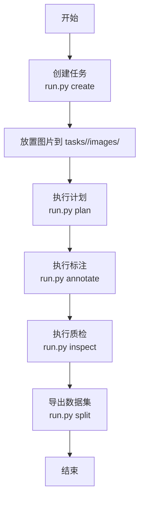

# 快速开始指南

<cite>
**本文引用的文件**   
- [pyproject.toml](file://pyproject.toml)
- [README.md](file://README.md)
- [run.py](file://run.py)
- [src/api_server.py](file://src/api_server.py)
- [src/core/pipeline.py](file://src/core/pipeline.py)
- [src/core/task_manager.py](file://src/core/task_manager.py)
- [config/global.yaml](file://config/global.yaml)
- [config/task_template.yaml](file://config/task_template.yaml)
- [start_gui.ps1](file://start_gui.ps1)
- [start_gui.sh](file://start_gui.sh)
- [gui/package.json](file://gui/package.json)
</cite>

## 目录
1. [简介](#简介)
2. [环境准备](#环境准备)
3. [安装依赖](#安装依赖)
4. [创建第一个任务](#创建第一个任务)
5. [CLI 使用示例](#cli-使用示例)
6. [GUI 启动方法](#gui-启动方法)
7. [端到端执行流程](#端到端执行流程)
8. [常见问题与故障排除](#常见问题与故障排除)
9. [性能与硬件建议](#性能与硬件建议)
10. [结论](#结论)

## 简介
VL-YOLO-Anchor 是一个面向工业缺陷检测的 YOLO-OBB 训练计划生成与智能标注平台。它支持通过自然语言描述自动生成训练计划，调用本地视觉语言模型进行旋转框标注，对标签进行质检并输出可直接训练的 YOLO-OBB 数据集、配置文件和训练命令。项目同时提供命令行接口和图形界面，便于快速验证和交互式标注审核。

本快速开始指南的目标是帮助新用户在最短时间内完成环境准备、安装依赖、创建任务、运行全流程，并成功看到结果。

## 环境准备
在开始之前，请确保你的系统满足以下基础条件：
- 操作系统：Windows、Linux 或 macOS。
- Python 版本：Python 3.11 或更高版本。
- uv 包管理器：用于创建虚拟环境和安装依赖。
- Node.js 与 npm：仅在使用 GUI 时需要。
- GPU（可选）：如果希望启用本地 VL 模型的 GPU 推理，需要 NVIDIA GPU 及对应驱动；否则可使用 CPU 回退模式。

### 检查 Python 与 uv
打开终端后，先确认 Python 版本是否满足要求，再确认 uv 是否可用。若未安装 uv，请先按照官方文档安装 uv。

### 推荐工作目录
建议在仓库根目录下执行所有命令，例如：
```bash
cd 
```

**章节来源**
- [README.md:40-51](file://README.md#L40-L51)
- [pyproject.toml:7-18](file://pyproject.toml#L7-L18)

## 安装依赖
项目使用 pyproject.toml 管理依赖，推荐使用 uv 同步基础依赖与开发工具。

### 基础依赖安装
在项目根目录执行：
```bash
uv venv
uv sync --extra dev
```
这会创建 `.venv` 虚拟环境，并安装 FastAPI、Uvicorn、OpenCV、PyYAML、NumPy、Pillow、Matplotlib、Pydantic、Jinja2 等核心依赖，以及 ruff、mypy、pytest、httpx 等开发工具。

### 可选 GPU 支持配置
如果你希望启用本地 VL 模型的 GPU 推理，可以额外安装 GPU 相关依赖：
```bash
uv sync --extra gpu
```
GPU 依赖包括 PyTorch、torchvision、transformers、accelerate、bitsandbytes 等。若未安装这些依赖，平台仍可在 CPU 模式下运行，但本地 VL 模型推理可能较慢或不可用。

### 前端依赖安装
如果使用 GUI，还需要安装前端依赖。脚本会自动尝试安装，你也可以手动进入 gui 目录执行：
```bash
cd gui
npm install
```

**章节来源**
- [pyproject.toml:8-33](file://pyproject.toml#L8-L33)
- [README.md:40-51](file://README.md#L40-L51)
- [gui/package.json:12-28](file://gui/package.json#L12-L28)

## 创建第一个任务
任务目录结构由 TaskManager 管理，每个任务包含 task.yaml、images、ai_labels、candidate_labels、dataset 等子目录。

### 使用 CLI 创建任务
在项目根目录执行：
```bash
uv run python run.py create --task demo --description "光伏 EL 图像：crack / break_grid 缺陷"
```
预期行为：
- 在 tasks 目录下创建 demo 任务目录。
- 初始化 images、ai_labels、candidate_labels 等子目录。
- 从 config/task_template.yaml 复制任务模板到 tasks/demo/task.yaml。
- 控制台输出类似“Created task 'demo' at ...”。

如果任务名称已存在，CLI 会报错并返回非零退出码。

### 任务模板的作用
config/task_template.yaml 定义了默认的训练计划结构，包括类别映射、标注规则、数据划分比例、模型推荐、超参数、质检规则和评估指标。新建任务时会基于该模板生成初始配置。

**章节来源**
- [run.py:20-36](file://run.py#L20-L36)
- [run.py:55-62](file://run.py#L55-L62)
- [src/core/task_manager.py:51-80](file://src/core/task_manager.py#L51-L80)
- [config/task_template.yaml:1-54](file://config/task_template.yaml#L1-L54)

## CLI 使用示例
CLI 入口为 run.py，支持 plan、annotate、inspect、split、full、create 等命令。

### 常用命令
- 创建任务：
  ```bash
  uv run python run.py create --task demo --description "光伏 EL 图像：crack / break_grid 缺陷"
  ```
- 生成训练计划：
  ```bash
  uv run python run.py plan --task demo
  ```
- 执行标注：
  ```bash
  uv run python run.py annotate --task demo
  ```
- 执行质检：
  ```bash
  uv run python run.py inspect --task demo
  ```
- 导出数据集：
  ```bash
  uv run python run.py split --task demo
  ```
- 一次性全流程：
  ```bash
  uv run python run.py full --task demo
  ```

### 参数说明
- command：要执行的步骤，可选值为 plan、annotate、inspect、split、full、create。
- --task：任务名称，必须提供。
- --description：任务描述，主要用于 create 命令。
- --tasks-root：任务根目录，默认为 tasks。
- --log-level：日志级别，默认为 INFO。

### 预期输出
- create：输出创建的 task 路径。
- plan/annotate/inspect/split：输出对应步骤的结果摘要。
- full：依次输出 plan、annotate、inspect、split 的结果。
- 失败时：打印错误日志并返回非零退出码。

**章节来源**
- [run.py:1-8](file://run.py#L1-L8)
- [run.py:20-36](file://run.py#L20-L36)
- [run.py:39-77](file://run.py#L39-L77)

## GUI 启动方法
GUI 由 FastAPI 后端与 Vite 开发服务器组成，脚本会同时启动两者。

### Windows PowerShell 启动
在项目根目录执行：
```powershell
.\start_gui.ps1
```
脚本行为：
- 检查 .venv 是否存在，不存在则提示先执行 uv venv 与 uv sync --extra dev。
- 启动 FastAPI 后端，监听 127.0.0.1:8765。
- 进入 gui 目录，若 node_modules 不存在则执行 npm install。
- 启动 Vite 开发服务器，Ctrl+C 停止时会一并关闭后端进程。

### Linux/macOS Shell 启动
在项目根目录执行：
```bash
./start_gui.sh
```
或使用跳过安装参数：
```bash
./start_gui.sh --skip-install
```
脚本行为：
- 检查 .venv 是否存在，不存在则提示先执行 uv venv 与 uv sync --extra dev。
- 后台启动 FastAPI 后端，监听 127.0.0.1:8765。
- 进入 gui 目录，若 node_modules 不存在则执行 npm install。
- 前台启动 Vite 开发服务器，Ctrl+C 停止时会清理后端进程。

### 手动启动后端
你也可以单独启动后端：
```bash
uv run uvicorn src.api_server:app --host 127.0.0.1 --port 8765
```
然后访问交互式文档：
```
http://127.0.0.1:8765/docs
```

**章节来源**
- [start_gui.ps1:1-51](file://start_gui.ps1#L1-L51)
- [start_gui.sh:1-40](file://start_gui.sh#L1-L40)
- [src/api_server.py:1-4](file://src/api_server.py#L1-L4)
- [README.md:73-93](file://README.md#L73-L93)

## 端到端执行流程
下图展示了从任务创建到数据集导出的完整流程，以及各组件之间的交互关系。



**图表来源**
- [run.py:20-36](file://run.py#L20-L36)
- [src/core/pipeline.py:48-94](file://src/core/pipeline.py#L48-L94)
- [src/core/pipeline.py:155-213](file://src/core/pipeline.py#L155-L213)

### 关键步骤说明
- 创建任务：TaskManager 创建任务目录并写入 task.yaml。
- 放置图片：将待标注图片放入 tasks/<task>/images/。
- 执行计划：Pipeline 调用 PlanAgent 生成 training_plan，并保存到 plan.yaml。
- 执行标注：Pipeline 调用 AnnotateAgent 生成 ai_labels。
- 执行质检：Pipeline 调用 InspectAgent 生成 inspection_report.yaml。
- 导出数据集：Pipeline 按 split 比例复制图片与标签，生成 dataset/train、dataset/val、dataset/test、data.yaml 与 train_command.txt。

**章节来源**
- [src/core/task_manager.py:51-80](file://src/core/task_manager.py#L51-L80)
- [src/core/pipeline.py:48-94](file://src/core/pipeline.py#L48-L94)
- [src/core/pipeline.py:155-213](file://src/core/pipeline.py#L155-L213)

## 常见问题与故障排除

### 找不到 .venv
现象：启动 GUI 时报错提示 .venv 不存在。  
原因：尚未创建虚拟环境或未安装依赖。  
解决：
```bash
uv venv
uv sync --extra dev
```
如需 GUI 前端依赖，再执行：
```bash
cd gui
npm install
```

**章节来源**
- [start_gui.ps1:12-16](file://start_gui.ps1#L12-L16)
- [start_gui.sh:13-17](file://start_gui.sh#L13-L17)

### 端口 8765 被占用
现象：FastAPI 后端无法启动或 GUI 无法连接后端。  
原因：其他进程占用了 127.0.0.1:8765。  
解决：
- 关闭占用端口的进程。
- 修改 config/global.yaml 中的 server.port。
- 或在启动命令中指定新端口。

**章节来源**
- [config/global.yaml:22-25](file://config/global.yaml#L22-L25)
- [src/api_server.py:1-4](file://src/api_server.py#L1-L4)

### 任务已存在
现象：create 命令报错，提示任务已存在。  
原因：tasks 目录下已有同名任务。  
解决：
- 更换任务名称。
- 或删除旧任务目录后重试。

**章节来源**
- [run.py:55-62](file://run.py#L55-L62)
- [src/core/task_manager.py:67-70](file://src/core/task_manager.py#L67-L70)

### 找不到任务或图片
现象：plan/annotate/inspect/split 报错，提示任务或图片不存在。  
原因：任务未创建或图片未放置在正确目录。  
解决：
- 确认任务已创建。
- 将图片放入 tasks/<task>/images/。
- 检查 --tasks-root 是否正确。

**章节来源**
- [run.py:74-77](file://run.py#L74-L77)
- [src/core/task_manager.py:92-107](file://src/core/task_manager.py#L92-L107)

### GUI 前端依赖缺失
现象：Vite 开发服务器启动失败或页面空白。  
原因：gui/node_modules 未安装。  
解决：
```bash
cd gui
npm install
```
或使用脚本跳过安装参数后手动安装。

**章节来源**
- [start_gui.ps1:24-34](file://start_gui.ps1#L24-L34)
- [start_gui.sh:30-35](file://start_gui.sh#L30-L35)
- [gui/package.json:6-10](file://gui/package.json#L6-L10)

### GPU 推理不可用
现象：启用 GPU 依赖后仍无法加载本地 VL 模型。  
原因：缺少 CUDA 驱动、PyTorch GPU 版本不匹配或显存不足。  
解决：
- 安装匹配的 NVIDIA 驱动与 CUDA。
- 重新安装 GPU 依赖：
  ```bash
  uv sync --extra gpu
  ```
- 调整 config/global.yaml 中的 device 与 max_gpu_memory_mb。
- 如显存不足，可回退到 CPU 模式。

**章节来源**
- [pyproject.toml:20-27](file://pyproject.toml#L20-L27)
- [config/global.yaml:2-9](file://config/global.yaml#L2-L9)

## 性能与硬件建议
- CPU 模式：适合快速验证与离线跑通全流程，无需 GPU。
- GPU 模式：建议使用 RTX 3060Ti 或更高显存显卡，以支持本地 VL 模型 int4 加载与推理。
- 显存限制：可通过 config/global.yaml 的 max_gpu_memory_mb 控制显存上限。
- 批量大小与输入尺寸：training_plan.hyperparameters 中的 batch 与 imgsz 会影响训练速度与显存占用。
- 日志级别：可通过 --log-level 调整日志详细程度，便于调试。

**章节来源**
- [README.md:119-123](file://README.md#L119-L123)
- [config/global.yaml:2-15](file://config/global.yaml#L2-L15)
- [config/task_template.yaml:29-38](file://config/task_template.yaml#L29-L38)

## 结论
通过以上步骤，你可以在 15 分钟内完成 VL-YOLO-Anchor 的环境准备、依赖安装、任务创建与全流程执行。CLI 适合自动化与批处理，GUI 适合交互式标注审核与可视化。若遇到环境问题，优先检查虚拟环境、端口占用、任务目录结构与前端依赖。对于本地 VL 模型推理，建议配置 GPU 并合理设置显存与超参数。