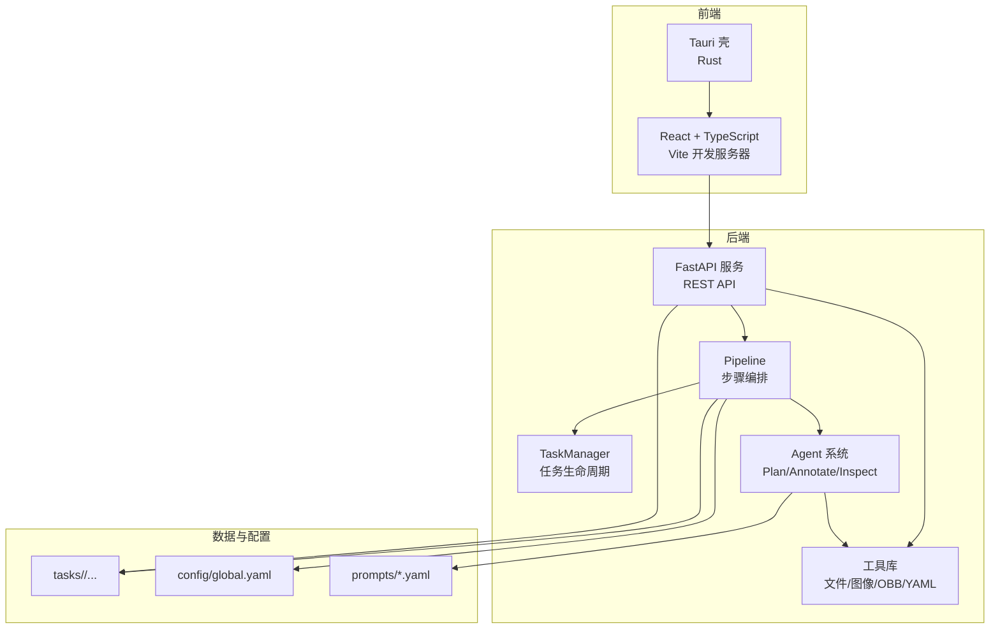
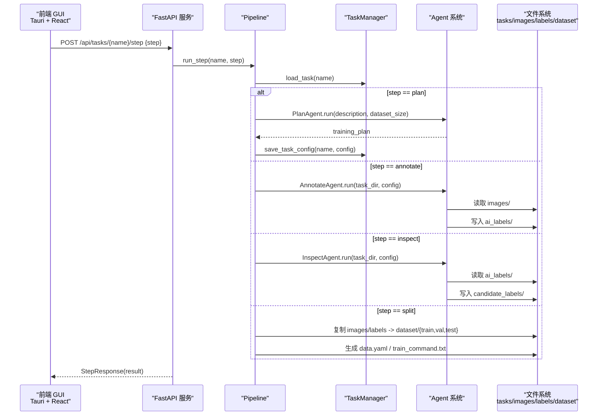
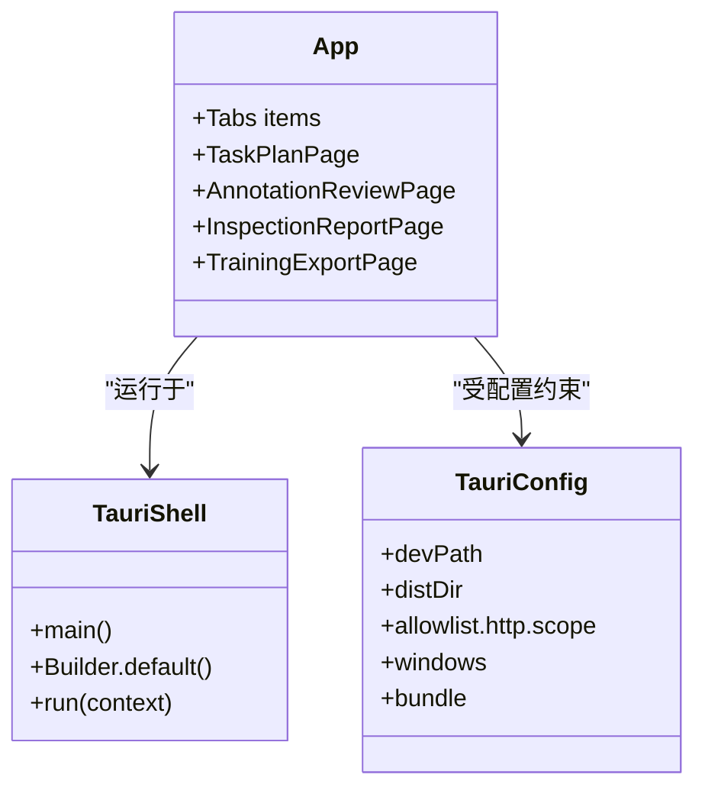
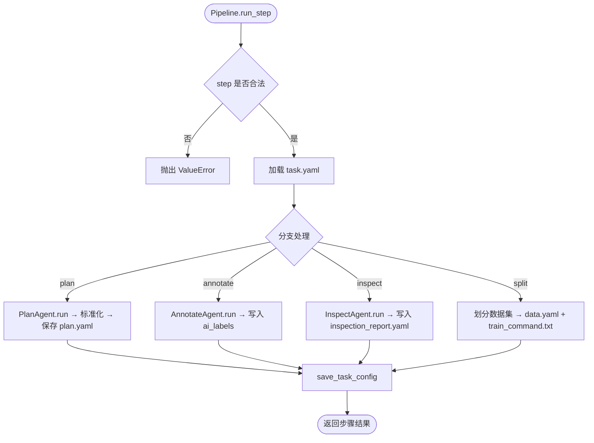
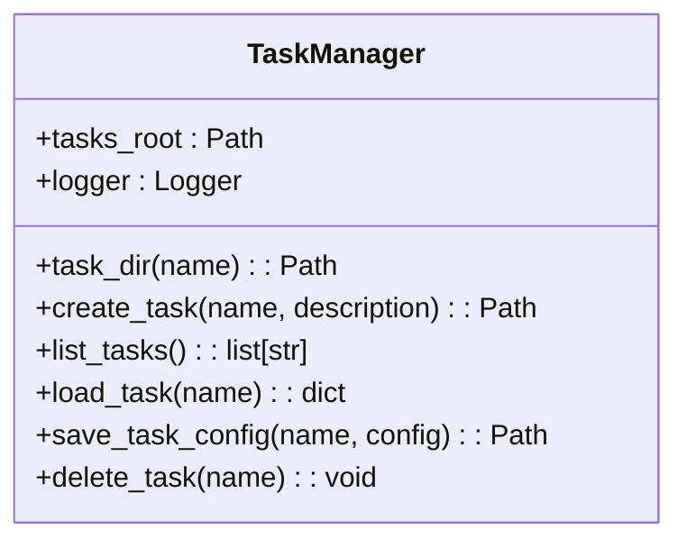
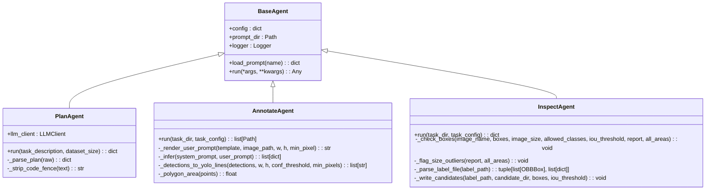
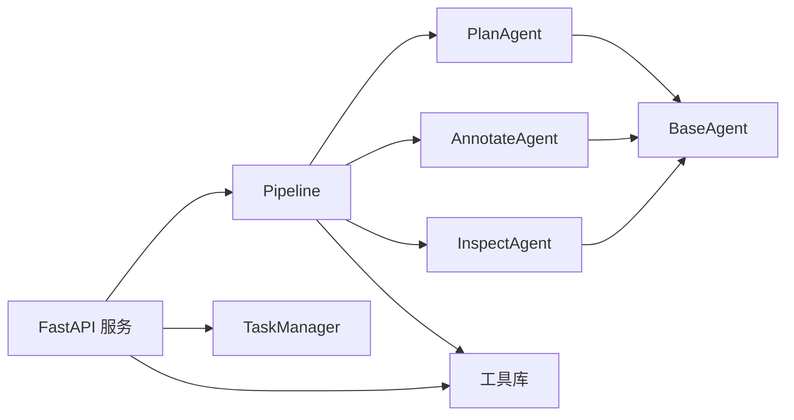
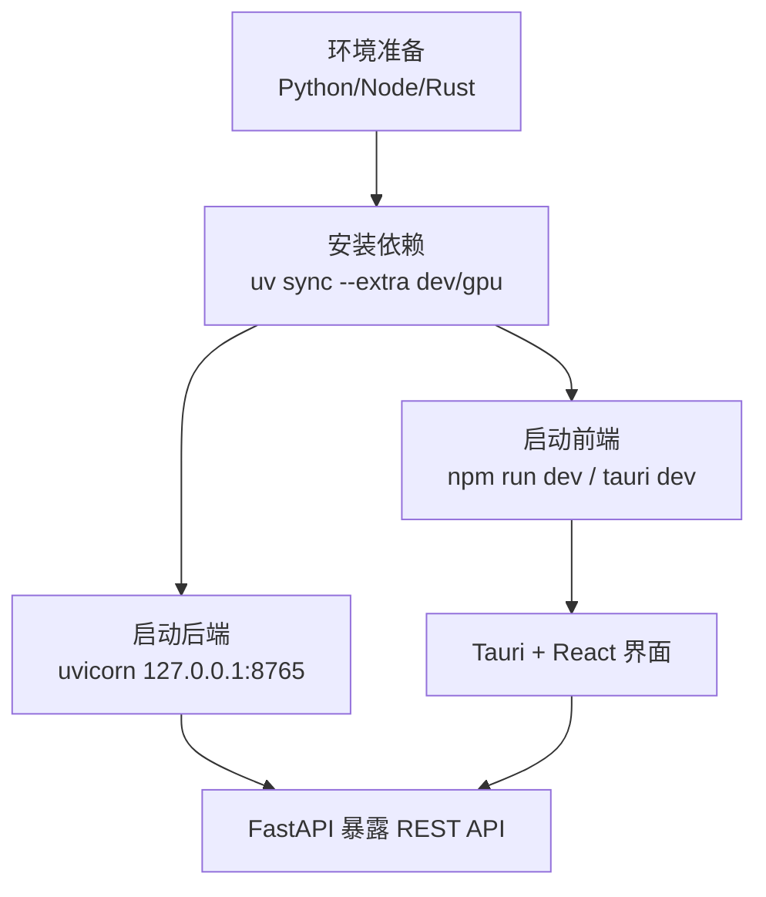

# 技术架构概览

<cite>
**本文引用的文件**   
- [README.md](file://README.md)
- [pyproject.toml](file://pyproject.toml)
- [src/api_server.py](file://src/api_server.py)
- [src/core/pipeline.py](file://src/core/pipeline.py)
- [src/core/task_manager.py](file://src/core/task_manager.py)
- [src/agents/base_agent.py](file://src/agents/base_agent.py)
- [src/agents/plan_agent.py](file://src/agents/plan_agent.py)
- [src/agents/annotate_agent.py](file://src/agents/annotate_agent.py)
- [src/agents/inspect_agent.py](file://src/agents/inspect_agent.py)
- [config/global.yaml](file://config/global.yaml)
- [gui/package.json](file://gui/package.json)
- [gui/src/App.tsx](file://gui/src/App.tsx)
- [gui/src-tauri/Cargo.toml](file://gui/src-tauri/Cargo.toml)
- [gui/src-tauri/src/main.rs](file://gui/src-tauri/src/main.rs)
- [gui/src-tauri/tauri.conf.json](file://gui/src-tauri/tauri.conf.json)
</cite>

## 目录
1. [引言](#引言)
2. [项目结构](#项目结构)
3. [核心组件](#核心组件)
4. [架构总览](#架构总览)
5. [详细组件分析](#详细组件分析)
6. [依赖关系分析](#依赖关系分析)
7. [性能与部署](#性能与部署)
8. [故障排查指南](#故障排查指南)
9. [结论](#结论)

## 引言
VL-YOLO-Anchor 是一个面向工业缺陷检测的“YOLO-OBB 训练计划生成与智能标注平台”。系统通过自然语言描述任务，由 PlanAgent 生成结构化训练计划，AnnotateAgent 调用本地视觉语言模型进行旋转框自动标注，InspectAgent 对标签进行质检并输出候选修正，最终导出可直接训练的 YOLO-OBB 数据集、配置文件与训练命令。

整体采用多层架构：
- 前端 GUI：基于 Tauri + React + TypeScript，负责任务管理、标注审核画布、质检报告展示与训练导出。
- 后端服务：FastAPI 提供 REST API，封装 Pipeline 与 TaskManager，统一暴露任务创建、步骤执行、图片与标签读取等能力。
- Agent 系统：PlanAgent / AnnotateAgent / InspectAgent 遵循 BaseAgent 抽象，提示词外置 YAML，支持可插拔 LLM 客户端。
- 数据处理管道：Pipeline 编排 plan → annotate → inspect → split/export 流程，产出 YOLO-OBB 数据集与训练命令。

选择 Tauri 而非 Electron 的原因在于更小的二进制体积、原生 Rust 运行时带来的更低内存占用与更快的启动速度；同时前端仍可使用 React/Vite 生态。FastAPI 的优势包括异步友好、类型注解与 Pydantic 数据校验、自动生成 OpenAPI 文档，便于前后端协作。多 Agent 模式将“计划生成”“自动标注”“质检修正”解耦，便于独立演进、测试与替换实现（例如用真实 Qwen2.5-VL 替换 StubLLMClient）。

## 项目结构
仓库按职责分层组织：
- gui：Tauri 桌面壳与 React 前端页面、组件与服务层。
- src：Python 后端，包含 FastAPI 服务、Pipeline 编排、TaskManager、Agent 系统与工具库。
- config：全局配置与任务模板。
- prompts：各 Agent 的系统提示词与用户提示模板。
- tests：单元测试与集成测试。
- docs/specs：SDD 工作流与接口规范。



图表来源
- [gui/src-tauri/src/main.rs:4-7](file://gui/src-tauri/src/main.rs#L4-L7)
- [gui/src/App.tsx:8-20](file://gui/src/App.tsx#L8-L20)
- [src/api_server.py:21-26](file://src/api_server.py#L21-L26)
- [src/core/pipeline.py:22-46](file://src/core/pipeline.py#L22-L46)
- [src/core/task_manager.py:14-38](file://src/core/task_manager.py#L14-L38)
- [config/global.yaml:1-29](file://config/global.yaml#L1-L29)

章节来源
- [README.md:16-38](file://README.md#L16-L38)
- [gui/package.json:1-30](file://gui/package.json#L1-L30)
- [gui/src-tauri/Cargo.toml:1-18](file://gui/src-tauri/Cargo.toml#L1-L18)
- [gui/src-tauri/tauri.conf.json:1-43](file://gui/src-tauri/tauri.conf.json#L1-L43)

## 核心组件
- FastAPI 服务：定义任务列表/创建、单步执行、计划/报告/导出摘要、图片与标签读取等 REST 端点，内部组合 TaskManager 与 Pipeline。
- Pipeline：编排 plan/annotate/inspect/split 四个阶段，标准化计划结构，生成 data.yaml 与训练命令。
- TaskManager：维护 tasks_root 下的任务目录结构、创建/删除任务、加载/保存 task.yaml。
- Agent 基类：统一提示词加载、日志记录与 run 抽象；具体 Agent 实现各自业务逻辑。
- PlanAgent：从自然语言任务描述生成结构化训练计划，支持 JSON/YAML 解析与回退策略。
- AnnotateAgent：遍历 images，渲染提示词，调用 VL 推理（当前为 Stub），过滤与归一化 OBB 坐标，写入 ai_labels。
- InspectAgent：扫描 ai_labels，检查缺失标签、重复框、类别错误、越界坐标与尺寸异常，输出 candidate_labels 与质量评分。

章节来源
- [src/api_server.py:21-26](file://src/api_server.py#L21-L26)
- [src/core/pipeline.py:22-46](file://src/core/pipeline.py#L22-L46)
- [src/core/task_manager.py:14-38](file://src/core/task_manager.py#L14-L38)
- [src/agents/base_agent.py:13-53](file://src/agents/base_agent.py#L13-L53)
- [src/agents/plan_agent.py:101-138](file://src/agents/plan_agent.py#L101-L138)
- [src/agents/annotate_agent.py:22-80](file://src/agents/annotate_agent.py#L22-L80)
- [src/agents/inspect_agent.py:34-108](file://src/agents/inspect_agent.py#L34-L108)

## 架构总览
系统以 FastAPI 为后端中枢，GUI 通过 HTTP 调用 API；Pipeline 作为调度器协调 TaskManager 与各 Agent；Agent 通过工具库完成文件 IO、图像处理与 OBB 几何计算；所有提示词与全局配置外置，便于版本管理与环境切换。



图表来源
- [src/api_server.py:169-192](file://src/api_server.py#L169-L192)
- [src/core/pipeline.py:62-94](file://src/core/pipeline.py#L62-L94)
- [src/core/pipeline.py:96-213](file://src/core/pipeline.py#L96-L213)
- [src/core/task_manager.py:92-122](file://src/core/task_manager.py#L92-L122)

## 详细组件分析

### 前端 GUI（Tauri + React）
- Tauri 壳使用 Rust 构建，窗口配置允许访问本地后端 http://127.0.0.1:8765/*。
- React 应用提供四个标签页：任务与计划、标注审核、质检报告、训练导出，通过 Ant Design Tabs 组织。
- 开发模式下 Vite 启动前端，Tauri 在 devPath 指向本地开发服务器。



图表来源
- [gui/src/App.tsx:8-20](file://gui/src/App.tsx#L8-L20)
- [gui/src-tauri/src/main.rs:4-7](file://gui/src-tauri/src/main.rs#L4-L7)
- [gui/src-tauri/tauri.conf.json:1-43](file://gui/src-tauri/tauri.conf.json#L1-L43)

章节来源
- [gui/package.json:1-30](file://gui/package.json#L1-L30)
- [gui/src-tauri/Cargo.toml:1-18](file://gui/src-tauri/Cargo.toml#L1-L18)
- [gui/src-tauri/tauri.conf.json:1-43](file://gui/src-tauri/tauri.conf.json#L1-L43)
- [gui/src/App.tsx:1-24](file://gui/src/App.tsx#L1-L24)

### 后端服务（FastAPI）
- 定义 Pydantic 请求/响应模型，统一输入校验与文档生成。
- 路由覆盖任务 CRUD、步骤执行、计划/报告/导出摘要、图片与标签读取。
- 错误处理：任务不存在返回 404，步骤执行失败捕获异常并返回 500。

```mermaid
flowchart TD
Start(["HTTP 请求进入"]) --> Validate["参数校验<br/>Pydantic"]
Validate --> Route{"路由匹配"}
Route --> |/api/tasks| ListOrCreate["列出/创建任务"]
Route --> |/api/tasks/{name}/step| RunStep["执行单步"]
Route --> |/api/tasks/{name}/plan| GetPlan["获取训练计划"]
Route --> |/api/tasks/{name}/report| GetReport["获取质检报告"]
Route --> |/api/tasks/{name}/export| GetExport["获取导出摘要"]
Route --> |/api/tasks/{name}/labels*| Labels["读取标签"]
Route --> |/api/tasks/{name}/images*| Images["读取图片"]
RunStep --> CallPipeline["调用 Pipeline.run_step"]
CallPipeline --> SaveConfig["保存 task.yaml"]
SaveConfig --> Response["返回 StepResponse"]
ListOrCreate --> Response
GetPlan --> Response
GetReport --> Response
GetExport --> Response
Labels --> Response
Images --> Response
```

图表来源
- [src/api_server.py:29-88](file://src/api_server.py#L29-L88)
- [src/api_server.py:139-192](file://src/api_server.py#L139-L192)
- [src/api_server.py:234-288](file://src/api_server.py#L234-L288)
- [src/api_server.py:291-377](file://src/api_server.py#L291-L377)

章节来源
- [src/api_server.py:1-384](file://src/api_server.py#L1-L384)

### 数据处理管道（Pipeline）
- 顺序执行 plan → annotate → inspect → split，每步结果持久化到 task.yaml 或 dataset 目录。
- normalize_plan 将 Agent 输出标准化为固定 schema，确保下游一致性。
- split 根据 plan.split 比例随机打乱并划分 train/val/test，生成 data.yaml 与训练命令。



图表来源
- [src/core/pipeline.py:62-94](file://src/core/pipeline.py#L62-L94)
- [src/core/pipeline.py:96-213](file://src/core/pipeline.py#L96-L213)
- [src/core/pipeline.py:284-324](file://src/core/pipeline.py#L284-L324)

章节来源
- [src/core/pipeline.py:1-325](file://src/core/pipeline.py#L1-L325)

### 任务管理器（TaskManager）
- 维护 tasks_root 下每个任务的目录结构：images、ai_labels、candidate_labels、dataset。
- 创建任务时从 task_template.yaml 初始化配置，写入 task.yaml。
- 提供 list/load/save/delete 等基础操作。



图表来源
- [src/core/task_manager.py:14-38](file://src/core/task_manager.py#L14-L38)
- [src/core/task_manager.py:40-122](file://src/core/task_manager.py#L40-L122)
- [src/core/task_manager.py:124-149](file://src/core/task_manager.py#L124-L149)

章节来源
- [src/core/task_manager.py:1-150](file://src/core/task_manager.py#L1-L150)

### Agent 系统
- BaseAgent：统一提示词加载与 run 抽象。
- PlanAgent：LLMClient 协议 + StubLLMClient 默认实现；JSON/YAML 解析与回退策略保证鲁棒性。
- AnnotateAgent：渲染提示词、VL 推理（stub）、置信度与面积过滤、坐标归一化、写入 YOLO-OBB 标签。
- InspectAgent：缺失标签、重复框、类别错误、越界坐标、尺寸异常检测，输出 candidate_labels 与质量评分。



图表来源
- [src/agents/base_agent.py:13-69](file://src/agents/base_agent.py#L13-L69)
- [src/agents/plan_agent.py:13-33](file://src/agents/plan_agent.py#L13-L33)
- [src/agents/plan_agent.py:35-99](file://src/agents/plan_agent.py#L35-L99)
- [src/agents/plan_agent.py:101-182](file://src/agents/plan_agent.py#L101-L182)
- [src/agents/annotate_agent.py:22-185](file://src/agents/annotate_agent.py#L22-L185)
- [src/agents/inspect_agent.py:34-227](file://src/agents/inspect_agent.py#L34-L227)

章节来源
- [src/agents/base_agent.py:1-70](file://src/agents/base_agent.py#L1-L70)
- [src/agents/plan_agent.py:1-182](file://src/agents/plan_agent.py#L1-L182)
- [src/agents/annotate_agent.py:1-185](file://src/agents/annotate_agent.py#L1-L185)
- [src/agents/inspect_agent.py:1-227](file://src/agents/inspect_agent.py#L1-L227)

## 依赖关系分析
- Python 依赖：OpenCV、PyYAML、NumPy、Pillow、Matplotlib、FastAPI、Uvicorn、Pydantic、Jinja2。可选 GPU 依赖：torch、torchvision、transformers、accelerate、bitsandbytes。
- 前端依赖：React、Ant Design、Axios、Tauri CLI、Vite、TypeScript。
- Rust 依赖：tauri、serde、serde_json。



图表来源
- [pyproject.toml:8-33](file://pyproject.toml#L8-L33)
- [gui/package.json:12-28](file://gui/package.json#L12-L28)
- [gui/src-tauri/Cargo.toml:11-14](file://gui/src-tauri/Cargo.toml#L11-L14)

章节来源
- [pyproject.toml:1-65](file://pyproject.toml#L1-L65)
- [gui/package.json:1-30](file://gui/package.json#L1-L30)
- [gui/src-tauri/Cargo.toml:1-18](file://gui/src-tauri/Cargo.toml#L1-L18)

## 性能与部署
- 运行环境要求：
  - Python 3.11+，建议使用 uv 管理依赖。
  - Node.js 与 npm 用于前端开发与 Tauri 打包。
  - 可选 GPU 环境：启用 --extra gpu 安装 torch/transformers/bitsandbytes 等依赖，配合 global.yaml 中 vl_model_name、load_in_4bit、device、max_gpu_memory_mb 配置。
- 后端启动：uvicorn 启动 FastAPI，默认监听 127.0.0.1:8765。
- GUI 启动：脚本一键启动后端与前端开发服务器；Tauri 在 devPath 指向 Vite 开发服务器。
- 显存目标：RTX 3060Ti（8GB），VL 模型 4-bit 加载，支持 CPU 回退。



图表来源
- [README.md:40-51](file://README.md#L40-L51)
- [README.md:73-109](file://README.md#L73-L109)
- [config/global.yaml:1-29](file://config/global.yaml#L1-L29)

章节来源
- [README.md:40-109](file://README.md#L40-L109)
- [config/global.yaml:1-29](file://config/global.yaml#L1-L29)
- [pyproject.toml:8-33](file://pyproject.toml#L8-L33)

## 故障排查指南
- 任务不存在：API 返回 404，检查 tasks_root 下是否存在对应任务目录与 task.yaml。
- 步骤执行失败：API 捕获异常返回 500，查看后端日志定位 Agent 或文件 IO 问题。
- 标签解析异常：跳过格式错误的行并记录警告，检查 ai_labels/candidate_labels 文件格式是否为 YOLO-OBB 八坐标。
- 图片未找到：确认 images 目录下存在对应图片文件。
- 前端无法访问后端：检查 Tauri allowlist 是否包含 http://127.0.0.1:8765/*，并确保后端已启动。

章节来源
- [src/api_server.py:169-192](file://src/api_server.py#L169-L192)
- [src/api_server.py:234-288](file://src/api_server.py#L234-L288)
- [src/api_server.py:291-377](file://src/api_server.py#L291-L377)
- [gui/src-tauri/tauri.conf.json:13-18](file://gui/src-tauri/tauri.conf.json#L13-L18)

## 结论
VL-YOLO-Anchor 通过清晰的层次化架构与可插拔 Agent 设计，实现了从自然语言任务描述到可训练 YOLO-OBB 数据集的全流程自动化。FastAPI 提供稳定可靠的 REST API，Pipeline 保证步骤一致性与可观测性，TaskManager 简化任务生命周期管理。前端 Tauri + React 提供轻量高效的桌面体验。未来可通过接入真实 Qwen2.5-VL 模型提升标注质量，并通过扩展 Agent 与提示词工程持续优化标注与质检效果。