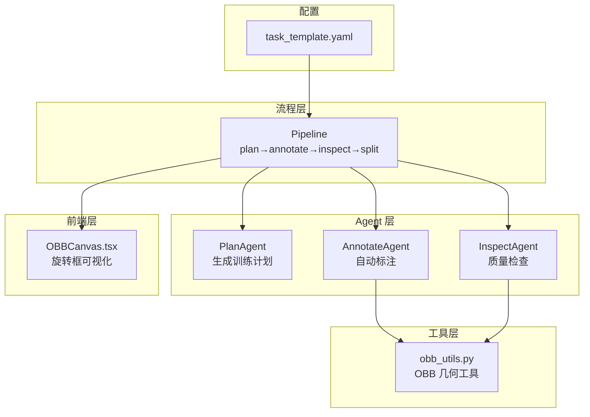
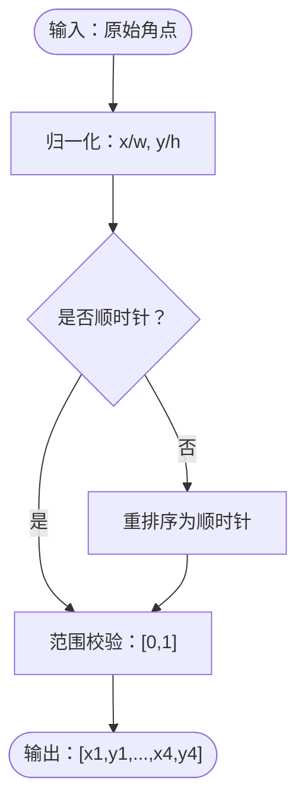
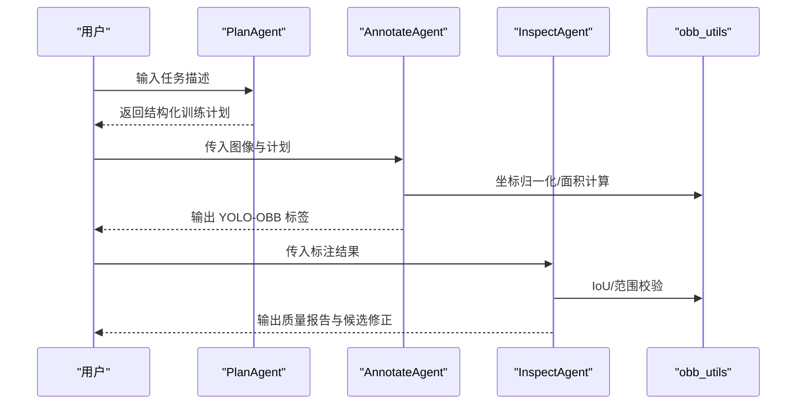
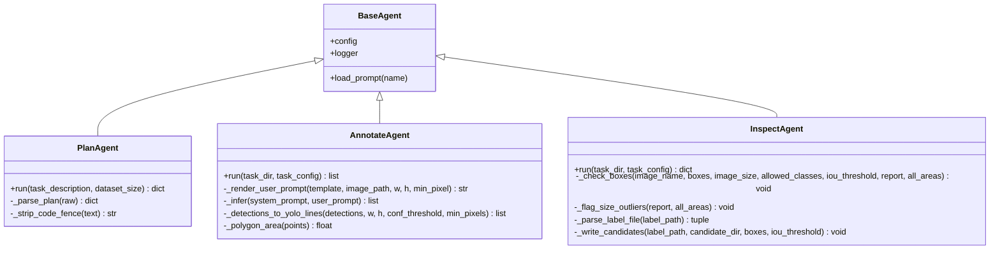
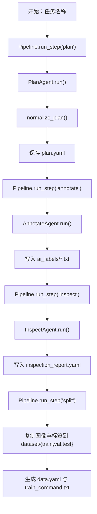
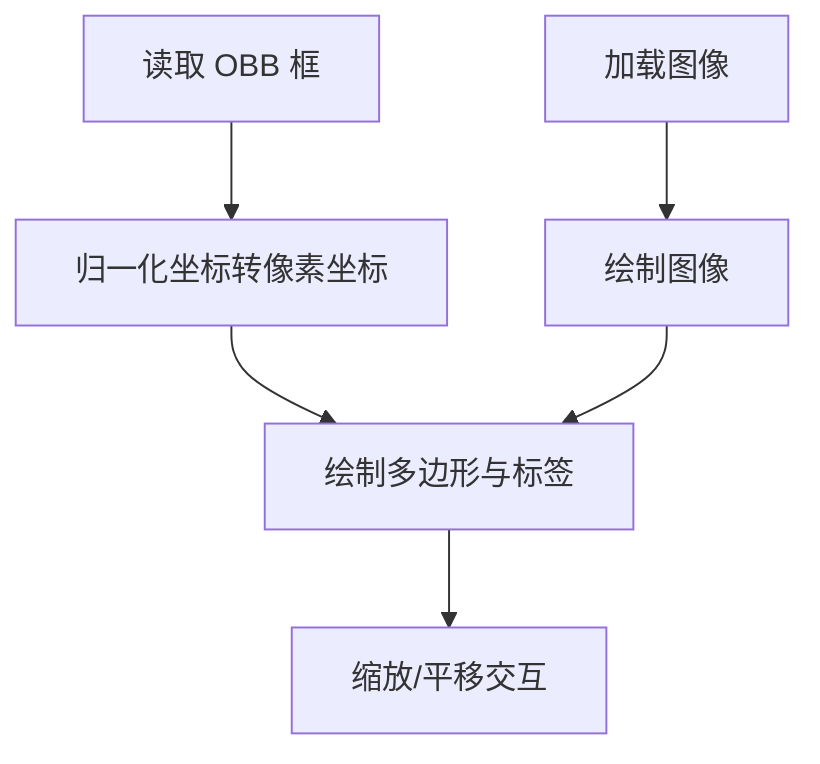
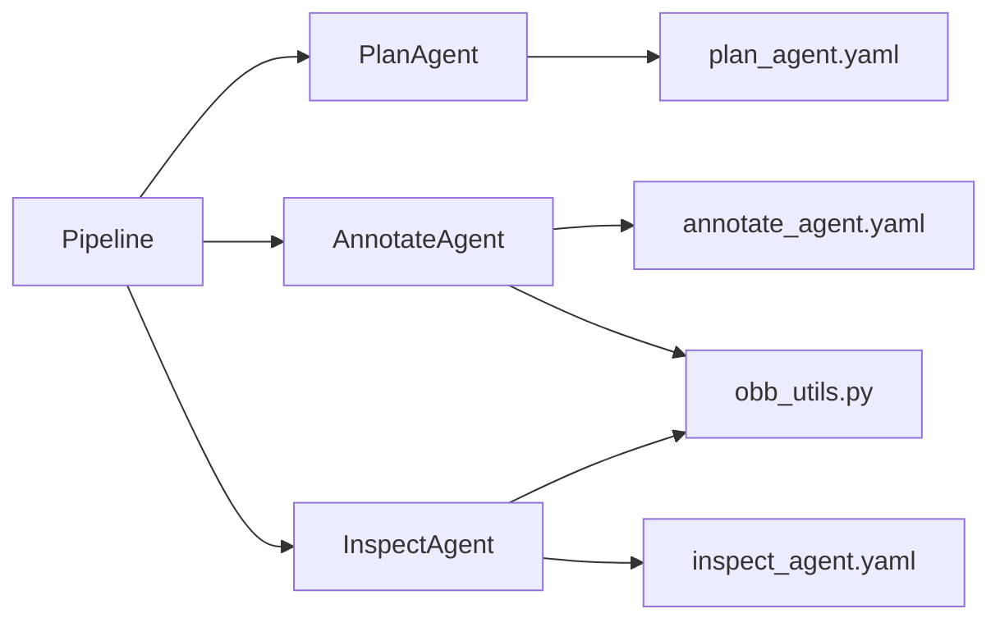

# 核心概念解释

<cite>
**本文引用的文件**   
- [plan_agent.py](file://src/agents/plan_agent.py)
- [annotate_agent.py](file://src/agents/annotate_agent.py)
- [inspect_agent.py](file://src/agents/inspect_agent.py)
- [obb_utils.py](file://src/utils/obb_utils.py)
- [pipeline.py](file://src/core/pipeline.py)
- [task_template.yaml](file://config/task_template.yaml)
- [plan_agent.yaml](file://prompts/plan_agent.yaml)
- [annotate_agent.yaml](file://prompts/annotate_agent.yaml)
- [inspect_agent.yaml](file://prompts/inspect_agent.yaml)
- [OBBCanvas.tsx](file://gui/src/components/OBBCanvas.tsx)
- [sdd-workflow.md](file://docs/sdd-workflow.md)
</cite>

## 目录
1. [引言](#引言)
2. [项目结构概览](#项目结构概览)
3. [YOLO-OBB 与旋转边界框](#yolo-obb-与旋转边界框)
4. [多模态 AI 在图像标注中的作用](#多模态-ai-在图像标注中的作用)
5. [Agent 架构模式](#agent-架构模式)
6. [数据流与处理逻辑](#数据流与处理逻辑)
7. [可视化与交互组件](#可视化与交互组件)
8. [依赖关系分析](#依赖关系分析)
9. [性能与可扩展性](#性能与可扩展性)
10. [常见问题与排错指南](#常见问题与排错指南)
11. [结论](#结论)

## 引言
本文件面向初学者和工程实践者，系统解释 VL-YOLO-Anchor 项目的核心概念：YOLO-OBB（旋转边界框）算法、顺时针归一化角点数据表示、多模态视觉语言模型在自动标注中的角色，以及 PlanAgent、AnnotateAgent、InspectAgent 的 Agent 协作模式。文档同时给出架构图、流程图和代码片段路径，帮助读者将抽象概念映射到实际代码实现中。

## 项目结构概览
VL-YOLO-Anchor 采用“任务驱动 + Agent 编排”的结构：
- 配置层：任务模板定义训练计划、分割策略、模型选择、超参数和质量检查规则。
- Agent 层：PlanAgent 生成结构化训练计划；AnnotateAgent 基于视觉语言模型进行自动标注；InspectAgent 校验标注质量并输出候选修正。
- 工具层：OBB 几何工具提供坐标归一化、面积计算、IoU 等基础能力。
- 流程层：Pipeline 串联 plan → annotate → inspect → split/export。
- 前端层：GUI 通过 Canvas 渲染旋转框，支持缩放和平移，便于人工复核。

图表来源
- [pipeline.py:22-46](file://src/core/pipeline.py#L22-L46)
- [task_template.yaml:8-54](file://config/task_template.yaml#L8-L54)
- [plan_agent.py:101-138](file://src/agents/plan_agent.py#L101-L138)
- [annotate_agent.py:22-80](file://src/agents/annotate_agent.py#L22-L80)
- [inspect_agent.py:34-108](file://src/agents/inspect_agent.py#L34-L108)
- [obb_utils.py:16-151](file://src/utils/obb_utils.py#L16-L151)
- [OBBCanvas.tsx:56-135](file://gui/src/components/OBBCanvas.tsx#L56-L135)

章节来源
- [pipeline.py:22-46](file://src/core/pipeline.py#L22-L46)
- [task_template.yaml:8-54](file://config/task_template.yaml#L8-L54)

## YOLO-OBB 与旋转边界框
YOLO-OBB 用于检测具有方向性的目标，例如工业缺陷、光伏板裂纹、倾斜物体等。与传统水平矩形框相比，旋转边界框能更精确地贴合目标外形，减少背景噪声，提高定位精度和 IoU 评估质量。

### 旋转框与传统水平框的区别
- 传统水平框：仅用左上、右下两个点描述，无法表达角度信息，对斜向或细长目标容易包含过多背景。
- 旋转框：用四个角点或中心+宽高+角度描述，可表达任意方向，适合不规则或倾斜目标。

### 顺时针归一化角点格式 `[x1,y1,x2,y2,x3,y3,x4,y4]`
- 含义：四个角点按顺时针顺序排列，每个点是二维坐标 (x, y)。
- 归一化：坐标值位于 [0, 1] 区间，x 除以图像宽度，y 除以图像高度，使标注与图像分辨率无关。
- 优势：
  - 统一数据格式，便于跨数据集共享。
  - 避免像素坐标带来的尺度问题。
  - 与 YOLO-OBB 标签格式一致，可直接用于训练。

图表来源
- [obb_utils.py:96-151](file://src/utils/obb_utils.py#L96-L151)

章节来源
- [obb_utils.py:1-151](file://src/utils/obb_utils.py#L1-L151)

## 多模态 AI 在图像标注中的作用
多模态视觉语言模型（VL）能够理解图像内容并结合文本指令进行推理。在本项目中：
- PlanAgent 根据自然语言任务描述生成结构化训练计划，包括类别、标注规则、模型选择和超参数。
- AnnotateAgent 使用 VL 模型对每张图像进行自动标注，输出符合 YOLO-OBB 格式的旋转框。
- InspectAgent 对标注结果进行质量检查，识别缺失标签、重复框、类别错误、坐标越界和尺寸异常，并输出候选修正。

图表来源
- [plan_agent.py:101-138](file://src/agents/plan_agent.py#L101-L138)
- [annotate_agent.py:22-80](file://src/agents/annotate_agent.py#L22-L80)
- [inspect_agent.py:34-108](file://src/agents/inspect_agent.py#L34-L108)
- [obb_utils.py:73-151](file://src/utils/obb_utils.py#L73-L151)

章节来源
- [plan_agent.py:101-138](file://src/agents/plan_agent.py#L101-L138)
- [annotate_agent.py:22-80](file://src/agents/annotate_agent.py#L22-L80)
- [inspect_agent.py:34-108](file://src/agents/inspect_agent.py#L34-L108)

## Agent 架构模式
Agent 架构将复杂任务拆分为多个职责单一的智能体，通过标准化接口协作：
- PlanAgent：负责从自然语言任务描述生成训练计划，解析 LLM 输出，保证计划结构与任务模板一致。
- AnnotateAgent：负责自动标注，渲染提示词，调用 VL 推理（当前为 stub），过滤低置信度与小目标，写入 YOLO-OBB 标签。
- InspectAgent：负责质量检查，解析标签文件，执行类别、坐标、重复框、尺寸异常检查，输出候选修正。

图表来源
- [plan_agent.py:101-182](file://src/agents/plan_agent.py#L101-L182)
- [annotate_agent.py:22-185](file://src/agents/annotate_agent.py#L22-L185)
- [inspect_agent.py:34-227](file://src/agents/inspect_agent.py#L34-L227)

章节来源
- [plan_agent.py:101-182](file://src/agents/plan_agent.py#L101-L182)
- [annotate_agent.py:22-185](file://src/agents/annotate_agent.py#L22-L185)
- [inspect_agent.py:34-227](file://src/agents/inspect_agent.py#L34-L227)

## 数据流与处理逻辑
Pipeline 协调三个 Agent 完成端到端的数据准备：
- Plan：读取任务描述，调用 PlanAgent 生成训练计划，规范化后保存。
- Annotate：遍历图像，渲染提示词，调用 VL 推理，过滤并写入标签。
- Inspect：解析标签，执行多项检查，输出质量报告和候选修正。
- Split/Export：按训练计划分割数据集，生成 data.yaml 和训练命令。

图表来源
- [pipeline.py:48-94](file://src/core/pipeline.py#L48-L94)
- [pipeline.py:96-153](file://src/core/pipeline.py#L96-L153)
- [pipeline.py:155-281](file://src/core/pipeline.py#L155-L281)

章节来源
- [pipeline.py:48-94](file://src/core/pipeline.py#L48-L94)
- [pipeline.py:96-153](file://src/core/pipeline.py#L96-L153)
- [pipeline.py:155-281](file://src/core/pipeline.py#L155-L281)

## 可视化与交互组件
GUI 中的 OBBCanvas 组件负责渲染图像与旋转框，支持缩放和平移，便于人工复核自动标注结果。它接收归一化的顺时针角点，并在 Canvas 上绘制多边形和类别标签。

图表来源
- [OBBCanvas.tsx:56-135](file://gui/src/components/OBBCanvas.tsx#L56-L135)

章节来源
- [OBBCanvas.tsx:56-135](file://gui/src/components/OBBCanvas.tsx#L56-L135)

## 依赖关系分析
- PlanAgent 依赖 Prompt 模板与 LLM 客户端接口，输出结构化计划。
- AnnotateAgent 依赖文件工具、图像工具与 OBB 工具，输出 YOLO-OBB 标签。
- InspectAgent 依赖 OBB 工具进行 IoU 与范围校验，输出质量报告。
- Pipeline 依赖 TaskManager 与各 Agent，串联整个流程。

图表来源
- [plan_agent.py:101-182](file://src/agents/plan_agent.py#L101-L182)
- [annotate_agent.py:22-185](file://src/agents/annotate_agent.py#L22-L185)
- [inspect_agent.py:34-227](file://src/agents/inspect_agent.py#L34-L227)
- [pipeline.py:22-46](file://src/core/pipeline.py#L22-L46)
- [plan_agent.yaml:1-27](file://prompts/plan_agent.yaml#L1-L27)
- [annotate_agent.yaml:1-25](file://prompts/annotate_agent.yaml#L1-L25)
- [inspect_agent.yaml:1-31](file://prompts/inspect_agent.yaml#L1-L31)

章节来源
- [plan_agent.py:101-182](file://src/agents/plan_agent.py#L101-L182)
- [annotate_agent.py:22-185](file://src/agents/annotate_agent.py#L22-L185)
- [inspect_agent.py:34-227](file://src/agents/inspect_agent.py#L34-L227)
- [pipeline.py:22-46](file://src/core/pipeline.py#L22-L46)

## 性能与可扩展性
- 性能特性：
  - OBB IoU 使用凸多边形交集计算，复杂度与顶点数相关，通常固定为 4 个顶点，开销可控。
  - 面积计算使用鞋带公式，时间复杂度 O(n)，n=4，常数级开销。
  - 归一化/反归一化线性扫描，时间复杂度 O(n)。
- 可扩展性：
  - LLM 客户端接口抽象，允许替换为真实后端（如 Qwen2.5-VL）。
  - Agent 间通过标准接口解耦，便于扩展新的检查规则或标注策略。
  - 前端 Canvas 支持缩放和平移，便于大规模图像复核。

章节来源
- [obb_utils.py:73-151](file://src/utils/obb_utils.py#L73-L151)
- [annotate_agent.py:97-113](file://src/agents/annotate_agent.py#L97-L113)
- [plan_agent.py:13-32](file://src/agents/plan_agent.py#L13-L32)

## 常见问题与排错指南
- 标注缺失：
  - 现象：某图像无对应标签文件。
  - 排查：检查 images 与 ai_labels 目录命名一致性，确认 AnnotateAgent 是否成功运行。
  - 参考：InspectAgent 的 missing_labels 检查。
- 重复框：
  - 现象：同一图像存在多个高重叠旋转框。
  - 排查：调整 IoU 阈值，查看 duplicate_boxes 报告，必要时移除冗余框。
  - 参考：InspectAgent 的 IoU 比较逻辑。
- 类别错误：
  - 现象：标签类别不在允许集合中。
  - 排查：核对 training_plan.classes 映射，确保 AnnotateAgent 输出的类别 ID 合法。
  - 参考：AnnotateAgent 的类别过滤与 InspectAgent 的类别检查。
- 坐标越界：
  - 现象：归一化坐标超出 [0,1]。
  - 排查：检查 normalize_points/denormalize_points 的使用场景，确认图像尺寸正数。
  - 参考：obb_utils.py 的范围校验与异常抛出。
- 尺寸异常：
  - 现象：某些框面积显著偏离数据集均值。
  - 排查：查看 size_anomaly 报告，结合图像内容判断是否为误检或标注偏差。
  - 参考：InspectAgent 的尺寸异常检测。

章节来源
- [inspect_agent.py:110-175](file://src/agents/inspect_agent.py#L110-L175)
- [annotate_agent.py:115-161](file://src/agents/annotate_agent.py#L115-L161)
- [obb_utils.py:96-151](file://src/utils/obb_utils.py#L96-L151)

## 结论
VL-YOLO-Anchor 通过 PlanAgent、AnnotateAgent、InspectAgent 的协作，实现了从自然语言任务描述到 YOLO-OBB 训练数据的自动化流水线。旋转边界框的顺时针归一化角点格式提供了稳定、通用的数据表示，配合多模态 AI 的能力，显著提升了标注效率与质量。Pipeline 将各阶段解耦，便于扩展与优化；GUI 可视化组件则为人机协同复核提供了直观界面。对于初学者，建议从任务模板与 OBB 工具入手，逐步理解 Agent 的职责与数据流转，再结合实际业务场景调整提示词与检查规则。