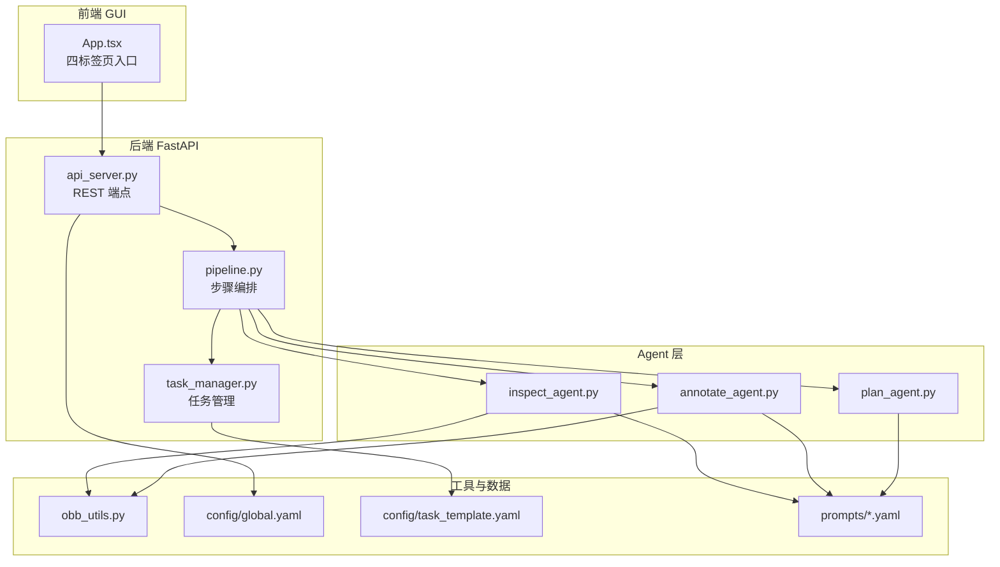
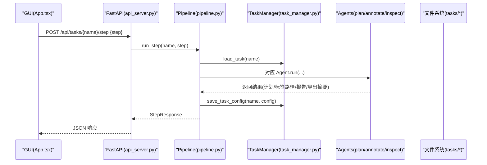
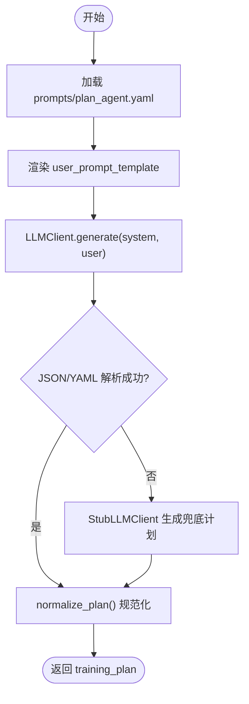
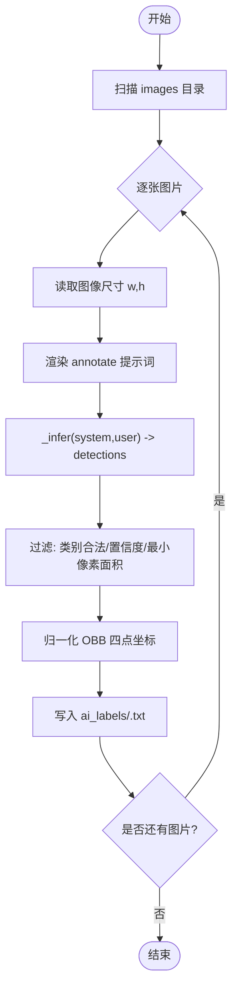
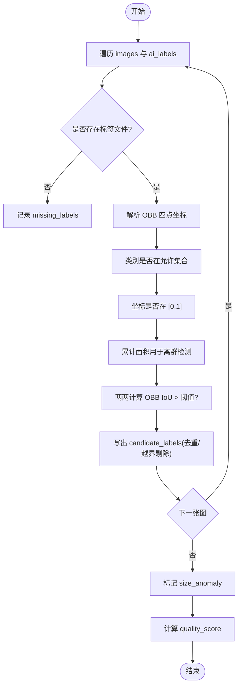
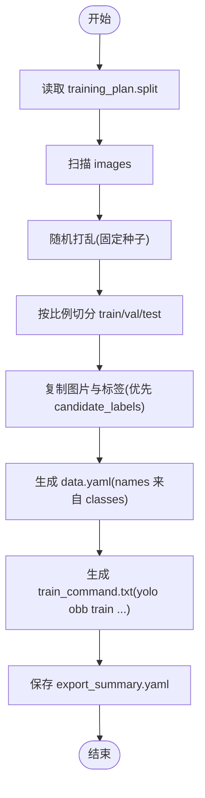
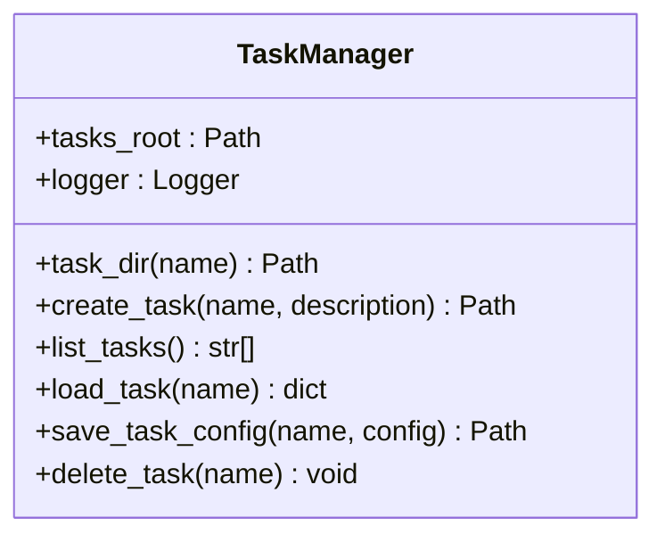
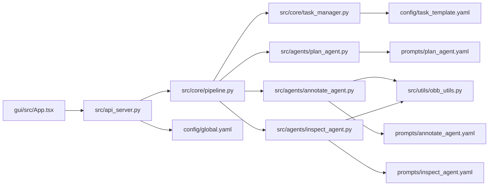

# 项目介绍与特性

<cite>
**本文引用的文件**   
- [README.md](file://README.md)
- [pyproject.toml](file://pyproject.toml)
- [global.yaml](file://config/global.yaml)
- [task_template.yaml](file://config/task_template.yaml)
- [api_server.py](file://src/api_server.py)
- [pipeline.py](file://src/core/pipeline.py)
- [task_manager.py](file://src/core/task_manager.py)
- [base_agent.py](file://src/agents/base_agent.py)
- [plan_agent.py](file://src/agents/plan_agent.py)
- [annotate_agent.py](file://src/agents/annotate_agent.py)
- [inspect_agent.py](file://src/agents/inspect_agent.py)
- [plan_agent.yaml](file://prompts/plan_agent.yaml)
- [annotate_agent.yaml](file://prompts/annotate_agent.yaml)
- [inspect_agent.yaml](file://prompts/inspect_agent.yaml)
- [obb_utils.py](file://src/utils/obb_utils.py)
- [App.tsx](file://gui/src/App.tsx)
- [sdd-workflow.md](file://docs/sdd-workflow.md)
</cite>

## 目录
1. [引言](#引言)
2. [项目结构](#项目结构)
3. [核心组件](#核心组件)
4. [架构总览](#架构总览)
5. [详细组件分析](#详细组件分析)
6. [依赖关系分析](#依赖关系分析)
7. [性能与约束](#性能与约束)
8. [使用示例与预期效果](#使用示例与预期效果)
9. [故障排查指南](#故障排查指南)
10. [结论](#结论)

## 引言
VL-YOLO-Anchor 是一个面向通用工业缺陷检测的 YOLO-OBB 训练计划生成与智能标注平台。其核心价值在于：用自然语言描述任务，自动生成结构化训练计划；调用本地多模态大模型进行旋转框自动标注；对标注结果进行自动化质量检查并输出候选修正；最终一键导出可直接训练的 YOLO-OBB 数据集、配置文件与训练命令。

该平台特别针对工业场景优化：强调 OBB 顺时针归一化角点格式、任务级规则隔离、显存目标配置（RTX 3060Ti 约 8GB）、以及“永不覆盖原始标签”的安全策略。前端仅负责画布渲染与交互，后端承担全部 CV、推理与文件 IO。

**章节来源**
- [README.md:1-15](file://README.md#L1-L15)

## 项目结构
仓库采用“后端 Python + 前端 Tauri+React”的分层组织方式：
- 后端：FastAPI 服务暴露 REST API，Pipeline 编排 Plan/Annotate/Inspect/Split 四步流程，TaskManager 管理任务生命周期，Agent 体系实现提示词驱动的计划生成、自动标注与质检。
- 前端：Tauri 打包桌面应用，提供任务与计划、标注审核（OBB 画布）、质检报告、训练导出四个页面。
- 配置与提示词：全局配置、任务模板、各 Agent 的系统提示词与用户提示模板均外置 YAML，便于版本管理与替换。

**图示来源**
- [App.tsx:1-24](file://gui/src/App.tsx#L1-L24)
- [api_server.py:1-30](file://src/api_server.py#L1-L30)
- [pipeline.py:1-46](file://src/core/pipeline.py#L1-L46)
- [task_manager.py:14-38](file://src/core/task_manager.py#L14-L38)
- [plan_agent.py:101-118](file://src/agents/plan_agent.py#L101-L118)
- [annotate_agent.py:22-43](file://src/agents/annotate_agent.py#L22-L43)
- [inspect_agent.py:34-56](file://src/agents/inspect_agent.py#L34-L56)
- [obb_utils.py:1-29](file://src/utils/obb_utils.py#L1-L29)
- [global.yaml:1-29](file://config/global.yaml#L1-L29)
- [task_template.yaml:1-54](file://config/task_template.yaml#L1-L54)

**章节来源**
- [README.md:16-38](file://README.md#L16-L38)
- [pyproject.toml:1-33](file://pyproject.toml#L1-L33)

## 核心组件
- Pipeline：统一编排 plan → annotate → inspect → split/export 四步流程，负责参数校验、日志记录、结果持久化与导出。
- TaskManager：创建/列出/加载/保存任务，维护 tasks_root 下的任务目录结构与 task.yaml。
- Agents：
  - PlanAgent：根据自然语言任务描述生成结构化训练计划，解析为 task_template 规范。
  - AnnotateAgent：按任务规则对 images 批量生成 YOLO-OBB 标签，写入 ai_labels。
  - InspectAgent：对 AI 标签进行漏标、重复、类别错误、越界、尺寸异常等检查，输出 candidate_labels 与质检报告。
- Utils：OBB 几何计算、坐标归一化/反归一化、IoU、面积计算等。
- API Server：将 Pipeline 能力以 REST API 暴露给 GUI。

**章节来源**
- [pipeline.py:22-94](file://src/core/pipeline.py#L22-L94)
- [task_manager.py:14-38](file://src/core/task_manager.py#L14-L38)
- [plan_agent.py:101-138](file://src/agents/plan_agent.py#L101-L138)
- [annotate_agent.py:22-80](file://src/agents/annotate_agent.py#L22-L80)
- [inspect_agent.py:34-108](file://src/agents/inspect_agent.py#L34-L108)
- [obb_utils.py:16-29](file://src/utils/obb_utils.py#L16-L29)

## 架构总览
系统由前端 GUI、后端 FastAPI、Pipeline 编排器、三个 Agent、工具库与配置组成。GUI 通过 HTTP 调用后端接口触发任务创建、单步执行、查看计划与报告、导出数据集等操作；后端在内存中持有 TaskManager 与 Pipeline 实例，按需调度 Agent 完成具体工作。

**图示来源**
- [App.tsx:1-24](file://gui/src/App.tsx#L1-L24)
- [api_server.py:169-192](file://src/api_server.py#L169-L192)
- [pipeline.py:62-94](file://src/core/pipeline.py#L62-L94)
- [task_manager.py:92-122](file://src/core/task_manager.py#L92-L122)

## 详细组件分析

### 训练计划生成（PlanAgent）
PlanAgent 从外部提示词加载 system_prompt 与 user_prompt_template，结合任务描述与数据集规模提示，调用 LLMClient.generate 生成结构化计划文本，再尝试 JSON/YAML 解析，失败时回退到 StubLLMClient 的确定性计划，确保流水线不中断。

**图示来源**
- [plan_agent.py:119-168](file://src/agents/plan_agent.py#L119-L168)
- [pipeline.py:284-324](file://src/core/pipeline.py#L284-L324)

**章节来源**
- [plan_agent.py:13-99](file://src/agents/plan_agent.py#L13-L99)
- [plan_agent.py:101-182](file://src/agents/plan_agent.py#L101-L182)
- [plan_agent.yaml:1-27](file://prompts/plan_agent.yaml#L1-L27)

### 自动旋转框标注（AnnotateAgent）
AnnotateAgent 遍历 images 目录，逐图渲染提示词，调用 _infer（当前为 Stub 实现）得到检测结果，按 conf_threshold 与 min_defect_pixels 过滤，将 OBB 四点坐标归一化为 YOLO-OBB 行格式，写入 ai_labels。

**图示来源**
- [annotate_agent.py:25-80](file://src/agents/annotate_agent.py#L25-L80)
- [annotate_agent.py:115-161](file://src/agents/annotate_agent.py#L115-L161)
- [obb_utils.py:96-137](file://src/utils/obb_utils.py#L96-L137)

**章节来源**
- [annotate_agent.py:22-185](file://src/agents/annotate_agent.py#L22-L185)
- [annotate_agent.yaml:1-25](file://prompts/annotate_agent.yaml#L1-L25)

### 自动化质量检查（InspectAgent）
InspectAgent 对 ai_labels 进行多维度检查：缺失标签、重复框（OBB IoU 阈值）、类别错误、坐标越界、尺寸异常（基于全量面积均值±3σ）。检查结果写入 inspection_report.yaml，同时生成 candidate_labels 作为“候选修正”，绝不修改原始标签。

**图示来源**
- [inspect_agent.py:37-108](file://src/agents/inspect_agent.py#L37-L108)
- [inspect_agent.py:110-175](file://src/agents/inspect_agent.py#L110-L175)
- [inspect_agent.py:203-227](file://src/agents/inspect_agent.py#L203-L227)
- [obb_utils.py:73-93](file://src/utils/obb_utils.py#L73-L93)

**章节来源**
- [inspect_agent.py:1-227](file://src/agents/inspect_agent.py#L1-L227)
- [inspect_agent.yaml:1-31](file://prompts/inspect_agent.yaml#L1-L31)

### 数据集导出与训练命令（Pipeline.split）
split 步骤依据 training_plan.split 比例随机打乱划分 train/val/test，复制图片与标签（优先 candidate_labels），生成 data.yaml 与 train_command.txt，并输出 export_summary.yaml。

**图示来源**
- [pipeline.py:155-213](file://src/core/pipeline.py#L155-L213)
- [pipeline.py:234-281](file://src/core/pipeline.py#L234-L281)

**章节来源**
- [pipeline.py:155-281](file://src/core/pipeline.py#L155-L281)

### 任务管理与目录约定（TaskManager）
TaskManager 负责 tasks_root 下任务的创建、列举、加载与保存。新建任务会拷贝 task_template.yaml 作为初始配置，并初始化 images、ai_labels、candidate_labels 等子目录。

**图示来源**
- [task_manager.py:14-150](file://src/core/task_manager.py#L14-L150)

**章节来源**
- [task_manager.py:14-150](file://src/core/task_manager.py#L14-L150)
- [task_template.yaml:1-54](file://config/task_template.yaml#L1-L54)

## 依赖关系分析
- 前端依赖后端 REST API，页面路由与状态由 App.tsx 聚合。
- 后端依赖 Pipeline 编排与 TaskManager 存储；Pipeline 依赖三个 Agent；Agent 依赖 BaseAgent 提供的提示词加载与日志能力。
- 工具层 OBB 几何函数被 AnnotateAgent 与 InspectAgent 共同复用。
- 配置层 global.yaml 控制 VL 模型加载、设备、显存上限与服务端口；task_template.yaml 定义训练计划默认结构。

**图示来源**
- [App.tsx:1-24](file://gui/src/App.tsx#L1-L24)
- [api_server.py:1-30](file://src/api_server.py#L1-L30)
- [pipeline.py:1-46](file://src/core/pipeline.py#L1-L46)
- [task_manager.py:14-38](file://src/core/task_manager.py#L14-L38)
- [plan_agent.py:101-118](file://src/agents/plan_agent.py#L101-L118)
- [annotate_agent.py:22-43](file://src/agents/annotate_agent.py#L22-L43)
- [inspect_agent.py:34-56](file://src/agents/inspect_agent.py#L34-L56)
- [obb_utils.py:1-29](file://src/utils/obb_utils.py#L1-L29)
- [global.yaml:1-29](file://config/global.yaml#L1-L29)
- [task_template.yaml:1-54](file://config/task_template.yaml#L1-L54)

**章节来源**
- [pyproject.toml:1-33](file://pyproject.toml#L1-L33)
- [global.yaml:1-29](file://config/global.yaml#L1-L29)

## 性能与约束
- OBB 输出格式：严格采用 4 个顺时针归一化角点 [x1,y1,x2,y2,x3,y3,x4,y4]，范围 [0,1]，不使用水平矩形。
- 显存目标：RTX 3060Ti（约 8GB），VL 模型 4-bit 加载，支持 CPU 回退；全局显存上限可配置。
- 任务隔离：每个任务拥有独立的 classes/rules，Agent 不跨任务混用规则。
- 安全策略：永不覆盖原始标签；所有修正写入 candidate_labels。
- 后端职责：Python 后端负责全部 CV/推理/文件 IO；前端只做画布渲染与 UI。
- 提示词外置：所有 Agent 系统提示词位于 prompts/*.yaml，不硬编码。

**章节来源**
- [README.md:7-14](file://README.md#L7-L14)
- [global.yaml:1-16](file://config/global.yaml#L1-L16)

## 使用示例与预期效果

### 快速上手
- 安装依赖（可选 GPU 加速）：
  - uv venv
  - uv sync --extra dev
  - uv sync --extra gpu（可选）
- CLI 创建任务与逐步执行：
  - uv run python run.py create --task demo --description "光伏 EL 图像：crack / break_grid 缺陷"
  - uv run python run.py plan     --task demo
  - uv run python run.py annotate --task demo
  - uv run python run.py inspect  --task demo
  - uv run python run.py split    --task demo
- 或一次性全流程：
  - uv run python run.py full --task demo

预期产出：
- tasks/demo/images/：输入图片
- tasks/demo/ai_labels/：AI 生成的 YOLO-OBB 标签
- tasks/demo/candidate_labels/：质检后的候选修正标签
- tasks/demo/dataset/train|val|test/images|labels：导出的数据集
- tasks/demo/dataset/data.yaml：YOLO-OBB 数据集配置
- tasks/demo/dataset/train_command.txt：可直接运行的 yolo obb train 命令

**章节来源**
- [README.md:40-71](file://README.md#L40-L71)

### 通过 API 与 GUI 协作
- 启动后端：uvicorn src.api_server:app --host 127.0.0.1 --port 8765
- 主要端点：
  - GET/POST /api/tasks：列出/创建任务
  - POST /api/tasks/{name}/step：运行单步（plan/annotate/inspect/split）
  - GET /api/tasks/{name}/plan：获取训练计划
  - GET /api/tasks/{name}/report：获取质检报告
  - GET /api/tasks/{name}/export：获取导出摘要
  - GET /api/tasks/{name}/labels：有标签的图片列表
  - GET /api/tasks/{name}/labels/{img}：单图 OBB 标签（candidate_labels 优先）
  - GET /api/tasks/{name}/images | /images/{img}：图片列表/图片文件
- GUI 启动：
  - Windows: ./start_gui.ps1
  - Linux/macOS: ./start_gui.sh
- GUI 包含四个标签页：任务与计划、标注审核（OBB 画布，缩放/平移）、质检报告、训练导出。

**章节来源**
- [README.md:73-109](file://README.md#L73-L109)
- [api_server.py:139-377](file://src/api_server.py#L139-L377)

## 故障排查指南
- 任务不存在：访问 /api/tasks/{name}... 相关端点时若返回 404，请确认已创建任务且名称一致。
- 步骤失败：run_step 捕获异常并返回 500，建议查看后端日志定位 Agent 报错。
- 无图片可分割：split 步骤在无 images 时会返回空 splits，请先放置图片到 images 目录。
- 标签解析告警：当标签行格式不符合 cls + 8 个坐标时，API 与 Agent 会跳过该行并记录警告。
- 前端依赖未安装：gui/ 与 gui/src-tauri/ 需先 npm install；tauri dev 还需 Rust toolchain。

**章节来源**
- [api_server.py:169-192](file://src/api_server.py#L169-L192)
- [api_server.py:91-118](file://src/api_server.py#L91-L118)
- [pipeline.py:174-177](file://src/core/pipeline.py#L174-L177)
- [README.md:119-127](file://README.md#L119-L127)

## 结论
VL-YOLO-Anchor 以“自然语言驱动的训练计划生成 + 智能旋转框标注 + 自动化质检 + 一键导出”为核心闭环，围绕工业缺陷检测场景进行了针对性优化：严格的 OBB 格式、显存目标与 CPU 回退、任务级规则隔离、以及“不覆盖原始标签”的安全机制。配合 FastAPI 与 Tauri+React 的前后端分离架构，既适合离线跑通全流程，也便于接入真实 Qwen2.5-VL 模型进行生产级部署。