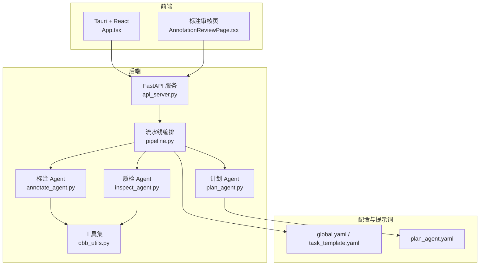
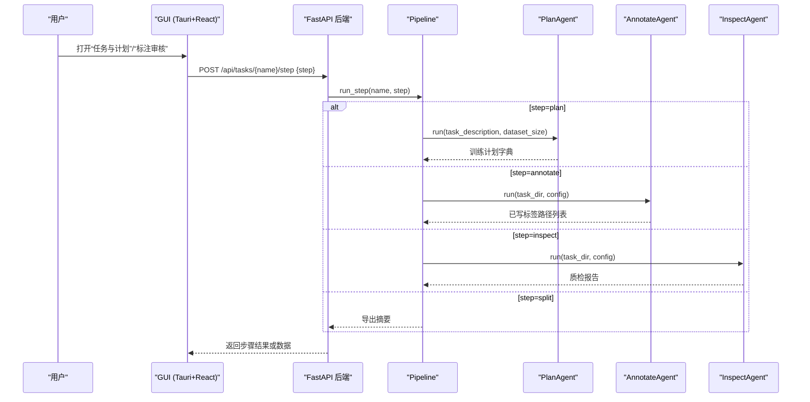
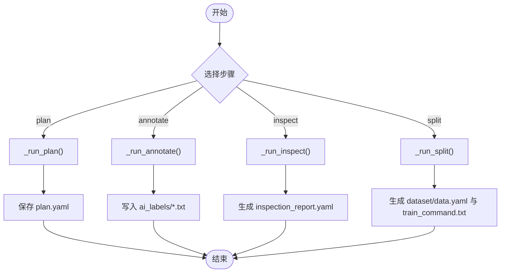
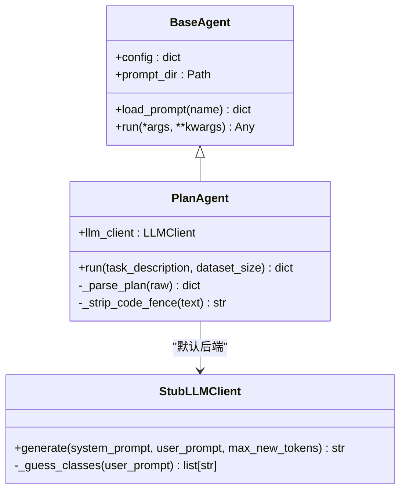
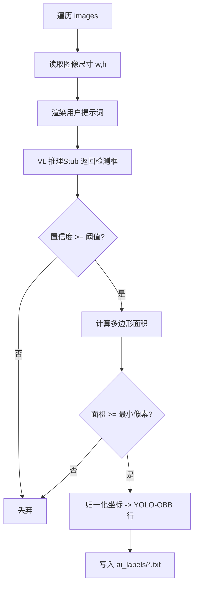
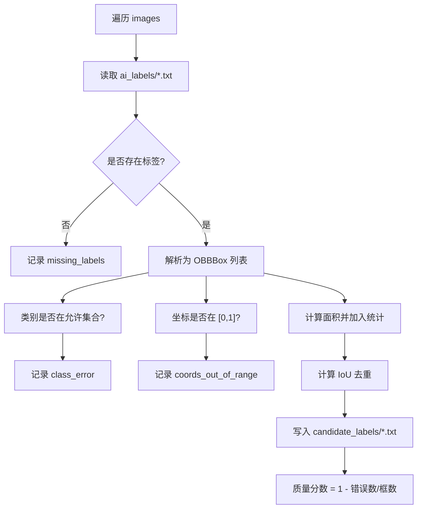
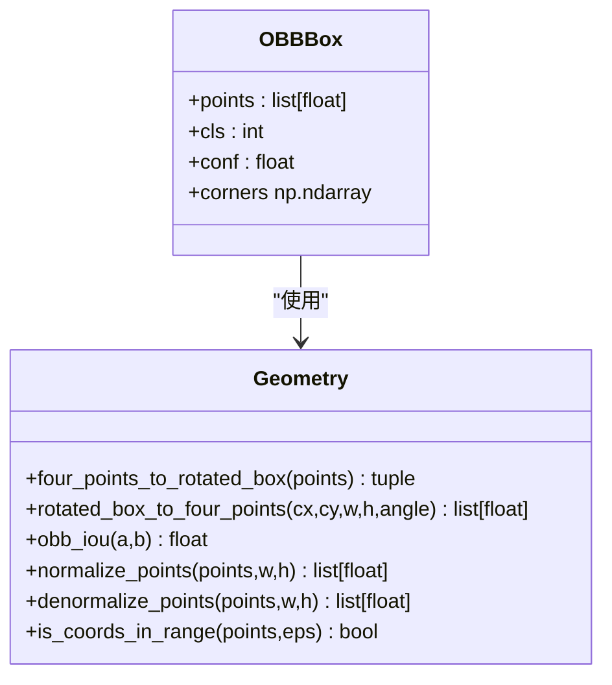
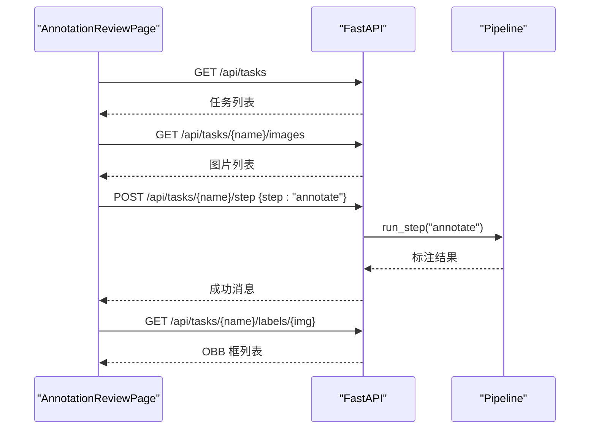
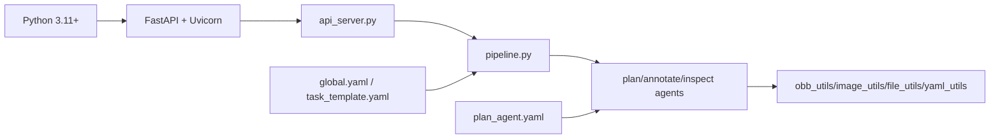

# 项目概述

<cite>
**本文引用的文件**
- [README.md](file://README.md)
- [pyproject.toml](file://pyproject.toml)
- [config/global.yaml](file://config/global.yaml)
- [config/task_template.yaml](file://config/task_template.yaml)
- [prompts/plan_agent.yaml](file://prompts/plan_agent.yaml)
- [src/api_server.py](file://src/api_server.py)
- [src/core/pipeline.py](file://src/core/pipeline.py)
- [src/agents/base_agent.py](file://src/agents/base_agent.py)
- [src/agents/plan_agent.py](file://src/agents/plan_agent.py)
- [src/agents/annotate_agent.py](file://src/agents/annotate_agent.py)
- [src/agents/inspect_agent.py](file://src/agents/inspect_agent.py)
- [src/utils/obb_utils.py](file://src/utils/obb_utils.py)
- [run.py](file://run.py)
- [gui/src/App.tsx](file://gui/src/App.tsx)
- [gui/src/pages/AnnotationReviewPage.tsx](file://gui/src/pages/AnnotationReviewPage.tsx)
- [docs/sdd-workflow.md](file://docs/sdd-workflow.md)
</cite>

## 目录
1. [简介](#简介)
2. [项目结构](#项目结构)
3. [核心组件](#核心组件)
4. [架构总览](#架构总览)
5. [详细组件分析](#详细组件分析)
6. [依赖关系分析](#依赖关系分析)
7. [性能与约束](#性能与约束)
8. [快速开始指南](#快速开始指南)
9. [故障排查](#故障排查)
10. [结论](#结论)

## 简介
VL-YOLO-Anchor 是一个面向通用工业缺陷检测的“YOLO-OBB 训练计划生成与智能标注平台”。其核心目标是将自然语言任务描述转化为可执行的 YOLO-OBB 训练计划，并通过多 Agent 协作完成自动旋转框标注、质检与数据集导出，最终输出可直接用于训练的 YOLO-OBB 数据集与训练命令。

典型工作流：
- 输入：自然语言任务描述（行业、模态、缺陷类型等）。
- PlanAgent：生成结构化训练计划（类别、标注规则、超参数、质检规则、模型选择等）。
- AnnotateAgent：调用本地 VL 模型（默认使用 Qwen2.5-VL int4）进行自动旋转框标注，输出 YOLO-OBB 标签。
- InspectAgent：对 AI 标注进行质检（漏标、重复、类别错误、越界、尺寸异常），并写入候选修正。
- 导出：按训练计划拆分数据集，生成 data.yaml 与一键训练命令。

技术要点：
- 多 Agent 系统：PlanAgent / AnnotateAgent / InspectAgent 职责清晰、解耦良好。
- Tauri + React 桌面前端：提供任务管理、标注审核画布、质检报告与训练导出四个页面。
- FastAPI 后端服务：暴露统一 API，供 GUI 与 CLI 调用。
- OBB 规范：统一采用顺时针归一化四点坐标，范围 [0,1]，不依赖水平矩形。
- 安全约束：永不覆盖原始标签；所有修正写入 candidate_labels；任务间规则隔离。

**章节来源**
- [README.md:1-15](file://README.md#L1-L15)
- [config/global.yaml:1-29](file://config/global.yaml#L1-L29)

## 项目结构
仓库采用分层与模块化组织：
- 配置层：global.yaml（全局模型/推理/路径/服务端口）、task_template.yaml（任务模板）。
- 提示词层：prompts/*.yaml（各 Agent 的系统提示与用户提示模板）。
- 后端层：src/agents（Agent 实现）、src/core（Pipeline/TaskManager）、src/utils（OBB/图像/文件/YAML 工具）、src/api_server.py（FastAPI）。
- 前端层：gui/（Tauri + React + TypeScript + Ant Design），包含四个主要页面。
- 入口与脚本：run.py（CLI）、start_gui.*（一键启动后端与 GUI）。

**图表来源**
- [gui/src/App.tsx:1-24](file://gui/src/App.tsx#L1-L24)
- [gui/src/pages/AnnotationReviewPage.tsx:1-118](file://gui/src/pages/AnnotationReviewPage.tsx#L1-L118)
- [src/api_server.py:1-384](file://src/api_server.py#L1-L384)
- [src/core/pipeline.py:1-325](file://src/core/pipeline.py#L1-L325)
- [src/agents/plan_agent.py:1-182](file://src/agents/plan_agent.py#L1-L182)
- [src/agents/annotate_agent.py:1-185](file://src/agents/annotate_agent.py#L1-L185)
- [src/agents/inspect_agent.py:1-227](file://src/agents/inspect_agent.py#L1-L227)
- [src/utils/obb_utils.py:1-151](file://src/utils/obb_utils.py#L1-L151)
- [config/global.yaml:1-29](file://config/global.yaml#L1-L29)
- [config/task_template.yaml:1-54](file://config/task_template.yaml#L1-L54)
- [prompts/plan_agent.yaml:1-27](file://prompts/plan_agent.yaml#L1-L27)

**章节来源**
- [README.md:16-38](file://README.md#L16-L38)
- [gui/src/App.tsx:1-24](file://gui/src/App.tsx#L1-L24)
- [src/api_server.py:1-30](file://src/api_server.py#L1-L30)

## 核心组件
- Pipeline（流水线编排）：串联 plan → annotate → inspect → split/export，负责步骤调度、结果持久化与数据导出。
- TaskManager（任务管理）：维护 tasks_root 下的任务目录与配置读写（由 API 与 CLI 调用）。
- Agents（多 Agent 系统）：
  - PlanAgent：将自然语言描述解析为结构化训练计划，兼容 JSON/YAML 输出，具备回退策略。
  - AnnotateAgent：遍历 images，渲染提示词，执行 VL 推理（当前为 Stub），过滤与规范化后写入 ai_labels。
  - InspectAgent：读取 ai_labels，执行多维质检，写入 candidate_labels，生成 inspection_report.yaml。
- Utils（工具集）：OBB 几何计算、坐标归一化/反归一化、面积与 IoU 计算、图像与文件操作。
- API Server（FastAPI）：提供任务创建、步骤运行、图片/标签读取、报告与导出摘要等 REST 接口。
- GUI（Tauri + React）：四标签页应用，支持任务与计划查看、标注审核画布、质检报告浏览、训练导出。

**章节来源**
- [src/core/pipeline.py:22-94](file://src/core/pipeline.py#L22-L94)
- [src/agents/base_agent.py:13-69](file://src/agents/base_agent.py#L13-L69)
- [src/agents/plan_agent.py:101-182](file://src/agents/plan_agent.py#L101-L182)
- [src/agents/annotate_agent.py:22-80](file://src/agents/annotate_agent.py#L22-L80)
- [src/agents/inspect_agent.py:34-108](file://src/agents/inspect_agent.py#L34-L108)
- [src/utils/obb_utils.py:16-151](file://src/utils/obb_utils.py#L16-L151)
- [src/api_server.py:139-384](file://src/api_server.py#L139-L384)
- [gui/src/App.tsx:1-24](file://gui/src/App.tsx#L1-L24)

## 架构总览
整体架构分为三层：
- 前端交互层：React + Tauri 提供可视化界面与交互能力。
- 后端服务层：FastAPI 暴露 HTTP API，封装 Pipeline 与 TaskManager。
- 数据处理层：多 Agent 协同完成计划生成、自动标注、质检与数据集导出。

**图表来源**
- [src/api_server.py:169-232](file://src/api_server.py#L169-L232)
- [src/core/pipeline.py:48-94](file://src/core/pipeline.py#L48-L94)
- [src/agents/plan_agent.py:119-138](file://src/agents/plan_agent.py#L119-L138)
- [src/agents/annotate_agent.py:25-80](file://src/agents/annotate_agent.py#L25-L80)
- [src/agents/inspect_agent.py:37-108](file://src/agents/inspect_agent.py#L37-L108)

## 详细组件分析

### 流水线与任务管理（Pipeline）
- 步骤定义：plan、annotate、inspect、split。
- 流程控制：run_full 顺序执行全部步骤；run_step 根据 step 分发到对应私有方法。
- 计划标准化：normalize_plan 将 LLM 输出映射到 task_template 结构，确保 classes、split、inspection、metrics 等字段一致。
- 数据集导出：按 plan.split 比例随机打乱并划分 train/val/test，复制图片与标签，生成 data.yaml 与 train_command.txt。

**图表来源**
- [src/core/pipeline.py:48-213](file://src/core/pipeline.py#L48-L213)
- [src/core/pipeline.py:284-325](file://src/core/pipeline.py#L284-L325)

**章节来源**
- [src/core/pipeline.py:1-325](file://src/core/pipeline.py#L1-L325)

### PlanAgent（计划生成）
- 输入：任务描述与数据集规模提示。
- 处理：加载 prompts/plan_agent.yaml，渲染 user_prompt_template，调用 LLMClient.generate（默认 StubLLMClient）。
- 输出：JSON/YAML 结构的训练计划，若解析失败则回退到 Stub 生成的保守计划。
- 关键特性：classes 必须为从 0 开始的连续整数；参数需适配单卡 3060Ti（约 8GB VRAM）。

**图表来源**
- [src/agents/base_agent.py:13-69](file://src/agents/base_agent.py#L13-L69)
- [src/agents/plan_agent.py:13-99](file://src/agents/plan_agent.py#L13-L99)
- [src/agents/plan_agent.py:101-182](file://src/agents/plan_agent.py#L101-L182)

**章节来源**
- [src/agents/plan_agent.py:1-182](file://src/agents/plan_agent.py#L1-L182)
- [prompts/plan_agent.yaml:1-27](file://prompts/plan_agent.yaml#L1-L27)

### AnnotateAgent（自动标注）
- 输入：任务目录（含 images/）与任务配置（training_plan）。
- 处理：遍历 images，渲染用户提示词，执行 VL 推理（Stub 返回固定中心旋转框），过滤置信度与最小像素面积，转换为 YOLO-OBB 行格式。
- 输出：ai_labels/*.txt，每行格式为“cls x1 y1 x2 y2 x3 y3 x4 y4”，坐标归一化至 [0,1]。

**图表来源**
- [src/agents/annotate_agent.py:25-80](file://src/agents/annotate_agent.py#L25-L80)
- [src/agents/annotate_agent.py:115-185](file://src/agents/annotate_agent.py#L115-L185)
- [src/utils/obb_utils.py:96-137](file://src/utils/obb_utils.py#L96-L137)

**章节来源**
- [src/agents/annotate_agent.py:1-185](file://src/agents/annotate_agent.py#L1-L185)

### InspectAgent（质检与候选修正）
- 输入：ai_labels/*.txt 与任务配置（inspection 规则）。
- 检查项：缺失标签、重复框（OBB IoU 阈值）、类别错误、坐标越界、尺寸异常（基于全数据集面积均值与标准差）。
- 输出：inspection_report.yaml 与 candidate_labels/*.txt（仅保留有效且去重后的框）。

**图表来源**
- [src/agents/inspect_agent.py:37-108](file://src/agents/inspect_agent.py#L37-L108)
- [src/agents/inspect_agent.py:110-175](file://src/agents/inspect_agent.py#L110-L175)
- [src/agents/inspect_agent.py:203-227](file://src/agents/inspect_agent.py#L203-L227)
- [src/utils/obb_utils.py:73-93](file://src/utils/obb_utils.py#L73-L93)

**章节来源**
- [src/agents/inspect_agent.py:1-227](file://src/agents/inspect_agent.py#L1-L227)

### OBB 几何工具（obb_utils）
- 数据结构：OBBBox（points、cls、conf），提供 corners 属性。
- 几何转换：four_points_to_rotated_box、rotated_box_to_four_points。
- 度量与校验：obb_iou（凸多边形交集）、is_coords_in_range（[0,1] 范围校验）。
- 坐标变换：normalize_points、denormalize_points。

**图表来源**
- [src/utils/obb_utils.py:16-151](file://src/utils/obb_utils.py#L16-L151)

**章节来源**
- [src/utils/obb_utils.py:1-151](file://src/utils/obb_utils.py#L1-L151)

### 前端与后端集成（GUI + API）
- GUI 根组件 App.tsx 提供四标签页布局：任务与计划、标注审核、质检报告、训练导出。
- AnnotationReviewPage 通过 API 列出任务与图片，触发标注并展示 OBB 画布。
- API 端点：/api/tasks（创建/列出）、/api/tasks/{name}/step（运行步骤）、/api/tasks/{name}/labels/*（读取标签）、/api/tasks/{name}/images/*（读取图片）、/api/tasks/{name}/report（质检报告）、/api/tasks/{name}/export（导出摘要）。

**图表来源**
- [gui/src/pages/AnnotationReviewPage.tsx:1-118](file://gui/src/pages/AnnotationReviewPage.tsx#L1-L118)
- [src/api_server.py:139-384](file://src/api_server.py#L139-L384)
- [src/core/pipeline.py:62-94](file://src/core/pipeline.py#L62-L94)

**章节来源**
- [gui/src/App.tsx:1-24](file://gui/src/App.tsx#L1-L24)
- [gui/src/pages/AnnotationReviewPage.tsx:1-118](file://gui/src/pages/AnnotationReviewPage.tsx#L1-L118)
- [src/api_server.py:1-384](file://src/api_server.py#L1-L384)

## 依赖关系分析
- 运行时依赖：OpenCV、PyYAML、NumPy、Pillow、Matplotlib、FastAPI、Uvicorn、Pydantic、Jinja2。
- GPU 可选依赖：torch、torchvision、transformers、accelerate、bitsandbytes（启用 --extra gpu）。
- 开发依赖：ruff、mypy、pytest、httpx。
- 配置文件：global.yaml 指定 VL 模型名称、量化位宽、设备、显存上限、服务端口等；task_template.yaml 定义任务结构与默认值。

**图表来源**
- [pyproject.toml:1-65](file://pyproject.toml#L1-L65)
- [config/global.yaml:1-29](file://config/global.yaml#L1-L29)
- [config/task_template.yaml:1-54](file://config/task_template.yaml#L1-L54)
- [src/api_server.py:1-30](file://src/api_server.py#L1-L30)
- [src/core/pipeline.py:1-47](file://src/core/pipeline.py#L1-L47)
- [prompts/plan_agent.yaml:1-27](file://prompts/plan_agent.yaml#L1-L27)

**章节来源**
- [pyproject.toml:1-65](file://pyproject.toml#L1-L65)
- [config/global.yaml:1-29](file://config/global.yaml#L1-L29)

## 性能与约束
- 显存目标：RTX 3060Ti（8GB），VL 模型以 4-bit 加载，支持 CPU 回退。
- 标注输出：统一为顺时针归一化四点坐标，范围 [0,1]，不使用水平矩形。
- 数据安全：从不覆盖原始标签；修正写入 candidate_labels。
- 任务隔离：每个任务拥有独立的 classes/rules，Agent 不跨任务混用规则。
- 后端职责：所有 CV/推理/文件 IO 由 Python 后端承担；前端仅负责画布渲染与 UI。
- 提示词外置：所有 Agent 系统提示词位于 prompts/*.yaml，避免硬编码。

**章节来源**
- [README.md:7-15](file://README.md#L7-L15)
- [config/global.yaml:1-29](file://config/global.yaml#L1-L29)
- [src/agents/annotate_agent.py:1-6](file://src/agents/annotate_agent.py#L1-L6)
- [src/agents/inspect_agent.py:1-5](file://src/agents/inspect_agent.py#L1-L5)

## 快速开始指南
环境要求：
- Python 3.11+ 与 uv。
- 可选 GPU 环境（安装 --extra gpu）以启用本地 VL 模型推理。

安装步骤：
- 创建虚拟环境并同步依赖：uv venv && uv sync --extra dev。
- 如需 GPU 推理：uv sync --extra gpu。

基本使用方法：
- 创建任务：uv run python run.py create --task demo --description "光伏 EL 图像：crack / break_grid 缺陷"。
- 逐步执行：plan → annotate → inspect → split。
- 一次性全流程：full。
- 放置图片于 tasks/<task>/images/ 后再执行 annotate；split 会在 tasks/<task>/dataset/ 生成 train/val/test、data.yaml 与 train_command.txt。

启动后端与 GUI：
- 后端：uv run uvicorn src.api_server:app --host 127.0.0.1 --port 8765。
- GUI：Windows 使用 start_gui.ps1；Linux/macOS 使用 start_gui.sh。

交互式文档：
- 访问 http://127.0.0.1:8765/docs 查看 API 文档。

**章节来源**
- [README.md:40-109](file://README.md#L40-L109)
- [run.py:20-77](file://run.py#L20-L77)
- [src/api_server.py:380-384](file://src/api_server.py#L380-L384)

## 故障排查
常见问题与建议：
- 任务不存在：API 返回 404，请确认任务名与 tasks_root 路径。
- 步骤失败：API 捕获异常并返回 500，查看日志定位具体 Agent 错误。
- 无标签文件：GET /api/tasks/{name}/labels/{image} 返回 404，请先执行 annotate。
- 图片不存在：GET /api/tasks/{name}/images/{image} 返回 404，请确认图片已放入 images/。
- 质检报告缺失：GET /api/tasks/{name}/report 返回 404，请先执行 inspect。
- 数据集导出缺失：GET /api/tasks/{name}/export 返回 404，请先执行 split。

调试建议：
- 调整日志级别：CLI 支持 --log-level。
- 检查 global.yaml 中的 server.host/port 与 model.device/load_in_4bit 设置。
- 使用 ruff/mypy/pytest 进行代码质量与测试验证。

**章节来源**
- [src/api_server.py:169-232](file://src/api_server.py#L169-L232)
- [src/api_server.py:234-384](file://src/api_server.py#L234-L384)
- [README.md:111-117](file://README.md#L111-L117)

## 结论
VL-YOLO-Anchor 通过多 Agent 协作与前后端分离架构，实现了从自然语言任务描述到可训练 YOLO-OBB 数据集的端到端自动化流程。其设计强调：
- 明确的职责边界：计划生成、自动标注、质检与导出各司其职。
- 强约束与安全性：OBB 规范、不覆盖原始标签、任务规则隔离。
- 可扩展性：LLMClient 协议与外部提示词机制便于接入真实 VL 模型。
- 易用性：CLI 与 GUI 双入口，提供一键启动与交互式文档。

对于初学者，建议先理解 YOLO-OBB 与旋转边界框的基本概念，再按照快速开始指南逐步实践；对于有经验的开发者，可重点关注 Pipeline 编排、Agent 协议与 OBB 工具链，以便扩展或替换后端推理能力。

**章节来源**
- [docs/sdd-workflow.md:1-14](file://docs/sdd-workflow.md#L1-L14)
- [README.md:1-15](file://README.md#L1-L15)