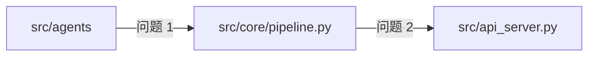

# 模板：设计方案文档

> **用途**：记录一个能力的技术设计 —— 现状、方案、决策权衡、阶段拆解、风险回退
> **产出路径**：`specs/<feature>/design.md`（与 `spec.md` 同目录，SDD 第二阶段产物）；`docs/architecture/*.md` 的架构说明
> **使用方**：`architect` agent 产出；`design-doc` workflow 阶段 2 落盘；`backend-engineer` / `frontend-engineer` 实施时对照；`docs-consistency-review` 作为比对锚点
> **前置**：`specs/<feature>/spec.md` 必须先存在且六要素齐全 —— **无 spec 不设计，无 design 不编码**

---

## 模板结构

`````markdown
# {设计标题}

> **定位**：{一句话说明本设计要解决什么问题}
> **状态**：{草稿 / 评审中 / 已批准 / 已实施 / 已废弃}
> **关联 spec**：`specs/{feature}/spec.md`
> **关联 ADR**：{`docs/memory/architect-decisions.md` 的 ADR-{nnn}，无则"待补"}
> **作者**：{agent 名或人名}
> **实施栈**：{后端 / 前端 / 跨栈}
> **最后更新**：{YYYY-MM-DD}

## 一、执行摘要

{1-2 句说明现状、方案、结论 —— 不读正文也能知道核心结论。}

## 二、现状分析

{Mermaid 或 ASCII 图展示当前架构，说明痛点。图上的每个节点必须是**真实存在的模块名**，禁止画不存在的组件。}



**痛点清单**：
1. {痛点 1} — {影响}（证据：`文件:行号`）
2. {痛点 2} — {影响}（证据：`文件:行号`）

## 三、变更范围

{从需求视角描述涉及哪些模块的变动，宽泛即可，不落到具体代码；具体改动见附录 A.1。}

| 模块 | 变动类型 | 变动内容 |
|------|---------|----------|
| `src/utils/` | {新增/修改/移除} | {新职责或行为变化} |
| `src/core/` | 修改 | {编排或数据流如何变化} |
| `src/api_server.py` | 修改 | {端点或响应模型变化} |
| `gui/src/{components,pages,hooks,services,types}` | 修改 | {页面/组件/契约层变化} |
| `prompts/*.yaml`、`config/*.yaml` | 修改 | {提示词或配置 schema 变化} |
| `tasks/<task>/` | 修改 | {磁盘产物 schema 变化} |

**不动什么**：
- {明确排除的模块/功能，防止读者误判影响面}

## 四、方案设计

### 4.1 总体架构

{目标架构图，标注分层与依赖方向。本项目依赖方向恒为 `src/utils` ← `src/agents` ← `src/core` ← `src/api_server.py` / `run.py`，禁止反向。}

### 4.2 关键设计决策

| 决策 | 选项 | 选择 | 理由 | 被否选项的代价 |
|------|------|------|------|---------------|
| {决策 1} | {A / B / C} | {A} | {理由} | {选 B 会怎样} |

### 4.3 核心流程

{流程图或步骤说明，**必须标注边界条件与异常处理**：文件读写失败返回什么状态码、LLM 输出畸形怎么走、空集合怎么处理。}

### 4.4 接口与数据契约

> 跨栈变更必填；单栈变更写「无契约变更」。

| 契约项 | 定义位置 | 消费位置 | 说明 |
|--------|---------|---------|------|
| 端点 + HTTP 方法 | `src/api_server.py` 装饰器 | `gui/src/services/api.ts` | 面 A |
| 响应结构 | Pydantic `response_model` | `gui/src/types/index.ts` | 面 B |
| 请求结构 | `*Request(BaseModel)` | `api.ts` 入参 | 面 C |
| 提示词占位符 | `prompts/*.yaml` 的 `{}` | `src/agents/*.py` 的 `.format()` | 面 D |
| 磁盘产物 | `tasks/<task>/{plan,task,inspection_report}.yaml`、`candidate_labels/*.txt` | `src/core/pipeline.py`、各页面 | schema |

**契约冻结点**：{后端 Pydantic 模型定稿的时点或提交号}。**未冻结前前端不得开工**；无法同批对齐处必须留 `// TODO(contract)` 并登记 `docs/memory/pm-memory.md`。

### 4.5 约束核查

| 约束类别 | 内容 | 是否满足 |
|---------|------|---------|
| OBB 硬约束 | `.claude/rules/obb-hard-constraints.md` 7 小节逐条 | {是/否/不涉及，逐条注明} |
| VRAM 预算 | RTX 3060Ti 8GB，4-bit + CPU 回退 | {是/否} |
| 职责边界 | 全部 CV/推理/文件 IO 留在 Python | {是/否} |
| 依赖方向 | 无反向依赖、无跨层直调 | {是/否} |
| 锁文件影响 | `uv.lock` / `gui/package-lock.json` / `gui/src-tauri/Cargo.lock` 是否变动 | {列具体包} |

## 五、阶段拆解

| 阶段 | 内容 | 预计工时 | 依赖 | 交付物 | 执行 agent |
|------|------|----------|------|--------|-----------|
| Phase 1 | {最小可行} | {N 人·天} | 无 | {…} | {backend-engineer / frontend-engineer} |
| Phase 2 | {增强} | {N 人·天} | Phase 1 | {…} | {…} |

> 跨栈变更：Phase 顺序必须体现「后端定契约 → 契约冻结 → 前端对齐」的串行关系，不得写成并发。

## 六、测试设计

| 用例 | 覆盖点 | 手段 |
|------|--------|------|
| `tests/test_{模块}.py::test_{方法}_{场景}_{预期}` | {正常路径} | `tmp_path` 隔离 |
| … | {异常路径} | `monkeypatch` 注入 IO/网络失败 |

**门禁**：`make lint` / `make type` / `make test` / `make gui-typecheck`（前端变更时）

## 七、风险与回退

| 风险 | 等级 | 概率 | 缓解 | 回退成本 |
|------|------|------|------|----------|
| {风险 1} | {🔴 不可控 / 🟡 弱可控 / 🟢 可控} | {高/中/低} | {方案} | {N 人·天} |

## 八、不做清单

| 不做事项 | 理由 | 何时再议 |
|----------|------|----------|
| {事项 1} | {超出范围 / 违反硬约束 / 收益不足} | {触发条件} |

## 附录

### A.1 变更代码清单

| 文件 | 行号 | 改动类型 | 改动内容 |
|------|------|----------|----------|
| `src/{模块}.py` | `{L10-20}` | 新增 | {函数/逻辑} |
| `gui/src/{层}/{文件}.tsx` | `{L30}` | 修改 | {props / 状态 / 调用变化} |
| `prompts/{agent}.yaml` | `{L5}` | 修改 | {占位符或文案变化} |

### A.2 关键文件速查

| 文件 | 用途 | 变更相关性 |
|------|------|-----------|
| `src/config.py` | {配置分层加载} | 本次修改 / 只读参考 / 未涉及 |

### A.3 参考文档与术语表

{相关 spec / ADR / rule / skill / 外部文档链接；术语定义}
`````

---

## 填写要点

1. **执行摘要必须 1-2 句可用**，不读正文也能知道核心结论
2. **至少 1 张架构图 + 1 张流程图**（Mermaid 或 ASCII），图上节点必须是真实模块名
3. **决策表必须含「被否选项的代价」** —— 只写"选了 A"没有信息量，要写"不选 B 会付出什么"
4. **三、变更范围只写模块级宽泛变动**；`文件:行号` 级改动一律放附录 A.1，正文不混入代码细节
5. **风险条目必须精确到 `文件:行号`**，禁止"可能有性能问题"这类无法验证的描述
6. **4.4 契约冻结点是跨栈设计的硬性字段**：没有冻结点的跨栈设计不予批准（见 `.claude/rules/frontend-backend-contract.md`）
7. **禁止虚构未实现内容**：现状分析、关键文件速查、行号都必须来自实际 `Read`；未取证处标注「需人工确认」
8. **OBB 硬约束不可作为权衡项被让渡**：第七节的风险表里不能出现"暂时违反硬约束"的选项
9. 模板内**禁止**出现数据库表结构、SQL、迁移脚本、ER 图、索引/外键等章节（本项目无数据库，持久化为 `tasks/<task>/` 下的 YAML 与 txt）

## 填写示例

本项目已有的实况设计文档可作参照：`specs/platform-core/design.md`（pipeline 编排与任务隔离）、`specs/deployment/design.md`（Docker 拓扑与配置分层）、`docs/architecture/技术架构.md`（整体架构基线）。
