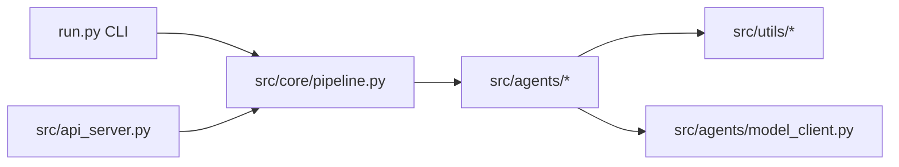

# Design: platform-core

> **状态**：已实施（as-built 设计记录，从现有 spec 技术段落 + 代码实况整理，**不含未实现内容**）
> **关联 spec**：[`spec.md`](spec.md)
> **关联 ADR**：ADR-001（LLM/VL 配置拆分）、ADR-002（实施 agent 拆分）
> **实施栈**：后端（前端消费点见 `specs/per-image-label-api/`、`specs/tauri-shell/`）
> **最后核对**：2026-09-27

## 一、执行摘要

四步流水线以 `Pipeline` 为唯一编排核，CLI 与 HTTP 共享同一实例；步骤名收敛为常量 `_STEPS`，未知步骤立即抛错。模型能力经 `VLClient` 协议抽象，`stub` 与 `remote` 两种实现按配置构造，使全流程可在**完全离线**下跑通。代价是 agent 配置采用「每步前就地重赋值」实现任务隔离，在并发下不成立（账本 A1）。

## 二、现状与痛点



一期建立时的痛点与应对：

| 痛点 | 应对 |
|------|------|
| 无模型就不能跑通链路，CI 无法回归 | `StubLLMClient` + `AnnotateAgent._infer` 的确定性伪检测，离线全流程可验证 |
| 步骤名散落在字符串里，拼错静默失败 | `_STEPS` 元组（`pipeline.py:21`）+ `run_step` 入口校验（`:118-119` 抛 `ValueError`） |
| 提示词硬编码会让实验不可追溯 | 外置 `prompts/*.yaml` + `base_agent.load_prompt()`（`:51`） |
| 各任务的类别/阈值可能冲突 | 每步执行前 `agent.config = config`（`:154/:176/:191`）—— **隔离意图明确，实现方式有并发缺陷** |

## 三、变更范围

（as-built，一期基线）

| 模块 | 变动类型 | 内容 |
|------|---------|------|
| `src/utils/` | 新增 | OBB 四点↔旋转框互转与 IoU、图像/文件/YAML 工具 |
| `src/agents/` | 新增 | `BaseAgent`(ABC) + 三个 agent + `VLClient` 协议与两实现 |
| `src/core/` | 新增 | `TaskManager`、`Pipeline` 四步编排 |
| `src/api_server.py` | 新增 | FastAPI 端点与 Pydantic 模型 |
| `config/`、`prompts/` | 新增 | 全局配置、任务模板、三个提示词 |
| **不动** | — | 模型训练执行、用户体系、任何数据库 |

## 四、方案设计

### 4.1 结构与依赖

依赖方向恒为 `src/utils` ← `src/agents` ← `src/core` ← `src/api_server.py` / `run.py`。

`Pipeline.__init__`（`:33`）接受可选 agents，缺省时由 `_default_agents()`（`:63`）构造：

```
"plan"     → PlanAgent({}, prompts_dir, llm_client=llm_client or StubLLMClient())   :84
"annotate" → AnnotateAgent({}, prompts_dir, vl_client=vl_client)                      :85
"inspect"  → InspectAgent({}, prompts_dir)                                            :86
```

LLM 与 VL 两个 client 由 `build_model_client(llm_settings)` / `build_model_client(vl_settings)` 分别构造 ⇒ 两个角色可指向不同端点/模型。

### 4.2 关键设计决策

| 决策 | 选项 | 选择 | 理由 | 被否选项的代价 |
|------|------|------|------|---------------|
| 模型接入抽象 | 直接 httpx 调用 / `VLClient` 协议 | **协议 + 双实现** | stub 与 remote 可互换，CI 无需网络 | 直接调用 ⇒ 无离线基线，回归测试依赖外部服务 |
| 文本角色无 client 时 | 报错 / 回退 stub | **回退 `StubLLMClient`** | 保证 `plan` 步骤永远可跑通 | 报错 ⇒ 未配密钥的新用户开箱即失败 |
| 视觉角色无 client 时 | 回退 / 传 `None` 由 agent 处理 | **传 `None`，由 `AnnotateAgent` 自行处理** | 视觉缺配置时应显式降级而非伪造检测结果 | 统一回退 ⇒ 掩盖"以为在用真模型其实在用假框"的严重误判 |
| 步骤分派 | if/elif 链 / `_STEPS` 常量 + 校验 | **常量 + 入口校验** | 未知步骤立即失败 | 静默返回空结果 ⇒ 前端显示成功但什么都没做 |
| 任务规则隔离 | 每步新建 agent / 就地重赋 `.config` | **就地重赋 `.config`**（现状） | 省掉重复构造与 client 重建开销 | 每步新建 ⇒ 需重建 httpx 连接池；**但现状在并发下不安全，见 A1** |

### 4.3 核心流程与异常

`run_step(task_name, step)`（`:103`）：

1. 校验 step ∈ `_STEPS`，否则 `ValueError`
2. `TaskManager` 定位 `tasks/<name>/`，加载 `task.yaml`（缺失 → `FileNotFoundError`）
3. 分派到 `_run_plan` / `_run_annotate` / `_run_inspect` / `_run_split`
4. 各步执行前 `agent.config = config`，执行后 `save_yaml` 落盘对应产物

`run_full`（`:89`）按 `_STEPS` 顺序循环调用 `run_step`（`:99`）。

**异常边界**：

| 情形 | 行为 |
|------|------|
| 未知 step | `ValueError`；HTTP 层 `api_server.py:342-346` 兜底 → 500 |
| 任务/`task.yaml` 不存在 | `FileNotFoundError` → HTTP 404 |
| 无图片执行 split | 产出空 summary，不崩溃 |
| 步骤内任意异常（HTTP 路径） | `except Exception` → `HTTPException(500, detail=str(exc))`（**异常文本透传，账本 H-3**） |

### 4.4 契约面

| 面 | 本能力的契约 |
|----|-------------|
| 面 B 响应结构 | `StepResponse(task, step, result)`；`result` 为 `dict`，前端按步骤各自解释 |
| 面 C 请求结构 | `StepRequest(step)`；任务名有 `pattern` + `max_length=64`，`description` **无约束**（账本 S1/S2） |
| 面 D 提示词 | `plan_agent.yaml` 2 个占位符 ↔ `plan_agent.py:132`；`annotate_agent.yaml` 6 个 ↔ `annotate_agent.py:86/:116`（`:116` 多传 `image_name`，账本 A6）；`inspect_agent.yaml` **无消费方**（账本 A5） |
| 磁盘产物 | 见 spec 第四节；`ai_labels/` 只读，`candidate_labels/` 唯一修正落点 |

**契约冻结点**：`StepResponse` 与 `tasks/<task>/` 产物 schema 已冻结（一期已实施并被 4 个页面消费）。新增字段属破坏性变更，必须走 SDD 并同批改齐三个契约文件。

### 4.5 约束核查

| 约束 | 满足 | 说明 |
|------|------|------|
| OBB 格式与归一化只经 `obb_utils` | 是 | 见红线 RL 系列（`docs/memory/architect-memory.md`） |
| `ai_labels/` 不被覆盖 | 是 | 写入方仅 `AnnotateAgent`；读端点只读 |
| 任务规则隔离 | **部分** | 隔离意图在实现上成立（顺序执行），**并发下不成立**（A1） |
| 提示词外置 | 是 | 源码内无 system prompt 字面量 |
| Python 承担全部 CV/推理/IO | 是 | `gui/src/**` 零 CV 计算 |
| ruff / mypy 零错 | 是 | `make lint` / `make type`；注意 `ignore=E501` ⇒ 行长不被拦 |
| VRAM 预算 | 是 | 4bit 走 `[gpu]` extra；远程 API 为主，CPU 可运行 |

## 五、阶段拆解

（一期已完成；后续待办见 `docs/memory/architect-memory.md` 的架构待办与 `docs/audit-reports/README.md` 账本）

## 六、测试设计

`tests/test_pipeline.py`（118 行）覆盖 plan→annotate→inspect→split 全流程与 `data.yaml`/`train_command.txt` 产出；`tests/test_api_server.py`（433 行）覆盖端点、CORS、路径遍历、标签容错。隔离手段：`tmp_path` 构造独立 tasks root，`monkeypatch` 注入 IO 失败。基线 **99 passed / 4.4s**。

**门禁**：`make lint` / `make type` / `make test`。

## 七、风险与回退

| 风险 | 等级 | 说明与缓解 |
|------|------|-----------|
| 并发执行多任务时规则串味（A1） | 🔴 不可控 | 需改为每请求构造上下文或加锁；**在修复前不得对外承诺并发安全** |
| `train_command.txt` 可被执行（S1） | 🔴 | 必须给 `description` 加 `max_length` 并约束渲染，勿在导出环节做"消毒"了事 |
| stub 输出被误认作真实检测结果 | 🟡 | 交付时明确 `provider` 值；GUI 应展示当前 provider（现状未展示） |

回退：`Pipeline` 是唯一的编排变更点，回退只需还原 `src/core/pipeline.py` 与对应端点，磁盘产物格式向后兼容（新增键不影响旧读取路径）。

## 八、不做清单

| 不做 | 理由 | 何时再议 |
|------|------|---------|
| 引入 FastAPI `Depends()` 重构配置注入 | 现有模块级 `_settings` + `lru_cache` 可用，重构面过大且与 A1 修复纠缠 | A1 修复时一并评估 |
| 在 agent 内并发处理多任务 | 与隔离硬约束冲突，且需要无状态化改造 | A1 关闭后 |
| 把质检接入 LLM（启用 `inspect_agent.yaml`） | 需先确认收益，纯规则计算已覆盖当前检查项 | 账本 A5 决策时 |

## 附录：关键位置速查

| 位置 | 用途 |
|------|------|
| `src/core/pipeline.py:21` | `_STEPS` 步骤常量 |
| `src/core/pipeline.py:63-86` | `_default_agents()` 三 agent 构造 |
| `src/core/pipeline.py:103-119` | `run_step` 与未知步骤校验 |
| `src/core/pipeline.py:154/:176/:191` | 每步的 `agent.config` 重赋值（A1 现场） |
| `src/core/pipeline.py:257/:276/:300` | `_pick_label` / `_write_dataset_yaml` / `_write_train_command` |
| `src/agents/base_agent.py:51` | `load_prompt` 提示词加载 |
| `src/agents/model_client.py` | `VLClient` / `OpenAICompatClient` / `StubLLMClient` / `build_model_client` |
